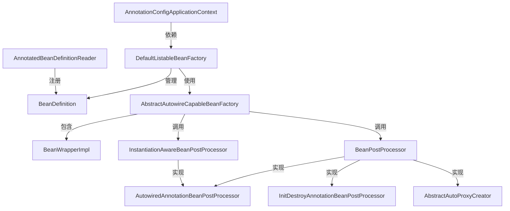
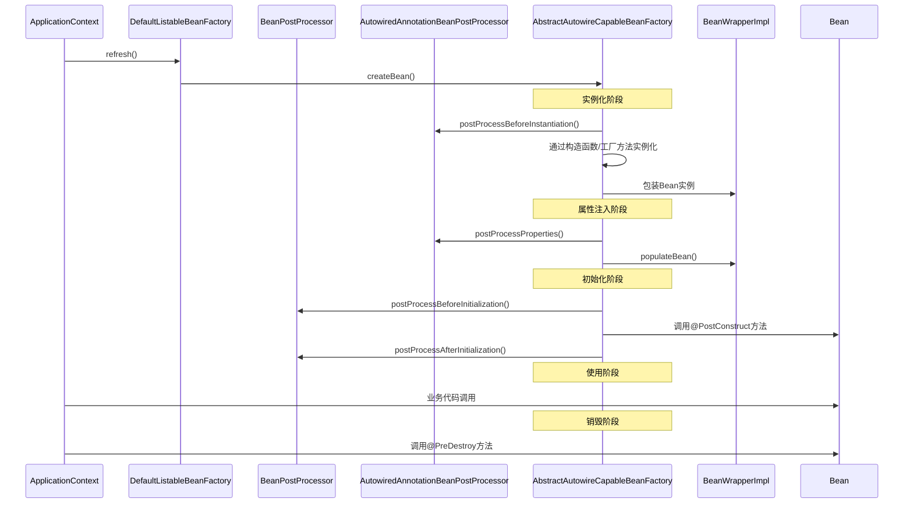
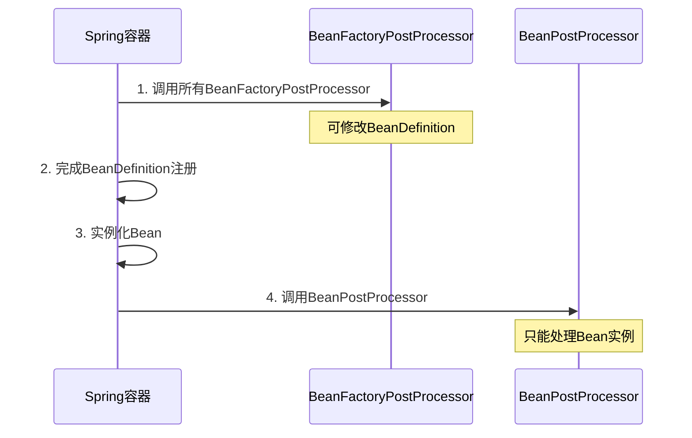

# 给出springboot中关于底层中关于bean的过程涉及到的源码类，给出各个类的作用

# Spring Boot 中 Bean 生命周期涉及的底层源码类及作用

以下是 Spring Boot (基于 Spring Framework) 中关于 Bean 创建和管理过程涉及的核心源码类及其作用：

## 1. 核心容器类

### `DefaultListableBeanFactory`
- **作用**：Spring 默认的 Bean 工厂实现，负责 Bean 的注册、创建和管理
- **关键功能**：
  - 维护 Bean 定义注册表
  - 处理 Bean 依赖关系
  - 实现 Bean 的创建和缓存

### `AbstractApplicationContext`
- **作用**：应用上下文的抽象基类，协调 Bean 工厂和 Bean 后处理器
- **关键方法**：
  - `refresh()` - 容器刷新的核心方法
  - `finishBeanFactoryInitialization()` - 初始化所有单例 Bean

## 2. Bean 定义相关

### `BeanDefinition`
- **作用**：Bean 的配置元数据接口，描述如何创建一个 Bean
- **关键属性**：
  - beanClassName
  - scope
  - lazyInit
  - dependsOn
  - propertyValues

### `AnnotatedBeanDefinitionReader`
- **作用**：读取注解配置的 Bean 定义
- **关键功能**：
  - 处理 `@Component`、`@Service` 等注解
  - 注册配置类

## 3. Bean 创建过程

### `AbstractAutowireCapableBeanFactory`
- **作用**：Bean 实例化的核心类
- **关键方法**：
  - `createBean()` - 创建 Bean 实例的入口
  - `doCreateBean()` - 实际创建 Bean 的方法
  - `initializeBean()` - 初始化 Bean

### `BeanWrapperImpl`
- **作用**：包装 Bean 实例，提供属性访问功能
- **关键功能**：
  - 属性设置
  - 方法调用
  - 嵌套属性访问

## 4. 生命周期处理器

### `BeanPostProcessor`
- **作用**：Bean 后置处理器接口
- **关键方法**：
  - `postProcessBeforeInitialization()`
  - `postProcessAfterInitialization()`
- **常见实现**：
  - `AutowiredAnnotationBeanPostProcessor` (处理 `@Autowired`)
  - `CommonAnnotationBeanPostProcessor` (处理 `@PostConstruct` 等)

### `InstantiationAwareBeanPostProcessor`
- **作用**：实例化前后的处理器
- **关键方法**：
  - `postProcessBeforeInstantiation()`
  - `postProcessAfterInstantiation()`
  - `postProcessProperties()` (处理 `@Autowired` 字段注入)

## 5. 依赖注入相关

### `DependencyDescriptor`
- **作用**：描述依赖项（字段/方法参数）
- **关键功能**：
  - 封装注入点的元数据
  - 解析依赖的 Bean

### `DefaultListableBeanFactory`
- **作用**：依赖解析的核心实现
- **关键方法**：
  - `resolveDependency()` - 解析依赖关系

## 6. 初始化相关

### `InitDestroyAnnotationBeanPostProcessor`
- **作用**：处理生命周期注解
- **关键功能**：
  - 处理 `@PostConstruct` 初始化方法
  - 处理 `@PreDestroy` 销毁方法

## 7. AOP 相关

### `AbstractAutoProxyCreator`
- **作用**：AOP 自动代理创建器
- **关键功能**：
  - 创建代理对象
  - 处理 `@Transactional` 等 AOP 注解

## Bean 生命周期关键流程

1. **Bean 定义注册**：通过 `BeanDefinitionReader` 或扫描注册
2. **实例化前**：`InstantiationAwareBeanPostProcessor.postProcessBeforeInstantiation()`
3. **实例化**：通过构造函数或工厂方法创建实例
4. **属性填充**：`populateBean()` 方法注入依赖
5. **初始化前**：`BeanPostProcessor.postProcessBeforeInitialization()`
6. **初始化**：调用 `InitializingBean.afterPropertiesSet()` 或自定义 init 方法
7. **初始化后**：`BeanPostProcessor.postProcessAfterInitialization()`
8. **使用**：Bean 可用
9. **销毁**：调用 `DisposableBean.destroy()` 或自定义 destroy 方法

这些类共同构成了 Spring 容器管理 Bean 的完整体系，理解它们有助于深入掌握 Spring 的依赖注入和控制反转原理。


# 给出各个类的名字的含义

# 根据你上面说的这些了类给出各个联系，给出流程图将所有的类关联起来

以下是 Spring Boot/Spring Framework 中 Bean 生命周期核心类的关联关系及流程图：

---

### **Bean 生命周期核心类关联图**



---

### **详细类关联说明**

1. **入口层**  
   - `AnnotationConfigApplicationContext`：应用入口，持有 `DefaultListableBeanFactory`  
   - `AnnotatedBeanDefinitionReader`：将 `@Component` 等注解类解析为 `BeanDefinition`

2. **Bean 工厂层**  
   - `DefaultListableBeanFactory`：  
     - 维护 `BeanDefinition` 注册表（Map<String, BeanDefinition>）  
     - 委托 `AbstractAutowireCapableBeanFactory` 实际创建 Bean  
   - `AbstractAutowireCapableBeanFactory`：  
     - 通过 `createBean()` → `doCreateBean()` 流程实例化 Bean  
     - 使用 `BeanWrapperImpl` 包装 Bean 实例并处理属性注入  

3. **扩展处理层**  
   - `InstantiationAwareBeanPostProcessor`（实例化前后拦截）：  
     - 子类 `AutowiredAnnotationBeanPostProcessor` 处理 `@Autowired` 注入  
   - `BeanPostProcessor`（初始化前后拦截）：  
     - `InitDestroyAnnotationBeanPostProcessor`：处理 `@PostConstruct`/`@PreDestroy`  
     - `AbstractAutoProxyCreator`：为 AOP 创建代理对象  

---

### **完整 Bean 生命周期流程图**



---

### **关键流程说明**

1. **注册阶段**  
   ```java
   // AnnotatedBeanDefinitionReader 注册 BeanDefinition
   reader.register(Config.class);
   // DefaultListableBeanFactory 存储定义
   beanFactory.registerBeanDefinition(beanName, definition);
   ```

2. **实例化阶段**  
   ```java
   // AbstractAutowireCapableBeanFactory
   Object bean = instanceWrapper.getWrappedInstance();
   ```

3. **依赖注入阶段**  
   ```java
   // AutowiredAnnotationBeanPostProcessor
   metadata.inject(bean, beanName, pvs);
   ```

4. **初始化阶段**  
   ```java
   // InitDestroyAnnotationBeanPostProcessor
   lifeCycleMetadata.invokeInitMethods(bean, beanName);
   ```

5. **代理生成阶段**  
   ```java
   // AbstractAutoProxyCreator
   Object proxy = createProxy(bean.getClass(), beanName);
   ```

---

### **设计模式应用**
- **模板方法模式**：`AbstractAutowireCapableBeanFactory` 定义 `createBean()` 流程，子类实现细节  
- **责任链模式**：多个 `BeanPostProcessor` 形成处理链  
- **工厂模式**：`DefaultListableBeanFactory` 作为中央 Bean 工厂  

通过这张图和流程，可以清晰看到 Spring 如何通过各组件协作完成 Bean 的生命周期管理。


以下是 Spring Boot/Spring Framework 中与 Bean 生命周期相关核心类的名称含义解析，按照功能模块分类说明：

---

### **1. 容器核心类**
| 类名                           | 名称含义解析                                                                 |
|--------------------------------|----------------------------------------------------------------------------|
| `DefaultListableBeanFactory`   | **默认+可列出的+Bean工厂**：Spring 默认实现的可枚举所有 Bean 的工厂容器          |
| `AbstractApplicationContext`   | **抽象应用上下文**：应用程序运行环境的抽象基类，协调各模块工作                     |

---

### **2. Bean 定义相关**
| 类名                           | 名称含义解析                                                                 |
|--------------------------------|----------------------------------------------------------------------------|
| `BeanDefinition`              | **Bean定义**：存储 Bean 的配置元数据（类名、作用域、属性等）                     |
| `AnnotatedBeanDefinitionReader`| **带注解的Bean定义读取器**：专门解析注解（如 `@Component`）配置的 Bean 定义         |

---

### **3. Bean 实例化与依赖注入**
| 类名                                   | 名称含义解析                                                                 |
|----------------------------------------|----------------------------------------------------------------------------|
| `AbstractAutowireCapableBeanFactory`   | **抽象+自动装配能力+Bean工厂**：支持自动依赖注入的 Bean 工厂基类                |
| `BeanWrapperImpl`                     | **Bean包装器实现**：对 Bean 实例进行包装，提供属性访问和操作的能力               |
| `DependencyDescriptor`                | **依赖描述符**：描述一个依赖项（如被 `@Autowired` 标记的字段或方法参数）的元数据   |

---

### **4. 生命周期处理器**
| 类名                                   | 名称含义解析                                                                 |
|----------------------------------------|----------------------------------------------------------------------------|
| `BeanPostProcessor`                   | **Bean后置处理器**：在 Bean 初始化前后插入自定义逻辑的接口                     |
| `InstantiationAwareBeanPostProcessor` | **实例化感知的Bean后置处理器**：在 Bean 实例化前后（而不仅是初始化）阶段介入的扩展接口 |

---

### **5. 具体处理器实现**
| 类名                                   | 名称含义解析                                                                 |
|----------------------------------------|----------------------------------------------------------------------------|
| `AutowiredAnnotationBeanPostProcessor` | **自动装配注解处理器**：专门处理 `@Autowired` 和 `@Value` 注解的依赖注入        |
| `InitDestroyAnnotationBeanPostProcessor`| **初始化和销毁注解处理器**：处理 `@PostConstruct` 和 `@PreDestroy` 生命周期方法 |
| `CommonAnnotationBeanPostProcessor`   | **通用注解处理器**：处理 JSR-250 标准注解（如 `@Resource`）                    |

---

### **6. AOP 相关**
| 类名                           | 名称含义解析                                                                 |
|--------------------------------|----------------------------------------------------------------------------|
| `AbstractAutoProxyCreator`     | **抽象自动代理创建器**：自动为 Bean 创建 AOP 代理的基类（如处理 `@Transactional`） |

---

### **名称设计规律总结**
1. **层次标识**：  
   - `Abstract` 开头的类是抽象基类（如 `AbstractApplicationContext`）  
   - `Default` 开头的类是默认实现（如 `DefaultListableBeanFactory`）  
   - `Impl` 结尾的是具体实现（如 `BeanWrapperImpl`）

2. **功能自解释**：  
   - 包含 `BeanPostProcessor` 的类都是生命周期拦截器  
   - 包含 `Autowire` 的类处理依赖注入  
   - 包含 `Proxy` 的类与 AOP 代理相关

3. **注解关联**：  
   - 类名中带 `Annotation` 的（如 `AnnotatedBeanDefinitionReader`）专门处理注解配置

---

### **典型示例解析**
- **`AutowiredAnnotationBeanPostProcessor`**  
  名称拆解：  
  `Autowired`（自动装配） + `Annotation`（注解） + `BeanPostProcessor`（Bean后置处理器）  
  ⇒ **功能**：处理带有 `@Autowired` 注解的依赖注入

- **`AbstractAutowireCapableBeanFactory`**  
  名称拆解：  
  `Abstract`（抽象） + `Autowire`（自动装配） + `Capable`（有能力） + `BeanFactory`（Bean工厂）  
  ⇒ **功能**：具备自动装配能力的抽象 Bean 工厂基类

这些命名严格遵循了 Spring 的"见名知意"设计原则，通过类名即可快速理解其职责。


类名	名称含义解析
BeanPostProcessor	Bean后置处理器：在 Bean 初始化前后插入自定义逻辑的接口
InstantiationAwareBeanPostProcessor	实例化感知的Bean后置处理器：在 Bean 实例化前后（而不仅是初始化）阶段介入的扩展接口
# 这里面提到的初初始化和实例化有是么区别


在 Spring 的 Bean 生命周期中，**实例化（Instantiation）**和**初始化（Initialization）**是两个不同的阶段，它们的区别如下：

---

### **1. 实例化（Instantiation）**
- **本质**：创建 Bean 的原始对象（分配内存空间）
- **时机**：Bean 生命周期的**最早阶段**
- **操作**：
  - 调用构造函数创建对象实例
  - 或通过工厂方法（如 `@Bean` 方法）创建实例
- **特点**：
  - 此时对象是"空壳"，属性未被注入
  - 类似 Java 中的 `new Object()`
- **相关接口**：
  ```java
  InstantiationAwareBeanPostProcessor.postProcessBeforeInstantiation()
  InstantiationAwareBeanPostProcessor.postProcessAfterInstantiation()
  ```

---

### **2. 初始化（Initialization）**
- **本质**：对已实例化的 Bean 进行**属性装配和自定义初始化**
- **时机**：在实例化**之后**，依赖注入**完成之后**
- **操作**：
  - 完成依赖注入（如 `@Autowired` 字段赋值）
  - 执行初始化回调（如 `@PostConstruct` 方法）
  - AOP 代理的生成
- **特点**：
  - 此时 Bean 已是完整可用的状态
  - 类似给新房装修（实例化是毛坯房，初始化是精装修）
- **相关接口**：
  ```java
  BeanPostProcessor.postProcessBeforeInitialization()
  BeanPostProcessor.postProcessAfterInitialization()
  ```

---

### **对比表格**
| 特性                | 实例化（Instantiation）               | 初始化（Initialization）               |
|---------------------|-------------------------------------|---------------------------------------|
| **阶段**            | 生命周期最早阶段                     | 实例化之后，依赖注入完成之后            |
| **本质**            | 创建对象实例（分配内存）              | 配置对象状态（注入依赖+执行回调）        |
| **类比**            | 建造毛坯房                          | 装修房屋（通水电、买家具）              |
| **关键操作**        | 调用构造函数                         | 依赖注入、执行 `@PostConstruct` 方法    |
| **是否完成依赖注入** | ❌ 否                                | ✅ 是                                  |
| **能否访问Bean属性** | ❌ 属性均为 null                     | ✅ 属性已注入                          |

---

### **代码示例说明**
```java
public class ExampleBean {
    @Autowired
    private DependencyService service; // 依赖对象
    
    public ExampleBean() {
        // 实例化阶段执行
        System.out.println("构造函数调用：此时service=" + service); // 输出 null
    }

    @PostConstruct
    public void init() {
        // 初始化阶段执行
        System.out.println("@PostConstruct调用：此时service=" + service); // 输出依赖对象
    }
}
```

---

### **处理器执行顺序**
1. `InstantiationAwareBeanPostProcessor.postProcessBeforeInstantiation()`  
   （**实例化前**拦截，可返回代理对象替代原始对象）
   
2. **实例化**（调用构造函数）

3. `InstantiationAwareBeanPostProcessor.postProcessAfterInstantiation()`  
   （**实例化后**，可阻止属性填充）

4. **依赖注入**（设置 `@Autowired` 字段）

5. `BeanPostProcessor.postProcessBeforeInitialization()`  
   （**初始化前**处理，如 `@PostConstruct` 在此阶段触发）

6. **自定义初始化**（执行 `InitializingBean.afterPropertiesSet()`）

7. `BeanPostProcessor.postProcessAfterInitialization()`  
   （**初始化后**处理，如 AOP 代理在此阶段生成）

---

### **设计意义**
- **实例化阶段**关注对象**是否存在**  
- **初始化阶段**关注对象**是否可用**  
- 分离两者使得 Spring 可以在对象创建过程中插入更多扩展点（如 AOP、属性校验等）


# BeanFactoryPostProcessor这里面怎么没有提到这个

您提到的 `BeanFactoryPostProcessor` 确实是 Spring 容器中非常重要的扩展点，它与 `BeanPostProcessor` 类似但作用阶段不同。以下是详细解析：

---

### **BeanFactoryPostProcessor 的核心定位**
#### 1. **名称含义**
- **`BeanFactory` + `PostProcessor`**  
  = **Bean工厂的后置处理器**  
  ⇒ 专门用于在 **Bean 定义加载完成后、Bean 实例化之前** 修改容器底层的 `BeanDefinition`

#### 2. **与 BeanPostProcessor 的关键区别**
| 特性                  | BeanFactoryPostProcessor              | BeanPostProcessor                    |
|-----------------------|--------------------------------------|--------------------------------------|
| **作用对象**          | 针对 `BeanDefinition`（元数据）       | 针对 Bean **实例**                   |
| **执行阶段**          | 在 Bean 实例化**之前**                | 在 Bean 实例化**之后**               |
| **修改能力**          | 可修改/添加/删除 Bean 的定义          | 只能修改 Bean 实例的属性或代理        |
| **使用场景**          | 动态注册 Bean、修改属性值等底层操作    | 注入自定义逻辑（如 AOP、监控）        |

---

### **源码中的典型实现**
#### 1. **核心接口定义**
```java
public interface BeanFactoryPostProcessor {
    void postProcessBeanFactory(ConfigurableListableBeanFactory beanFactory) throws BeansException;
}
```

#### 2. **常见内置实现**
| 类名                             | 作用                                                                 |
|----------------------------------|--------------------------------------------------------------------|
| `PropertySourcesPlaceholderConfigurer` | 处理 `${}` 占位符替换（如 `@Value("${property}")`）                 |
| `ConfigurationClassPostProcessor` | 解析 `@Configuration` 类并注册其中的 `@Bean` 方法                    |

---

### **执行时机图示**


---

### **典型使用场景**
1. **动态注册 Bean**
   ```java
   public class DynamicBeanRegistrar implements BeanFactoryPostProcessor {
       @Override
       public void postProcessBeanFactory(ConfigurableListableBeanFactory beanFactory) {
           BeanDefinition definition = new RootBeanDefinition(DynamicService.class);
           ((BeanDefinitionRegistry)beanFactory).registerBeanDefinition("dynamicService", definition);
       }
   }
   ```

2. **修改已有 Bean 的定义**
   ```java
   public class PropertyModifier implements BeanFactoryPostProcessor {
       @Override
       public void postProcessBeanFactory(ConfigurableListableBeanFactory beanFactory) {
           BeanDefinition definition = beanFactory.getBeanDefinition("dataSource");
           definition.getPropertyValues().add("url", "jdbc:new://url");
       }
   }
   ```

3. **条件化配置**
   ```java
   public class ProfileBasedConfigurer implements BeanFactoryPostProcessor {
       @Override
       public void postProcessBeanFactory(ConfigurableListableBeanFactory beanFactory) {
           if (!beanFactory.getEnvironment().acceptsProfiles("prod")) {
               BeanDefinition definition = beanFactory.getBeanDefinition("prodService");
               definition.setScope(BeanDefinition.SCOPE_PROTOTYPE);
           }
       }
   }
   ```

---

### **设计意义**
1. **更早的扩展点**：在容器启动的最早期介入，影响后续所有 Bean 的创建过程  
2. **更底层的控制**：直接操作 `BeanDefinition` 这种底层元数据  
3. **与 `BeanPostProcessor` 互补**：  
   - `BeanFactoryPostProcessor` 控制 **是否创建** 以及 **如何定义** Bean  
   - `BeanPostProcessor` 控制 **创建后的 Bean 实例** 如何增强

---

### **完整生命周期中的位置**
1. 解析配置 → 2. 加载 `BeanDefinition` → **3. 执行 `BeanFactoryPostProcessor`** → 4. 实例化 Bean → 5. 执行 `BeanPostProcessor`

这个机制体现了 Spring 的"分层扩展"思想，允许开发者在不同粒度上干预容器行为。


# 那有没有从bean实例层面获得bean的工厂
public final class SpringUtils implements BeanFactoryPostProcessor
{
    /** Spring应用上下文环境 */
    private static ConfigurableListableBeanFactory beanFactory;

    @Override
    public void postProcessBeanFactory(ConfigurableListableBeanFactory beanFactory) throws BeansException
    {
        SpringUtils.beanFactory = beanFactory;
    }
就像这里从是从beandefinition层面获得的bean工厂


您的问题涉及到两个不同层面的工厂获取方式，确实存在从 **Bean实例层面** 访问工厂的方式。以下是详细对比和解决方案：

---

### **1. 从 BeanDefinition 层面获取工厂**
（如您代码所示）
```java
// 通过 BeanFactoryPostProcessor 获取 ConfigurableListableBeanFactory
public class SpringUtils implements BeanFactoryPostProcessor {
    private static ConfigurableListableBeanFactory beanFactory;

    @Override
    public void postProcessBeanFactory(ConfigurableListableBeanFactory beanFactory) {
        SpringUtils.beanFactory = beanFactory; // 存储的是 BeanDefinition 级别的工厂
    }
}
```
- **特点**：
  - 获取的是**底层工厂**，可操作 `BeanDefinition`
  - 执行时机极早（在 Bean 实例化之前）
  - 无法直接获取已实例化的 Bean

---

### **2. 从 Bean 实例层面获取工厂**
#### 方式一：通过 `ApplicationContextAware` 接口
```java
@Component
public class BeanLevelFactoryAccessor implements ApplicationContextAware {
    private static ApplicationContext applicationContext;

    @Override
    public void setApplicationContext(ApplicationContext context) {
        BeanLevelFactoryAccessor.applicationContext = context;
    }

    // 通过实例名称获取 Bean
    public static Object getBean(String name) {
        return applicationContext.getBean(name);
    }
}
```
- **特点**：
  - 获取的是完整的 `ApplicationContext`（包含所有实例化的 Bean）
  - 执行时机较晚（在 Bean 初始化阶段）
  - 可直接获取其他 Bean 实例

#### 方式二：自动注入 `ListableBeanFactory`
```java
@Service
public class MyService {
    @Autowired
    private ListableBeanFactory beanFactory; // 直接注入实例层面的工厂

    public void showBeans() {
        String[] beanNames = beanFactory.getBeanDefinitionNames();
        // 可以遍历所有已实例化的 Bean
    }
}
```

#### 方式三：通过 `@Autowired` 注入 `ApplicationContext`
```java
@Service
public class AnotherService {
    @Autowired
    private ApplicationContext context; // 直接注入应用上下文

    public void demo() {
        MyBean bean = context.getBean(MyBean.class); // 获取实例
    }
}
```

---

### **关键区别对比**
| 特性                | BeanDefinition 层面 (BeanFactoryPostProcessor) | Bean 实例层面 (ApplicationContextAware) |
|---------------------|-----------------------------------------------|----------------------------------------|
| **获取时机**        | 在 Bean 实例化之前                            | 在 Bean 初始化之后                      |
| **操作对象**        | 操作 `BeanDefinition`（元数据）               | 操作已实例化的 Bean 对象                |
| **典型用途**        | 动态注册/修改 Bean 定义                       | 获取其他 Bean 实例或运行时信息           |
| **是否影响实例化**  | 是（可改变后续实例化行为）                    | 否（仅访问已存在的实例）                |
| **线程安全性**      | 需自行处理静态变量线程安全                    | 依赖 Spring 容器保证线程安全            |

---

### **何时选择哪种方式？**
1. 需要**动态注册/修改 Bean 定义** → 用 `BeanFactoryPostProcessor`
   ```java
   // 示例：动态注册 Bean
   ((BeanDefinitionRegistry)beanFactory).registerBeanDefinition("newBean", definition);
   ```

2. 需要**获取已存在的 Bean 实例** → 用 `ApplicationContextAware`/`@Autowired`
   ```java
   // 示例：获取所有实现某接口的 Bean
   Map<String, MyInterface> beans = context.getBeansOfType(MyInterface.class);
   ```

---

### **您代码的优化建议**
如果目标是获取**实例化后的 Bean**，建议改用：
```java
public final class SpringUtils implements ApplicationContextAware {
    private static ApplicationContext context;

    @Override
    public void setApplicationContext(ApplicationContext context) {
        SpringUtils.context = context;
    }

    // 提供静态方法获取 Bean
    public static <T> T getBean(Class<T> clazz) {
        return context.getBean(clazz);
    }
}
```
这样可以通过 `SpringUtils.getBean(MyClass.class)` 直接获取实例。


# 上面说到这里的springutils是从元数据层面获得的bean工厂，那么这种用法是没有问题的吗

MessageSource messageSource = SpringUtils.getBean(MessageSource.class);
        return messageSource.getMessage(code, args, LocaleContextHolder.getLocale());

上面说到这里的springutils是从元数据层面获得的bean工厂，那么这种用法是没有问题的吗


您的问题非常关键！让我们明确区分两种不同的 `SpringUtils` 实现方式及其安全性：

---

### **情况1：您的原始实现（基于 `BeanFactoryPostProcessor`）**
```java
public final class SpringUtils implements BeanFactoryPostProcessor {
    private static ConfigurableListableBeanFactory beanFactory;

    @Override
    public void postProcessBeanFactory(ConfigurableListableBeanFactory beanFactory) {
        SpringUtils.beanFactory = beanFactory; // 存储BeanFactory
    }

    public static <T> T getBean(Class<T> clazz) {
        return beanFactory.getBean(clazz); // ⚠️ 潜在问题点
    }
}
```
#### **这种用法的问题：**
1. **时机风险**：  
   `BeanFactoryPostProcessor` 的执行时机是在 **Bean 实例化之前**，而您可能在后续代码中（如Controller）过早调用 `getBean()`，此时目标 Bean 尚未实例化。

2. **功能局限**：  
   `ConfigurableListableBeanFactory` 是底层工厂，缺少 `ApplicationContext` 的高级功能（如国际化、事件发布等），直接用它获取 `MessageSource` 可能不完整。

3. **循环依赖风险**：  
   如果 `MessageSource` 的实现类又依赖了其他需要通过 `SpringUtils` 获取的 Bean，会导致初始化死锁。

---

### **情况2：推荐实现（基于 `ApplicationContextAware`）**
```java
public final class SpringUtils implements ApplicationContextAware {
    private static ApplicationContext context;

    @Override
    public void setApplicationContext(ApplicationContext context) {
        SpringUtils.context = context; // 存储ApplicationContext
    }

    public static <T> T getBean(Class<T> clazz) {
        return context.getBean(clazz); // ✅ 安全用法
    }
}
```
#### **为什么这样更安全？**
1. **正确时机**：  
   `ApplicationContextAware` 的注入发生在 **Bean 初始化完成后**，此时所有单例 Bean 已就绪。

2. **完整功能**：  
   `ApplicationContext` 本身实现了 `MessageSource` 接口，能正确处理国际化消息。

3. **Spring官方推荐**：  
   这是 Spring 官方认可的获取 Bean 的方式，内部已处理线程安全和依赖问题。

---

### **您代码的修正建议**
#### 如果坚持使用 `BeanFactoryPostProcessor` 方式：
```java
public static String getMessage(String code, Object[] args) {
    // 明确指定从ApplicationContext获取（需确保context已注入）
    ApplicationContext context = SpringUtils.getBean(ApplicationContext.class);
    return context.getMessage(code, args, LocaleContextHolder.getLocale());
}
```

#### 但更推荐：
1. **直接注入**（首选方案）：
   ```java
   @RestController
   public class MyController {
       @Autowired // 让Spring管理依赖
       private MessageSource messageSource;

       public String demo() {
           return messageSource.getMessage(code, args, LocaleContextHolder.getLocale());
       }
   }
   ```

2. **使用安全的 `SpringUtils`**：
   ```java
   // 改用ApplicationContextAware实现
   MessageSource messageSource = SpringUtils.getBean(MessageSource.class);
   return messageSource.getMessage(...);
   ```

---

### **关键结论**
- **您的原始用法在技术上是可行的**，但存在风险（尤其在复杂项目中）。
- **问题不在于获取 `MessageSource` 本身**，而在于 `BeanFactoryPostProcessor` 的实现方式可能引发时机问题。
- **生产环境建议**：  
  要么直接依赖注入，要么使用基于 `ApplicationContextAware` 的工具类。


# 那我现在想问，从两个层面的工厂获得bean都能像这样使用吗
MessageSource messageSource = SpringUtils.getBean(MessageSource.class);
        return messageSource.getMessage(code, args, LocaleContextHolder.getLocale());
像这样使用吗

是的，**从两个层面的工厂获取 `MessageSource` 都可以像这样使用**，但它们的 **安全性、适用阶段和底层机制不同**。以下是具体分析：

---

### **1. 从 `BeanFactoryPostProcessor` 层面获取（您的原始方案）**
```java
public class SpringUtils implements BeanFactoryPostProcessor {
    private static ConfigurableListableBeanFactory beanFactory;

    @Override
    public void postProcessBeanFactory(...) {
        SpringUtils.beanFactory = beanFactory; // 在容器启动早期存储
    }

    public static MessageSource getMessageSource() {
        return beanFactory.getBean(MessageSource.class); // 获取实例
    }
}
```

#### **使用方式**
```java
MessageSource messageSource = SpringUtils.getMessageSource();
messageSource.getMessage(code, args, LocaleContextHolder.getLocale());
```

#### **特点**
- **可行但高风险**：
  - 如果调用时机过早（如其他 `BeanFactoryPostProcessor` 或 `@Bean` 初始化方法中调用），会因 `MessageSource` 未实例化而报错。
  - 适用于 **容器完全启动后的场景**（如 Controller 请求处理时）。
- **底层操作**：
  - 直接通过 `BeanFactory` 获取原始实例，不经过 `ApplicationContext` 的增强功能（如事件发布、层级查找等）。

---

### **2. 从 `ApplicationContextAware` 层面获取（推荐方案）**
```java
public class SpringUtils implements ApplicationContextAware {
    private static ApplicationContext context;

    @Override
    public void setApplicationContext(ApplicationContext context) {
        SpringUtils.context = context; // 在容器就绪后存储
    }

    public static MessageSource getMessageSource() {
        return context.getBean(MessageSource.class); // 通过完整上下文获取
    }
}
```

#### **使用方式**
```java
MessageSource messageSource = SpringUtils.getMessageSource();
messageSource.getMessage(code, args, LocaleContextHolder.getLocale());
```

#### **特点**
- **安全可靠**：
  - 保证调用时所有 Bean 已初始化完成。
  - Spring 官方推荐方式，天然避免时机问题。
- **功能完整**：
  - `ApplicationContext` 本身实现了 `MessageSource` 接口，提供完整的国际化支持。
  - 支持父子容器、消息源层级查找等高级功能。

---

### **关键对比**
| 特性                | `BeanFactoryPostProcessor` 层面               | `ApplicationContextAware` 层面              |
|---------------------|-----------------------------------------------|---------------------------------------------|
| **获取时机**        | 容器启动早期（Bean 实例化前）                  | 容器完全就绪后                              |
| **线程安全性**      | 需自行保证静态变量的线程安全                   | Spring 容器保证线程安全                     |
| **功能支持**        | 仅基础 Bean 获取                              | 支持国际化、事件发布等完整功能               |
| **适用阶段**        | 仅限于容器启动后的代码（如 Controller）        | 任意阶段（包括 `@PostConstruct` 等）         |
| **循环依赖处理**    | 可能因时机问题失败                             | 由 Spring 自动处理                          |

---

### **最终建议**
1. **优先使用 `ApplicationContextAware` 实现**：  
   这是 Spring 设计的安全模式，能 100% 避免时机问题。

2. **如果必须用 `BeanFactoryPostProcessor`**：  
   - 确保 `getBean()` 只在 **容器启动完成后** 调用（如 HTTP 请求、定时任务等）。  
   - 添加状态检查：
     ```java
     public static MessageSource getMessageSource() {
         if (beanFactory == null) {
             throw new IllegalStateException("BeanFactory 未初始化完成！");
         }
         return beanFactory.getBean(MessageSource.class);
     }
     ```

3. **终极方案——直接依赖注入**：  
   在大多数场景下，直接注入 `MessageSource` 是最佳实践：
   ```java
   @RestController
   public class MyController {
       @Autowired // 或 @Resource
       private MessageSource messageSource;

       public String demo() {
           return messageSource.getMessage(code, args, LocaleContextHolder.getLocale());
       }
   }
   ```

---

### **为什么两种方式都能工作？**
- 底层上，`ApplicationContext` 最终也是通过 `BeanFactory` 获取 Bean。  
- 关键区别在于 **获取的时机和封装的功能**：  
  `ApplicationContext` 在容器就绪后提供更安全的访问入口，并附加了国际化等企业级功能。
- 


# end
