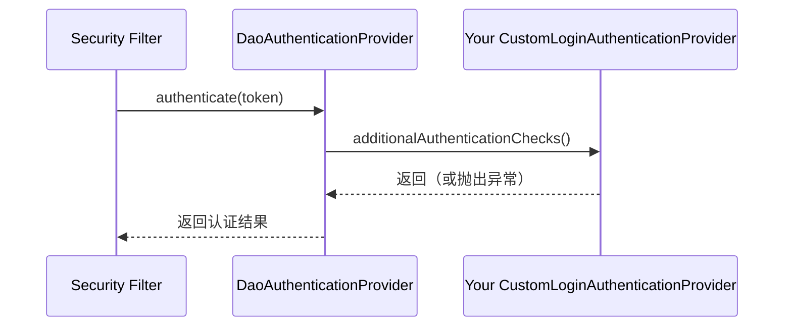

# begin(侧重ai出来的内容)

# messageSource.getMessage(code, args, LocaleContextHolder.getLocale());

# `MessageUtils` 类详解

这是一个用于国际化(i18n)消息处理的工具类，它封装了Spring的消息源(`MessageSource`)功能，提供静态方法来获取国际化消息。

## 类结构

```java
/**
 * 获取i18n资源文件
 * 
 * @author HQ
 */
public class MessageUtils {
    public static String message(String code, Object... args) {
        MessageSource messageSource = SpringUtils.getBean(MessageSource.class);
        return messageSource.getMessage(code, args, LocaleContextHolder.getLocale());
    }
}
```

## 核心组件解析

### 1. `MessageSource`
- **作用**：Spring框架提供的国际化消息接口
- **功能**：
  - 根据消息代码(code)获取对应的文本
  - 支持参数替换
  - 支持多语言环境(Locale)

### 2. `SpringUtils.getBean()`
- **作用**：从Spring容器中获取Bean实例
- **这里获取**：`MessageSource`的实现类(通常是`ResourceBundleMessageSource`或`ReloadableResourceBundleMessageSource`)

### 3. `LocaleContextHolder`
- **作用**：Spring提供的Locale上下文持有者
- **功能**：
  - 获取当前线程绑定的Locale(语言环境)
  - 通常通过拦截器或过滤器设置

## 方法详解

### `message(String code, Object... args)`

#### 参数
- `code`：消息键(在properties文件中的key)
- `args`：可变参数，用于替换消息中的占位符

#### 返回值
- 国际化后的消息字符串

#### 内部逻辑
1. 从Spring容器获取`MessageSource`实例
2. 使用当前Locale和参数获取对应的消息文本

## 使用示例

假设有以下消息资源文件：

`messages.properties`:
```
welcome.message=Hello, {0}! Today is {1}.
```

`messages_zh_CN.properties`:
```
welcome.message=你好，{0}！今天是{1}。
```

调用示例：
```java
String msg = MessageUtils.message("welcome.message", "张三", "星期一");
// 根据当前Locale返回：
// 中文环境：你好，张三！今天是星期一。
// 英文环境：Hello, Zhangsan! Today is Monday.
```

## 实现原理

1. **消息查找顺序**：
   - 根据Locale查找对应的properties文件
   - 找不到时回退到系统默认Locale或基础properties文件

2. **参数替换**：
   - 使用`{0}`, `{1}`等占位符
   - 参数按顺序替换

## 优点

1. **简化调用**：封装了Spring的国际化细节，提供静态方法
2. **自动Locale处理**：利用`LocaleContextHolder`自动获取当前语言环境
3. **与Spring集成**：直接使用Spring容器管理的`MessageSource`

## 注意事项

1. **依赖Spring上下文**：必须在Spring容器初始化后才能使用
2. **线程安全**：`LocaleContextHolder`使用ThreadLocal保存Locale，线程安全
3. **性能考虑**：频繁调用`getBean()`可能有性能影响，可考虑缓存`MessageSource`

## 典型应用场景

1. 控制器返回国际化消息
2. 服务层异常消息国际化
3. 视图层(如JSP/Thymeleaf)显示多语言文本

## 改进建议

1. **增加null检查**：
   ```java
   if (code == null) {
       return "";
   }
   ```

2. **提供默认消息**：
   ```java
   return messageSource.getMessage(code, args, "默认消息", LocaleContextHolder.getLocale());
   ```

3. **缓存MessageSource**：
   ```java
   private static MessageSource messageSource;
   
   static {
       messageSource = SpringUtils.getBean(MessageSource.class);
   }
   ```

这个工具类很好地封装了Spring国际化的核心功能，使得在应用中可以方便地获取多语言消息。


# getAuthentication

```
public static Authentication getAuthentication()  
{  
    return SecurityContextHolder.getContext().getAuthentication();  
}


return (LoginUser) getAuthentication().getPrincipal();

```

# getRequestAttributes
```
public static ServletRequestAttributes getRequestAttributes()  
{  
    RequestAttributes attributes = RequestContextHolder.getRequestAttributes();  
    return (ServletRequestAttributes) attributes;  
}
```

# shutdownAndAwaitTermination线程停止方法等待120秒
```
/**  
 * 停止线程池  
 * 先使用shutdown, 停止接收新任务并尝试完成所有已存在任务.  
 * 如果超时, 则调用shutdownNow, 取消在workQueue中Pending的任务,并中断所有阻塞函数.  
 * 如果仍人超時，則強制退出.  
 * 另对在shutdown时线程本身被调用中断做了处理.  
 */public static void shutdownAndAwaitTermination(ExecutorService pool)  
{  
    if (pool != null && !pool.isShutdown())  
    {  
        pool.shutdown();  
        try  
        {  
            if (!pool.awaitTermination(120, TimeUnit.SECONDS))  
            {  
                pool.shutdownNow();  
                if (!pool.awaitTermination(120, TimeUnit.SECONDS))  
                {  
                    logger.info("Pool did not terminate");  
                }  
            }  
        }  
        catch (InterruptedException ie)  
        {  
            pool.shutdownNow();  
            Thread.currentThread().interrupt();  
        }  
    }  
}
```

### `awaitTermination(120, TimeUnit.SECONDS)` 的详细行为

1. **阻塞等待机制**
    
    - 该方法会**阻塞当前线程**（即调用该方法的线程）
        
    - 在以下两种情况下会解除阻塞：
        
        - 线程池**所有任务完成**且**所有线程终止** → 返回 `true`
            
        - **超过120秒** → 返回 `false`
            
2. **返回值含义**
    
    - `true`：线程池已完全终止
        
    - `false`：超时后仍有活动线程或未完成任务


1. **Spring容器管理生命周期**
    
    - 所有`@Bean`方法都由Spring调用，不是开发者手动调用
        
    - 参数由Spring根据类型自动解析注入
2. **ScheduleConfig 实例化**
    
    - `ScheduleConfig` 本身是一个配置类（`@Configuration`），它的实例化**不需要** `DataSource` 参数
        
    - 配置类的构造是无参的，由Spring直接调用默认构造函数
        
3. **`schedulerFactoryBean()` 方法调用**
    
    - 当Spring需要获取 `SchedulerFactoryBean` 实例时，才会调用这个方法
        
    - **此时** Spring会解析方法参数 `DataSource dataSource`，并从容器中找到匹配的Bean注入


# `@Configuration` 和 `@Component`
`@Configuration` 和 `@Component` 都是 Spring 核心注解，但设计目的和行为有本质区别。以下是它们的详细对比：

---

### **1. 核心定位差异**
| 注解               | 主要用途                              | 设计目标                  |
|--------------------|-------------------------------------|-------------------------|
| `@Component`       | 标记**普通组件类**                    | 通用Bean的自动扫描与注册    |
| `@Configuration`   | 标记**配置类**                        | 定义`@Bean`方法的手动配置   |

---

### **2. 功能对比**

#### **`@Component` 的典型场景**
```java
@Component // 声明为通用组件
public class DataValidator {
    public boolean validate(String data) {
        return data != null;
    }
}
```
- **作用**：被扫描后成为普通Bean
- **使用方式**：通过`@Autowired`注入使用
- **生命周期**：由Spring管理实例化、依赖注入

#### **`@Configuration` 的典型场景**
```java
@Configuration // 声明为配置类
public class AppConfig {
    
    @Bean // 显式定义Bean
    public DataSource dataSource() {
        return new HikariDataSource();
    }
    
    @Bean
    public JdbcTemplate jdbcTemplate(DataSource dataSource) {
        return new JdbcTemplate(dataSource); // 依赖注入
    }
}
```
- **作用**：作为`@Bean`方法的容器
- **特殊能力**：
  - 保证`@Bean`方法返回单例（通过CGLIB代理）
  - 支持Bean之间的方法调用依赖注入

---

### **3. 底层处理机制**
| 特性                | `@Component`                      | `@Configuration`                |
|---------------------|----------------------------------|--------------------------------|
| **代理方式**         | 不代理                          | CGLIB代理                      |
| **@Bean方法调用**    | 每次调用创建新实例               | 拦截方法调用，返回单例          |
| **嵌套支持**         | 无特殊处理                      | 支持`@Import`引入其他配置类      |

**关键区别示例**：
```java
@Configuration
public class Config {
    @Bean
    public ServiceA serviceA() {
        return new ServiceA(serviceB()); // 每次返回同一个serviceB实例
    }
    
    @Bean
    public ServiceB serviceB() {
        return new ServiceB();
    }
}

@Component
public class ComponentClass {
    @Bean 
    public ServiceC serviceC() {
        return new ServiceC(serviceD()); // 每次调用创建新的serviceD实例！
    }
    
    @Bean
    public ServiceD serviceD() {
        return new ServiceD();
    }
}
```

---

### **4. 使用场景选择**
#### **用 `@Configuration` 当：**
- 需要显式控制Bean的创建逻辑（如第三方库集成）
- 配置Bean之间有复杂依赖关系
- 需要结合`@Profile`、`@Conditional`等做条件化配置

#### **用 `@Component` 当：**
- 简单的业务组件或工具类
- 不需要特殊初始化的POJO
- 自动扫描即可满足需求的场景

---

### **5. 组合使用**
二者可协同工作：
```java
@Configuration
public class MainConfig {
    @Autowired // 注入其他组件
    private DataValidator validator;
    
    @Bean
    public Service service() {
        return new Service(validator);
    }
}

@Component
public class DataValidator {...}
```

---

### **常见误区**
1. **在`@Component`类中写`@Bean`方法**  
   会导致`@Bean`方法无法保证单例，引发隐蔽bug。

2. **混淆注解层次**  
   - `@Configuration` 是 `@Component` 的派生注解（`@Configuration`本身也被`@Component`标注）
   - 但**语义和实现机制不同**，不可互换

3. **过度使用`@Configuration`**  
   简单的组件注册应优先用`@Component`扫描。

---

### **总结选择依据**
| 需求                      | 选择                |
|--------------------------|-------------------|
| 声明普通可注入组件          | `@Component`      |
| 集中管理复杂Bean定义        | `@Configuration`  |
| 需要条件化/动态化配置       | `@Configuration`  |
| 与Spring Boot自动配置配合   | 通常两者结合使用     |

理解这一区别能帮助您更合理地组织Spring应用结构。

## 为什么我用configuation注解加在那个自定义类上，就能正常识别了

在 Spring Boot 中，使用 `@Configuration` 注解标记你的自定义 `LocaleResolver` 配置类后能够正常识别，主要是因为 **该注解触发了 Spring 的自动配置机制**，确保你的自定义 Bean 被正确注册并覆盖了默认实现。以下是具体原因解析：

---

### **1. `@Configuration` 的核心作用**
- **标识为配置类**：告诉 Spring 这是一个包含 Bean 定义的类。
- **触发 Bean 注册**：Spring 会扫描该类中所有 `@Bean` 方法，并将返回值注册为容器管理的 Bean。
- **覆盖默认配置**：当你的自定义 Bean 与 Spring Boot 默认提供的 Bean **类型相同**（如 `LocaleResolver`）时，`@Configuration` 类中的定义会优先。

---

### **2. 为什么不加 `@Configuration` 会失效？**
#### **(1) 默认行为**
Spring Boot 自动配置（如 `WebMvcAutoConfiguration`）会默认注册一个 `AcceptHeaderLocaleResolver`。如果不显式提供自定义实现，Spring 会直接使用默认解析器。

#### **(2) 关键差异**
| 场景                | 结果                                                                 |
|---------------------|----------------------------------------------------------------------|
| **无 `@Configuration`** | 你的 `CookieLocaleResolver` 只是一个普通 Bean，不会覆盖默认解析器。 |
| **有 `@Configuration`** | Spring 明确知道这是一个配置类，会优先使用其中定义的 `LocaleResolver`。 |

---

### **3. 结合 `@Bean` + `@Primary` 的强化效果**
即使有 `@Configuration`，最佳实践是 **同时使用 `@Primary`**，明确指示 Spring 优先使用你的实现：
```java
@Configuration
public class LocaleConfig {

    @Bean
    @Primary  // 关键注解：标记为主候选 Bean
    public LocaleResolver localeResolver() {
        return new CookieLocaleResolver();
    }
}
```
- **`@Primary` 的作用**：当存在多个同类型 Bean 时，明确指定默认注入哪一个。

---

### **4. 调试技巧：验证 Bean 注册**
在应用启动后，通过以下方式检查：
```java
@Autowired
private ApplicationContext context;

@PostConstruct
public void checkResolver() {
    LocaleResolver resolver = context.getBean(LocaleResolver.class);
    System.out.println("实际使用的解析器: " + resolver.getClass().getName());
}
```
- 如果输出是你的 `CookieLocaleResolver`，说明配置成功。

---

### **5. 其他等效配置方式**
如果不喜欢用 `@Configuration`，也可以通过以下方式生效（但不如 `@Configuration` 直观）：
#### **(1) 在主启动类中直接定义 `@Bean`**
```java
@SpringBootApplication
public class Application {
    public static void main(String[] args) {
        SpringApplication.run(Application.class, args);
    }

    @Bean
    @Primary
    public LocaleResolver localeResolver() {
        return new CookieLocaleResolver();
    }
}
```

#### **(2) 使用 `WebMvcConfigurer` 接口**
```java
@Configuration
public class LocaleConfig implements WebMvcConfigurer {
    @Bean
    public LocaleResolver localeResolver() {
        return new CookieLocaleResolver();
    }
}
```

---

### **6. 总结：为什么 `@Configuration` 能解决问题**
| 关键点                | 说明                                                                 |
|-----------------------|----------------------------------------------------------------------|
| **声明配置意图**       | 明确告诉 Spring 这是一个需要处理的配置类。                           |
| **触发 Bean 覆盖**     | 优先使用用户自定义 Bean 替代默认实现。                               |
| **组织性**            | 集中管理相关配置（如国际化、拦截器等），避免代码分散。               |

**最终结论**：  
`@Configuration` 是 Spring 中管理组件依赖和覆盖默认行为的基石注解，确保你的自定义逻辑被正确识别和执行。

# 密码验证
```
package com.o.framework.security.service;  
  
import org.springframework.security.authentication.BadCredentialsException;  
import org.springframework.security.authentication.UsernamePasswordAuthenticationToken;  
import org.springframework.security.authentication.dao.DaoAuthenticationProvider;  
import org.springframework.security.core.AuthenticationException;  
import org.springframework.security.core.userdetails.UserDetails;  
import org.springframework.security.core.userdetails.UserDetailsService;  
import org.springframework.security.crypto.bcrypt.BCryptPasswordEncoder;  
import org.springframework.stereotype.Component;  
  
import static org.springframework.security.crypto.factory.PasswordEncoderFactories.createDelegatingPasswordEncoder;  
  
/**  
 * @author xy  
 * @version 2.0  
 * @description  
 * @updateRemark  
 * @updateUser  
 * @createDate 2021/7/20 8:24  
 * @updateDate 2021/7/20 8:24  
 **/@Component  
public class CustomLoginAuthenticationProvider extends DaoAuthenticationProvider {  
    public CustomLoginAuthenticationProvider(UserDetailsService userDetailsService) {  
        super();  
        // 这个地方一定要对userDetailsService赋值，不然userDetailsService是null (这个坑有点深)  
        setUserDetailsService(userDetailsService);  
        setPasswordEncoder(createDelegatingPasswordEncoder());  
    }  
  
    protected void additionalAuthenticationChecks(UserDetails userDetails, UsernamePasswordAuthenticationToken authentication) throws AuthenticationException {  
        if (authentication.getCredentials() == null) {  
            throw new BadCredentialsException(this.messages.getMessage(  
                    "AbstractUserDetailsAuthenticationProvider.badCredentials",  
                    "Bad credentials"));  
        } else {  
            String presentedPassword = authentication.getCredentials().toString();  
            if("LOGIN_FREE".equals(presentedPassword)||"CUSTOM_LOGIN_SSO".equals(presentedPassword)){  
                //短信登录 SSO登录，不验证密码（还可以继续扩展，只要传进来的password标识即可）  
            }else{  
                BCryptPasswordEncoder passwordEncoder = new BCryptPasswordEncoder();  
                if (!passwordEncoder.matches(presentedPassword, userDetails.getPassword())) {  
                    throw new BadCredentialsException(this.messages.getMessage(  
                            "AbstractUserDetailsAuthenticationProvider.badCredentials",  
                            "Bad credentials"));  
                }  
            }  
        }  
    }  
}

```

当调用 `authenticate()` 方法时，父类 `DaoAuthenticationProvider` 会执行以下逻辑：

```
public Authentication authenticate(Authentication authentication) {
    // 尝试获取用户信息（此时 userDetailsService 为 null）
    UserDetails user = this.getUserDetailsService().loadUserByUsername(username);
    // 抛出 NullPointerException!
}
```

您是对的！在您的 `CustomLoginAuthenticationProvider` 代码中确实没有直接定义 `authenticate()` 方法，这是因为您继承了 `DaoAuthenticationProvider`，而认证逻辑主要由父类处理。以下是关键点的澄清：

---

### **1. 为什么没有 `authenticate()` 方法？**
- 您的类继承自 `DaoAuthenticationProvider`，**认证主逻辑已在父类实现**。
- 您只重写了 `additionalAuthenticationChecks()`，这是父类 `authenticate()` 方法调用的一个**子步骤**。

---

### **2. 认证流程的完整调用链**
当用户登录时，Spring Security 的认证流程如下：

```java
// 伪代码：父类 DaoAuthenticationProvider 的逻辑
public Authentication authenticate(Authentication authRequest) {
    // 1. 调用您注入的 UserDetailsService 加载用户
    UserDetails user = getUserDetailsService().loadUserByUsername(authRequest.getName());
    
    // 2. 调用您重写的 additionalAuthenticationChecks() 验证密码
    additionalAuthenticationChecks(user, authRequest); // 您的代码在此介入
    
    // 3. 创建认证成功的 Token
    return createSuccessAuthentication(user, authRequest);
}
```

---

### **3. 您的代码介入点**
您通过重写 `additionalAuthenticationChecks()` 自定义了**密码验证逻辑**：
```java
protected void additionalAuthenticationChecks(
    UserDetails userDetails, 
    UsernamePasswordAuthenticationToken authentication
) {
    // 您的特殊逻辑（如跳过 "LOGIN_FREE" 的密码检查）
    if(!"LOGIN_FREE".equals(authentication.getCredentials())){
        // 父类的默认密码检查
        super.additionalAuthenticationChecks(userDetails, authentication); 
    }
}
```

---

### **4. 方法调用时机图示**


---

### **5. 关键结论**
1. **您不需要重写 `authenticate()`**：  
   父类已处理了核心流程，您只需通过 `additionalAuthenticationChecks()` 干预密码验证环节。

2. **您的定制逻辑仍会生效**：  
   当父类的 `authenticate()` 被调用时，一定会执行您重写的 `additionalAuthenticationChecks()`。

3. **调试方法**：  
   在 `additionalAuthenticationChecks()` 中打断点，登录时观察是否触发。

---

### **6. 常见误区**
- **误以为需要重写 `authenticate()`**：  
  大多数情况下，只需扩展特定方法（如 `additionalAuthenticationChecks()` 或 `retrieveUser()`）。
  
- **忽略父类逻辑**：  
  如果完全重写 `authenticate()` 而忘记调用父类逻辑，可能破坏标准流程。

---

通过这种方式，Spring Security 既保留了默认行为，又提供了灵活的扩展点。您的实现正是标准的最佳实践！


原来在这用的


# ROW_NUMBER() OVER(PARTITION BY DS.C_EMPLOYEE_ID ORDER BY DS.C_DATE DESC) NUM

这是一个使用 **窗口函数 (Window Function)** 的 SQL 片段，主要功能是 **按员工ID分组并按日期降序生成行号**。以下是详细解析：

---

### **核心功能**
```sql
ROW_NUMBER() OVER(PARTITION BY DS.C_EMPLOYEE_ID ORDER BY DS.C_DATE DESC) NUM
```
| 部分 | 作用 |
|------|------|
| `ROW_NUMBER()` | 生成连续的行号（从1开始） |
| `PARTITION BY DS.C_EMPLOYEE_ID` | **按员工ID分组**，每组独立计算行号 |
| `ORDER BY DS.C_DATE DESC` | 组内按日期**降序**排序 |
| `NUM` | 将结果列命名为 `NUM` |

---

### **典型应用场景**
1. **获取每个员工的最新记录**  
   ```sql
   SELECT * FROM (
       SELECT 
           DS.*,
           ROW_NUMBER() OVER(PARTITION BY C_EMPLOYEE_ID ORDER BY C_DATE DESC) NUM
       FROM DATA_SOURCE DS
   ) WHERE NUM = 1  -- 每组只取第一条（日期最新的）
   ```

2. **数据去重**  
   配合 `WHERE NUM = 1` 可消除同一员工的多条记录，保留最新一条。

3. **分页查询**  
   在分组结果中实现分页（如每组取第2-5条记录）。

---

### **执行逻辑**
1. **先分组**：按 `C_EMPLOYEE_ID` 将数据分成若干组。
2. **组内排序**：每组按 `C_DATE` 从新到旧（`DESC`）排序。
3. **分配行号**：每组内从1开始依次编号。

---

### **对比其他窗口函数**
| 函数 | 特点 | 示例结果 |
|------|------|----------|
| `ROW_NUMBER()` | 连续唯一序号（相同值也不同号） | `1, 2, 3, 4` |
| `RANK()` | 并列时跳号（如1,1,3） | `1, 1, 3, 4` |
| `DENSE_RANK()` | 并列时不跳号（如1,1,2） | `1, 1, 2, 3` |

---

### **注意事项**
1. **性能影响**  
   大数据量时，窗口函数可能较耗资源，建议在过滤后使用（先缩小数据集）。
2. **数据库兼容性**  
   所有主流数据库（Oracle/MySQL 8+/PostgreSQL/SQL Server）均支持此语法。

如果需要具体数据库的优化方案，可以告诉我您使用的数据库类型！


# 国际化

```
package com.o.framework.config;


import com.o.common.constant.Constants;
import com.o.common.enums.LanguageEnum;
import com.o.common.utils.StringUtils;
import org.springframework.stereotype.Component;
import org.springframework.web.servlet.LocaleResolver;

import javax.servlet.http.HttpServletRequest;
import javax.servlet.http.HttpServletResponse;
import java.util.Locale;
import java.util.Objects;

/**
 * 国际化重写
 */
@Component
public class SelfLocaleResolver implements LocaleResolver {

    @Override
    public Locale resolveLocale(HttpServletRequest request) {
        try {
            //从请求头获取语言偏好
            String mobileLocale = request.getHeader(Constants.LANGUAGE_HEADER);
            if (StringUtils.isBlank(mobileLocale)) {
                return Locale.ROOT;
            }
            //特殊处理的
            Locale locale = specialLocale(mobileLocale);
            if (!Objects.isNull(locale)) {
                return locale;
            }
            //language-country
            String[] split = StringUtils.split(mobileLocale, "-");
            if (split.length > 1) {
                locale = new Locale(split[0], split[1]);
            } else {
                locale = new Locale(split[0]);
            }
            return locale;
        } catch (Exception e) {
            //返回默认的（这里是简体中文）
            return Locale.ROOT;
        }
    }

    /**
     * 特殊处理
     *
     * @param mobileLocale 语言编码
     * @return
     */
    private Locale specialLocale(String mobileLocale) {
        Locale locale = null;
        if (LanguageEnum.TRADITIONAL_CHINESE.getCode().equals(mobileLocale)) {
            locale = Locale.TRADITIONAL_CHINESE;
        } else if (LanguageEnum.SIMPLIFIED_CHINESE.getCode().equals(mobileLocale)) {
            locale = Locale.ROOT;
        }
        return locale;
    }

    @Override
    public void setLocale(HttpServletRequest httpServletRequest, HttpServletResponse httpServletResponse, Locale locale) {

    }
}
这个方法就是国际化处理是吧，它的效果就是，每次有请求到达的时候都会拦截生效是吗
```

是的，您理解的完全正确。这个 `SelfLocaleResolver` 类就是 Spring Boot 项目中用于**自定义国际化语言解析**的核心组件，其工作原理和效果如下：

---

### **1. 核心作用**
- **动态语言解析**：根据每次请求的 `Header` 或特定参数，自动切换应用的语言环境（`Locale`）。
- **优先级高于默认配置**：会覆盖 Spring Boot 默认的 `Accept-Language` 头解析逻辑。

---

### **2. 拦截时机**
✅ **每次请求都会生效**  
只要请求到达 Spring MVC 控制器（`@Controller`/`@RestController`），框架会**自动调用** `resolveLocale()` 方法确定当前请求的语言环境。  
（底层由 `DispatcherServlet` 触发，无需手动拦截）

---

### **3. 具体解析逻辑**
#### **(1) 语言来源**
从请求头 `Constants.LANGUAGE_HEADER`（如 `X-Language`）获取语言代码，优先级：  
```mermaid
graph TD
    A[请求头X-Language] -->|有值| B[特殊处理?]
    A -->|无值| C[返回默认Locale.ROOT]
    B -->|是繁体中文| D[返回Locale.TRADITIONAL_CHINESE]
    B -->|是简体中文| E[返回Locale.ROOT]
    B -->|其他| F[按"zh-CN"格式解析]
```

#### **(2) 特殊处理**
- **繁体中文**：强制返回 `Locale.TRADITIONAL_CHINESE`  
- **简体中文**：返回 `Locale.ROOT`（等同于 `Locale.CHINA`，但需注意实际行为可能因JDK版本而异）

#### **(3) 通用解析**
处理类似 `en-US` 的格式：  
- `zh-CN` → `new Locale("zh", "CN")`  
- `en` → `new Locale("en")`

---

### **4. 效果验证**
#### **测试请求**
```bash
# 请求示例1：简体中文
curl -H "X-Language: zh-CN" http://localhost:8080/api

# 请求示例2：英文
curl -H "X-Language: en-US" http://localhost:8080/api

# 请求示例3：繁体中文
curl -H "X-Language: zh-TW" http://localhost:8080/api
```

#### **结果表现**
- 界面/接口返回的文本、日期格式等会自动适配解析到的 `Locale`。
- 资源文件匹配规则：  
  `messages_zh_CN.properties` → `messages_en_US.properties` → `messages.properties`（默认）

---

### **5. 关键注意事项**
1. **默认语言**  
   `Locale.ROOT` 是兜底值，通常对应项目中的默认资源文件（如 `messages.properties`）。

2. **与前端配合**  
   确保前端传递的语言代码与后端支持的一致（如 `zh-CN` vs `zh_CN` 需统一）。

3. **性能影响**  
   每次请求都解析，但逻辑简单，性能损耗可忽略。

4. **缺失语言回退**  
   若找不到对应资源文件，会自动回退到默认文件。

---

### **6. 扩展建议**
如果需要更复杂的逻辑（如从数据库读取用户语言偏好），可以：
1. 重写 `setLocale()` 方法实现语言持久化  
2. 结合 `@RequestHeader` 注解在控制器层动态处理

---

总结来说，这个解析器通过**请求头智能判断语言**，是国际化方案中的关键桥梁，确保多语言场景下用户体验一致。

## 那这里返回的ocale会有什么效果，

在Spring Boot国际化体系中，`SelfLocaleResolver`返回的`Locale`对象会直接影响整个请求处理周期中的**语言环境相关行为**，具体效果如下：

---

### **1. 核心效果**
#### **(1) 控制消息文本的显示语言**
- **自动匹配资源文件**：  
  根据`Locale`选择对应的`.properties`文件。  
  示例：返回`Locale("zh", "CN")` → 优先加载`messages_zh_CN.properties`。
  ```properties
  # messages_zh_CN.properties
  welcome=欢迎！

  # messages_en_US.properties
  welcome=Welcome!
  ```

#### **(2) 格式化日期、数字、货币**
- **日期格式**：  
  `Locale.CHINA` → `2023年8月15日`  
  `Locale.US` → `Aug 15, 2023`
- **数字格式**：  
  `Locale.CHINA` → `1,000.5`（千分位逗号，小数点句号）  
  `Locale.GERMAN` → `1.000,5`（反序）

#### **(3) 验证消息的国际化**
  如JSR-380校验注解的错误消息：
  ```java
  @NotBlank(message = "{user.name.required}")
  private String name;
  ```
  会根据`Locale`返回对应语言的错误提示。

---

### **2. 生效范围**
| 场景 | 影响范围 | 示例 |
|------|----------|------|
| **控制器返回文本** | 通过`MessageSource`获取的文本 | `messageSource.getMessage("welcome", null, locale)` |
| **Thymeleaf模板** | 模板中的`#{}`表达式 | `<p th:text="#{welcome}"></p>` |
| **JSON响应** | 国际化消息的序列化 | `{"message": "欢迎！"}` |
| **日期/数字格式化** | `@DateTimeFormat`等注解 | `2023-08-15` → `15/08/2023`（`Locale.FRENCH`） |

---

### **3. 您代码中的特殊处理分析**
#### **(1) 返回`Locale.ROOT`**
- **效果**：  
  使用**无地区中立的默认语言**（实际可能退回到`messages.properties`或系统默认）。
- **注意**：  
  在JDK中`Locale.ROOT`表示空地区/语言，但Spring通常会将其视为兜底值。

#### **(2) 繁体中文处理**
```java
if (LanguageEnum.TRADITIONAL_CHINESE.getCode().equals(mobileLocale)) {
    return Locale.TRADITIONAL_CHINESE; // 对应 messages_zh_TW.properties
}
```
- **效果**：  
  强制匹配繁体中文资源文件（常见于台湾地区）。

#### **(3) 通用解析（如`en-US`）**
```java
new Locale("en", "US"); // 明确语言+地区
new Locale("fr");      // 仅语言（匹配所有法语地区）
```

---

### **4. 验证方法**
#### **(1) 测试接口**
```java
@GetMapping("/test-locale")
public String testLocale(Locale locale) {
    return String.format(
        "当前Locale: %s, 日期示例: %s", 
        locale,
        LocalDate.now().format(DateTimeFormatter.ofLocalizedDate(FormatStyle.FULL).withLocale(locale))
    );
}
```
- 请求头`X-Language: fr-FR` → 输出法语日期格式。

#### **(2) 资源文件优先级测试**
创建不同层级的资源文件，观察匹配顺序。

---

### **5. 注意事项**
1. **资源文件缺失**：  
   若找不到匹配的`.properties`文件，会回退到默认文件（`messages.properties`）。

2. **Locale与区域码一致性**：  
   确保`Locale`的构造参数（如`zh-CN`）与资源文件命名一致（`messages_zh_CN.properties`）。

3. **线程安全性**：  
   `LocaleResolver`解析的`Locale`是**请求级别的**，不会影响其他请求。

---

通过返回不同的`Locale`对象，您的系统可以无缝切换语言和区域格式，这是国际化能力的核心机制。如果需要进一步优化（如缓存`Locale`解析结果），可以在`resolveLocale()`中添加逻辑。


# 方法trycatch

在编程中，`try-catch` 块的作用是捕获和处理代码块中抛出的异常。关键在于 **异常是否在 `try` 块内部被抛出**，而无论异常是在当前函数中直接产生，还是在被调用的函数中产生。以下是详细分析：

---

### **1. 基本规则**
- **`try-catch` 会捕获 `try` 块中所有直接或间接抛出的异常**（包括调用的函数内部抛出的异常）。
- **唯一例外**：如果被调用的函数内部已经捕获并处理了异常（未重新抛出），则外部的 `try-catch` 不会生效。

---

### **2. 代码示例分析**
#### **(1) 函数内部未处理异常 → 外部 `try-catch` 生效**
```java
void functionA() {
    throw new RuntimeException("函数内部出错！");
}

void test() {
    try {
        functionA(); // 调用可能抛出异常的函数
    } catch (RuntimeException e) {
        System.out.println("捕获到异常: " + e.getMessage()); // 会执行
    }
}
```
**输出**：
```
捕获到异常: 函数内部出错！
```

#### **(2) 函数内部已处理异常 → 外部 `try-catch` 不生效**
```java
void functionB() {
    try {
        throw new RuntimeException("函数内部出错！");
    } catch (RuntimeException e) {
        System.out.println("函数内部已处理异常"); // 内部消化异常
    }
}

void test() {
    try {
        functionB(); // 函数内部已处理异常
    } catch (RuntimeException e) {
        System.out.println("这里不会执行"); // 不会触发
    }
}
```
**输出**：
```
函数内部已处理异常
```

---

### **3. 关键注意事项**
| 场景 | 外部 `try-catch` 是否生效 | 原因 |
|------|--------------------------|------|
| 函数内部抛出异常且未捕获 | ✅ 生效 | 异常冒泡到调用方 |
| 函数内部捕获异常后未重新抛出 | ❌ 不生效 | 异常已被消化 |
| 函数内部捕获后重新抛出 | ✅ 生效 | 相当于新抛出异常 |

---

### **4. 如何确保外部 `try-catch` 生效？**
如果需要在函数内部处理异常后仍让外部捕获，可以 **重新抛出异常**：
```java
void functionC() throws RuntimeException {
    try {
        throw new RuntimeException("原始异常");
    } catch (RuntimeException e) {
        System.out.println("函数内部处理日志");
        throw e; // 重新抛出
    }
}

void test() {
    try {
        functionC();
    } catch (RuntimeException e) {
        System.out.println("外部捕获: " + e.getMessage()); // 会执行
    }
}
```
**输出**：
```
函数内部处理日志
外部捕获: 原始异常
```

---

### **5. 多层调用中的异常传递**
异常会沿着调用栈向上冒泡，直到被某个 `try-catch` 捕获或导致程序崩溃：
```java
void inner() {
    throw new RuntimeException("最内层异常");
}

void middle() {
    inner(); // 未处理异常 → 继续向上冒泡
}

void outer() {
    try {
        middle();
    } catch (RuntimeException e) {
        System.out.println("外层捕获: " + e.getMessage()); // 会执行
    }
}
```
**输出**：
```
外层捕获: 最内层异常
```

---

### **总结**
- **`try-catch` 对调用的函数内部异常生效的条件**：  
  函数内部未捕获异常，或捕获后重新抛出。
- **设计建议**：  
  - 明确异常处理层级（哪些在内部处理，哪些交给调用方）。  
  - 通过 JavaDoc 或 `throws` 声明可能抛出的异常，提高代码可维护性。


这个错误 `HttpMessageNotReadableException: Required request body is missing` 表示 **Spring MVC 在解析 HTTP 请求时，发现请求体（Request Body）缺失**，但你的 Controller 方法要求必须传入一个 Request Body。
直接

但是为什么不是{} 试了试不对
知道了
```
@RequestBody List<PmdpPartnerInfo> list
```
这个要求的是json数组，需要[]
单单{}只是json


我他喵xiaosile
我看了大佬的问题想去ai问问，结果看到我刚问的json，我就觉得好好笑
我在研究{}是json,\[]是json数组，大佬在研究我看不懂的
悲


# 这里面type = body是什么效果@ApiImplicitParam(name = "userParam", type = "body", dataTypeClass = UserParam.class, required = true)

在 Swagger 注解 `@ApiImplicitParam` 中，`type = "body"` 表示该参数是一个请求体（Request Body）参数，通常用于 POST、PUT 等 HTTP 方法，用来传递复杂的结构化数据（如 JSON 或 XML）。

### 效果说明：
1. **参数位置**：
   - `type = "body"` 表示参数是通过 HTTP 请求体（RequestBody）传递的，而不是通过 URL 路径（如 `@PathVariable`）、查询参数（如 `@RequestParam`）或请求头（如 `@RequestHeader`）传递的。

2. **适用场景**：
   - 通常用于接收 JSON/XML 格式的复杂对象（比如 `UserParam` 这样的 DTO 类）。
   - 在 Swagger UI 中，会生成一个请求体的输入框或 JSON 示例，方便测试。

3. **与其他 `type` 的区别**：
   - `type = "query"`：参数是 URL 查询参数（如 `?name=xxx`）。
   - `type = "path"`：参数是 URL 路径的一部分（如 `/users/{id}`）。
   - `type = "header"`：参数是 HTTP 请求头。
   - `type = "body"`：参数是请求体（通常用于 `@RequestBody` 注解的参数）。

4. **`dataTypeClass` 的作用**：
   - `dataTypeClass = UserParam.class` 指定了请求体的数据结构，Swagger 会根据这个类生成文档和示例。

### 示例代码：
```java
@PostMapping("/create")
@ApiOperation("创建用户")
@ApiImplicitParam(
    name = "userParam",
    type = "body",
    dataTypeClass = UserParam.class,
    required = true,
    value = "用户信息"
)
public ResponseEntity<String> createUser(@RequestBody UserParam userParam) {
    // 业务逻辑
    return ResponseEntity.ok("用户创建成功");
}
```

### Swagger UI 中的表现：
- 在 Swagger 页面上，你会看到一个 "Body" 参数区域，并显示 `UserParam` 的 JSON 结构示例，例如：
  ```json
  {
    "username": "string",
    "password": "string",
    "age": 0
  }
  ```

### 注意事项：
- 如果你的方法已经使用了 `@RequestBody` 注解，通常更推荐使用 `@ApiParam` 来描述请求体参数，例如：
  ```java
  public ResponseEntity<String> createUser(@ApiParam(value = "用户信息", required = true) @RequestBody UserParam userParam)
  ```
- `@ApiImplicitParam` 更适用于非直接方法参数的情况（比如通过 `HttpServletRequest` 获取的参数）。

总结：`type = "body"` 的作用是告诉 Swagger 这个参数是通过请求体传递的，并且结合 `dataTypeClass` 可以生成对应的文档和测试示例。


# 4J

是的！**“4j”** 代表 **“for Java”**，这里的 **“4”** 确实源自英文单词 **“for”** 的谐音（因为英文中 **“4”** 的发音和 **“for”** 相同）。这种命名方式在技术圈非常常见，既简洁又符合极客文化中的缩写习惯，同时带点趣味性。  

---

### **为什么用 “4” 代替 “for”？**
1. **简洁性**：  
   - 相比写全 `forjava` 或 `for-java`，`4j` 更短（如 `kni4j` vs `kniforjava`），符合技术工具命名的极简风格。  

2. **行业惯例**：  
   - 类似命名早有先例，比如：  
     - **`i18n`**（Internationalization，首尾字母 + 中间18个字母）  
     - **`a11y`**（Accessibility）  
     - **`4j`** 系列：如旧版工具 `Hutool` 曾叫 `Java4j`，`Spring4j` 等。  

3. **极客文化**：  
   - 用数字替代单词是程序员群体的“黑话”，比如：  
     - **“2”** 代替 “to”（`2B||!2B` = “To be or not to be”）  
     - **“4”** 代替 “for”（`4U` = “for you”）  

---

### **类比其他技术命名**
| 命名       | 含义                     | 逻辑                          |
|------------|--------------------------|-------------------------------|
| **kni4j**  | 匕首 for Java            | 4 = for                       |
| **H2**     | 内存数据库               | H2 = Hyper + 2（谐音“to”）    |
| **Gr8**    | Great（如 Gr8QL）        | 8 = “ate” 发音像 “great” 结尾 |

---

### **用户认知成本低**
- 开发者看到 `4j` 会自然联想到 **“for Java”**，无需额外解释。  
- 如果直接用 `for`（如 `kniforjava`），反而显得冗长且不够“技术范儿”。  

---

### **总结**
`4j` = `for Java`，是技术圈内一种经典的 **谐音缩写**，既保留了明确含义，又让名字更短、更酷。  
就像 **“kni4j”** 的寓意——**“一把锋利的 Java 匕首”**，名字本身也像匕首一样干净利落！ 🔥


# 调试

可以看左下角的调用栈
可以重置回去
直接放行是会直接到下次的断点的


# 热部署
Rebuild（Ctrl + Shift + F9）

配置之间的传递


# 注解

```
@RestControllerAdvice
```
通过@ExceptionHandler注解用于全局异常的处理


# 开发者工具设置cookie


# 真实类


在 Java 中，**"被 AOP 过的真实类"** 指的是 **被 Spring AOP（面向切面编程）或类似框架动态代理（Proxy）增强后的原始类对象**。以下是详细解释：

---

### **1. 为什么需要获取 "真实类"？**
当 Spring 对某个 Bean 应用 AOP（如 `@Transactional`、`@Async` 或自定义切面）时，会创建一个**代理对象**（JDK 动态代理或 CGLIB 代理）包裹原始对象。此时：
- **直接调用 `getClass()`** 返回的是代理类（如 `com.sun.proxy.$Proxy123`），而非原始类。
- **反射工具类**需要穿透代理，获取被代理的原始类才能正确操作字段或方法。

---

### **2. 如何获取 "真实类"？**
#### **方法 1：Spring 的 `AopUtils`**
```java
import org.springframework.aop.framework.AopProxy;
import org.springframework.aop.support.AopUtils;

public class ReflectionUtil {
    public static Class<?> getTargetClass(Object obj) {
        // 判断是否是代理对象
        if (AopUtils.isAopProxy(obj)) {
            // 获取目标对象（可能是嵌套代理）
            Object target = ((AopProxy) obj).getTargetSource().getTarget();
            return target.getClass();
        }
        return obj.getClass(); // 非代理对象直接返回
    }
}
```

#### **方法 2：直接处理 CGLIB 代理**
```java
public static Class<?> getRealClass(Object obj) {
    if (obj instanceof org.springframework.cglib.proxy.Factory) {
        // 获取 CGLIB 代理的父类（即原始类）
        return obj.getClass().getSuperclass();
    }
    return obj.getClass();
}
```

---

### **3. 使用场景示例**
#### **场景：反射调用被 `@Transactional` 注解的私有方法**
```java
@Service
public class UserService {
    @Transactional
    private void updateUser(Long id) {
        // 私有方法
    }
}

// 调用代码
UserService proxyService = ctx.getBean(UserService.class); // 获取的是代理对象

// 错误方式：直接反射会抛出 NoSuchMethodException
Method method = proxyService.getClass().getDeclaredMethod("updateUser", Long.class);

// 正确方式：先获取真实类
Class<?> realClass = AopUtils.getTargetClass(proxyService);
Method realMethod = realClass.getDeclaredMethod("updateUser", Long.class);
realMethod.setAccessible(true);
realMethod.invoke(AopUtils.getTarget(proxyService), 1L);
```

---

### **4. 关键点总结**
| 概念 | 说明 |
|------|------|
| **代理对象** | Spring AOP 生成的动态代理（可能是 JDK 代理或 CGLIB 代理） |
| **真实类** | 被代理的原始类（如 `UserServiceImpl`） |
| **穿透代理** | 通过 `AopUtils` 或检查代理类型获取原始类 |
| **反射限制** | 代理对象无法直接反射调用私有方法，需操作原始类 |

---

### **5. 其他注意事项**
- **嵌套代理**：一个对象可能被多次代理（如同时应用 `@Transactional` 和 `@Cacheable`），需递归处理。
- **性能开销**：频繁穿透代理会影响性能，建议缓存反射结果。
- **非 Spring 环境**：纯 JDK 动态代理可通过 `Proxy.getInvocationHandler()` 处理。

如果工具类中提供 `getRealClass()` 方法，它能帮助开发者绕过代理层，直接操作底层业务逻辑类，尤其在需要反射调用私有方法或字段时非常关键。


# Quartz 

Quartz 的底层原理比简单的"轮询监测表达式"要复杂得多，它采用了一种更高效的调度机制。下面我将详细解释 Quartz 的底层工作原理：

---

## **1. Quartz 核心架构**
Quartz 主要由三个核心组件组成：
1. **`Scheduler`** - 任务调度器（大脑）
2. **`Job`** - 具体要执行的任务
3. **`Trigger`** - 触发条件（如 Cron 表达式）

---

## **2. 底层运行原理**
### **(1) 不是简单的轮询机制**
❌ **错误认知**：很多人以为 Quartz 是用一个线程不断检查时间是否匹配 cron 表达式。  
✅ **实际实现**：Quartz 使用 **"时间触发算法"** 来高效管理任务触发。

### **(2) 核心调度线程（`QuartzSchedulerThread`）**
Quartz 启动时，会创建一个 **主调度线程**，它的工作流程如下：

```java
while (!halted.get()) {
    // 1. 获取即将触发的 Trigger（未来30秒内要执行的任务）
    List<TriggerWrapper> triggers = triggerManager.acquireNextTriggers(now + idleWaitTime, batchSize, timeBeforeTrigger);

    // 2. 触发任务（将任务交给线程池执行）
    for (TriggerWrapper tw : triggers) {
        JobRunShell shell = new JobRunShell(job, trigger, scheduler);
        threadPool.runInThread(shell); // 使用线程池执行
    }

    // 3. 计算下次检查时间（基于最近一个待触发任务的时间）
    long waitTime = calculateNextTriggerTime();
    lock.wait(waitTime); // 不是忙等，而是精确等待
}
```

### **(3) 关键优化点**
1. **不是实时轮询**  
   - 线程会 **休眠** 直到下一个任务触发时间临近（毫秒级精度）
   - 通过 `wait(time)` 实现高效等待，避免 CPU 空转

2. **时间片管理**  
   - 默认每次获取未来 **30秒内** 要触发的任务（可配置）
   - 使用 `JobStore` 持久化触发时间（数据库或内存）

3. **错过触发（Misfire）处理**  
   - 如果系统崩溃后重启，会检查错过的任务
   - 根据配置的策略（如忽略、立即补跑等）处理

---

## **3. 线程模型**
Quartz 采用 **多线程协作** 的架构：
| 线程类型 | 数量 | 职责 |
|----------|------|------|
| **`QuartzSchedulerThread`** | 1 | 主调度线程，负责触发任务 |
| **`Worker Threads`** | 可配置（默认10个） | 实际执行 `Job` 的线程池 |
| **`Misfire Handler Thread`** | 1 | 处理错过触发的任务 |

---

## **4. 触发时间计算（以 CronTrigger 为例）**
当使用 Cron 表达式时：
1. Quartz 会解析表达式，生成 **时间序列**  
   - 例如 `0 0/5 * * * ?` 会生成类似 `12:00, 12:05, 12:10...` 的触发时间点
2. 每次触发后，计算 **下一次触发时间**  
   - 通过 `CronExpression.getNextValidTimeAfter()` 方法高效计算

---

## **5. 持久化支持**
如果配置了 `JobStoreTX`（数据库存储）：
- 触发时间会存入 `QRTZ_TRIGGERS` 表
- 调度器重启后可以从数据库恢复任务计划
- 集群模式下通过数据库锁实现分布式协调

---

## **6. 性能优化手段**
1. **跳跃式检查**  
   - 不是每秒检查，而是跳到下一个可能的触发时间点
2. **批次获取**  
   - 一次性获取未来多个任务，减少数据库访问
3. **智能唤醒**  
   - 当新增/修改任务时，会主动唤醒调度线程

---

## **7. 简单总结**
Quartz 的调度原理：
1. **主线程** 通过高效算法计算最近要触发的任务
2. **精准休眠** 直到下一个任务触发时间临近
3. **触发时** 将任务交给线程池异步执行
4. **支持持久化** 和集群环境下的协调

这种设计避免了轮询带来的性能损耗，同时保证了毫秒级的触发精度。


# public class FastJson2JsonRedisSerializer\<T> implements RedisSerializer\<T>

这是一个基于 FastJSON 实现的 Redis 序列化器 (`FastJson2JsonRedisSerializer`)，用于在 Spring Data Redis 中序列化和反序列化对象。下面我将详细解释其设计和工作原理：

---

### **1. 核心功能**
- **序列化**：将 Java 对象转为 JSON 格式的字节数组（存储到 Redis）
- **反序列化**：将 Redis 中的 JSON 字节数组还原为 Java 对象

---

### **2. 关键代码解析**

#### **(1) 类定义与初始化**
```java
public class FastJson2JsonRedisSerializer<T> implements RedisSerializer<T> {
    private Class<T> clazz; // 目标类型
    public static final Charset DEFAULT_CHARSET = Charset.forName("UTF-8");
    
    static {
        ParserConfig.getGlobalInstance().setAutoTypeSupport(true); // 启用自动类型识别
    }
}
```
- **泛型 `T`**：支持任意类型的序列化
- **字符集**：固定使用 UTF-8 编码
- **AutoType**：允许 FastJSON 在反序列化时自动识别类型（有安全风险，需谨慎）

#### **(2) 序列化方法 (`serialize`)**
```java
public byte[] serialize(T t) {
    if (t == null) return new byte[0];
    return JSON.toJSONString(t, SerializerFeature.WriteClassName).getBytes(DEFAULT_CHARSET);
}
```
- **`SerializerFeature.WriteClassName`**：在 JSON 中写入类名（用于反序列化时识别类型）
- 示例：对象 `User(name="Alice")` 序列化为  
  `{"@type":"com.example.User","name":"Alice"}`

#### **(3) 反序列化方法 (`deserialize`)**
```java
public T deserialize(byte[] bytes) {
    if (bytes == null || bytes.length <= 0) return null;
    String str = new String(bytes, DEFAULT_CHARSET);
    return JSON.parseObject(str, clazz); // 根据clazz类型反序列化
}
```
- 依赖 `clazz` 参数确定目标类型

#### **(4) 冗余的 Jackson 配置**
```java
private ObjectMapper objectMapper = new ObjectMapper(); // 未使用
protected JavaType getJavaType(Class<?> clazz) { ... } // 未使用
```
- 这些是 Jackson 的代码，**实际未参与 FastJSON 的序列化流程**，可能是历史遗留或兼容性设计。

---

### **3. 安全风险**
#### **AutoType 问题**
```java
ParserConfig.getGlobalInstance().setAutoTypeSupport(true);
```
- **风险**：攻击者可能构造恶意 JSON 数据触发远程代码执行（RCE）  
- **解决方案**（如必须使用 AutoType）：
  ```java
  ParserConfig.getGlobalInstance().addAccept("com.yourpackage."); // 白名单
  ```

---

### **4. 使用示例**
#### **(1) 配置 RedisTemplate**
```java
@Bean
public RedisTemplate<String, User> userRedisTemplate(RedisConnectionFactory factory) {
    RedisTemplate<String, User> template = new RedisTemplate<>();
    template.setConnectionFactory(factory);
    template.setDefaultSerializer(new FastJson2JsonRedisSerializer<>(User.class));
    return template;
}
```

#### **(2) 存储/读取数据**
```java
// 存储
redisTemplate.opsForValue().set("user:1", new User("Alice"));

// 读取
User user = redisTemplate.opsForValue().get("user:1"); // 自动反序列化
```

---

### **5. 与 Jackson 序列化的对比**
| 特性                | FastJSON                          | Jackson                     |
|---------------------|-----------------------------------|-----------------------------|
| 速度                | 更快                              | 稍慢                        |
| 安全性              | 需手动处理 AutoType 风险           | 默认更安全                  |
| 功能完整性          | 满足基础需求                      | 支持更多复杂场景            |
| 与 Spring 生态集成  | 需自定义实现                      | 原生支持                    |

---

### **6. 改进建议**
1. **移除无用代码**：删除未使用的 `objectMapper` 和 `getJavaType`  
2. **增强安全性**：
   - 关闭 AutoType 或设置白名单
   - 添加反序列化校验
3. **支持泛型**：改进以处理 `List<User>` 等复杂类型：
   ```java
   public FastJson2JsonRedisSerializer(TypeReference<T> typeRef) {
       this.typeRef = typeRef;
   }
   ```

---

### **总结**
- **用途**：为 Redis 提供高性能的 FastJSON 序列化方案
- **优点**：代码简洁、序列化速度快
- **注意**：需谨慎处理 AutoType 安全问题
- **适用场景**：对性能要求高且类型可控的内部系统


# redis


## **1. 什么是 License 问题？**

License 问题主要涉及以下几个方面：

1. **使用权限**：能否免费使用？是否需要付费？
    
2. **修改与分发**：能否修改代码？是否需要公开修改后的代码？
    
3. **商业用途**：能否用于商业产品？是否需要授权？
    
4. **兼容性**：不同 License 的代码能否混合使用？
    
5. **法律风险**：违反 License 可能导致诉讼或项目被迫下架。


# 在 Spring Boot 中获取前端请求 Header 中的 `lang` 参数（或其他自定义 Header），可以通过以下几种方式实现，根据场景选择最合适的方法：

---

### **1. 使用 `@RequestHeader` 注解（推荐）**
直接在 Controller 方法参数中获取：
```java
@GetMapping("/api/data")
public ResponseEntity<String> getData(@RequestHeader("lang") String lang) {
    // 使用 lang 参数（例如 "en" 或 "zh-CN"）
    return ResponseEntity.ok("Language: " + lang);
}
```
- **特点**：
  - 简洁直观，适合明确需要 `lang` 的接口。
  - 如果 Header 中没有 `lang`，会抛出 `MissingRequestHeaderException`，可通过 `required = false` 避免：
    ```java
    @RequestHeader(value = "lang", required = false, defaultValue = "en") String lang
    ```

---

### **2. 通过 `HttpServletRequest` 对象获取**
在 Controller 方法中注入 `HttpServletRequest`：
```java
@GetMapping("/api/data")
public ResponseEntity<String> getData(HttpServletRequest request) {
    String lang = request.getHeader("lang"); // 直接获取 Header
    return ResponseEntity.ok("Language: " + lang);
}
```
- **特点**：
  - 灵活，适合需要访问多个 Header 或 Servlet API 的场景。
  - 需手动处理 `lang` 为 `null` 的情况（如提供默认值）：
    ```java
    String lang = Optional.ofNullable(request.getHeader("lang")).orElse("en");
    ```

---

### **3. 使用拦截器（Interceptor）统一处理**
适合需要全局处理语言参数的场景（如国际化）：
#### **(1) 定义拦截器**
```java
@Component
public class LanguageInterceptor implements HandlerInterceptor {
    @Override
    public boolean preHandle(HttpServletRequest request, HttpServletResponse response, Object handler) {
        String lang = request.getHeader("lang");
        // 将 lang 存储到请求上下文或 ThreadLocal
        RequestContextHolder.setLang(lang); // 假设有自定义的上下文工具类
        return true;
    }
}
```
#### **(2) 注册拦截器**
```java
@Configuration
public class WebConfig implements WebMvcConfigurer {
    @Autowired
    private LanguageInterceptor languageInterceptor;

    @Override
    public void addInterceptors(InterceptorRegistry registry) {
        registry.addInterceptor(languageInterceptor);
    }
}
```
- **特点**：
  - 避免在每个 Controller 重复获取 Header。
  - 可与 Spring 的 `LocaleResolver` 结合实现国际化。

---

### **4. 通过 `@RequestAttribute` 传递（结合 Filter）**
如果需要在 Filter 中预处理 Header 并传递到 Controller：
#### **(1) 定义 Filter**
```java
@Component
public class LanguageFilter implements Filter {
    @Override
    public void doFilter(ServletRequest request, ServletResponse response, FilterChain chain) {
        HttpServletRequest httpRequest = (HttpServletRequest) request;
        String lang = httpRequest.getHeader("lang");
        httpRequest.setAttribute("lang", lang); // 存储到请求属性
        chain.doFilter(request, response);
    }
}
```
#### **(2) Controller 中获取**
```java
@GetMapping("/api/data")
public ResponseEntity<String> getData(@RequestAttribute("lang") String lang) {
    return ResponseEntity.ok("Language: " + lang);
}
```

---

### **5. 与 Spring 国际化整合（高级用法）**
如果 `lang` 用于国际化，可以自定义 `LocaleResolver`：
#### **(1) 自定义解析器**
```java
public class HeaderLocaleResolver implements LocaleResolver {
    @Override
    public Locale resolveLocale(HttpServletRequest request) {
        String lang = request.getHeader("lang");
        return lang != null ? Locale.forLanguageTag(lang) : Locale.getDefault();
    }
}
```
#### **(2) 注册为 Bean**
```java
@Configuration
public class LocaleConfig {
    @Bean
    public LocaleResolver localeResolver() {
        return new HeaderLocaleResolver();
    }
}
```
- **Controller 中直接使用**：
  ```java
  @GetMapping("/message")
  public String getMessage(@RequestHeader("lang") String lang) {
      return messageSource.getMessage("welcome", null, Locale.forLanguageTag(lang));
  }
  ```

---

### **6. 处理异常情况**
- **缺失 Header**：提供默认值或返回错误响应。
  ```java
  @GetMapping("/api/data")
  public ResponseEntity<?> getData(@RequestHeader(value = "lang", defaultValue = "en") String lang) {
      if (!List.of("en", "zh").contains(lang)) {
          return ResponseEntity.badRequest().body("Unsupported language");
      }
      // 正常逻辑
  }
  ```

---

### **总结**
| 方法                | 适用场景                          | 优点                          | 缺点                          |
|---------------------|----------------------------------|-------------------------------|-------------------------------|
| `@RequestHeader`    | 单个接口需要明确 Header          | 简洁直观                      | 需在每个方法参数中添加        |
| `HttpServletRequest`| 需要灵活访问多个 Header          | 全面控制请求对象              | 手动处理 null 和默认值        |
| **拦截器**          | 全局统一处理语言逻辑             | 避免代码重复                  | 需要额外配置                  |
| **Filter + Attribute**| 前置处理 Header 并传递          | 适合复杂预处理逻辑            | 流程稍显复杂                  |
| **LocaleResolver**  | 与国际化功能深度整合             | 符合 Spring 标准实践          | 仅适用于语言场景              |

根据项目需求选择最适合的方式！

# 1

内部类作为参数 表示方法

```
List<ConfigurationTask.OrganizationAmount> executeQuery(SysConfiguration configuration);
```

这个是 mapper里面用到的 嵌套表示类
```
<select id="queryToBeConfirmed" resultType="com.o.framework.task.ConfigurationTask$OrganizationAmount">  
    SELECT EG.C_DEPT_HID                    AS organizationId,  
           count(DISTINCT EG.C_EMPLOYEE_ID) AS amount
```


函数式接口
```
@FunctionalInterface  
interface QueryCondition {  
    List<ConfigurationTask.OrganizationAmount> executeQuery(SysConfiguration configuration);  
}
```

定义函数 最后一个参数用到 上面接口
```
protected void queryDataFromHCMByConditionSqlIntoOrgManagement(int taskType, StaffEnum nameEnum, QueryCondition condition) {
```

调用函数
```
queryDataFromHCMByConditionSqlIntoOrgManagement(DAILY_MANAGEMENT_TASK, StaffEnum.TOBECONFIRMED, configuration -> dailyManagementMapper.queryToBeConfirmed(configuration.getConditionSql(), configuration.getTwoClassify()));
```


也就是说通过函数式接口来是的函数传参可以直接传入函数运行来动态传递参数

不对
实际的函数运行应该是在那个接口什么时候执行的

定义函数的部分里面有
```
orgAmountList = condition.executeQuery(configuration);
```
这个东西


# 1


# ImmutableMap.of
[ImmutableMap.of(...)](file://com\google\common\collect\ImmutableMap.java#L18-L18) 是 Guava 提供的一个静态工厂方法，用于创建不可变的 `Map`。根据 Guava 的设计，[of](file://com\google\common\collect\ImmutableMap.java#L17-L17) 方法有多个重载形式，可以支持不同数量的键值对。

### 支持的参数数量

1. **[ImmutableMap.of()](file://com\google\common\collect\ImmutableMap.java#L17-L17)**  
   - **无参数**：创建一个空的 [ImmutableMap](file://com\google\common\collect\ImmutableMap.java#L10-L84)。
   - 示例：
     ```java
     ImmutableMap<String, String> emptyMap = ImmutableMap.of();
     ```


2. **`ImmutableMap.of(K key1, V value1)`**  
   - **1 个键值对**。
   - 示例：
     ```java
     ImmutableMap<String, String> map1 = ImmutableMap.of("key1", "value1");
     ```


3. **`ImmutableMap.of(K key1, V value1, K key2, V value2)`**  
   - **2 个键值对**。
   - 示例：
     ```java
     ImmutableMap<String, String> map2 = ImmutableMap.of("key1", "value1", "key2", "value2");
     ```


4. **`ImmutableMap.of(K key1, V value1, K key2, V value2, K key3, V value3)`**  
   - **3 个键值对**。

5. **一直到 `ImmutableMap.of(K key1, V value1, ..., K key10, V value10)`**  
   - **最多支持 10 个键值对**。

### 超过 10 个键值对怎么办？
如果你需要创建一个包含 **超过 10 个键值对** 的不可变 `Map`，可以使用 [ImmutableMap.builder()](file://com\google\common\collect\ImmutableMap.java#L24-L24)：

#### 示例：
```java
ImmutableMap<String, String> bigMap = ImmutableMap.<String, String>builder()
    .put("key1", "value1")
    .put("key2", "value2")
    .put("key3", "value3")
    .put("key4", "value4")
    .put("key5", "value5")
    .put("key6", "value6")
    .put("key7", "value7")
    .put("key8", "value8")
    .put("key9", "value9")
    .put("key10", "value10")
    .put("key11", "value11")
    .build();
```


### 总结
- [ImmutableMap.of(...)](file://com\google\common\collect\ImmutableMap.java#L18-L18) **最多支持 10 个键值对**。
- 如果需要更多键值对，使用 [ImmutableMap.builder()](file://com\google\common\collect\ImmutableMap.java#L24-L24) 是更灵活的选择。


# 捕捉异常返回

这两段代码都是用于构建包含错误信息的不可变 Map，但它们在 **错误信息处理方式** 和 **使用场景** 上有明显区别：

---

### **1. `ImmutableMap.of("result", "failed", "message", e.getMessage())`**
#### **特点**：
- **仅提取异常消息**：  
  只获取异常的最简信息（`e.getMessage()`），通常是单行简短描述（例如：`"Division by zero"`）。
- **输出示例**：
  ```json
  {
    "result": "failed",
    "message": "用户名不能为空"
  }
  ```
#### **适用场景**：
- 需要 **简洁的错误信息**（如返回给前端 API 响应）。
- 不希望暴露底层堆栈等敏感细节。

#### **局限性**：
- 如果 `e.getMessage()` 返回 `null`，`message` 字段会为 `null`。
- 无法调试复杂问题（缺少堆栈上下文）。

---

### **2. `ImmutableMap.of("result", "failed", "message", ExceptionUtils.getStackTrace(e))`**
#### **特点**：
- **获取完整堆栈轨迹**：  
  通过 `ExceptionUtils.getStackTrace(e)`（来自 Apache Commons Lang 或类似工具）生成完整的异常堆栈字符串，包含：
  - 异常类型、消息、文件名、行号。
  - 方法调用链（从触发点到最外层）。
- **输出示例**：
  ```json
  {
    "result": "failed",
    "message": "java.lang.NullPointerException: 用户名不能为空\n
               at com.example.UserService.validate(UserService.java:42)\n
               at com.example.Controller.login(Controller.java:15)..."
  }
  ```
#### **适用场景**：
- **调试或日志记录**：需要完整错误上下文定位问题。
- 内部系统间传递错误（如微服务调用链的异常上报）。

#### **局限性**：
- 信息冗长，**不适合直接返回给前端用户**（可能存在敏感信息）。
- 堆栈字符串可能很长，增加网络传输或日志存储负担。

---

### **关键区别总结**
| 对比项                | `e.getMessage()`                          | `ExceptionUtils.getStackTrace(e)`          |
|-----------------------|------------------------------------------|--------------------------------------------|
| **信息量**            | 仅异常消息（单行）                       | 完整堆栈轨迹（多行）                       |
| **安全性**            | 较高（可隐藏实现细节）                   | 较低（暴露代码路径）                       |
| **适用场景**          | API 错误响应、用户提示                   | 日志记录、调试、内部系统错误传递           |
| **依赖库**            | 无需额外库（Java 原生）                  | 需要 Apache Commons Lang 等工具类          |

---

### **如何选择？**
1. **返回给前端/客户端**：  
   ```java
   // 简洁提示
   ImmutableMap.of("result", "failed", "message", "操作失败: " + e.getMessage());
   ```
2. **记录日志或内部调试**：  
   ```java
   // 完整堆栈（配合日志框架如 SLF4J）
   log.error("请求失败", e);
   // 或返回给内部系统
   ImmutableMap.of("result", "failed", "detail", ExceptionUtils.getStackTrace(e));
   ```

---

### **扩展建议**
- 如果使用 Spring Boot，可结合 `@ControllerAdvice` 统一处理异常，动态选择返回信息（如根据环境区分开发/生产模式）。
- 对于敏感信息，建议用工具（如 `HibernateValidator`）提前校验参数，避免原生异常信息泄露。


在代码 `ImmutableMap.of("result", "failed", "message", e)` 中，如果直接将异常对象 `e` 作为 `message` 的值，实际返回的内容取决于 **`e` 的类型** 和 **`toString()` 方法的实现**。以下是详细分析：

---

### **1. 默认行为（直接使用 `e`）**
#### **输出示例**
```java
try {
    // 模拟异常
    throw new RuntimeException("用户名不能为空");
} catch (Exception e) {
    Map<String, Object> result = ImmutableMap.of("result", "failed", "message", e);
    System.out.println(result);
}
```
#### **可能的返回结果**
```json
{
  "result": "failed",
  "message": "java.lang.RuntimeException: 用户名不能为空"
}
```
- **原因**：  
  Java 中直接使用异常对象 `e` 时，会调用其 `toString()` 方法，默认格式为：  
  **`<异常类全名>: <getMessage()内容>`**  
  但 **不包含堆栈信息**（与 `e.getMessage()` 相比，多了异常类型）。

---

### **2. 对比其他写法**
| 写法                                  | 返回值示例                                      | 特点                                                                 |
|---------------------------------------|-----------------------------------------------|----------------------------------------------------------------------|
| `"message", e`                        | `"java.lang.NullPointerException: 参数为空"`   | 包含异常类型，但无堆栈。                                              |
| `"message", e.getMessage()`           | `"参数为空"`                                   | 仅异常消息，最简洁。                                                  |
| `"message", ExceptionUtils.getStackTrace(e)` | 多行堆栈轨迹（含类名、方法名、行号）          | 完整调试信息，但可能暴露敏感内容。                                    |

---

### **3. 使用建议**
#### **何时直接使用 `e`？**
- 需要 **区分异常类型**（例如前端根据异常类名做不同处理）。
- 简单日志记录（无需堆栈），且能接受 `toString()` 的默认格式。

#### **何时避免使用 `e`？**
1. **返回给前端**：  
   - 直接暴露异常类名可能不安全（如 `SQLException` 会泄露数据库信息）。  
   - 建议改用 `e.getMessage()` 或自定义错误消息。  
   ```java
   ImmutableMap.of("result", "failed", "message", "操作失败: " + e.getMessage());
   ```

2. **需要完整堆栈**：  
   - 直接 `e` 无法提供堆栈，需用 `ExceptionUtils.getStackTrace(e)`。

---

### **4. 安全性注意**
- **避免敏感信息泄露**：  
  某些异常（如 `DatabaseException`）的 `toString()` 可能包含表名、字段名等，需过滤后再返回。  
- **空指针异常**：  
  如果 `e` 为 `null`，会导致 `NullPointerException`，建议判空：
  ```java
  ImmutableMap.of("result", "failed", "message", e != null ? e.toString() : "未知错误");
  ```

---

### **总结**
- **`ImmutableMap.of("result", "failed", "message", e)` 会返回 `e.toString()` 的结果**（格式：`异常类名: 消息`）。  
- **优先选择更可控的方式**：  
  - 用户提示 → `e.getMessage()`。  
  - 调试日志 → `ExceptionUtils.getStackTrace(e)`。  
  - 区分异常类型 → `e.getClass().getSimpleName()`。


# 1


# method.getParameterTypes().length == 0

```
Matcher m = GET_PATTERN.matcher(method.getName());
            if (m.matches() && (method.getParameterTypes().length == 0))
            {
                getterMethods.add(method);
            }
method.getParameterTypes().length == 0有什么效果
```


这段代码的效果是 **检查方法是否有零个参数**，即判断该方法是否是一个无参方法。结合前面的 `m.matches()`（匹配方法名是否符合 Getter 的命名模式，如 `getXxx()` 或 `isXxx()`），整体逻辑是：

### **`method.getParameterTypes().length == 0` 的作用**
1. **确保方法是无参的**  
   - Java 的 Getter 方法通常是无参的（例如 `getName()`、`isActive()`）。
   - 如果方法有参数（如 `getValue(int index)`），则不符合 Getter 的规范，不会被添加到 `getterMethods` 列表中。

2. **排除类似 Getter 但实际不是 Getter 的方法**  
   - 例如，`getUserById(int id)` 方法名可能匹配 `GET_PATTERN`（如正则表达式 `^get[A-Z].*` 或 `^is[A-Z].*`），但它有参数，显然不是真正的 Getter。
   - 通过检查参数数量，可以过滤掉这些“假 Getter”。

---

### **完整逻辑解析**
```java
Matcher m = GET_PATTERN.matcher(method.getName());
if (m.matches() && (method.getParameterTypes().length == 0)) {
    getterMethods.add(method);
}
```
1. **`GET_PATTERN.matcher(...)`**  
   - 用预定义的正则（如 `^get[A-Z].*` 或 `^is[A-Z].*`）匹配方法名，判断是否符合 Getter 的命名规范。

2. **`method.getParameterTypes().length == 0`**  
   - 通过反射获取方法的参数类型数组，如果长度为 0，说明是无参方法。

3. **组合条件**  
   - 只有同时满足 **方法名匹配 Getter 模式** 且 **无参数** 的方法，才会被识别为 Getter 并加入 `getterMethods` 列表。

---

### **示例说明**
假设有一个类：
```java
public class User {
    public String getName() { return name; }          // 会被识别为 Getter
    public boolean isActive() { return active; }      // 会被识别为 Getter
    public String getRole(int level) { return role; } // 不会被识别（因为有参数）
    public void setName(String name) { ... }          // 不会被识别（不符合 Getter 命名）
}
```
- **符合条件的方法**：`getName()`, `isActive()`  
- **不符合条件的方法**：`getRole(int level)`（有参数）、`setName(String name)`（非 Getter 命名）

---

### **典型应用场景**
这段代码通常用于 **反射工具类** 或 **序列化框架**（如 Jackson/Gson）中，目的是自动识别类中的 Getter 方法，以便：
1. 序列化对象时提取属性值（如 JSON 转换）。
2. 动态调用无参 Getter 获取数据（如 EL 表达式处理）。

如果没有 `method.getParameterTypes().length == 0` 的限制，可能会错误地将带参数的方法当作 Getter，导致逻辑异常。


# transferTo


在 Java 中，`file.transferTo(desc)` 是 **Spring Framework** 提供的 `MultipartFile` 接口中的一个方法，用于将上传的临时文件（通常是用户通过 HTTP 表单提交的文件）**直接保存到目标路径**（`desc`）。  

### **作用**
`transferTo(File dest)` 的作用是：
1. **将上传的文件内容写入目标文件**（`desc`）。
2. **自动处理文件流**（无需手动读写字节流）。
3. **适用于 Spring MVC 文件上传**，通常与 `@RequestParam("file") MultipartFile file` 配合使用。

---

### **代码解析**
```java
File desc = getAbsoluteFile(baseDir, fileName);  // 获取目标文件路径
file.transferTo(desc);  // 将上传的文件保存到 desc
```
- `file`：通常是 Spring MVC 接收的 `MultipartFile` 对象（如用户上传的文件）。
- `desc`：目标文件（`File` 对象），表示文件要保存的位置。

---

### **关键点**
1. **自动关闭流**  
   `transferTo()` 内部会处理文件流的打开和关闭，无需手动调用 `close()`。

2. **覆盖已有文件**  
   如果 `desc` 已存在，`transferTo()` 会直接覆盖它（不会报错）。

3. **临时文件清理**  
   Spring 默认会将上传的文件先存储在临时目录（如 `/tmp`），调用 `transferTo()` 后，临时文件会被自动清理。

4. **异常处理**  
   如果写入失败（如磁盘空间不足、权限问题），会抛出 `IOException`，通常需要捕获处理：
   ```java
   try {
       file.transferTo(desc);
   } catch (IOException e) {
       throw new RuntimeException("文件保存失败: " + e.getMessage());
   }
   ```

---

### **对比手动文件复制**
如果不使用 `transferTo()`，你需要手动读写文件流：
```java
try (InputStream is = file.getInputStream();
     OutputStream os = new FileOutputStream(desc)) {
    byte[] buffer = new byte[1024];
    int bytesRead;
    while ((bytesRead = is.read(buffer)) != -1) {
        os.write(buffer, 0, bytesRead);
    }
}
```
而 `transferTo()` 封装了这些操作，代码更简洁。

---

### **适用场景**
- **文件上传功能**（如用户头像、文档上传）。
- **需要快速保存 `MultipartFile` 到本地磁盘或网络存储**。

---

### **注意事项**
1. **目标目录必须存在**  
   `desc` 的父目录（`baseDir`）需要提前创建，否则会抛出 `IOException`。  
   建议先检查并创建目录：
   ```java
   File desc = getAbsoluteFile(baseDir, fileName);
   if (!desc.getParentFile().exists()) {
       desc.getParentFile().mkdirs(); // 创建父目录
   }
   file.transferTo(desc);
   ```

2. **文件名冲突**  
   如果不想覆盖已有文件，需提前检查 `desc.exists()`。

3. **大文件处理**  
   对于超大文件（如几百MB），`transferTo()` 可能仍会占用内存，此时建议使用 **NIO**（`Files.copy()`）或分块传输。

---

### **完整示例（Spring MVC 文件上传）**
```java
@PostMapping("/upload")
public String uploadFile(@RequestParam("file") MultipartFile file) {
    if (file.isEmpty()) {
        return "上传失败：文件为空";
    }

    try {
        String fileName = file.getOriginalFilename();
        File desc = new File("/uploads/" + fileName);
        if (!desc.getParentFile().exists()) {
            desc.getParentFile().mkdirs();
        }
        file.transferTo(desc); // 保存文件
        return "上传成功: " + fileName;
    } catch (IOException e) {
        return "上传失败: " + e.getMessage();
    }
}
```

---

### **总结**
- `transferTo(File dest)` 是 Spring 提供的便捷方法，用于将 `MultipartFile` 保存到目标文件。
- **优势**：代码简洁、自动管理流、适合大多数文件上传场景。
- **注意**：需确保目标目录存在，并处理可能的异常。


# **Happens-Before 规则详解**

`happens-before` 是 Java 内存模型（JMM）的核心概念，用于**定义多线程环境下操作的可见性和执行顺序**。它确保：

1. **可见性**：如果一个操作 `A` happens-before 操作 `B`，那么 `A` 对共享变量的修改对 `B` 可见。
2. **顺序性**：`A` 的执行顺序在 `B` 之前（但不一定时间上先发生）。

---

## **1. 为什么需要 happens-before？**

- **解决指令重排序问题**：编译器和 CPU 可能对代码优化重排，导致多线程执行结果不符合预期。
- **避免内存可见性问题**：线程可能读取到过期的共享变量值（如未同步的 `volatile` 或普通变量）。

---

## **2. Java 中的 happens-before 规则**

JMM 定义了以下 **6 种 happens-before 规则**：

### **(1) 程序顺序规则（Program Order Rule）**

- **同一线程内**，代码的书写顺序（`as-if-serial` 语义）保证执行顺序。
- 但允许指令重排序（只要不影响单线程执行结果）。

**示例**：

java

```java
int a = 1;      // 操作 A
int b = 2;      // 操作 B
```

- `A` happens-before `B`，但 CPU 可能并行执行 `A` 和 `B`（只要结果一致）。

---

### **(2) 锁规则（Monitor Lock Rule）**

- **解锁操作** happens-before **后续的加锁操作**（同一把锁）。
- 确保锁内修改对其他线程可见。

**示例**：

java

```java
synchronized (lock) {
    x = 10;     // 操作 A（解锁前）
}               // 解锁操作
// ----------- happens-before 边界
synchronized (lock) {
    int y = x;  // 操作 B（加锁后，能看到 x=10）
}
```

---

### **(3) `volatile` 变量规则**

- **写 `volatile` 变量** happens-before **后续读同一变量**。
- 禁止指令重排序（通过内存屏障实现）。

**示例**：

java

```java
volatile boolean flag = false;

// 线程1
flag = true;    // 操作 A（写 volatile）
// ----------- happens-before 边界
// 线程2
if (flag) {     // 操作 B（读 volatile，能看到 flag=true）
    doSomething();
}
```

---

### **(4) 线程启动规则（Thread Start Rule）**

- **`Thread.start()`** happens-before **子线程的任何操作**。

**示例**：

java

```java
int x = 10;

Thread t = new Thread(() -> {
    System.out.println(x);  // 能看到 x=10
});
x = 20;                     // 操作 A
t.start();                  // 操作 B（A happens-before B）
```

---

### **(5) 线程终止规则（Thread Termination Rule）**

- **线程的所有操作** happens-before **其他线程检测到该线程终止**（如 `t.join()` 或 `t.isAlive()`）。

**示例**：

java

```java
Thread t = new Thread(() -> {
    x = 100;    // 操作 A
});
t.start();
t.join();       // 操作 B（A happens-before B）
System.out.println(x); // 保证看到 x=100
```

---

### **(6) 传递性规则（Transitivity Rule）**

- 如果 `A` happens-before `B`，且 `B` happens-before `C`，则 `A` happens-before `C`。

**示例**：

java

```java
// 线程1
synchronized (lock) {
    x = 1;      // 操作 A
}               // 解锁（A happens-before 解锁）
// ----------- happens-before 边界
// 线程2
synchronized (lock) { // 加锁（解锁 happens-before 加锁）
    y = x;      // 操作 B（能看到 x=1）
}
// ----------- happens-before 边界
// 线程3
System.out.println(y); // 操作 C（B happens-before C）
```

---

## **3. 实际应用场景**

### **(1) 避免可见性问题**

java

```java
// 错误示例（无同步，可能看不到 ready=true）
boolean ready = false;
int value = 0;

// 线程1
value = 42;
ready = true;

// 线程2
while (!ready);
System.out.println(value); // 可能输出 0（未同步）
```

**修复方法**（使用 `volatile`）：

java

```java
volatile boolean ready = false; // 写 happens-before 读
```

### **(2) 双重检查锁定（DCLP）**

java

```java
class Singleton {
    private static volatile Singleton instance; // 必须 volatile

    public static Singleton getInstance() {
        if (instance == null) {
            synchronized (Singleton.class) {
                if (instance == null) {
                    instance = new Singleton(); // 写 happens-before 读
                }
            }
        }
        return instance;
    }
}
```

---

## **4. happens-before 与 JVM 优化**

- **指令重排序**：只要不违反 happens-before，JVM 可以自由优化。
- **内存屏障**：JVM 通过插入屏障指令（如 `LoadLoad`、`StoreStore`）强制遵守规则。

---

## **5. 总结**

|规则|作用|
|---|---|
|**程序顺序规则**|单线程代码顺序执行（允许重排序但不影响结果）。|
|**锁规则**|解锁 → 加锁保证可见性。|
|**`volatile` 规则**|写 `volatile` → 读 `volatile` 保证可见性和禁止重排序。|
|**线程启动/终止规则**|父线程操作 → 子线程操作，子线程操作 → `join()` 检测。|
|**传递性规则**|跨线程操作的顺序传递。|

**关键结论**：

- **happens-before 是逻辑顺序**，不一定是时间顺序。
- **正确同步的代码**（如 `synchronized`、`volatile`）天然符合 happens-before。
- **无同步的代码**（如普通变量）可能因重排序导致可见性问题。


# 树形菜单初次加载问题

这个问题是由于 Vue 的异步更新机制和 Element UI 的树形控件初始化时机导致的。我来详细分析原因并提供解决方案：

### 问题原因分析

1. **数据加载时序问题**：
    
    - 点击搜索后重新加载了角色列表数据
    - 立即点击修改按钮时，`getRoleMenuTreeselect(roleId)` 的异步请求还未完成
    - 此时 `menuOptions` 数据可能为空或未更新，导致树形控件初始化失败
2. **树形控件的渲染时机**：
    
    - 第一次打开对话框时，`menuOptions` 数据尚未准备好
    - Element UI 的树形控件在初次渲染时如果没有数据，后续即使数据更新也不会自动重新渲染
3. **`this.$nextTick` 的使用限制**：
    
    - 当前代码中虽然使用了 `$nextTick`，但它只能确保 DOM 更新完成，不能保证异步数据已加载

### 解决方案

#### 方案1：确保数据加载完成后再打开对话框（推荐）

javascript

```javascript
handleUpdate(row) {
  this.reset();
  const roleId = row.roleId || this.ids;
  
  // 先获取菜单数据
  Promise.all([
    this.getRoleMenuTreeselect(roleId),
    getRole(roleId)
  ]).then(([menuData, roleData]) => {
    this.form = roleData.data;
    this.open = true; // 数据准备好后再打开对话框
    this.title = "修改角色";
  });
}
```

#### 方案2：强制重新渲染树形控件

javascript

```javascript
handleUpdate(row) {
  this.reset();
  const roleId = row.roleId || this.ids;
  
  this.open = true; // 先打开对话框
  this.title = "修改角色";
  
  this.$nextTick(() => {
    this.getRoleMenuTreeselect(roleId).then(() => {
      // 强制更新树形控件
      this.$refs.menu.doLayout();
    });
    getRole(roleId).then(response => {
      this.form = response.data;
    });
  });
}
```

#### 方案3：使用 v-if 控制树形控件渲染

html

```html
<el-tree
  v-if="open"  <!-- 对话框打开时才渲染 -->
  :data="menuOptions"
  show-checkbox
  ref="menu"
  node-key="id"
  empty-text="加载中，请稍后"
  :props="defaultProps"
></el-tree>
```

### 根本原因修正建议

1. **修改 `getRoleMenuTreeselect` 方法**：

javascript

```javascript
getRoleMenuTreeselect(roleId) {
  return roleMenuTreeselect(roleId).then(response => {
    this.menuOptions = response.menus;
    this.$refs.menu.setCheckedKeys(response.checkedKeys);
    return response; // 返回Promise链
  });
}
```

2. **调整 `handleUpdate` 流程**：

javascript

```javascript
async handleUpdate(row) {
  this.reset();
  const roleId = row.roleId || this.ids;
  
  try {
    this.loading = true;
    await this.getRoleMenuTreeselect(roleId);
    const roleData = await getRole(roleId);
    this.form = roleData.data;
    this.open = true;
    this.title = "修改角色";
  } catch (error) {
    console.error(error);
  } finally {
    this.loading = false;
  }
}
```

### 最佳实践建议

1. **添加加载状态**：
    
    - 在对话框打开时显示加载动画
    - 防止用户在数据加载完成前进行操作
2. **错误处理**：
    
    - 添加 try-catch 块处理可能的网络错误
3. **性能优化**：
    
    - 可以考虑缓存已加载的菜单数据
    - 对于频繁操作的角色，可以预加载数据

这种问题在管理系统中很常见，核心是要处理好异步数据加载和UI渲染的时序关系。选择哪种方案取决于您的具体业务场景和性能要求。


# native关键字

在Java中，`native`关键字用于声明一个方法是由本地代码（如C/C++）实现的，而不是用Java编写的。以下是关于`native`关键字的详细说明和使用场景：

---

### **1. 基本概念**

- `native`方法表示该方法的具体实现不在Java中，而是在外部的本地库（如JNI - Java Native Interface）。
- 它没有方法体，以分号`;`结尾。
- 例如：
    
    java
    
    ```java
    public native void nativeMethod();
    ```
    

---

### **2. 使用场景**

- **调用系统级功能**：访问操作系统或硬件相关的功能（如文件操作、设备驱动）。
- **性能优化**：对计算密集型任务使用本地代码（如数学运算、图形处理）。
- **复用现有库**：集成已有的C/C++库（如加密库、图像处理库）。

---

### **3. 使用步骤**

#### **(1) 声明`native`方法**

java

```java
public class NativeExample {
    // 声明native方法
    public native void printHello();
}
```

#### **(2) 生成头文件**

编译Java类并生成C/C++头文件：

bash

```bash
javac -h . NativeExample.java
```

生成的头文件（如`NativeExample.h`）会包含需要实现的函数原型。

#### **(3) 实现本地方法**

用C/C++实现头文件中的函数：

c

```c
#include "NativeExample.h"
#include <stdio.h>

JNIEXPORT void JNICALL Java_NativeExample_printHello(JNIEnv *env, jobject obj) {
    printf("Hello from native code!\n");
}
```

#### **(4) 编译本地库**

将C/C++代码编译为动态链接库（如`.dll`、`.so`）：

- **Windows**：
    
    bash
    
    ```bash
    gcc -shared -o NativeExample.dll NativeExample.c -I"%JAVA_HOME%\include" -I"%JAVA_HOME%\include\win32"
    ```
    
- **Linux/Mac**：
    
    bash
    
    ```bash
    gcc -shared -o libNativeExample.so NativeExample.c -I$JAVA_HOME/include -I$JAVA_HOME/include/linux
    ```
    

#### **(5) 加载库并调用方法**

在Java中加载库并调用`native`方法：

java

```java
public class Main {
    static {
        System.loadLibrary("NativeExample"); // 加载动态库（无需后缀）
    }

    public static void main(String[] args) {
        new NativeExample().printHello(); // 调用native方法
    }
}
```

---

### **4. 注意事项**

1. **跨平台兼容性**：本地库需要针对不同操作系统分别编译。
2. **内存管理**：JNI中需手动处理内存（如释放资源），避免内存泄漏。
3. **性能权衡**：JNI调用有额外开销，仅在必要时使用。
4. **安全性**：本地代码可能引发JVM崩溃，需严格测试。

---

### **5. 示例完整流程**

1. **Java文件**（`NativeExample.java`）：
    
    java
    
    ```java
    public class NativeExample {
        public native void printHello();
    }
    ```
    
2. **C文件**（`NativeExample.c`）：
    
    c
    
    ```c
    #include "NativeExample.h"
    #include <stdio.h>
    
    JNIEXPORT void JNICALL Java_NativeExample_printHello(JNIEnv *env, jobject obj) {
        printf("Hello from native code!\n");
    }
    ```
    
3. **编译运行**：
    
    bash
    
    ```bash
    javac -h . NativeExample.java
    gcc -shared -o libNativeExample.so NativeExample.c -I$JAVA_HOME/include -I$JAVA_HOME/include/linux
    java -Djava.library.path=. Main
    ```
    

---

通过`native`关键字，Java可以无缝调用本地代码，但需谨慎处理跨平台和稳定性问题。


# end