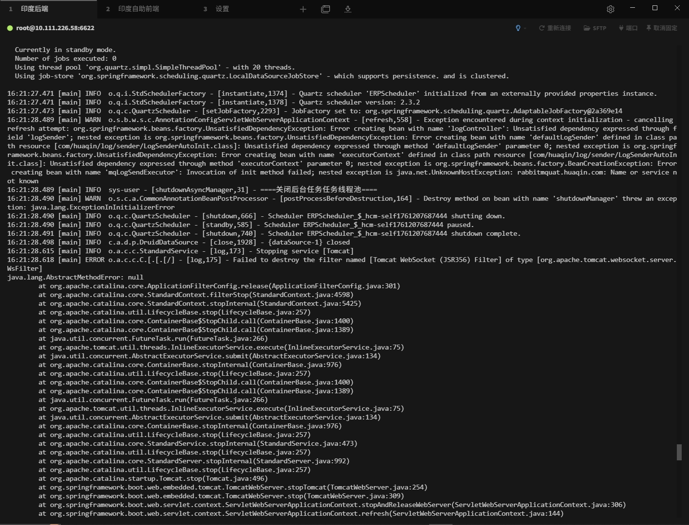

# begin


7/3/11
第二天现在才安装上idea


那个教程文件里面的算法有问题
那个太老了，也可能兼容的不够
这个是兼容的算法
还有用cur之类的新算法，这个git不支持


还有
到现在都没装上我想要的idea
天塌了
对，还好那个人给提了一嘴，启动22的需要卸载干净20版本的
果然能启动了


天啊
终于好了


笑死我了

卧槽
不对
我进了我的那个版本还是不对
天啊
我人傻了
emm
可能是
安装完直接启动，系统没搞明白
emm还是不对
emmm
难道是因为要手动切换
果然可以
可能安装的时候直接继承上面的那个设置了把
那原来的22版本呢
我去看看
哦也能切换新的ui
哦，但是查看版本的时候发现不如23的，好，还好，要不然就白下载白问开权限了

对啊，你他妈的直接连着下载了好几个相同的文件，你也是sb，耽误自己的时间


我服了


[IDEA下使用gerrit项目指南_idea使用gerrit-CSDN博客](https://blog.csdn.net/gongjin28_csdn/article/details/90167011)
这个教了怎么用idea拉取gerrti代码，其实就是和git一样的


用git导入项目的时候，发现不能直接导入钩子
所以问了ai要先导入i项目在手动下载钩子
去掉克隆项目的剩下部分
```
mkdir -p .git/hooks/ && curl -Lo .git/hooks/commit-msg https://itgerrit.huaqin.com/tools/hooks/commit-msg && chmod +x .git/hooks/commit-msg
```
在Gitbash中运行


然后发现maven在构建，想起来一开始的maven还没有配置好
我天塌了
然后来进行maven的配置（nexus3使用手册）
发现了这个


完整配置过程


现在git和nuxus配置的差不多了
接着看Idea的导入项目
该下载钩子了

PS E:\project\IdeaProjects\hq\HCMSELF-CONTROLLER_1.1> curl -Lo .git/hooks/commit-msg https://itgerrit.huaqin.com/tools/hooks/commit-msg
Invoke-WebRequest : 找不到与参数名称“Lo”匹配的参数。
所在位置 行:1 字符: 6
+ curl -Lo .git/hooks/commit-msg https://itgerrit.huaqin.com/tools/hook ...
+      ~~~
    + CategoryInfo          : InvalidArgument: (:) [Invoke-WebRequest]，ParameterBindingException
    + FullyQualifiedErrorId : NamedParameterNotFound,Microsoft.PowerShell.Commands.InvokeWebRequestCommand


不是哥们呢
错误原因是参数不对，结果问了ai，居然

这个错误是因为在 **Windows PowerShell** 中，`curl` 命令实际上是 **PowerShell 的 `Invoke-WebRequest` 命令的别名**，而不是 Linux/macOS 中的原生 `curl` 工具。两者的参数语法不同，导致 `-Lo` 参数无法识别。

解决办法还挺多的
用windows自带的
用curl.exe(git自带的)
用临时禁用别名

我想用的是相当于linux里面的curl
但是这个正好是windows中的另一个命令的别名，所以可以用curl.exe
或者禁用别名
或者直接用对应的windows的那个东西命令的参数格式，

这是整个过程

```
Windows PowerShell
尝试新的跨平台 PowerShell https://aka.ms/pscore6

PS E:\project\IdeaProjects\hq\HCMSELF-CONTROLLER_1.1> cat .git/hooks/commit-msg
cat : 找不到路径“E:\project\IdeaProjects\hq\HCMSELF-CONTROLLER_1.1\.git\hooks\commit-msg”，因为该路径不存在。
所在位置 行:1 字符: 1
+ cat .git/hooks/commit-msg
+ ~~~~~~~~~~~~~~~~~~~~~~~~~
 
PS E:\project\IdeaProjects\hq\HCMSELF-CONTROLLER_1.1> # 进入项目目录（如果不在当前路径）
PS E:\project\IdeaProjects\hq\HCMSELF-CONTROLLER_1.1> cd HCMSELF-CONTROLLER
cd : 找不到路径“E:\project\IdeaProjects\hq\HCMSELF-CONTROLLER_1.1\HCMSELF-CONTROLLER”，因为该路径不存在。
所在位置 行:1 字符: 1
+ cd HCMSELF-CONTROLLER
+ ~~~~~~~~~~~~~~~~~~~~~
 
PS E:\project\IdeaProjects\hq\HCMSELF-CONTROLLER_1.1> # 创建 hooks 目录（通常已存在，可跳过）
PS E:\project\IdeaProjects\hq\HCMSELF-CONTROLLER_1.1> mkdir -p .git/hooks/
mkdir : 具有指定名称 E:\project\IdeaProjects\hq\HCMSELF-CONTROLLER_1.1\.git\hooks\ 的项已存在。
所在位置 行:1 字符: 1
+ mkdir -p .git/hooks/
+ ~~~~~~~~~~~~~~~~~~~~
    + FullyQualifiedErrorId : DirectoryExist,Microsoft.PowerShell.Commands.NewItemCommand
 
PS E:\project\IdeaProjects\hq\HCMSELF-CONTROLLER_1.1> # 下载 commit-msg 钩子
PS E:\project\IdeaProjects\hq\HCMSELF-CONTROLLER_1.1> curl -Lo .git/hooks/commit-msg https://itgerrit.huaqin.com/tools/hooks/commit-msg
Invoke-WebRequest : 找不到与参数名称“Lo”匹配的参数。
所在位置 行:1 字符: 6
+ curl -Lo .git/hooks/commit-msg https://itgerrit.huaqin.com/tools/hook ...
+      ~~~
    + CategoryInfo          : InvalidArgument: (:) [Invoke-WebRequest]，ParameterBindingException
    + FullyQualifiedErrorId : NamedParameterNotFound,Microsoft.PowerShell.Commands.InvokeWebRequestCommand
 
PS E:\project\IdeaProjects\hq\HCMSELF-CONTROLLER_1.1> curl.exe -Lo .git/hooks/commit-msg "https://itgerrit.huaqin.com/tools/hooks/commit-msg"
  % Total    % Received % Xferd  Average Speed   Time    Time     Time  Current
                                 Dload  Upload   Total   Spent    Left  Speed
  0     0    0     0    0     0      0      0 --:--:--  0:01:00 --:--:--     0
curl: (35) schannel: failed to receive handshake, SSL/TLS connection failed
PS E:\project\IdeaProjects\hq\HCMSELF-CONTROLLER_1.1>


```


```
PS E:\project\IdeaProjects\hq\HCMSELF-CONTROLLER_1.1> chmod +x .git/hooks/commit-msg
chmod : 无法将“chmod”项识别为 cmdlet、函数、脚本文件或可运行程序的名称。请检查名称的拼写，如果包括路径，请确保路径正确，然后再试一次。
所在位置 行:1 字符: 1                                                                    
+ chmod +x .git/hooks/commit-msg                                                         
+ ~~~~~                                                                                  
    + CategoryInfo          : ObjectNotFound: (chmod:String) [], CommandNotFoundException
    + FullyQualifiedErrorId : CommandNotFoundException 
```

好家伙，问了，ai建议去gitbash来运行
他喵的，原来是要本来就在git里面运行的意思

我在idea终端里面运行半天
超

好了我又在git bash里面运行了一遍
```

100563122@WXP100563122-01 MINGW64 /e/project/IdeaProjects/hq/HCMSELF-CONTROLLER_1.1 (master)
$ git branch
* master

100563122@WXP100563122-01 MINGW64 /e/project/IdeaProjects/hq/HCMSELF-CONTROLLER_1.1 (master)
$ cd "HCMSELF-CONTROLLER"
bash: cd: HCMSELF-CONTROLLER: No such file or directory

100563122@WXP100563122-01 MINGW64 /e/project/IdeaProjects/hq/HCMSELF-CONTROLLER_1.1 (master)
$ mkdir -p "$(git rev-parse --git-dir)/hooks/"

100563122@WXP100563122-01 MINGW64 /e/project/IdeaProjects/hq/HCMSELF-CONTROLLER_1.1 (master)
$ git rev-parse --git-dir
.git

100563122@WXP100563122-01 MINGW64 /e/project/IdeaProjects/hq/HCMSELF-CONTROLLER_1.1 (master)
$ curl -Lo "$(git rev-parse --git-dir)/hooks/commit-msg" "https://itgerrit.huaqin.com/tools/hooks/commit-msg"
  % Total    % Received % Xferd  Average Speed   Time    Time     Time  Current
                                 Dload  Upload   Total   Spent    Left  Speed
100  2992  100  2992    0     0  46335      0 --:--:-- --:--:-- --:--:-- 48258

100563122@WXP100563122-01 MINGW64 /e/project/IdeaProjects/hq/HCMSELF-CONTROLLER_1.1 (master)
$ chmod +x "$(git rev-parse --git-dir)/hooks/commit-msg"

100563122@WXP100563122-01 MINGW64 /e/project/IdeaProjects/hq/HCMSELF-CONTROLLER_1.1 (master)
$

```

这是图片


配置的差不多了
看看前端啦

emm哦，和前面的过程好像差不多
我勒个，要是用vscode不知道该有多麻烦，毕竟也要git


拉完之后执行命令

很顺利啦
```
mkdir -p `git rev-parse --git-dir`/hooks/

curl -Lo `git rev-parse --git-dir`/hooks/commit-msg https://itgerrit.huaqin.com/tools/hooks/commit-msg

chmod +x `git rev-parse --git-dir`/hooks/commit-msg

```


有点神奇，这个user中一堆信息


# 1 外包月度延时出勤明细

员工延时明细、员工组织信息、员工分类信息
工号不空
员工类型CODE 在034

员工分类信息
中C_LABOR_TYPE 用工方式没有外包

先按年份降序；
再按月份降序；
然后按延时出勤余额降序；
最后按体系、部门、工号升序排列。


为什么直接sql查询和xml里面的不一样，原来这个地方，还有查询语句

查出来和xml一样都是0行，好，看看这个部分是什么玩意


这里（datascope的）切面编程存的是当前用户的组织信息的orghid
和部门别名
这个id是当前用户的组织信息，当前用户是管理者，返回他的部门的信息，


这是获取orghid的地方
没走if
所以前端返回了组织id
然后直接根据id拼接sql
根据id向上查找组织列表
查找所有的本组织和上面组织的信息，
所以效果就是根据本人的组织信息，返回所有这个组织的上面的组织的所有人的出勤明细？
这么奇怪


getRoutersByMenuIdAndOrghid
selectTbOrgUnitByOrgAndUser
selectRoleListByOrgUnitAndUser
selectMenuTreeByRoleIdAndMenuId
getMenuPermSpecialByCode

当我研究到前端需要后端传递参数获取菜单的时候
要切实研究获取组织单元信息这个玩意了
然后有了升序，降序，递归查询的玩意

然后真的发现是部门大于组的情况下，是 4 》5


天啊
看了这么长时间，就看到了 这个 获取组织单元


找到了！！！
终于看见这个月度延时出勤明细
天啊


半天找不到
终于在2025/7/9/21:29 这个时候看见了
天啊


问了昊哥知道在哪配置菜单了，主要是，当时无忧姐说我给忘记了
悲

发现运行后还是没有页面，
觉得是那个角色没有配置这个新页面的权限

但是找不到好多啊
然后调试
找到了登陆人的角色id（本来不知道是不是角色id，但是去那个地方找了下还真有，还真没有选那个页面权限


这个就是最小组织
！数据库就展示500条数据，所以就看见1就看见8
哦哦，所以之前没找到那个组织id就是因为当时没查询完全


但是这个子类搜索里面有这个不同的类型啊。。。。要不要删掉


删掉了这两个


ok啊
人生中第一次提交代码


天啊，三年的时间
我复制的代码是三年前的
我醉了
是我刚进大一的时候，那个时候已经。。。
天啊


前端的

我真他喵的服了
本来很小的问题，一会就修改完了，但是我代码死活提交不上去，为什么啊
到最后发现是有一个合并的问题
就在我准备问老师的时候
老师要下班顺口问了我一下，被我留下了，绷不住了
然后就在那研究
发现是那个有个merge的问题
还有把中文改成了英文，
然后成功了
但是我还是没有看清记住怎么取消的那个merge,怎么提的时候没有那个merge
可能是那个updata的问题
但是现在我转念一想好像是因为有那个第一次提交的问题？

因为没有我改名字的那次那个v.1.1了
哦，也许是改名字的问题？
也许是
但是确实就是updata的时候就有那个merger了把
确实
那下次怎么办
e,,,
提交之前先pull
再commit push
如果已经提交了，就去idea中的Log中找撤回那个提交，哦对，我记得确实是撤回提交，但是老师选了什么模式应该是，所以当时我第一次撤回的时候我的代码修改都没了，chao了，所以下次可以试试某个模式下的撤回提交，然后再手动pull然后再commit(当然还有一种高可能性，老师说的拉下新代码可能指的是fetch，这样就不会有Merge，这个也有点合理，下次看看)


## 总结

照抄后看看 原有的一些东西是不是需要修改或删除了


# 2 编制 15薪字段 定时任务


还是新建一个查询语句把，在原有的查询语句上进行增加感觉怪怪的
那就直接添加那个非制造o,的在职15和在途15


```java
//新增根据员工类型以及是否15薪 取季度和月度绩效--20220826  
List<OnJobOrDimIssIonVo> not15AndOLempList = onJobOrDimIssIonVoList.stream()  
                                            .filter(item ->"0".equals(item.getO15()) && "5".equals(item.getNewEmpType())).collect(Collectors.toList());  
List<OnJobOrDimIssIonVo> yes15empList =      onJobOrDimIssIonVoList.stream()  
                                            .filter(item ->!("0".equals(item.getO15()) && "5".equals(item.getNewEmpType()))).collect(Collectors.toList());
```


天才
能想起在这添加列名


我看到了ai的痕迹hhh


可能是因为前端就准备展示中心和体系，所以后端，遇见公司直挂的中心就直接添加合计用于之后添加中心下的各体系，
而直接直挂于公司的就直接展示出来了


中心
	分体系
		部门
		组
	体系
		分体系
			部门
			组
		部门
		组

```java
//1、获取直挂中心的 体系、分体系、部门、组 编制数据  
//        这个就是直接返回  
        List<ManagePlaitReportRespVo> systemReportList = tbOrgManagePlaitReportMapper.queryAllChildrenOrgByCenterOrgHid(Arrays.asList(centerOrgHid));  
        //固定展示顺序  
        Map<String,List<ManagePlaitReportRespVo>> systemMap = getSortOrg(systemReportList);
```
这就是获得 中心，各个体系 分体系

```java
//获取体系下 直挂的分体系、部门、组 编制数据
List<ManagePlaitReportRespVo> deptList =  tbOrgManagePlaitReportMapper.queryAllChildrenOrgBySysOrgHid(sysHids);  
Map<String, List<ManagePlaitReportRespVo>> deptMap = deptList.stream().collect(Collectors.groupingBy(ManagePlaitReportRespVo::getSuperiorHid));  
//将体系下部门/分体系 组织，排序插入对应位置 整合报表返回格式  
for(Map.Entry<String,List<ManagePlaitReportRespVo>> entry:systemMap.entrySet()){  
    if(deptMap.containsKey(entry.getKey())){ /*对应的各个体系的entry添加这个体系下的直属部门，组，分体系，因为entry中有一个是所有体系的上级的一个中心，所以需要If判断一下*/  
        entry.getValue().addAll(deptMap.get(entry.getKey()));  
    }  
}
```
这就是获得体系下面的

因为前端是中心、体系、分体系、部门组
且
分体系下还有部门组

所以现在还需要获得分体系下的部门组


```java
/*把中心直挂分体系和体系下面的分体系 的各个部门组进行添加到 systemMap*///4、过滤获取当前中心下所有直挂的分体系的组织       中心，体系 -》 分体系  
List<String> zgzxFsysHids = systemReportList.stream().filter(a->"7".equals(a.getOrgLevel())).map(ManagePlaitReportRespVo::getOrgHid).collect(Collectors.toList());  
fsysHids.addAll(zgzxFsysHids);/*各个体系下的各个部门组分体系中的分体系 加上 中心下的 分体系 *///获取分体系下直挂部门组的编制数据      之所以要这样分这找，是因为前端是这样展示的四列  
if(fsysHids.size()>0){/*这里找的是所有 中心下分体系，体系下分体系 的所有直挂 部门组，然后把这些部门组的上级id本来应该是分体系的，全部改成了分体系的上级id，（相当于越级了*/  
    List<ManagePlaitReportRespVo> fsysDeptList = tbOrgManagePlaitReportMapper.queryAllChildrenOrgByFSysOrgHid(fsysHids);  
    //上級hid有兩種，一種是中心，一種是体系,所以sql对SuperiorHid字段特殊处理了 （将直挂某体系下的分体系的上级hid调整成了体系的）方便下面遍历放到对应体系下     /*按照修改之后的上级id进行分组，也就是按照中心下面的所有体系或者分体系id进行分组*/  
    Map<String, List<ManagePlaitReportRespVo>> fsysDeptMap = fsysDeptList.stream().collect(Collectors.groupingBy(ManagePlaitReportRespVo::getSuperiorHid));  
    //直挂中心的分体系下的部门组还挂载中心下 直挂体系下的分体系挂在体系合计后面  
    for(Map.Entry<String,List<ManagePlaitReportRespVo>> entry:systemMap.entrySet()){  
        if(fsysDeptMap.containsKey(entry.getKey())){  
            //获取分体系合计行在list中的位置  
            List<ManagePlaitReportRespVo> value = entry.getValue();  
            int index = 0;  
            for(int i=0;i<value.size();i++){  
                if((value.get(i).getThirdName()+"合计").equals(value.get(i).getFourName())){      /*= 说明 分体系名称合计 这个i 这个地方 是分体系 */                    index = i;  
                    break;  
                }  
            }  
            entry.getValue().addAll(index+1,fsysDeptMap.get(entry.getKey()));  
        }  
    }  
}
```
所以有了这个

```
case "2" ://中心  
    returnList = getCenterReport(tbOrgUnit.getId(),tbOrgUnit.getName());  
    break;  
case "3" ://体系  / 事业部
    returnList = getSystemReport(orgUnits.get(0).getId());  
    break;  
case "7" ://分体系  
    returnList = getFSystemReport(orgUnits.get(0).getId());  
    break;  
case "4" ://部门  
    returnList = getDeptReport(orgUnits.get(0).getId());  
    break;  
case "6" ://副部  
    returnList = getFDeptReport(orgUnits.get(0).getId());  
    break;  
default:  
    break;
```
```
//获取 副部 组织hid  
List<String> fdeptHids = allDeptList.stream().filter(a->"6".equals(a.getOrgLevel())).map(ManagePlaitReportRespVo::getOrgHid).collect(Collectors.toList());
```
副部 6


```
  
<el-table-column  
  prop="empO15Num"  
  align="center"  
  min-width="60"  
  label="15薪在职"  
></el-table-column>
```


```
  
<el-table-column  
  prop="intransitO15Num"  
  align="center"  
  min-width="60"  
  label="15薪在途"  
></el-table-column>
```


应该就是提交前就要拉代码，就是commit之前就要pull
这样就能pull完成功commit and push


**
我用了那么长时间原来只需要重新npm run dev
一下就好了
我真是服了
热加载原来不会加载这个啊


我好像发现问题了


怎么回事

为什么会有88 和 89
果然
我自己下午闲来无事搞得idea的前端项目也在启动，占用的就是88端口，而且是没有改的那个null默认值

超了
害我看了几遍的命名是不是错了
我真是又服了
我还清空了浏览数据，换了浏览器
能发现还多亏是项目启动自己新开了个网页，然后我自己用网址都是88的
自己开的就是89 自己弄的都是88
怪不得


成了，
果然
commit and push的时候推送会失败
然后undo 发现更改全没了
然后ds告诉我需要 git reset soft HEAD~1
那我直接尝试 

发现好像没什么变化
执行了吗
再试一次看到右下角有进度条
成功执行了但是没有效果
那试试下面的那个reset
ok!
成功了
来，再试试分开提交推送

确实，应该要有这个选择的
前面直接commit and push的时候是没有这个的

### 定时任务测试

应该用第二个的


看了，发现我没运行


现在应该就是注解问题了


太感动了
感谢王浩宇
用不了那个xxljob方式的注解
还要要用bean(类)方式
然后继承实现方法
然后添加注解
还有一个方式是
```
1. `XxlJobExecutor.registJobHandler("demoJobHandler", new DemoJobHandler());`
```
因为这个地方我找不到地方添加，所以就去问别人了
现在一想我好像知道了可以放到那个Init的地方

然后我还没想到可以直接这个实现方法调用你要测试的函数，而不是你整个放进去

我是sb？


天啊真有错误
吓人


随便去·网上找了下教程，还真是直接用jobhandler注解
怎么没想到去网上看看
试了试两个方法
第一个xxljob注解找不到
第二个要
1. `XxlJobExecutor.registJobHandler("demoJobHandler", new DemoJobHandler());`
2. 不知道添加到哪个位置
然后就直接放弃了，哎，还可以问问网上或者把自己的试错都展示出来问问无忧姐
danshiganjuewenwanghaoyukenenghaodian
结果问完好像知道那个
3. `XxlJobExecutor.registJobHandler("demoJobHandler", new DemoJobHandler());`
可以添加到那个init的那个位置


我服了
我服了
我豁然开朗
之所以数据库里面有那个组下的异动
但是公司总览里面没有看到

是因为！
组上的异动之间的调动不算部门上的调动和异动

我服了

我找到那个异动的那个人的部门id
找到他的组织是组，然后找他的部门
然后在sql中侧重研究部门和组
发现确实，组能查到的人，但是部门查不到
不应该啊
组都有了，为是么部门没有

再来回查，确实查不到

然后下面的组我按照 部门的id进行group发现能找到
那为什么上面找不到
经过截图对比
发现前面都一样啊
不会真的都一样把
然后终于到了最后一行
发现不一样了
超
原来部门下的异动还需要异动前后组织不一样
我勒个

那这下可以理解le1


这个地方的评测中心中合计是 0 


但是最下面有一个是1
是因为
评测中心合计是从所有组织表连接编制结果表得来的
然后编制结果表中那个评测中心就是没有的
理由如上所述，（其实就是组上的异动不算是中心上的异动，必须跨中心才算中心上的异动
所以有了这个看似不合理的样子
按照组上的异动不算是中心上的异动，必须跨中心才算中心上的异动这个规则
那这样就合理了


他喵的
前俩的pos level 是一个长串的哈希值
需要连表查 职级
这样改完确实多几个


## 测试


hid组织
d5026c008b03439ebe01aa23378bb686
计划二部


他喵的
这个降序是这个500个数据的降序


知道了
为什么下面能查到34个人
但是整体就几个人呢
因为整体是
```
m.C_EMP_TYPE = '4' AND (m.C_YONGGONGXINGSHI = '1' OR m.C_ZHAOPINQUDAO = '100006003') AND m.o15 = '1'
```
下面仅仅是
```
m.o15 = '1'
```

所以，这样就对了吗
不对

注意他说的是岗位巴拉巴拉的东西是 非制造o15薪的条件，不是15薪的判断逻辑
所以m.015=1,不用连接m.C_EMP_TYPE = '4' AND (m.C_YONGGONGXINGSHI = '1' OR m.C_ZHAOPINQUDAO = '100006003')
吵了
一开始是这个需求判断条件没有理解对，
一个是被sql带偏了，想当然了


记住这是刚才错的所有人数，改正看看


这就不对了
第二个是直接能判断非制造o15
第三个只能判断 o15


！
是我自作多情了

## 总结

定时任务测试


# 3 esb 编制数据返回

```
请递归检查 src/main/java/com/huaqin/hcm 下的所有文件，找出与 ESB 相关的接口定义、客户端调用和服务处理逻辑，并整理出完整的实现结构。
```


@Slf4j
方便用日志的


你好意思问吗
我请问了呢


```
SELECT  
        OU.C_HID orgHid,        OU.C_CODE orgCode,        OU.C_NAME orgName,        OU.C_LEVEL orgLevel,        GETCODENAME(OU.C_LEVEL,'ORGANIZATION_LEVEL') orgLevelName,<!--        CASE-->  
<!--        WHEN OU.C_LEVEL = '2' THEN '中心'-->  
<!--        WHEN OU.C_LEVEL = '3' THEN '体系'-->  
<!--        WHEN OU.C_LEVEL = '7' THEN '分体系'-->  
<!--        WHEN OU.C_LEVEL = '4' THEN '部门'-->  
<!--        WHEN OU.C_LEVEL = '6' THEN '副部'-->  
<!--        END AS orgLevelName,-->
```
直接用数据库的函数来


之前看不懂这个
现在懂了
其实就是下面这个

其实就是常数代码
根据organization_level
找c_level编码的映射值 


这个应该就是意思是在不同维度下有不同的隶属关系的意思


## 总结

维度，常数代码，


# 4 bs项目

```
ssh://100563122@itgerrit.huaqin.com:29418/IT/HCM-BS
```


别错了

一开始配置之后运行
错啦！
因为idea不支持7以下的jdk天塌了
但是ai说可以用高版本Jdk生成6的字节码
试试
似乎原来的问题解决了
但是新的问题出现了
tomcat的版本jdk又有问题
好了把tomcat的jre改成6
试了试
又有新的问题
找不到redis配置
怪！
怎么全文都找不到这个redis.max...
来回查找想到
后面还有修改配置文件教程，那应该就是这个了
试试


别错了
!
错了
数据库连接问题
天塌了


找了一圈
以为是配置的问题
可是配置不是复制的吗
然后找了测试连接问题的方法
有下载软件的telnet的
tnsping的
哦，可以直接用datagrip测试的
果然数据库和原来的oracle不一样


好家伙错误

又找了找，原来可以直接Ping这个网址，试了试，请求超时


Ok啊，地址问题


运行似乎没有太大的问题，但是他喵的，怎么打不开网页

然后午休结束打开idea看到这个东西，！什么情况


哦，是我抄错了
我勒个我服了


成了


莫名有这个错误，目前没看到什么影响


# 5 bmbp  国际化

改端口，改配置，命令nginx，来回捯饬，

直接打开hosts文件用记事本，修改需要管理员权限，但是我没有管理员权限，一直失败
今天早上回来看了看ds又随手试了试，又可以了？？就是因为我是管理员身份运行的记事本？？

好吧，来回试了试，还是不行，还是登录之后就空白再返回登录页面

问了无忧姐，发现分支错了
但是分支改了还是不对，有可能是账号问题

然后写代码，直接测试，发现没有token，然后来回找，发现找不到，然后发现有个esb向外发送请求获得auth认证，那可能是外部认证，
直接去登录uat环境，然后拿到里面的token试了试，可以了，但是


平常里的controller里面生效了，但是为什么怎么传递参数都是显示默认的中文呢
经过调试，走到源码里面，发现走的是
经过调试，我发现是走的public class AcceptHeaderLocaleResolver implements LocaleResolver {
这个类里面的resolvelocale方法，获得的默认语言，这是怎么回事

问了ai好像需要配置扫描到这个类，可是我不是已经弄这个Component，难道不会自动替换吗
好吧，又回去看了看ai之前给的国际化流程，确实有配置过程，再看看

找到了
```
/**  
 * 国际化  
 * @return  
 */  
@Bean  
public LocaleResolver localeResolver(){  
    return new SelfLocaleResolver();  
}
```
还需要这个配置

哦，对比网上，知道了，可以直接加上configuration注解也行，也可以先component再bean再configuration

所以国际化过程需要
资源文件
实现接口
（配置类）
（工具类）


哦哦

那我知道了
为什么这个地方是带点的，原来是这样


你是不是傻
你直接看中文message中有哪些东西不就知道用到哪些需要国际化处理了


选中直接ctrl shift x直接中英替换
ei~


```
[\u4e00-\u9fa5]+
```


```
MessageUtils.message("")
```


```
MessageSource messageSource = SpringUtil.getBean(messsource.class);
```
```

```
```
package com.huaqin.pmdp.util;  
  
import org.springframework.context.MessageSource;  
import org.springframework.context.i18n.LocaleContextHolder;  
  
/**  
 * 获取i18n资源文件  
 *  
 * @author HQ  
 */public class MessageUtils  
{  
    /**  
     * 根据消息键和参数 获取消息 委托给spring messageSource  
     *     * @param code 消息键  
     * @param args 参数  
     * @return 获取国际化翻译值  
     */  
    public static String message(String code, Object... args)  
    {  
        MessageSource messageSource = SpringUtil.getBean(MessageSource.class);  
        return messageSource.getMessage(code, args, LocaleContextHolder.getLocale());  
    }  
}
```

还是不行
静态方法需要静态成员，还是需要中转变量赋值

```
@Component
public class MessageUtils {

    private static MessageSource staticMessageSource; // 静态变量

    @Autowired 
    private MessageSource instanceMessageSource; // 实例变量（Spring可注入）

    @PostConstruct
    public void init() {
        staticMessageSource = instanceMessageSource; // 启动时赋值给静态变量
    }

    public static String message(String code, Object... args) {
        return staticMessageSource.getMessage(code, args, LocaleContextHolder.getLocale());
    }
}
```

```porperties
query.successful=查询成功  
params.error=参数错误  
params.error.check=参数错误，请检查  
asynchronous.delivery.interface.responds.successfully=异步下发中，接口响应成功  
add.dictionary=新增字典  
error.dictionary.type.exists=失败，字典类型已存在  
revise.dictionary=修改字典  
opertion.successful=操作成功  
business.exception=业务异常  
under.review=审核中  
approved.review=审核通过  
review.failed=审核不通过  
params.empty=必填参数为空  
expiration.state.invalid.expiration.date.required=失效状态时，失效日期必填  
country.domestic.registration.code/identity.ID.requires=所属国家为国内时，注册码/身份ID必填  
status.value.incorrect=所传状态值错误，请检查所传参数  
information.not.exist=信息不存在，请检查所传参数  
information.already.exists=信息已存在，不能重复创建  
partner.code.generation.fails.recreate=合作方编码生成失败，请重新创建  
collaboration.type.already.invalid=合作类型已被置为失效状态，无需重复失效  
collaboration.type.already.active=合作类型已被置为激活状态，无需重复激活  
information.draft.wait.approval=信息为草稿状态，请等待审批完成  
corporate.group.code.not.exist=法人集团编码不存在，请检查/创建法人集团信息后再操作  
entity.type.unit.registered.address.requried=所选主体类型为单位时，注册地址必填  
other=其他  
suppliers=供应商  
customer=客户  
dictionary.tags.cant.empty=字典标签不能为空  
dictionary.labels.cant.exceed.100.length=字典标签长度不能超过100个字符  
dictionary.key.values.cant.empty=字典键值不能为空  
dictionary.key.values.cant.exceed.100.length=字典键值长度不能超过100个字符  
dictionary.type.cant.empty=字典类型不能为空  
dictionary.type.cant.exceed.100.length=字典类型长度不能超过100个字符  
style.attributes.cannot.exceed.100.length=样式属性长度不能超过100个字符  
dictionary.name.cant.empty=字典名称不能为空  
dictionary.name.cant.exceed.100.length=字典类型名称长度不能超过100个字符  
opertion.failed=操作失败  
database.exception.contact.administrator=数据库异常，请联系管理员  
copyplease=请拷贝【  
IT=】给IT  
data.exception.contact.administrator.empty.pointer=数据异常，请联系管理员(空指针)  
token.invalid=token失效，请重新登录  
ESB.service.call.fails.contact.administrator=ESB服务调用失败，请联系管理员处理  
partner.information.not.exist=合作方信息不存在，请检查！  
partner.information.not.draft.status.not.allowed.approval=合作方信息非草稿状态，不允许提交审批，请检查！  
partner.information.ing.or.approved.not.repeated=合作方信息审核中或已审批，不允许重复提交审批，请检查！  
submission.approval.failed.contact.IT=提交审批失败，请联系IT人员！  
submission.successful=提交成功  
save.successfully=保存成功  
operation.failure.fullnameOrID.already.exists=操作失败：【合作方全称或公司注册码/身份ID】已存在，请检查！  
fullnameOrID.already=【合作方全称或公司注册码/身份ID】已存在，请检查  
partner.number.generate.failed=合作方编号生成失败，请重新保存  
update.successful=更新成功  
update.release.successfully=更新并下发成功  
already.unused.state=】已为未使用状态，无需重复失效！  
partner.status.draft.cannot.invalidated=】合作方状态为草稿状态，不能失效！  
collaboration.types.not.include.other.types.no.need.invalidate=】合作类型不含其他类型，无需失效！  
failure success=失效成功  
parameters.incorrect=所传参数有误，请检查  
partner.ownership.system.not.platform=合作方归属系统非平台，不允许修改！  
partners.information.review.ing=合作方信息审核中，不允许修改数据，请等待审批结果！
```

## token 获得
```
[Huaqin Technology IBP System](https://ibpuat.huaqin.com/home)
```
登录之后f12 搜索token 复制一个就好了
```
9c3306c23b85c9b68229bfb80021f798
```
```
c995df1d35ece5949c8735ab6dc2f36e
```

直接测试
缺什么直接补什么


直接这样测试

直接这样直接看有没有不就好了还在这里一直一个一个注释

为什么token失效的时候登录的时候发现en zh无效

无效获得null设置zh
得到zh返回

有效 获得despatchservlet

不对
是一开始都是null然后进行设置
然后获得行为，但是后者是有一个dispatcherservlet赋值，后面获得时候根据这个获得en


太感动了
太感动了
实在看不懂源码，网上也找不到，
于是想着直接获取请求直接获取那个参数lang,直接进行获取那个消息
然后进行各种测试看看怎么获取请求，怎么直接调用那个函数，终于

这种方式
下面直接用那个自动注入的类调用方法来实现功能


原来底层会从header中找token（一个一个键值对遍历找

又看了一遍
好像知道大概的原因了
正常情况下
是走了三遍getlocale
第一次是null
二次是 zh -cn
三次是那个en

但是失效情况下，是直接两次，第一次null第二次直接zh直接返回然后走了catch返回了

既然是这样那为什么其他的THrow就是正常的


全是断点


```
this.$t('manager.registCode')
```
```
this.$t('common.registCode')
```

```
{{ $t('common.loadMore') }}
```


终于用到滚轮长按竖向选中了


他喵的，来回问ai以为知道了是nginx代理静态资源访问请求，
前端服务器直接把请求代理到了入口文件之类的index.html

结果加了代理不对，问了ai可以直接访问
```
http://localhost:8011/lib-pmdp/static/config/index.js
```
来进行测试，发现，改不改都能正常访问，他喵的，

也就是npm run dev情况下，vue自己有一个服务器
build只是把资源打包，服务器给了nginx

!
又错了醉了

然后无忧姐让我本地启动，可是不是之前说了本地错了
难道现在好了

我又试了试
访问了home，发现有点问题，但是进去了
一些静态资源有问题
然后又把配置改回去，
然后对了
进去了，我醉了
那为什么之前有问题，
难道无忧姐部署那个在线访问的js资源了吗，可能不是
这里可能是当时的路由选的不好


此时做的翻译是 ctrl n 在里面找到的中文进行了 翻译


这里就是从后端取完字典数据之后又把数据放到redis里面

这个合作方整体流程是
合作方信息从后端拿
然后字典也是从后端拿
然后在前端进行对应翻译取值


```
create table sys_language_config  
(  
    id                bigint auto_increment comment '主键',  
    language_category varchar(32)   null comment '语言类别',  
    language_value    varchar(1000) null comment '语言值',  
    relation_id       varchar(100)  null comment '关联id',  
    relation_table    varchar(100)  null comment '关联需国际化的表名',  
    operate_time      datetime      null comment '操作时间',  
    constraint `PRIMARY`  
        primary key (id)  
)  
    comment '国际化语言配置表';  
  
create index language_config_category  
    on sys_language_config (language_category);  
  
create index language_config_relationid  
    on sys_language_config (relation_id);
```


我知道了，应该是当有多个参数的时候，应该需要注解来映射
果然不报那个什么找不到lang参数问题了
醉了


给你完了
你单词拼错了
一直映射不上
返回不出来数据
我真醉了


翻完了
从早上来到现在15：23


我也是醉了，这都是啥


测试发现还是中文
原来是
pmdp/api/system/dict/data/type/pmdp:provice:001为什么发送请求的时候这个请求中没有cookie，我后端取得不了cookie中的lang参数


## 投产资料


前端向此接口发送请求获得字典数据，

/pmdp/api/system/dict/data/type/{dictType}

前端请求过程
[pmdp](lingma/开发过程.md#pmdp)

首先获取 各个合作方的各种信息，包括省份（以编号dictvalue形式）
再查询字典
前端循环查找 和dictvalue 的对应的 dictLabel 进行展示

/pmdp/api/system/dict/data/type/{dictType}
后端此接口修改为 根据前端请求的cookie 中的 lang 参数返回的对应语言环境下的dictLabel内容
（若无翻译结果，则默认为中文，若中文状态下表内存储即是英语，则返回英语）
cookie若找不到语言参数（lang) 则默认中文

为此增加了数据库表：
sys_language_config
```
create table sys_language_config  
(  
    id                bigint auto_increment comment '主键'  
        primary key,  
    language_category varchar(32)   null comment '语言类别',  
    language_value    varchar(1000) null comment '语言值',  
    relation_id       varchar(100)  null comment '关联id',  
    relation_table    varchar(100)  null comment '关联需国际化的表名',  
    operate_time      datetime      null comment '操作时间'  
)  
    comment '国际化语言配置表';  
  
create index language_config_category  
    on sys_language_config (language_category);  
  
create index language_config_relationid  
    on sys_language_config (relation_id);
```

并且 以下面的展示为规则

language_category -- en(英文)/vi(越南语)/es(西班牙语)/id(印度尼西亚语)
language_value -- sys_dict_data 表内 dict_label 对应语言的 翻译结果
relation_id -- sys_dict_data 表内 dict_label 对应 dict_code（主键）
relation_table -- sys_dict_data
operate_time -- 2025-08-07 17:51:04

向表内插入了 500(sys_dict_data的总行数) * 4  共计2000 条数据


前端传递的 id 印度尼西亚 语言 参数 对应 后端的 in 资源文件

redis 存储相关字典数据时的 key 变为 lang+':'+dictType

## ai问法

```
我现在有一个 create table sys_language_config ( id bigint auto_increment comment '主键' primary key, language_category varchar(32) null comment '语言类别', language_value varchar(1000) null comment '语言值', relation_id varchar(100) null comment '关联id', relation_table varchar(100) null comment '关联需国际化的表名', operate_time datetime null comment '操作时间' ) comment '国际化语言配置表'; create index language_config_category on sys_language_config (language_category); create index language_config_relationid on sys_language_config (relation_id); 这样的表， 还有一个我放在最下方的 json 数据 我需要你生成许多插入的sql语句，要求如下 现在我需要你把下方数据中的dict_label列数据分别翻译为 英语 越南语 西班牙语 印度尼西亚语 作为 sys_language_config 表内的 language_value 而 当英语的时候 sys_language_config 表 内的 language_category 为 en 越南语的时候为 vi 西班牙语的时候为 es 印度尼西亚语的时候为 id 而 sys_language_config 表 内的 relation_id 则为 下方数据中的dict_label 数据 所对应的 dict_code 而 sys_language_config 表 内的 relation_table 固定为 sys_dict_data 而 sys_language_config 表 内的 operate_time 固定为 2025-10-16 17:51:04 要求如上，给我生成对应的sql语句来插入这些要求的数据 首先给我生成关于 下方 数据的 前十 个数据 的对应的40 条sql插入语句 另外要求每个数据要有一个注释包含 对应的dictcode dictlabel，注释下面是对应的四个翻译后的sql语句，还有每个sql语句就一行 包含单引号的内容都已正确转义处理


```

```
再接着生成json 中的 接着的上面的 10 个数据对应的sql语句
```
## 问题

js翻译响应式问题
lose不能测试问题
后端国际化测试未测试

## common


西班牙语
印度尼西亚语
越南语


我有以下所展示的js文件
我需要把里面的键值对形式的比如
```
mainType:'主体类型不能为空',
```
这样的数据的地方的值也就是右边的地方从中文翻译成 印度尼西亚语
注意翻译之后的结果也需要''进行包裹
按照这个js文件原来的样子返回给我
```js
export default {  
    route: {  
        systemManagement: '系统管理',  
        sysUser: '管理员列表',  
        jobSchedule: '作业时间表',  
        dashboard: '主页',  
        demo: '演示',  
        demoEcharts: '电子图表',  
        demoUeditor: 'Ueditor'  
    },  
    navbar: {  
        en: '英语',  
        zh: '简体中文',  
        changePassword: '更改密码',  
        logout: '注销'  
    },  
    common:{  
        search:'搜索',  
        add:'新增',  
        edit:'编辑',  
        lose:'失效',  
        save:'保存',  
        submit:'提交',  
        warning:'警告',  
        ok:'确认',  
        cancel:'取消',  
        messageSuccess: '操作成功',  
        idEmpty:'主键未获取到，请刷新后再尝试',  
        loadMore: '加载更多',  
        clear: '清除',  
        pageNotFound: '抱歉！您访问的页面',  
        disconnected: '失联',  
        ellipsis: '啦 ...',  
        goBack: '返回上一页',  
        goHome: '进入首页',  
        adminLogin: '管理员登录',  
        login: '登录',  
        username: '帐号',  
        password: '密码',  
        captcha: '验证码',  
        usernameNotNull: '帐号不能为空',  
        passwordNotNull: '密码不能为空',  
        captchaNotNull: '验证码不能为空',  
        monday: '周一',  
        tuesday: '周二',  
        wednesday: '周三',  
        thursday: '周四',  
        friday: '周五',  
        saturday: '周六',  
        sunday: '周日',  
        layoutSettings: '布局设置',  
        navbarType: '导航条类型',  
        sidebarSkin: '侧边栏皮肤',  
        tip: '提示：',  
        selectPlease: '请选择'  
    },  
    manager: {  
        cardType:'证件类型',  
        mainType: '主体类型',  
        code: '合作方编号',  
        personName:'姓名',  
        status: '合作方状态',  
        fullName:'合作方全称',  
        name: '合作方简称',  
        type:'合作类型',  
        country:'所属国家',  
        provice:'省',  
        source:'来源',  
        flowStatus:'流程状态',  
        city:'市',  
        updateTime: '操作时间',  
        loseDate: '失效日期',  
        registCode:'公司注册码',  
        registComCode:'公司注册码',  
        registPerCode:'身份ID',  
        corporateGroup:'法人集团全称',  
        registAddress:'注册地址',  
        legalRepresentative:'法人代表',  
        registCapital:'注册资本(万元)',  
        establishDate:'成立日期',  
        registCodeMsg1:'1.中国大陆企业填写营业执照上的统一社会信用代码',  
        registCodeMsg2:'2.海外或港澳台地区填写商业登记证编号',  
        add:'新增合作方',  
        edit:'编辑合作方',  
        detail:'合作方详情',  
        loseWarn:'是否要失效选中的数据',  
        createBy:'创建人',  
        updateBy:'更新人',  
        remark:'备注说明',  
        welcomeMessage: '欢迎使用合作方主数据平台',  
        renrenFastVueDesc: 'renren-fast-vue基于vue、element-ui构建开发，实现renren-fast后台管理前端功能，提供一套更优的前端解决方案。',  
        echartsDemoNote: '1. 此Demo只提供ECharts官方使用文档，入门部署和体验功能。具体使用请参考：http://echarts.baidu.com/index.html',  
        partner: '合作方',  
        partnerHome: '合作方-首页',  
        batchMaterialQuery: '物料批量查询',  
        selected: '选中',  
        materialCount: '个物料',  
        exportFailed: '导出文件失败！',  
        atpDataCollection: 'ATP数据收集',  
        intervalNotSet: '间隔周期未维护',  
        tallyCycleNotSet: '理货周期未维护',  
        uphNotSet: 'UPH未维护',  
        lineStack: '折线图堆叠',  
        emailMarketing: '邮件营销',  
        unionAd: '联盟广告',  
        videoAd: '视频广告',  
        directAccess: '直接访问',  
        searchEngine: '搜索引擎',  
        total: '总量',  
        baidu: '百度',  
        google: '谷歌',  
        bing: '必应',  
        others: '其他',  
        advertisement: '广告',  
        lifeExpectancyVsGDP: '1990 与 2015 年各国家人均寿命与 GDP',  
        visitSource: '访问来源'  
    },  
    rule:{  
        mainType:'主体类型不能为空',  
        registCode:'注册码不能为空',  
        fullName:'合作方全称/姓名不能为空',  
        country:'所属国家不能为空',  
        card:'身份证号码不正确',  
        cardCode:'身份ID不能为空',  
        registAddress:'注册地址不能为空'  
    },  
    receive:{  
        receivingTemplate: '收料模板',  
        receivingTemplateList: '收料模板列表',  
        addReceivingTemplate: '新增收料模板',  
        editReceivingTemplate: '编辑收料模板',  
        receivingTemplateDetail: '收料模板详情',  
        receivingPlan: '收料计划',  
        receivingPlanList: '收料计划列表',  
        receivingPlanHistory: '收料计划历史'  
    },  
    sys:{  
        systemManagement: '系统管理',  
        adminList: '管理员列表',  
        roleManagement: '角色管理',  
        menuManagement: '菜单管理',  
        sqlMonitor: 'SQL监控',  
        timedTask: '定时任务',  
        parameterManagement: '参数管理',  
        fileUpload: '文件上传',  
        sysLog: '系统日志'  
    }  
};
```


我有一下数据，需要将数据中的键值对中的值 从中文翻译成越南语，其他不变，返回给我
```
query.successful=查询成功  
params.error=参数错误  
params.error.check=参数错误，请检查  
asynchronous.delivery.interface.responds.successfully=异步下发中，接口响应成功  
add.dictionary=新增字典  
error.dictionary.type.exists=失败，字典类型已存在  
revise.dictionary=修改字典  
operation.successful=操作成功  
business.exception=业务异常  
under.review=审核中  
approved.review=审核通过  
review.failed=审核不通过  
params.empty=必填参数为空  
expiration.state.invalid.expiration.date.required=失效状态时，失效日期必填  
country.domestic.registration.code/identity.ID.requires=所属国家为国内时，注册码/身份ID必填  
status.value.incorrect=所传状态值错误，请检查所传参数  
information.not.exist=信息不存在，请检查所传参数  
information.already.exists=信息已存在，不能重复创建  
partner.code.generation.fails.recreate=合作方编码生成失败，请重新创建  
collaboration.type.already.invalid=合作类型已被置为失效状态，无需重复失效  
collaboration.type.already.active=合作类型已被置为激活状态，无需重复激活  
information.draft.wait.approval=信息为草稿状态，请等待审批完成  
corporate.group.code.not.exist=法人集团编码不存在，请检查/创建法人集团信息后再操作  
entity.type.unit.registered.address.requried=所选主体类型为单位时，注册地址必填  
other=其他  
suppliers=供应商  
customer=客户  
dictionary.tags.cant.empty=字典标签不能为空  
dictionary.labels.cant.exceed.100.length=字典标签长度不能超过100个字符  
dictionary.key.values.cant.empty=字典键值不能为空  
dictionary.key.values.cant.exceed.100.length=字典键值长度不能超过100个字符  
dictionary.type.cant.empty=字典类型不能为空  
dictionary.type.cant.exceed.100.length=字典类型长度不能超过100个字符  
style.attributes.cannot.exceed.100.length=样式属性长度不能超过100个字符  
dictionary.name.cant.empty=字典名称不能为空  
dictionary.name.cant.exceed.100.length=字典类型名称长度不能超过100个字符  
operation.failed=操作失败  
database.exception.contact.administrator=数据库异常，请联系管理员  
copyplease=请拷贝【  
IT=】给IT  
data.exception.contact.administrator.empty.pointer=数据异常，请联系管理员(空指针)  
token.invalid=token失效，请重新登录  
ESB.service.call.fails.contact.administrator=ESB服务调用失败，请联系管理员处理  
partner.information.not.exist=合作方信息不存在，请检查！  
partner.information.not.draft.status.not.allowed.approval=合作方信息非草稿状态，不允许提交审批，请检查！  
partner.information.ing.or.approved.not.repeated=合作方信息审核中或已审批，不允许重复提交审批，请检查！  
submission.approval.failed.contact.IT=提交审批失败，请联系IT人员！  
submission.successful=提交成功  
save.successfully=保存成功  
operation.failure.fullnameOrID.already.exists=操作失败：【合作方全称或公司注册码/身份ID】已存在，请检查！  
fullnameOrID.already=【合作方全称或公司注册码/身份ID】已存在，请检查  
partner.number.generate.failed=合作方编号生成失败，请重新保存  
update.successful=更新成功  
update.release.successfully=更新并下发成功  
already.unused.state=】已为未使用状态，无需重复失效！  
partner.status.draft.cannot.invalidated=】合作方状态为草稿状态，不能失效！  
collaboration.types.not.include.other.types.no.need.invalidate=】合作类型不含其他类型，无需失效！  
failure.success=失效成功  
parameters.incorrect=所传参数有误，请检查  
partner.ownership.system.not.platform=合作方归属系统非平台，不允许修改！  
partners.information.review.ing=合作方信息审核中，不允许修改数据，请等待审批结果！
```
## 总结

实现接口，写资源文件，获取对应值，返回


前端向此接口发送请求获得字典数据，

/pmdp/api/system/dict/data/type/{dictType}

前端请求过程
[pmdp](lingma/开发过程.md#pmdp)

首先获取 各个合作方的各种信息，包括省份（以编号dictvalue形式）
再查询字典
前端循环查找 和dictvalue 的对应的 dictLabel 进行展示

/pmdp/api/system/dict/data/type/{dictType}
后端此接口修改为 根据前端请求的cookie 中的 lang 参数返回的对应语言环境下的dictLabel内容
（若无翻译结果，则默认为中文，若中文状态下表内存储即是英语，则返回英语）
cookie若找不到语言参数（lang) 则默认中文


# 6 薪酬管理赋能配置

他喵的
直接拉了uat的项目代码
结果运行失败
之后直接把原来的另一个_s项目拉过来运行，好吧成功了
但是一看，chenge好多
这怎么提交
然后想办法
准备再在_s项目新建分支然后进行测试看看是不是项目配置的原因
好吧，直接新建分支失败
原因是有change需要处理
好吧我直接把这些change放大开发项目里试试再启动
我去成功了

本来想着如果再不成功就要在uat环境下直接添加菜单了（但是这个方法不推荐。。。


```
TB_SALARY_EMPOWERS_ALLOCATE
```
```
薪酬管理赋能配置
```

（sys账号，但是数据库中找不到这个表）


功能树（新增


配置业务菜单（这个没改


这个地方增加了个对勾（tb账号


我他喵的就说
这个菜单配置应该就是设置用户菜单显示什么的
至于为什么和实际使用匹配不上，是因为刚才登录的账号属于tb，但是自己看的菜单设置属于 hr的
你都看见了那个tb使用，为什么一开始不就直接看呢
我醉了

然后这个地方 设置·菜单功能和 功能树的映射功能

但是如果要展示那个菜单，需要hr账号（在那个集团里面进行新建，
emm
那我先用tb账号测试测试


业务菜单配置中 这个地方可以看出来 是设置的 功能点， 功能点下的操作点应该是自动包含在内的
所以功能树那个地方不是要添加 基础配置 下添加 赋能配置
直接用赋能就好了 然后这个地方进行 映射设置

对原来添加的功能树进行修改
这个是原来的操作点，删掉


原来的功能点（无用的东西）


用tb账号本地服务，然后设置tb业务菜单，然后成功显示

并非，没有成功显示


| 常量名    | 值   | 含义                     | SQL 对应         |
| ------ | --- | ---------------------- | -------------- |
| `GT`   | 2   | **大于**                 | `>`            |
| `EQ`   | 1   | **等于**                 | `=`            |
| `NE`   | 6   | **不等于**                | `<>` 或 `!=`    |
| `SW`   | 7   | **以...开头（StartsWith）** | `LIKE 'xxx%'`  |
| `IN`   | 10  | **在...范围内**            | `IN (x, y, z)` |
| `LIKE` | 9   | **模糊匹配**               | `LIKE '%xxx%'` |
| `LT`   | 4   | **小于**                 | `<`            |
| `GE`   | 3   | **大于等于**               | `>=`           |
| `EW`   | 8   | **以...结尾（EndsWith）**   | `LIKE '%xxx'`  |
| `LE`   | 5   | **小于等于**               | `<=`           |


|机制|说明|
|---|---|
|**服务调用**|`doQuery()` → 调用 `salaryStandardService.executeQuery()`|
|**结果自动绑定**|返回值自动填充到 `query.result`|
|**表格数据绑定**|`dataProvider="{query.result.dataList}"` 绑定到表格行数据|
|**分页绑定**|`PagingToolbar` 读取 `query.result.totalCount` 实现分页|
|**响应式更新**|数据变化时，表格和分页控件会自动刷新|

```
views/deliver/listSalaryStandard.xml
```


这个暂时不需要了（已经删了）


# 7 pbc


## 疑问


insertnotexi子查询也要有有效性判断


d.status = '0' and d.del_flag = '0' and d.is_deleted = 0
部门有效性

and u.status = '0' and u.del_flag = '0'
用户有效性

and r.status = '0' and r.del_flag = '0'
role有效性


应该是那个循环内加上事务


需要检验是否表中已经存在了相同的userrole


日志标准


逗号拼接问题


create我写的都是upm

你拿ai生成的链接关系没有考虑有效性，记得加上


组织权限怎么查询
hrd是什么


导出待测试

开放给 集团绩效管理员

常量替换


1. 体系绩效管理员：
2. 新增sys_user_role表数据，
3. 查询组织权限数据，（这个是查询这个人有哪些组织权限还是说申请的这个角色下有哪些组织权限暂且认为是找这个人有哪些组织权限，然后看组织下的部门，如果已存在不管，不存在就添加这个人和对应的角色和对应的组织下的正负部填进去）
4. 若组织数据存在，
	1. 处理sys_manager_role_dept（user_code）表数据，(内有·组织，角色，user)
	2. 获取组织下部门级组织（正部/副部），然后获取对应部门的有效数据，
	3. 若数据不存在，新增sys_manager_role_dept，（新增时体系取适时组织信息、per_vp_code取已有数据悉尼线）
	4. 若数据存在则不处理
   
5. 考核过程看护/绩效考核表看护/制造考核过程看护：
6. 查询组织权限数据，
7. 若组织数据存在，
	1. 处理sys_role_limit（emp_code）表数据，(内有 组织，看护人，负责组织)
	2. 获取对应组织的有效数据，
	3. 若数据不存在，新增sys_role_limit，若数据存在则不处理（新增逻辑参考绩效配置-权限管理-看护人维护）
    
10. 其他：直接新增sys_user_role表数据


type 2


11. 获取员工角色，
12. 存在体系绩效管理员，
13. 查询组织权限数据，
14. 若组织数据存在，处理sys_manager_role_dept（user_code）表数据，获取组织下部门级组织（正部/副部），
	1. 然后获取对应部门的有效数据，
	2. 若数据不存在，新增sys_manager_role_dept，
	3. 若数据存在则不处理

15. 获取员工角色，
16. 存在考核过程看护/绩效考核表看护/制造考核过程看护，
17. 查询组织权限数据，
18. 若组织数据存在，处理sys_role_limit（emp_code）表数据，
	1. 获取对应组织的有效数据，
	2. 若数据不存在，新增sys_role_limit，
	3. 若数据存在则不处理
19. 不存在，不处理


```
com/huaqin/hcm/service/report/ReportPbcService.java
```


为什么要这么麻烦呢
为什么角色·无效和有效的时候要删除 角色菜单功能 数据呢才行呢，
是因为应用角色菜单功能 数据的时候没有判断 角色的有效性吗

## end


```
@PreAuthorize("@ss.hasPermi('system:role:query')")
```
这里的权限就是直接从那个redis中取出来的user中含有的一个属性set


他喵的终于成功了

首先试了试各个ip发现不行
又找到这个网址
有进展，密码不对
写了user也不对
各种实也不对
```
ENC(95lHwDFps4ut7gDCA7+ahtI/3AVqjKId)

```
这个就不对
应该是加密过的吧

去hcm里面找到了

旁边备注的真正的密码
好诶
可是你怎么直接觉得是权限问题直接去问yunlongge了，先不说是不是权限问题，即便是权限问题，你没在想到可以去redis中直接找吗
我请问了呢


```
com/huaqin/hcm/security/service/UserDetailsServiceImpl.java
```


```
throw new CustomException(String.format("%1$s已分配,不能删除", role.getRoleName()));
```


哦哦，原来是在insert的时候 已经进行 传进去的对象进行 主键返回回填设置了
可以直接用了

不用另外创建对象进行接受


哇，这个好方便


天啊·
根本不需要

```xml
<insert id="insertDeptsMinus">
    INSERT INTO sys_manager_role_dept
    (role_id, org_code, sys_code, org_level, hrd, create_by, update_by, create_time, update_time, other_vp_code, per_vp_code, user_code)
    SELECT 
        #{roleId} as role_id,
        d.dept_id as org_code,
        doa.sys_code as sys_code,
        d.rank_code as org_level,
        0 as hrd,
        'upm' as create_by,
        null as update_by,
        NOW() as create_time,
        null as update_time,
        mrd.other_vp_code as other_vp_code,
        mrd.per_vp_code as per_vp_code,
        #{userId} as user_code
    FROM 
        sys_dept d
    LEFT JOIN 
        sys_dept_orgappend doa ON d.dept_id = doa.dept_id
    LEFT JOIN 
        sys_manager_role_dept mrd ON d.dept_id = mrd.org_code
    WHERE 
        d.dept_id IN 
        <foreach collection="deptsMinus" item="deptId" open="(" separator="," close=")">
            #{deptId}
        </foreach>
        AND NOT EXISTS (
            SELECT 1 FROM sys_manager_role_dept 
            WHERE role_id = #{roleId} 
              AND org_code = d.dept_id
              AND user_code = #{userId}
        )
</insert>
```

直接not exists解决了
醉了，天啊，天呐
删除·的
```java
// 从upm查询组织权限  
List<String> orgs = sysUserUpmMapper.selectOrgByUser(vo.getUserId());  
  
// 查部门级别  看这个组织权限下有哪些部门 看表里有没有这些部门  全不全，然后做减法 补充  
// 看orgs下有哪些部门  
List<String> depts = sysUserUpmMapper.selectDeptByOrg(orgs);  
  
// 看user 和 申请的role 下 已经有了哪些部门权限 从managerroledept中获取  
List<String> deptsed =  sysManagerRoleDeptMapper.selectOrgByUserRole(vo.getUserId(),vo.getRoleId());  
  
// 做减法，orgs 减 找到的  
List<String> deptsMinus = depts.stream().filter(org -> !deptsed.contains(org)).collect(Collectors.toList());  
  
// 如果小于等于0 说明 已经存在 不用处理  
if(deptsMinus.isEmpty()){  
    // pass  
}  
  
// 如果大于 0 则补充（sys_code连组织全表找，组织层级是部门，hrd 0 ,othervpcode 和 pervpcode就根据相同组织找现有数据，找不到先不管）  
if (!deptsMinus.isEmpty()){  
    sysManagerRoleDeptMapper.insertDeptsMinus(deptsMinus, vo.getUserId(), vo.getRoleId());  
}
```


```
-- auto-generated definition  
create table sys_role_limit  
(  
    id                 bigint unsigned      not null  
        primary key,  
    org_code           text                 not null comment '组织编号',  
    org_name           text                 not null comment '组织名称',  
    business_area      varchar(200)         null comment '业务区域',  
    business_area_name varchar(200)         null comment '业务区域名称',  
    emp_type           varchar(2)           null comment '职员、O类员工',  
    role_limit         varchar(200)         not null comment '1=考核过程看护,2=绩效考核表看护,3=制造考核过程看护',  
    emp_code           varchar(200)         not null comment '看护人工号',  
    emp_name           varchar(200)         not null comment '看护人姓名',  
    is_valid           tinyint(1) default 1 null comment '是否生效 1:是0:否',  
    is_deleted         tinyint(1) default 0 null,  
    version            int(10)    default 1 null,  
    create_by          varchar(50)          not null,  
    create_time        datetime             not null,  
    update_by          varchar(50)          null,  
    update_time        datetime             null,  
    charge_org         text                 null comment '负责组织'  
)  
    comment '看护人权限约束';

int insertNotExist(Long roleId, List<String> orgs, String userId);
这个是接口方法
需要向表内插入数据的mybatis xml方法

id自增
org_code为orgs中的对应元素
org_name 为 用org 链接 sys_dept表中的 dept_id  之后的字段 dept_name
business_area      varchar(200)         null comment '业务区域',  为空
    business_area_name varchar(200)         null comment '业务区域名称',为空
    emptype为空
    rolelimit为  roleId
    empcode 为 userid
    empname为 以 userid为值链接 sys_user 的user_name 为条件 之后 sysuser中nick_name值
    is_valid 为 1
    is_deleted 为 0
    version 1
    create_by 为 upm 
    createtime为 now
    updateby 和time为null
    charge_org为 在 sys_dept表中用find_in_set(org(orgs中的对应元素), sys_dept.ancestors)所得到的所有数据行中的dept_id加上本次find_in_set中所使用的org，中间用英文符号,来链接

插入的时候要求not exists 表内已经有的 roleId，org userid组合


```


```
select dept_id  
from sys_dept  
<where>  
    status = '0'  
    and del_flag = '0'    <if test="rankList != null and rankList.size() > 0">  
        and rank_code in  
        <foreach collection="rankList" item="item" open="(" close=")" separator=",">  
            #{item}  
        </foreach>  
    </if>  
    <if test="codes != null and codes.size() > 0">  
        and (  
        <foreach collection="codes" index="index" item="item" separator="or">  
            find_in_set(#{item}, ancestors)  
        </foreach>  
        )  
    </if>  
</where>  
order by dept_id
```

```
  
List<SysUserRole> sysUserRoles1 = sysUserRoleMapper.selectList(  
        Wrappers.<SysUserRole>lambdaQuery().eq(SysUserRole::getUserId, Long.valueOf(vo.getUserId())));
```


```
  
  
// 准备要插入的userrole  
List<SysUserRole> sysUserRoles = new ArrayList<>();  
// 准备要插入的userupm数据  
List<SysUserUpm> collect = reqData.stream().map(vo -> {  
    SysUserUpm sysUserUpm = new SysUserUpm();  
  
    sysUserUpm.setId(IdUtil.getSnowflakeNextId());  
    sysUserUpm.setUserCode(vo.getUserId());  
    sysUserUpm.setIsSync(true);  
    sysUserUpm.setDeleted(false);  
    sysUserUpm.setCreateTime(LocalDateTime.parse(DateTimeFormatter.ofPattern("yyyy-MM-dd HH:mm:ss)").format(Instant.now())));  
    sysUserUpm.setCreateBy("upm");  
  
    // upm传递角色权限  
    if (vo.getRoleId().startsWith("PbcRole-")) {  
        sysUserUpm.setType(1);  
        sysUserUpm.setRoleId(Long.valueOf(vo.getRoleId().substring("PbcRole-".length())));  
  
        // 体系绩效管理员  
        if("160".equals(vo.getRoleId().substring("PbcRole-".length()))){  
            // 新增 userrole表  
            SysUserRole sysUserRole = new SysUserRole();  
            sysUserRole.setUserId(Long.valueOf(vo.getUserId()));  
            sysUserRole.setRoleId(sysUserUpm.getRoleId());  
            sysUserRoles.add(sysUserRole);//之后统一插入  
  
            // 从upm查询组织权限  
            List<String> orgs = sysUserUpmMapper.selectOrgByUser(vo.getUserId());  
  
            if(!orgs.isEmpty()){  
                // 看orgs下有哪些部门(正副 包含orgs作为部门  
                List<String> depts = sysUserUpmMapper.selectDeptByOrg(orgs);  
                if(!depts.isEmpty())  
                    // 内部排除已经存在的 user role org组合  
                    sysManagerRoleDeptMapper.insertOrgsNotExist(sysUserUpm.getRoleId(), depts, vo.getUserId());  
                else{  
                    // 没有部门 说明是 部门下的组织权限 todo 插入 排除  
  
                }  
            }  
        }  
        // 另外三个考核过程看护/绩效考核表看护/制造考核过程看护  
        else if ("300".equals(vo.getRoleId().substring("PbcRole-".length()))){  
            // 从upm查询组织权限  
            List<String> orgs = sysUserUpmMapper.selectOrgByUser(vo.getUserId());  
            if(!orgs.isEmpty())  
                sysRoleLimitMapper.insertNotExist("1", orgs, vo.getUserId());  
        }  
        else if ("301".equals(vo.getRoleId().substring("PbcRole-".length()))){  
            // 从upm查询组织权限  
            List<String> orgs = sysUserUpmMapper.selectOrgByUser(vo.getUserId());  
            if(!orgs.isEmpty())  
                sysRoleLimitMapper.insertNotExist("2", orgs, vo.getUserId());  
        }  
        else if("302".equals(vo.getRoleId().substring("PbcRole-".length()))){  
            // 从upm查询组织权限  
            List<String> orgs = sysUserUpmMapper.selectOrgByUser(vo.getUserId());  
            if(!orgs.isEmpty())  
                sysRoleLimitMapper.insertNotExist("3", orgs, vo.getUserId());  
        }  
        // 其他角色进行新增  
        else{  
            // 新增 userrole表  
            SysUserRole sysUserRole = new SysUserRole();  
            sysUserRole.setUserId(Long.valueOf(vo.getUserId()));  
            sysUserRole.setRoleId(sysUserUpm.getRoleId());  
            sysUserRoles.add(sysUserRole);//之后统一插入  
        }  
  
        // 统一插入userrole  
        sysUserRoleMapper.batchUserRole(sysUserRoles);  
  
    } // 申请组织权限的时候  
    else if (vo.getRoleId().toString().startsWith("DataRole-")) {  
        sysUserUpm.setType(2);  
        sysUserUpm.setOrgCode(vo.getRoleId().substring("DataRole-".length()));  
  
        // 从 upm中 查询角色  
        List<SysUserUpm> sysUserRoles1 = sysUserUpmMapper.selectList(Wrappers.<SysUserUpm>lambdaQuery().eq(SysUserUpm::getUserCode, vo.getUserId()).eq(SysUserUpm::getType,1));  
        if(!sysUserRoles1.isEmpty()){  
            // 判断sysUserRoles1是否包含体系绩效管理员  
            if(sysUserRoles1.stream().anyMatch(ele -> ele.getRoleId() == 160)){  
                // 申请的组织权限下 部门  
                List<String> depts = sysUserUpmMapper.selectDeptByOrg(Collections.singletonList(sysUserUpm.getOrgCode()));  
                if(!depts.isEmpty())  
                    sysManagerRoleDeptMapper.insertOrgsNotExist(sysUserUpm.getRoleId(), depts, vo.getUserId());  
                else{  
                    // 没有部门 说明是 部门下的组织权限 todo 插入 排除  
                    }  
            }  
            // 判断包含考核过程看护另外两个  
            else if(sysUserRoles1.stream().anyMatch(ele -> ele.getRoleId() == 300)){  
                sysRoleLimitMapper.insertNotExist("1", Collections.singletonList(sysUserUpm.getOrgCode()), vo.getUserId());  
            }  
            else if (sysUserRoles1.stream().anyMatch(ele-> ele.getRoleId() == 301)) {  
                sysRoleLimitMapper.insertNotExist("2", Collections.singletonList(sysUserUpm.getOrgCode()), vo.getUserId());  
            }  
            else if (sysUserRoles1.stream().anyMatch(ele-> ele.getRoleId() == 302)) {  
                sysRoleLimitMapper.insertNotExist("3", Collections.singletonList(sysUserUpm.getOrgCode()), vo.getUserId());  
            }  
        }  
    }  
    else{  
        throw new CustomException("传递权限类型错误");  
    }  
    return sysUserUpm;  
}).collect(Collectors.toList());  
  
sysUserUpmService.saveBatch(collect);
```


```
@TableField(  
        value = "create_by",  
        fill = FieldFill.INSERT,  
        updateStrategy = FieldStrategy.NEVER  
)  
private String createBy;
```
应该就是这个地方导致了，插入失败

```
@Slf4j  
@Component  
public class MyMetaObjectHandler implements MetaObjectHandler {  
  
    @Override  
    public void insertFill(MetaObject metaObject) {  
        this.setFieldValByName("createTime", LocalDateTime.now(), metaObject);  
        if (ObjectUtil.isEmpty(this.getFieldValByName("createBy", metaObject))) {  
            this.setFieldValByName("createBy", SecurityUtils.getLoginUser().getUser().getEmpCode(), metaObject);  
        }  
    }  
  
    @Override  
    public void updateFill(MetaObject metaObject) {  
        this.setFieldValByName("updateTime", LocalDateTime.now(), metaObject);  
        try {  
            this.setFieldValByName("updateBy", SecurityUtils.getLoginUser().getUser().getEmpCode(), metaObject);  
        } catch (Exception ex) {  
            ex.printStackTrace();  
        }  
    }  
}
```

在这个地方有对这个 自动填充做定义，所以会找不到用户，然后抛出异常

好吧，是自己多此一举了

这个地方加上后，那个表中也要增加相应的字段


你在发什么dian啊


file对象是能正常创建的，但是没法找到那个文件
知道了
因为没加.xlsx后缀。。。。。。。。


```
  
return sysUserUpms.stream()  
        .collect(Collectors.collectingAndThen(  
                Collectors.groupingBy(SysUserUpm::getUserCode),  
                map -> map.entrySet().stream()  
                        .map(entry -> {  
                            UserUpmVO vo = new UserUpmVO();  
                            vo.setUserCode(entry.getKey());  
  
                            String roles = entry.getValue().stream()  
                                    .filter(ele -> ele.getType() == 1)  
                                    .map(ele -> ele.getRoleId().toString())  
                                    .collect(Collectors.joining(","));  
                            vo.setRoleId(roles.isEmpty() ? "" : roles);  
  
                            String orgs = entry.getValue().stream()  
                                    .filter(ele -> ele.getType() == 2)  
                                    .map(SysUserUpm::getOrgCode)  
                                    .collect(Collectors.joining(","));  
                            vo.setOrgCode(orgs.isEmpty() ? "" : orgs);  
  
                            return vo;  
                        })  
                        .collect(Collectors.toList())  
        ));
```


不是哥们。你写反了

他喵的终于好了
中间经历了只返回了号码
返回空
mybatis-plus @tablefield不能链表映射 是和传递的实体对应的，
所以又改回了那个resultmap映射

看护负责的组织就是这个人负责组织下的所有组织和自己


在这里我看到了三种发送esb时候构造data数据的方法
一种是直接构造json数据样式的string，直接parse成json
一种是创建jsonarray来依次add 不断put各种键值对的 jsonobject对象
就i没直接把对象变成json的工具嘛
不应该啊
好，找到了
```
JSON.toJSON(workflowReqTeDataArr)
```
参数甚至是arraylist类型


总算写完了


我勒个，查出来我自己了，有点神奇

bugfixing删除的


```
/**  
 * Page<ExternalAssessmentObject> pageList(@Param("page") Page<ExternalAssessmentObject> page,  
 *                                             @Param("data") ExternalAssessmentObject object);  
 * *                                             GROUP BY *                                             GROUP_CONCAT() */Page<UserUpmVO> userUpmVOS = sysUserUpmMapper.selectAll(page);  
return userUpmVOS.stream().collect(Collectors.collectingAndThen(  
        Collectors.groupingBy(UserUpmVO::getUserCode),  
        map1 -> map1.entrySet().stream().map(  
                entry1 -> {  
                    String rolesName = entry1.getValue().stream()  
                            .filter(ele1 -> "1".equals(ele1.getType())).map(UserUpmVO::getRoleName).collect(Collectors.joining(","));  
                    String orgsName = entry1.getValue().stream()  
                            .filter(ele1 -> "2".equals(ele1.getType())).map(UserUpmVO::getOrgName).collect(Collectors.joining(","));  
                    String rolesCode = entry1.getValue().stream()  
                            .filter(ele1 -> "1".equals(ele1.getType())).map(UserUpmVO::getRoleId).collect(Collectors.joining(","));  
                    String orgsCode = entry1.getValue().stream()  
                            .filter(ele1 -> "2".equals(ele1.getType())).map(UserUpmVO::getOrgCode).collect(Collectors.joining(","));  
                    UserUpmVO vo1 = new UserUpmVO();  
                    vo1.setId(entry1.getValue().get(0).getId());  
                    vo1.setUserCode(entry1.getKey());  
                    vo1.setUserName(entry1.getValue().get(0).getUserName());  
                    vo1.setOrgName(orgsName);  
                    vo1.setRoleName(rolesName);  
                    vo1.setRoleId(rolesCode);  
                    vo1.setOrgCode(orgsCode);  
                    return vo1;  
                }  
        ).collect(Collectors.toList())  
));
```

```
  
//        String fileName = "员工角色有效数据导出.xlsx";  
//        String filePath = HqConfig.getDownloadPath() + fileName;  
//  
//        HttpServletRequest request = ServletUtils.getRequest();  
//        HttpServletResponse response = ServletUtils.getResponse();  
//        response.setCharacterEncoding("utf-8");  
//        response.setContentType("multipart/form-data");  
//        response.setHeader("Content-Disposition",  
//                "attachment;fileName=" + FileUtils.setFileDownloadHeader(request, fileName));  
//        FileUtils.writeBytes(filePath, response.getOutputStream());
```

## 测试


组织权限 没找到upm 角色
直接插入 upm 用户组织权限信息

角色权限 没找upm组织权限
直接插入upm userrole

组织权限 找到upm角色（其他角色）
插入upm userrole

角色权限 找到组织权限


异常


角色 
	普通 ed
	申请体系
		有组织
			体系 ed
			部门10000385 ed
			部门下  10005235 ed
		无组织  ed
	三个
		有组织
		无组织
组织
	体系角色
		有部门权限 插入6个manager ed
		部门下权限 ed
	三个角色
	非角色 ed
	

组织 非角色 插入流程与体系 到 角色申请体系有组织体系
申请部门权限，申请体系角色

异常 success

{
  "EsbReqHeader": {
    "RequestId": "fcd4a71f223d4b36aab9221682c9f066",
    "SourceSystem": "UPM", 
    "ServiceName": "REST_UPM_PUSH_ADD_USER_ROLE",
    "ServiceOperation": "1",
    "ServiceVersion": "1.0",
    "TargetSystem": "XXX系统"
  },
  "EsbReqData": [
      
    ]
}


{
  "EsbReqHeader": {
    "RequestId": "fcd4a71f223d4b36aab9221682c9f066",
    "SourceSystem": "UPM", 
    "ServiceName": "REST_UPM_PUSH_ADD_USER_ROLE",
    "ServiceOperation": "1",
    "ServiceVersion": "1.0",
    "TargetSystem": "XXX系统"
  },
  "EsbReqData": [
        {
            "userId": "99999999999",
            "roleId": "160"
        }  
    ]
}


角色 
	普通 ed
	申请体系
		有组织
			体系 ed
			部门10000385 ed
			部门下  10005235 ed
		无组织  ed
	三个
		有组织
		无组织

{
  "EsbReqHeader": {
    "RequestId": "fcd4a71f223d4b36aab9221682c9f066",
    "SourceSystem": "UPM", 
    "ServiceName": "REST_UPM_PUSH_ADD_USER_ROLE",
    "ServiceOperation": "1",
    "ServiceVersion": "1.0",
    "TargetSystem": "XXX系统"
  },
  "EsbReqData": [
        {
            "userId": "9999999996",
            "roleId": "DataRole-10000385"
        }  
    ]
}
{
  "EsbReqHeader": {
    "RequestId": "fcd4a71f223d4b36aab9221682c9f066",
    "SourceSystem": "UPM", 
    "ServiceName": "REST_UPM_PUSH_ADD_USER_ROLE",
    "ServiceOperation": "1",
    "ServiceVersion": "1.0",
    "TargetSystem": "XXX系统"
  },
  "EsbReqData": [
        {
            "userId": "9999999996",
            "roleId": "PbcRole-300"
        }  
    ]
}

{
  "EsbReqHeader": {
    "RequestId": "fcd4a71f223d4b36aab9221682c9f066",
    "SourceSystem": "UPM", 
    "ServiceName": "REST_UPM_PUSH_ADD_USER_ROLE",
    "ServiceOperation": "1",
    "ServiceVersion": "1.0",
    "TargetSystem": "XXX系统"
  },
  "EsbReqData": [
        {
            "userId": "9999999996",
            "roleId": "DataRole-10005235"
        }  
    ]
}


角色普通 suc 插入 userrole upm


{
  "EsbReqHeader": {
    "RequestId": "fcd4a71f223d4b36aab9221682c9f066",
    "SourceSystem": "UPM", 
    "ServiceName": "REST_UPM_PUSH_ADD_USER_ROLE",
    "ServiceOperation": "1",
    "ServiceVersion": "1.0",
    "TargetSystem": "XXX系统"
  },
  "EsbReqData": [
        {
            "userId": "9999999999",
            "roleId": "PbcRole-161"
        }  
    ]
}

角色体系无组织


角色申请体系有组织体系
{
  "EsbReqHeader": {
    "RequestId": "fcd4a71f223d4b36aab9221682c9f066",
    "SourceSystem": "UPM", 
    "ServiceName": "REST_UPM_PUSH_ADD_USER_ROLE",
    "ServiceOperation": "1",
    "ServiceVersion": "1.0",
    "TargetSystem": "XXX系统"
  },
  "EsbReqData": [
        {
            "userId": "9999999999",
            "roleId": "PbcRole-160"
        }  
    ]
}
角色申请体系有 部门 体系
{
  "EsbReqHeader": {
    "RequestId": "fcd4a71f223d4b36aab9221682c9f066",
    "SourceSystem": "UPM", 
    "ServiceName": "REST_UPM_PUSH_ADD_USER_ROLE",
    "ServiceOperation": "1",
    "ServiceVersion": "1.0",
    "TargetSystem": "XXX系统"
  },
  "EsbReqData": [
        {
            "userId": "9999999998",
            "roleId": "DataRole-10000385"
        }  
    ]
}
{
  "EsbReqHeader": {
    "RequestId": "fcd4a71f223d4b36aab9221682c9f066",
    "SourceSystem": "UPM", 
    "ServiceName": "REST_UPM_PUSH_ADD_USER_ROLE",
    "ServiceOperation": "1",
    "ServiceVersion": "1.0",
    "TargetSystem": "XXX系统"
  },
  "EsbReqData": [
        {
            "userId": "9999999998",
            "roleId": "PbcRole-160"
        }  
    ]
}
插入三张表 upm userrole manager


角色 
	普通 ed
	申请体系
		有组织
			体系 ed
			部门10000385 ed
			部门下  10005235
{
  "EsbReqHeader": {
    "RequestId": "fcd4a71f223d4b36aab9221682c9f066",
    "SourceSystem": "UPM", 
    "ServiceName": "REST_UPM_PUSH_ADD_USER_ROLE",
    "ServiceOperation": "1",
    "ServiceVersion": "1.0",
    "TargetSystem": "XXX系统"
  },
  "EsbReqData": [
        {
            "userId": "9999999997",
            "roleId": "DataRole-10005235"
        }  
    ]
}
{
  "EsbReqHeader": {
    "RequestId": "fcd4a71f223d4b36aab9221682c9f066",
    "SourceSystem": "UPM", 
    "ServiceName": "REST_UPM_PUSH_ADD_USER_ROLE",
    "ServiceOperation": "1",
    "ServiceVersion": "1.0",
    "TargetSystem": "XXX系统"
  },
  "EsbReqData": [
        {
            "userId": "9999999997",
            "roleId": "PbcRole-160"
        }  
    ]
}


组织 非角色 success 向upm插入 "9999999999",
{
  "EsbReqHeader": {
    "RequestId": "fcd4a71f223d4b36aab9221682c9f066",
    "SourceSystem": "UPM", 
    "ServiceName": "REST_UPM_PUSH_ADD_USER_ROLE",
    "ServiceOperation": "1",
    "ServiceVersion": "1.0",
    "TargetSystem": "XXX系统"
  },
  "EsbReqData": [
        {
            "userId": "9999999999",
            "roleId": "DataRole-161"
        }  
    ]
}

组织
	体系角色
		有部门权限 插入6个manager suc
{
  "EsbReqHeader": {
    "RequestId": "fcd4a71f223d4b36aab9221682c9f066",
    "SourceSystem": "UPM", 
    "ServiceName": "REST_UPM_PUSH_ADD_USER_ROLE",
    "ServiceOperation": "1",
    "ServiceVersion": "1.0",
    "TargetSystem": "XXX系统"
  },
  "EsbReqData": [
        {
            "userId": "9999999999",
            "roleId": "DataRole-10000385"
        }  
    ]
}

插入 体系级别组织权限 流程与IT体系 success
{
  "EsbReqHeader": {
    "RequestId": "fcd4a71f223d4b36aab9221682c9f066",
    "SourceSystem": "UPM", 
    "ServiceName": "REST_UPM_PUSH_ADD_USER_ROLE",
    "ServiceOperation": "1",
    "ServiceVersion": "1.0",
    "TargetSystem": "XXX系统"
  },
  "EsbReqData": [
        {
            "userId": "9999999999",
            "roleId": "DataRole-10000011"
        }  
    ]
}
manager表插入十个数据
userrole中添加一个数据
upm中添加一个数据


{
  "EsbReqHeader": {
    "RequestId": "fcd4a71f223d4b36aab9221682c9f066",
    "SourceSystem": "UPM", 
    "ServiceName": "REST_UPM_PUSH_ADD_USER_ROLE",
    "ServiceOperation": "1",
    "ServiceVersion": "1.0",
    "TargetSystem": "XXX系统"
  },
  "EsbReqData": [
        {
            "userId": "9999999999",
            "roleId": "PbcRole-160"
        }  
    ]
}


1. 删除sys_user_upm数据
    
2. 如果是角色，先删除sys_user_role表对应角色数据
    
    1. 体系绩效管理员：物理删除sys_manager_role_dept（user_code）表数据

"EsbReqData": [

        {

            "userId": "9999999999",

            "roleId": "PbcRole-160"

        }  

    ]


  "EsbReqData": [
        {
            "userId": "9999999999",
            "roleId": "DataRole-10000011"
        }  
    ]


        
    2. 考核过程看护/绩效考核表看护/制造考核过程看护：逻辑删除sys_role_limit（emp_code）表数据
        
4. 如果是组织
    
    1. 体系绩效管理员：物理删除员工对应组织的sys_manager_role_dept（user_code）表数据
        
    2. 考核过程看护/绩效考核表看护/制造考核过程看护：逻辑删除员工对应组织的sys_role_limit（emp_code）表数据
    3. 


## 须记
```
LambdaQueryWrapper<SysUserRole> queryWrapper = Wrappers.<SysUserRole>lambdaQuery().eq(SysUserRole::getUserId, Long.valueOf(vo.getUserId()));  
List<SysUserRole> sysUserRoles1 = sysUserRoleMapper.selectList(queryWrapper);  
if(!sysUserRoles1.isEmpty()){  
    // 判断sysUserRoles1是否包含体系绩效管理员  
    if(sysUserRoles1.stream().anyMatch(ele -> ele.getRoleId() == 160)){
```

如果一条sql可能会有多个数据进行插入，需要循环加入主键
记得分页

## todo


## 投产资料

```
esb接收角色关系，添加用户角色，删除用户角色
com/huaqin/hcm/controller/esb/EsbUserRoleUpmController.java
角色处理，查询level2,新增角色，保存角色，userupm数据查询及导出
com/huaqin/hcm/controller/sys/SysRoleController.java
发送信息到upm，同步用户角色到upm
com/huaqin/hcm/controller/sys/SysUserUpmController.java


```


## 总结

mybatisplus的匿名函数 lamda函数  wrappers.lambdaquery.eq
esb没有token

直接not exits来插入的时候排除一些三个列的相同组合

在这里我看到了三种发送esb时候构造data数据的方法
一种是直接构造json数据样式的string，直接parse成json
一种是创建jsonarray来依次add 不断put各种键值对的 jsonobject对象
就i没直接把对象变成json的工具嘛
不应该啊
好，找到了
```
JSON.toJSON(workflowReqTeDataArr)
```
参数甚至是arraylist类型


mybatis-plus @tablefield不能链表映射 是和传递的实体对应的，
所以又改回了那个resultmap映射


# 8 自助特殊菜单配置

## 临时
```
7f304de353c358egcfg267f023db8f25
```

```
6042d4ad0d654ddf819926f023b4d968
```

```
DynamicDataSourceContextHolder.setDataSourceType("SLAVE");
```

```
999999999
```

重写mybatis方法实现字符串拼接拆分

数据有效性校验、 注解 @Validated @notblank
数据权限校验 dontcare
日志

好像是因为依赖问题没有成功用selectone方法

新增判重

新增修改删除

事务


## 投产资料
### 数据库
sys_menu_permission_special表menu_id长度改成1000


数据库表创建

```
-- auto-generated definition  
create table sys_menu_permission_special_log  
(  
    id             bigint auto_increment  
        primary key,  
    operation_type varchar(10)   not null comment '操作类型: 插入/更新/删除',  
    operation_time datetime      not null comment '操作时间',  
    operator_code  varchar(64)   not null comment '操作人工号',  
    operator_name  varchar(64)   not null comment '操作人姓名',  
    record_id      bigint        null comment '被操作记录的原表ID',  
    emp_code_old   varchar(64)   null comment '修改前工号',  
    emp_code_new   varchar(64)   null comment '修改后工号',  
    emp_name_old   varchar(64)   null comment '修改前姓名',  
    emp_name_new   varchar(64)   null comment '修改后姓名',  
    org_hid_old    varchar(100)  null comment '修改前组织hid',  
    org_hid_new    varchar(100)  null comment '修改后组织hid',  
    perm_type_old  varchar(1)    null comment '修改前权限类型',  
    perm_type_new  varchar(1)    null comment '修改后权限类型',  
    menu_id_old    varchar(1000) null comment '修改前菜单ID集合',  
    menu_id_new    varchar(1000) null comment '修改后菜单ID集合'  
)  
    comment 'sys_menu_permission_special表的操作日志记录';

```
### 配置

菜单配置


角色配置


## 开发过程

下拉树 
三种方案

1 修改原有的下拉树vue文件使得可以从父节点传递ordId到子节点然后得到对应的树
2 添加上述的这样的vue文件
3 自己用select eltree组件实现

选第三个

```
<template>  
  <div class="app-container">  
    <el-form :model="queryParams" ref="queryForm" :inline="true" label-width="68px">  
      <el-form-item label="工号" prop="empCode">  
        <el-input            v-model="queryParams.empCode"  
            placeholder="请输入工号"  
            clearable  
            size="small"  
            @keyup.enter.native="handleQuery"  
        />  
      </el-form-item>      <el-form-item label="姓名" prop="empName">  
        <el-input            v-model="queryParams.empName"  
            placeholder="请输入姓名"  
            clearable  
            size="small"  
            @keyup.enter.native="handleQuery"  
        />  
      </el-form-item>      <el-form-item>        <el-button type="primary" icon="el-icon-search" size="mini" @click="handleQuery">搜索</el-button>  
        <el-button icon="el-icon-refresh" size="mini" @click="resetQuery">重置</el-button>  
      </el-form-item>    </el-form>  
    <el-row :gutter="10" class="mb8">  
      <el-col :span="1.5">  
        <el-button            type="primary"  
            icon="el-icon-plus"  
            size="mini"  
            @click="handleAdd"  
        >新增</el-button>  
      </el-col>      <el-col :span="1.5">  
        <el-button            type="success"  
            icon="el-icon-edit"  
            size="mini"  
            :disabled="single"  
            @click="handleUpdate"  
        >修改</el-button>  
      </el-col>      <el-col :span="1.5">  
        <el-button            type="danger"  
            icon="el-icon-delete"  
            size="mini"  
            :disabled="multiple"  
            @click="handleDelete"  
        >删除</el-button>  
      </el-col>      <el-col :span="1.5">  
        <el-button            type="warning"  
            icon="el-icon-download"  
            size="mini"  
            @click="handleExport"  
        >导出</el-button>  
      </el-col>    </el-row>  
    <el-table v-loading="loading" :data="specialList" @selection-change="handleSelectionChange">  
      <el-table-column type="selection" width="55" align="center" />  
      <el-table-column label="id" align="center" prop="id" />  
      <el-table-column label="工号" align="center" prop="empCode" />  
      <el-table-column label="姓名" align="center" prop="empName" />  
      <el-table-column label="组织约束id" align="center" prop="orgHid" />  
      <el-table-column label="操作" align="center" class-name="small-padding fixed-width">  
        <template slot-scope="scope">  
          <el-button              size="mini"  
              type="text"  
              icon="el-icon-edit"  
              @click="handleUpdate(scope.row)"  
          >修改</el-button>  
          <el-button              size="mini"  
              type="text"  
              icon="el-icon-delete"  
              @click="handleDelete(scope.row)"  
          >删除</el-button>  
        </template>      </el-table-column>    </el-table>  
    <pagination        v-show="total>0"  
        :total="total"  
        :page.sync="queryParams.pageNum"  
        :limit.sync="queryParams.pageSize"  
        @pagination="getList"  
    />  
  
    <!-- 添加或修改数据权限特殊配置对话框 -->  
    <el-dialog :title="title" :visible.sync="open" width="500px" append-to-body>  
      <el-form ref="form" :model="form" :rules="rules" label-width="80px">  
        <el-form-item label="工号" prop="empCode">  
          <el-input v-model="form.empCode" placeholder="请输入工号" />  
        </el-form-item>        <el-form-item label="姓名" prop="empName">  
          <el-input v-model="form.empName" placeholder="请输入姓名" />  
        </el-form-item>        <el-form-item label="组织约束id" prop="orgHid">  
          <el-input v-model="form.orgHid" placeholder="请输入组织约束id" />  
        </el-form-item>        <el-form-item label="组织" prop="orgHid">  
          <el-popover              placement="bottom-start"  
              width="400"  
              trigger="click"  
              v-model="orgTreeVisible">  
            <el-tree                :data="orgTreeData"  
                :props="orgTreeProps"  
                :filter-node-method="filterOrgNode"  
                @node-click="handleOrgNodeClick"  
                ref="orgTree"  
                node-key="id"  
                highlight-current  
                :expand-on-click-node="false"  
            ></el-tree>  
            <el-input                slot="reference"  
                v-model="form.orgName"  
                placeholder="请选择组织"  
                readonly  
                clearable                @clear="clearOrgSelection"  
            >  
              <i slot="suffix" class="el-icon-search"></i>  
            </el-input>          </el-popover>        </el-form-item>      </el-form>      <div slot="footer" class="dialog-footer">  
        <el-button type="primary" @click="submitForm">确 定</el-button>  
        <el-button @click="cancel">取 消</el-button>  
      </div>    </el-dialog>  </div></template>  
  
<script>  
import { listSpecial, getSpecial, delSpecial, addSpecial, updateSpecial, exportSpecial } from "@/api/system/special";  
import {directChildrenOrgList} from "@/api/G_api/saralyAdm";  
  
export default {  
  name: "Special",  
  data() {  
    return {  
      // 遮罩层  
      loading: true,  
      // 选中数组  
      ids: [],  
      // 非单个禁用  
      single: true,  
      // 非多个禁用  
      multiple: true,  
      // 总条数  
      total: 0,  
      // 数据权限特殊配置表格数据  
      specialList: [],  
      // 弹出层标题  
      title: "",  
      // 是否显示弹出层  
      open: false,  
      // 组织树选择弹窗显示状态  
      orgTreeVisible: false,  
      // 组织树数据  
      orgTreeData: [],  
      // 组织树配置  
      orgTreeProps: {  
        children: 'directChildren',  
        label: 'name'  
      },  
      // 查询参数  
      queryParams: {  
        pageNum: 1,  
        pageSize: 10,  
        empCode: undefined,  
        empName: undefined,  
        orgHid: undefined  
      },  
      // 表单参数  
      form: {},  
      // 表单校验  
      rules: {  
        empCode: [  
          { required: true, message: "工号不能为空", trigger: "blur" }  
        ],  
        empName: [  
          { required: true, message: "姓名不能为空", trigger: "blur" }  
        ],  
        orgHid: [  
          { required: true, message: "组织约束id不能为空", trigger: "blur" }  
        ]  
      }  
    };  
  },  
  created() {  
    this.getList();  
    this.getOrgTreeData();  
  },  
  methods: {  
    /** 查询数据权限特殊配置列表 */  
    getList() {  
      this.loading = true;  
      listSpecial(this.queryParams).then(response => {  
        this.specialList = response.rows;  
        this.total = response.total;  
        this.loading = false;  
      });  
    },  
    /** 获取组织树数据 */  
    getOrgTreeData() {  
      const orgId = '6042d4ad0d654ddf819926f023b4d968';  
      directChildrenOrgList(orgId).then(res => {  
        this.orgTreeData = res.data.directChildren || [];  
      });  
    },  
    /** 过滤组织树节点 */  
    filterOrgNode(value, data) {  
      if (!value) return true;  
      return data.name.indexOf(value) !== -1;  
    },  
    /** 组织树节点点击事件 */  
    handleOrgNodeClick(data) {  
      this.form.orgHid = data.id;  
      this.form.orgName = data.name;  
      this.orgTreeVisible = false;  
    },  
    /** 清除组织选择 */  
    clearOrgSelection() {  
      this.form.orgHid = '';  
      this.form.orgName = '';  
    },  
    // 取消按钮  
    cancel() {  
      this.open = false;  
      this.reset();  
    },  
    // 表单重置  
    reset() {  
      this.form = {  
        id: undefined,  
        empCode: undefined,  
        empName: undefined,  
        orgHid: undefined  
      };  
      this.resetForm("form");  
    },  
    /** 搜索按钮操作 */  
    handleQuery() {  
      this.queryParams.pageNum = 1;  
      this.getList();  
    },  
    /** 重置按钮操作 */  
    resetQuery() {  
      this.resetForm("queryForm");  
      this.handleQuery();  
    },  
    // 多选框选中数据  
    handleSelectionChange(selection) {  
      this.ids = selection.map(item => item.id)  
      this.single = selection.length!=1  
      this.multiple = !selection.length  
    },  
    /** 新增按钮操作 */  
    handleAdd() {  
      this.reset();  
      this.open = true;  
      this.title = "添加数据权限特殊配置";  
    },  
    /** 修改按钮操作 */  
    handleUpdate(row) {  
      this.reset();  
      const id = row.id || this.ids  
      getSpecial(id).then(response => {  
        this.form = response.data;  
        this.open = true;  
        this.title = "修改数据权限特殊配置";  
      });  
    },  
    /** 提交按钮 */  
    submitForm: function() {  
      this.$refs["form"].validate(valid => {  
        if (valid) {  
          if (this.form.id != undefined) {  
            updateSpecial(this.form).then(response => {  
              if (response.code === 200) {  
                this.msgSuccess("修改成功");  
                this.open = false;  
                this.getList();  
              }  
            });  
          } else {  
            addSpecial(this.form).then(response => {  
              if (response.code === 200) {  
                this.msgSuccess("新增成功");  
                this.open = false;  
                this.getList();  
              }  
            });  
          }  
        }  
      });  
    },  
    /** 删除按钮操作 */  
    handleDelete(row) {  
      const ids = row.id || this.ids;  
      this.$confirm('是否确认删除数据权限特殊配置编号为"' + ids + '"的数据项?', "警告", {  
        confirmButtonText: "确定",  
        cancelButtonText: "取消",  
        type: "warning"  
      }).then(function() {  
        return delSpecial(ids);  
      }).then(() => {  
        this.getList();  
        this.msgSuccess("删除成功");  
      }).catch(function() {});  
    },  
    /** 导出按钮操作 */  
    handleExport() {  
      const queryParams = this.queryParams;  
      this.$confirm('是否确认导出所有数据权限特殊配置数据项?', "警告", {  
        confirmButtonText: "确定",  
        cancelButtonText: "取消",  
        type: "warning"  
      }).then(function() {  
        return exportSpecial(queryParams);  
      }).then(response => {  
        this.download(response.msg);  
      }).catch(function() {});  
    }  
  }  
};  
</script>
```


```
insert into sys_menu_permission_special(  
<if test="id != null and id != 0">  
    id,  
</if>  
<if test="empCode != null and empCode != ''">  
    emp_code,  
</if>  
<if test="empName != null and empName != ''">  
    emp_name,  
</if>  
<if test="orgHid != null and orgHid != ''">  
    org_hid,  
</if>  
<if test="permType != null and permType != ''">  
    perm_type,  
</if>  
<if test="menuId != null">  
    menu_id  
</if>  
) values (  
<if test="id != null and id != 0">  
    #{id},  
</if>  
<if test="empCode != null and empCode != ''">  
    #{empCode},  
</if>  
<if test="empName != null and empName != ''">  
    #{empName},  
</if>  
<if test="orgHid != null and orgHid != ''">  
    #{orgHid},  
</if>  
<if test="permType != null and permType != ''">  
    #{permType},  
</if>  
<if test="menuId != null">  
    #{menuId}  
</if>  
)
```


```
  
<insert id="add" parameterType="SysMenuPermissionSpecialLog" useGeneratedKeys="true" keyProperty="id">  
    INSERT INTO sys_menu_permission_special_log (  
    <trim prefix="(" suffix=")" suffixOverrides=",">  
        <if test="operationType != null and operationType != ''">operation_type,</if>  
        <if test="operationTime != null">operation_time,</if>  
        <if test="operatorCode != null and operatorCode != ''">operator_code,</if>  
        <if test="operatorName != null and operatorName != ''">operator_name,</if>  
        <if test="recordId != null">record_id,</if>  
        <if test="empCodeOld != null and empCodeOld != ''">emp_code_old,</if>  
        <if test="empCodeNew != null and empCodeNew != ''">emp_code_new,</if>  
        <if test="empNameOld != null and empNameOld != ''">emp_name_old,</if>  
        <if test="empNameNew != null and empNameNew != ''">emp_name_new,</if>  
        <if test="orgHidOld != null and orgHidOld != ''">org_hid_old,</if>  
        <if test="orgHidNew != null and orgHidNew != ''">org_hid_new,</if>  
        <if test="permTypeOld != null and permTypeOld != ''">perm_type_old,</if>  
        <if test="permTypeNew != null and permTypeNew != ''">perm_type_new,</if>  
        <if test="menuIdOld != null and menuIdOld != ''">menu_id_old,</if>  
        <if test="menuIdNew != null and menuIdNew != ''">menu_id_new</if>  
    </trim>  
    ) VALUES (  
    <trim prefix="(" suffix=")" suffixOverrides=",">  
        <if test="operationType != null and operationType != ''">#{operationType},</if>  
        <if test="operationTime != null">#{operationTime},</if>  
        <if test="operatorCode != null and operatorCode != ''">#{operatorCode},</if>  
        <if test="operatorName != null and operatorName != ''">#{operatorName},</if>  
        <if test="recordId != null">#{recordId},</if>  
        <if test="empCodeOld != null and empCodeOld != ''">#{empCodeOld},</if>  
        <if test="empCodeNew != null and empCodeNew != ''">#{empCodeNew},</if>  
        <if test="empNameOld != null and empNameOld != ''">#{empNameOld},</if>  
        <if test="empNameNew != null and empNameNew != ''">#{empNameNew},</if>  
        <if test="orgHidOld != null and orgHidOld != ''">#{orgHidOld},</if>  
        <if test="orgHidNew != null and orgHidNew != ''">#{orgHidNew},</if>  
        <if test="permTypeOld != null and permTypeOld != ''">#{permTypeOld},</if>  
        <if test="permTypeNew != null and permTypeNew != ''">#{permTypeNew},</if>  
        <if test="menuIdOld != null and menuIdOld != ''">#{menuIdOld},</if>  
        <if test="menuIdNew != null and menuIdNew != ''">#{menuIdNew}</if>  
    </trim>  
    )  
</insert>
```


当我看到这一堆东西的时候我感觉有戏了


还真的有


## 总结

无法mybatisplus
组织树
菜单树
记得多账号测试，菜单树功能不走角色权限
mybatisheper


# 9 模厂自助角色权限

## 问题


公司id的校验

导出功能测试  ok


左框是因为交集了
右框是因为无忧姐勾选多了
ok


配置公司  ok
角色菜单配置 ok
角色排序配置 好了


## 投产

### 数据库
role表新增公司id  company_hid如图


### 后台角色配置
新增30个模厂角色,对应华勤的体系中心到班的制造、非制造的各个角色，各个角色需配置为各自的公司
uat环境下role_id 为 83 - 112


对原有的华勤的这些管理员自助角色的公司属性进行配置为 华勤

### 注意
只有管理员自助角色配置了所属公司，以后再增加管理员自助角色也需要配置公司名称


## 过程


role增删改查


其实查后端角色信息，里面只有公司Hid，如何回显公司名称呢
其实已经好了
因为点击修改和新增的时候已经获得那个全部的公司列表里面有了hid和name的映射，然后这里又是双向绑定，后端返回hid这里进行设置然后显示name

测试，确实是这样的


原来之前说的，问题，这样就能解决了
把逗号放在里面


同步代码修改


定时任务

路由


直觉告诉我是我刚才跑完代码的问题

所以应该是userrole表数据问题了

那么我可以删表然后重新跑下原有代码
这样原有数据应该就回来了

为什么无忧姐在的时候运行那么快
马上就好了

你是不是傻叉，你菜单是根据用户角色得到的
你你说你路由该改不改
还问还问，你是不是傻叉
又显得你菜了

其实你可以不喊laoshi1的，因为，你都快解决了，就是那个时候不知道那个东西运行时间长不长害怕运行有问题

这样也不会这么多事情了
收起你的分享欲吧


这里是获得主管组织，

那边同步的时候就是也是主管组织然后绑定管理员角色

所以这里获得主管组织然后传到后端根据属性获得管理员角色，进而获得菜单

所以其实是我的自助那里就是把这个人拥有的所有角色所有的菜单直接整合在一起发给前端组合了
但是管理员自助里面可能是因为要分开的原因导致后端要根据组织找到对应角色对应菜单


这最后一行没问题，说明原有用户角色对应没问题，只要路由没问题，那菜单应该也没问题，
又因为模厂和原有华勤是一个逻辑，所以我看模厂菜单没什么问题，说明路由没什么问题，那么原有的华勤菜单就没什么问题


哦耶
终于成了
加了一堆逻辑没有成功，

就这个成功了


但是这个就行
经过层层对比终于发现


要加上这个参数
天啊
哦哦，其实是

这个地方就没问题，其实是检测到了，也进行设置了新的规则，但是因为没有上面加的那个参数，所以它找不到该对谁对哪个组件进行这个错误提示


# 10 自助模厂适配

## 账号测试

春勤，制造体系


```
101000486
```

工程部负责人
```
100377130
```

上面的管理者下的一个人
```
100377239
```

有学员的
```
XQ0000004
```

前俩功能
```
XQ0000111
```


```
100519851
```


```
100024376
```


100377243
|   |   |
|---|---|
|||
100377616
|   |
|---|
||

异动的申请人模厂
```
100377240
```

南昌离职的人的上司
```
100377595
```

西勤总监
```
XQ0000007
```

春勤vp
```
101000486
```
## 测试过程

员工id
fee525fd1aa44332a71e0d0cb28b99d7
修改


从3变成2

从4变成1

这样就能用 wangshichao的账号进行登录查询到离职信息


相关人的empid
2bea616bc5f944bfb5104882b9e2f794
这是模场离职的人需要改的信息

原来是啥来着，忘记了，这个流程id改回来了
终于测好了这个，又是sql查询的又是造数据的，又是发现流程id没改，又是发现流程id需要重新加载的


为了测试当天缺勤


生日测试好了

待异动需要看看模场是否能查到
待续签待转正 待测试
考勤部分 的华勤是能正常使用的


模厂因为许多这个属性为空，所以要注释掉这个才能查到体系和部门的平均出勤数据，目前还没有调整这方面的代码


市外出差ok  2024年 5月

月度出勤ok
异常人员明细ok

出差超过20天ok应该，只是没有超过20天的

我不能直接修改数据库那个改成20，要不然他们测试一看有数据以为就对了，实际上是我针对性修改数据了，感觉有风险，还是不改了

超100应该也是ok的，只是没有超过100的数据


周度也应该没什么问题，主要就是没数据，在制造O的话就会有数据了，但是这里数据范围已经提前限制好了，

实际查的时候sql会变成这样


有薪假期库存ok


好了到这里，考勤部分的华勤和模厂都测试完了

连续7天可以

当天缺勤 模厂ok 


连续2天缺勤，模厂ok


人均出勤总工时月度累计工时模厂ok


月度累计工时小于250这个也可以模厂


异动这里

这种逗号放在前面的会导致sql日志有问题

导致直接解析失败


==先看看异动有没有数据然后看看能不能测试，再问问无忧姐==

很好又是xxl又是解析json失败的，又是oa没同步模厂数据过来的


可能是uat环境机器


## 测试步骤

先进行网页查询，idea找到测试sql然后贴到datagrip里，然后找到主表
然后主表铁道console.sql中查询主表中对应公司的员工数据，然后把查出来的员工再贴，找到对应的全组织信息，再贴组织信息找到组织负责人，然后登录负责人账号进行相关的测试


## todo


这个地方返回空值是{}然后解析成array就会有问题，因为要[]开头才行，

回归验证
超哥问下


感觉数据不统一
这两处的功能


月度延时超100没数据测试
周度也是
连续7天当天缺勤明细
连续旷工两天

D.C_LASTBALANCETIME lastBalanceTime, -- 上月延时出勤余额  
D.C_LEGALOVERTIME legalOverTime, -- 法定假日延时出勤  
D.C_WORKOVERTIME<!--工作日加班--> + D.C_WEEKOVERTIME<!--周末加班--> - D.C_LEAVETIME<!--调休时长--> cumulativeDelay -- 累计延时数
和balancetime的区别


我的团队日常管理O类的各种功能，可能需要跟超哥沟通底表进行


搜索条件需要进行修改


正班损失工时 班次编号开头限制问题
```
com/o/framework/task/DailyOclassTask.java
```
regularLoss


组织架构图待确定
```
https://hruat.huaqin.com/bs/callBackForHrSelfServlet
```
此请求失败
not care


几个发送有邮件，not care


## 修改过程

待离职，增加流程id
待异动，增加流程Id（232所在处，有效全部，出入的异动都在这

体系平均出勤时长
```
mybatis/manager/HcmOverTimeWorkMapper.xml
```
只需要前端传递组织，后端查出所在公司，sql中添加 and d.company_hid = ;即可
已经修改


有薪假库存定时任务
```
com/o/project/manager/service/impl/PaidLeaveStockManageServiceImpl.java
```
需要去除公司限制
sendMail
这个要等确定要不要发送邮件
已经修改


缺勤人数
TB_SELF_MID_ATTENDANCE

连续7天
TB_SELF_MID_ATTENDANCE_MONTH

月度累计工时汇总
TB_SELF_ATTENDANCE_TOTAL


```
com/o/framework/task/DailyManagementTask.java
```
此定时任务待转正等，插入sys_manage_organization


com/o/framework/task/PersonnelDynamicsTask.java
人员动态定时任务，都改成了in 一部分公司
注：
之后的公司配置需要在mybatis-config.xml文件中统一修改


```
IN (${getCompanyHid})
```


首页菜单权限问题

导师字段有的不显示

公司级别编制


测了半天，到了这一步，才想起来可能是那个流程id没有配置模厂，所以查不出来
我就说为什么明明表里有那个数据，为是么差不到，又是因为什么无效之类的条件吗，
去看看流程id配置没

果然没改，醉了


## 投产资料


生产环境下无模厂数据，需要超哥同步数据

### 运行定时任务

运行定时任务将模厂数据同步到表里
com/o/framework/task/PersonnelDynamicsTask.java

还有关于异动等的定时任务数据同步
如：
```
TransferInfoTask TB_STAINTRANSFERINFO 
EOAWorkFlowTask TB_INF_OA_FLOWINFO、 TB_EMP_TRANSFER_APPLY 
TB_STA_EMP_TURNOVER 这个表是异动流程走完才会有，不需要定时任务
```
### 增加模厂角色及权限配置

增加模厂的15个角色，实际测试环境增加了30个角色，因为模厂全部是制造，则实际上不需要非制造角色

配置角色权限
### 流程id 增加模厂配置
```
//离职
departure.flow.id
模厂职员非制造Oworkflowid=158025
模厂制造Oworkflowid=160029

//待异动参数  
departure.transactionId.id
异动(模厂)workflowid=161025

//待转正流程参数  
departure.regularization.id

//待续签流程参数  
departure.renew.id

```

### 注

mybatis-config文件增加全局公司Hid限制

```
<properties>  
    <!-- 华勤技术股份有限公司，广东省西勤精密模具有限公司，南昌春勤精密技术有限公司，东莞华誉精密技术有限公司 -->  
    <property name="getCompanyHid"  
            value="'6042d4ad0d654ddf819926f023b4d968',  
            '463ce84eef1745e2b2e32913dc59d9d9',            'ed42b1250ffd44cfb8098ede734daccd',            '4e2292566fc548608a8d0706a8e1f26f'"/>  
</properties>
```

如数据范围需增加某个公司或者剔除某个公司可在此配置，
eg: 新增角色时选择对应的公司，则在上述配置下可选择上述范围内的公司

新增的sql如要使用此参数可用

```
IN (${getCompanyHid})
```


## 需求


copy权限  制造

明细 数据限制取消


公司级别有问题·1


## 过程

知道了

是要


这个地方是主管岗位的任职的人才会进行角色同步，而不是是不是在岗和兼职的问题


我真是醉了，


有这个啊
你找了半天对不上，是因为那个学员是项目一科的，但是你在看产品科，但是数据库里面查出来了，但是这里没显示你就懵了，而且数据库列还理解错了，之前的兼岗主管也搞错了
醉了


待入职明细
未来生效sql把公司进行删除因为下面已经有了数据约束


意思是只开放对应人的权限是吧

 既然是制造的，那么非制造的是不是就是全部要关了（话说有没有非织造的模厂的人


搜索条件好像也要改

前俩没修改

组织架构图待确认


公司条件不要直接去掉而是加上in 最好搞个常量或者弄个配置项,上一个任务那个地方看看怎么修改
mybatis全局变量
java全局常量+mybatis引用
spring属性注入
存储函数
用1
```xml
<!-- 在mybatis-config.xml中定义 -->
<properties>
    <!-- 固定公司ID列表 -->
    <property name="fixedCompanies" value="'comp1','comp2','comp3'"/>
</properties>

<!-- 在Mapper XML中使用 -->
<select id="selectData">
    SELECT * FROM TABLE 
    WHERE C_COMPANY_HID IN (${getCompanyHid})
</select>
```
待入职之前的功能看看有没有什么属性要进行修改啊


不行，那个第一次点击菜单树没初始化完成，这个必须要改，因为我想要全部置空，但是可能会与没初始化混淆


明细升级取消限制


BI看板来源于BI系统

赋能通知不要
代办事项不要

流程监控内嵌 也不上
bI驾驶舱不要


超了
经过多方console.log，终于发现了

是这个报错的问题，导致渲染失败，然后
看了问了报错原因，原来是fourname是空，然后调用include方法，包含“合计' 用到的 方法，然后就直接报错，失败


首先，无忧姐还没有合并上次的代码，导致现在你的提交是基于你上次已经提交的代码进行提交的，
然后你准备提交前前更新下代码，就导致远程分支的还没有合并上次代码的老代码更新过来了，就导致你的changes多了你上次已经提交过的代码，中间还出现了冲突，
应该是因为有人改了那个代码，合并了，我也改了代码，但是我是基于他改了之前的代码进行修改的，所以，这一块代码有一个远程他改的，以及我这边改的（虽然这次我没改，但是上次我提交没有合并的已经变成了chage所以算是修改了（也就是上次改的））所以有冲突了

等无忧姐先合并代码再说吧，但是合并有冲突应该，应该还是要我自己处理，然后她band掉，我自己再提交一版

发现原来的公司级编制更改丢了
下面这个救了我


世界线发生了变动
这里是14个
刚才的recover分支是13个
所以这个是基与上上版代码进行修改，
那个是基于新代码进行修改


他喵的，怎么又成这样了
一直拉代码还是这样
之前不是这样是因为处于rebaseing过程中吗
醉了
这样好像也对，因为虽然和远程不一样但是，另外13个文件已经commit过了，这个则是又在新的远程代码上进行的修改


## 数据流向

人员动态
sys_manage_organization

日常管理
日常管理O类


编制
TB_ORG_MANAGE_PLAIT_REPORT

待离职
TB_STA_EMP
TB_STA_EXIT_APPROVAL  有模厂
TB_INF_OA_FLOWINFO

待入职
TB_STA_PREPARE_HIRE
TB_STA_EMP
TB_STA_EMP_TURNOVER
下面这俩是用来展示签署相关信息的，
TB_STA_PREPARE_HIRE
TB_CON_ELE_VISA_BATCH_INFO电子签批量接口信息


异动
TB_STA_INTRANSFERINFO 异动在途信息集  没有模场
TB_CNB_SALARYFLOWEMPINFO -- 调薪申请员工信息
TB_INF_OA_FLOWINFO
TB_EMP_TRANSFER_APPLY  --异动审批信息  有模场
TB_STA_EMP_TURNOVER--人员流动信息表   有

生日
TB_STA_EMP
TB_STA_PROB_NOVICE，好像没用

待续签
TB_STA_CONTRACT  有
TB_STA_AGREEMENT  有
TB_STA_EMP
TB_INF_OA_FLOWINFO

待转正
TB_INF_OA_FLOWINFO
TB_STA_EMP
TB_STA_PROB_NOVICE  有


<!--部门/体系平均延时出勤数-->
TB_TMG_EMPOVERTIMEDETAIL  有

<!--体系平均延时出勤-->
TB_TMG_EMPOVERTIMEDETAIL  有
还会取组织中人数大于80人的部门的延时出勤

市外出差
TB_TMG_OUTCITYTRAVEL  有
TB_V_STA_EMP_CUR_INF_REAL -- 这个人的各种信息

月度延迟出勤明细
延时出勤明细
TB_TMG_EMPOVERTIMEDETAIL  有

考勤异常人员明细
TB_TMG_ABNORMAL  --考勤异常人员明细  有
TB_V_STA_EMP_CUR_INF_REAL

月度出差天数超过20
TB_TMG_OUTCITYTRAVEL  有
TB_V_STA_EMP_CUR_INF_REAL

月度延时超100 
TB_TMG_EMPOVERTIMEDETAIL  有

<!--周度延时出勤-->
TB_TMG_WEEKOVERTIMEDETAIL  有


有薪假库存
TB_TMG_LEAVE_INVENTORY  有

连续7天出勤人数
<!--连续7天未休息 日常管理（O类员工）-->
TB_SELF_MID_ATTENDANCE_MONTH  有
直接C_CONTINUE_DAYS >=7判断了


当天缺勤明细
TB_SELF_MID_ATTENDANCE 有   -- 管理者自助考勤中间表

连续旷工两天明细
TB_SELF_MID_ATTENDANCE 有
AND DS.C_KG_NUMS >= 2  --旷工天数

月度累计工时汇总
月度累计工时汇总（日常管理O类）
<!--月度累计工时汇总 日常管理O类员工-->
TB_SELF_ATTENDANCE_TOTAL  有

人均出勤总工时月度累计超过250
月度累计工时<250明细
TB_SELF_ATTENDANCE_TOTAL 有
各个sum相加/60 《 250


导师管理

TB_STA_TUTOR_REMARK_RECORD
导师学员异常记录
TB_STA_PROB_NOVICE
试用期信息


在职明细
TB_STA_EMP
离职明细


流程sql
```
LEFT JOIN  
(  
SELECT  
OAF.* ,  
row_number() over(partition by C_CREATOR ORDER BY C_CREATE_DATE DESC,C_CREATE_TIME DESC) ID  
FROM TB_INF_OA_FLOWINFO OAF  
WHERE 1=1  
AND OAF.C_FLOW_ID IN ${regularization}   -- 流程参数
AND OAF.C_STATUS='1'  
) OAF ON OAF.C_CREATOR = EG.C_EMPLOYEE_ID AND OAF.ID = 1 -- 和emp的关联
```


当天缺勤人数
sys_configuration


# 11 spar3d


tamiaode

依赖问题
```
 Invalid bean definition with name 'modelCacheMapper' defined in file [E:\project\IdeaProjects\study\sb_qiniu_1_2\spar3d\target\classes\
```
下面的那个mybatisplus依赖有问题


## 问题

### 1
为什么前端发送请求是8081,但是后端监听的是8080，但是我前端发送请求，后端依然能有反应

```
NoResourceFoundException: No static resource generate.]
```

他喵的

结果是前端发送的请求

哦哦
知道了
前端发送的就是8081
然后proxy给代理成了8080
但是
把里面的api给代理掉了
后端的路径是带有api就导致了前后端不匹配
所以后端能接受但是找不到匹配的接口供使用


他喵的
上面的那个不会报异常

但是下面的那个会报异常，什么流被提前关闭似乎是
tamiaode


这个要和

这个地方进行对应


纳尼


为什么这个地方需要用两个data，但是自助就不用，chao


## 记得可以各种console.log来打印数据，看看里面有没有你想要的，没找到就去问ai怎么处理
根据你提供的详细错误响应，我发现问题出在 **响应数据类型** 上。后端返回的是一个 `Blob` 类型的响应（`responseType: "blob"`），但其中包含了 JSON 格式的错误信息。你需要先解析这个 Blob 才能获取到具体的错误消息。

以下是修正后的代码：

javascript

```javascript
try {
  const formData = new FormData()
  formData.append('image', this.imageFile)
  formData.append('textureResolution', this.form.textureResolution)
  formData.append('foregroundRatio', this.form.foregroundRatio)
  formData.append('remesh', this.form.remesh)
  formData.append('vertexCount', this.form.vertexCount)

  const response = await api.generate3DModel(formData)
  this.modelUrl = URL.createObjectURL(response.data)
  this.modelId = response.headers['x-model-id']
  this.$message.success('模型生成成功！')
} catch (error) {
  console.error('完整错误对象:', error)
  
  // 处理Blob类型的错误响应
  if (error.response?.data instanceof Blob) {
    try {
      // 将Blob转换为文本
      const errorText = await error.response.data.text()
      // 解析JSON错误信息
      const errorJson = JSON.parse(errorText)
      
      // 显示后端返回的具体错误消息
      this.$message.error(errorJson.message || '请求参数有误')
    } catch (parseError) {
      console.error('解析错误响应失败:', parseError)
      this.$message.error('处理错误信息时发生问题')
    }
  } else {
    // 非Blob类型错误的处理
    this.$message.error(error.response?.data?.message || error.message || '模型生成失败')
  }
} finally {
  this.loading = false
}
```

### 关键改进点：

1. **Blob 响应处理**：
    
    - 检测到错误响应是 Blob 类型时，先调用 `.text()` 方法将其转为文本
    - 然后解析 JSON 获取具体的错误消息
2. **错误处理增强**：
    
    - 添加了对 Blob 解析过程的错误处理
    - 保留了原始错误对象的日志输出，便于调试
3. **精准显示**：
    
    - 现在可以正确显示后端返回的 `message` 字段内容（如"请求参数无效，请检查输入参数"）

### 补充说明：

如果 `api.generate3DModel` 是你自己封装的请求方法，建议修改它的实现，对于错误响应不要直接返回 Blob，或者在拦截器中统一处理错误响应。例如：

javascript

```javascript
// 在api请求拦截器中添加
instance.interceptors.response.use(
  response => {
    if (response.data instanceof Blob) {
      return response
    }
    return response.data
  },
  async error => {
    if (error.response?.data instanceof Blob) {
      const errorData = await error.response.data.text()
      error.response.data = JSON.parse(errorData)
    }
    return Promise.reject(error)
  }
)
```

这样可以避免在每个请求的 catch 中重复处理 Blob 转换逻辑。


Hi aki-yo!

链接github步骤

生成ssh密钥，添加在github网站上，然后
```shell
ssh -T git@github.com
```
进行测试链接
然后为什么https网址链接失败，但是git网址链接正确


# 12 亲属报备信息

## 投产资料

### 新增菜单


### 菜单权限


### 后管参数配置
亲属报备信息申报流程地址

relative.declare.address


## 测试


效果良好


## 过程
CODE_DECLARATION_TYPE申报人群
CODE_StaffStatusType员工状态
CODE_WhetherType  员工是否待离职
CODE_jobGradeLevel 员工层级
CODE_DECLARATION_STATUS 申报生效条件
CODE_DeclareSource 数据来源
CODE_DECLARE_COMPLETE_STATUS 申报完成状态


仿照下面的这个格式，
```
<if test="onJobOrDimIssIonRequest.genDer != null and onJobOrDimIssIonRequest.genDer != ''">  
    AND E.C_GENDER = #{onJobOrDimIssIonRequest.genDer}  
</if>
```

根据
```
private String declareType;// 申报人群  
private String employeeCode; // 员工工号  
private String employeeName; // 员工姓名  
private String employeeStatus; // 员工状态  
private String exitStatus; // 员工是否离职  
private String centName; // 员工所在中心  
private String systemName; // 员工所在体系  
private String fSystemName; // 员工所在分体系  
private String deptName; // 员工所在部门  
private String grupName; // 员工所在组科室  
private String employeeLevel; // 员工层级  
private String positionName; // 员工岗位  
private String employeeRank; // 员工职级  
private String declareSource;    // 申报类型  
private String relCode; // 亲属工号  
private String relName; // 亲属姓名  
private String relation; // 亲属关系  
private String relCompany; // 亲属任职公司  
private String relLaborDate; // 亲属入职日期  
private String relDeptName; // 亲属任职部门  
private String relGrupName; // 亲属任职组科室  
private String relPostName; // 亲属任职岗位  
private String relEmployeeLevel; // 亲属任职层级  
private String relEmployeeRank; // 亲属任职职级  
private String relContent; // 亲属主要工作内容  
private String relEmployeeStatus; // 亲属在职状态  
private String completeTime; // 申报完成时间  
private String declarationStatus; // 生效状态  
private String declareCompleteStatus; // 申报完成状态
```
补充完善下述sql片段
```
<select id="selectRelativeReport" resultType="com.o.project.manager.domain.vo.RelativeReportVo">  
    select RDI.C_DECLARE_TYPE declareType,  
           RDI.C_CODE employeeCode,           RDI.C_NAME employeeName,           RDI.C_EMPLOYEE_STATUS employeeStatus,           RDI.C_EXIT_STATUS exitStatus,           RDI.C_CENTNAME centName,           RDI.C_SYSTNAME systemName,           RDI.C_F_SYSTEM_NAME fSystemName,           RDI.C_DEPTNAME deptName,           RDI.C_GRUPNAME grupName,           RDI.C_EMP_LEVEL employeeLevel,           RDI.C_POSITION_NAME positionName,           RDI.C_EMP_RANK employeeRank,           RDI.C_DECLARE_SOURCE declareSource,           RDD.C_REL_CODE relCode,           RDD.C_REL_NAME relName,           RDD.C_RELATION  relation,           RDD.C_REL_COMPANY relCompany,           RDD.C_REL_LABOR_DATE relLaborDate,           RDD.C_REL_DEPTNAME relDeptName,           RDD.C_REL_GRUPNAME relGrupName,           RDD.C_REL_POST_NAME relPostName,           RDD.C_REL_EMP_LEVEL relEmployeeLevel,           RDD.C_REL_EMP_RANK relEmployeeRank,           RDD.C_REL_CONTENT relContent,           RDD.C_REL_EMPLOYEE_STATUS relEmployeeStatus,           RDI.C_COMPLETE_TIME completeTime,           RDI.C_DECLARATION_STATUS declarationStatus,           RDI.C_DECLARE_COMPLETE_STATUS declareCompleteStatus    from TB_REL_DECLARE_DETAIL RDD,         TB_REL_DECLARE_INFO RDI    where RDI.C_OID = RDD.C_REFERENCE_ID and            GETCODEVALUE('RDI.C_DECLARATION_STATUS','CODE_DECLARATION_STATUS') = '1'</select>
```


==测试加上翻译==
==可以用开发者工具看返回值看看都有哪些常数代码的值然后向数据库中随便插入，然后来回的查即可，对啊，既然天机星网页可以多开，怎么不直接并行翻译呢==


我直接并行处理，不对应该是并发处理

直接并发欸嘿嘿


你qq音乐会员不是要过期了，我刚好买了，就问你要不要共用一个，之前你不是让我登过你的qq音乐来着，
但是感觉用我的qq音乐，你也不方便听到你想听的歌


通过奇偶判断，6的倍数判断
然后数据整齐后，通过查看dictcode的号和左边的行数进行倍数对比，顺序查找，看看缺了哪些

本来发现了缺了一个，直接补上6个回车


200x6+1 = 1201
这个和1195对比发现就缺了一个，肯定不是上面造成的
接着找（不用补了


上面缺8个减去刚才那个就是缺7个
不对
应该是算出来的比左边的行数多才对
每隔100个找，

好吧，差两个，还是补一下吧


他喵的·1

他喵的，缺的原来是这个

申报类型就是申报数据来源


## 未来

```
  
<!--前端没用-->  
<if test="relPostName != null and relPostName != ''">  
    AND RDD.C_REL_POST_NAME = #{relPostName}  
</if>  
<if test="relEmployeeLevel != null and relEmployeeLevel != ''">  
    AND RDD.C_REL_EMP_LEVEL = #{relEmployeeLevel}  
</if>  
<if test="relEmployeeRank != null and relEmployeeRank != ''">  
    AND RDD.C_REL_EMP_RANK = #{relEmployeeRank}  
</if>  
<if test="relEmployeeStatus != null and relEmployeeStatus != ''">  
    AND RDD.C_REL_EMPLOYEE_STATUS = #{relEmployeeStatus}  
</if><!---->
```

# 13 秒杀demo

首先问了下实施步骤
发现node.js冲突 vue 3 vue2
所以发现了nvm-windows这个工具
然后实施


```
  
//    "predev": "powershell -Command \"nvm use (Get-Content .nvmrc)\"",
```
折腾了半天
其实这个
```
nvm use
```
就是切换当前窗口用的node版本也就是决定用哪个node.exe

这边都有，那就不用nvm use了
ok


原来是这么个做自己的ai的
我就说嘛


他喵的，真麻烦
公司还不让用dockerdesktop


tamiaode
maven依赖又搞不上了我真服了


他喵的
这个仓库里没有2.0.0
然后用了阿里云也没有
然后看了之前保存的sentile找到了一个版本为1.几然后有了


如果你上面加了

那这里就是正确的，可以format进去这个seckillitemid
但是如果你没有加这个注解，他就是使用mybatis的log对象，然后这一行就会报错，应该提供throw对象


明明能识别到，但是运行错误找不到，那就是版本问题，依赖冲突问题，版本冲突问题


真别说

好了喵
直接把那个选项选到按个obtain pro。。。就好了

我再改回来去看看controller项目

是这样的·1


又错了
ai没用，搜了一下，发现，感觉是这个了，好厉害

人家这个才是真正的解决问题好吧
[Spring Boot 升级 3.2 报错 Invalid value type for attribute ‘factoryBeanObjectType‘: java.lang.String_invalid value type for attribute 'factorybeanobjec-CSDN博客](https://blog.csdn.net/u013737132/article/details/134938131)

原来还有这种办法
可以排除其中的某个依赖，再导入自己定义的依赖


怎么又蹦出来了


怎么回事


我朝
成了
原来build里的rebuild 是有效果的

真的醉了


他喵的就是这个玩意搞得这玩意回回刷新maven就变成了unknown我真是服了


这个要放在上面，要不然识别不到好像，


好了


一不小心又是一大堆


冗余的默认参数

看了看代码
访问商品列表 商品详情 抢购 状态查询 
然后抢购过程就是 
	查redis库存，没有查到就找数据库
	找到了直接返回数据
	如果数量大于0就直接返回一个随机生成的订单号
	同时还会发送mq消息 异步 实际执行库存减少逻辑
		这里的库存减少就是先减少redis的商品数量，减少失败直接返回，
		成功给你则查出各种商品信息然后创建订单插入数据库并且向redis中插入一个订单并设置过期时间（好奇怪，为什么这里没有实际减少数据库数量，好像确实没必要，因为实时查询商品数量的时候就是从redis查询的，没有才去数据库查，不影响，只要不让redis的这些已经放入的秒杀商品的相关key过期就好了，
		那这里的key过期后怎么办，要是付款之后了怎么办


==分布式锁没有用，库存回滚没有用==


```
// 初始状态：中断标志 = false
Thread.currentThread().isInterrupted(); // 返回 false

// 外部请求中断（比如调用 thread.interrupt()）
thread.interrupt(); 
// 此时中断标志 = true

// 当线程执行到可中断方法（如 sleep()）时：
Thread.sleep(100); 
// 如果此时中断标志=true，则：
//   - sleep() 会立即抛出 InterruptedException
//   - JVM 会自动清除中断标志（重置为 false）

//所以之后还需要  Thread.currentThread().interrupt()  来中断恢复让后续代码知道曾经中断过
```


这个就是需要用jackjson配置一下就好了‘


去sbin里面打开cmd
然后下载放到插件目录下，然后启动
```
wget https://github.com/rabbitmq/rabbitmq-delayed-message-exchange/releases/download/3.8.0/rabbitmq_delayed_message_exchange-3.8.0.ez
rabbitmq-plugins list
rabbitmq-plugins enable rabbitmq_delayed_message_exchange
rabbitmq-plugins list

```


确实有了哈


ok，test成功了


还真是5喵

比如抢购
redis减少数量，
生成订单号进行返回
发送延迟消息30分钟，
如果用户没有支付，30分钟，后处理消息，查看订单未支付，所以进行redis库存回滚，设置已取消
支付了，则不处理
取消的话，不处理，
当用户发送支付消息，不对，不一定是消息了，因为这里不用卡时间了吧，然后更改状态已经支付，
如果发送的不是支付，而是取消呢，设置已经取消，

我有个问题，当延时队列最后检查订单的时候，会先查询，然后如果未支付就会恢复库存，但是如果中间突然支付了，最后还是会恢复库存这不会出现问题吗


又出现了，原来是这样用的，通过这个玩意可以很灵活的在分布式环境下进行加锁解锁，保证线程安全

这个方法确实是可以的，但是这个只能改变数据库的时候用，我不仅要修改数据库，关键我还要修改redis里的库存啊

我真是天才


好像也行？
如果先更新redis确实不行
但是如果先数据库好像也行，就是肯定会短暂的数据不一致问题，


他喵的直接事务所得了

好像也行

确实，如果用事务锁，你在失效这个订单，另外一个支付服务在已支付这个订单，这两个应该要串行的，但是你仅仅用事务锁就无法满足

用分布式吧

哦，还是用分布式锁➕事务锁吧
[分布式锁+事务锁](ds/分布式锁+事务锁.md)
分布式锁保证 数据库设置订单取消状态操作 和 redis增加操作 中间不会被其他线程干扰，也是为了防止其他服务/进程并发操作同一订单。
事务锁 保证 redis出错的时候，数据库操作能回滚


我勒个自动修改，tab一下就好了

哦，可能下面我已经写过一点这些东西了


不对啊，失败之后怎么办


也就是为了能承担更大量的并发请求
以及提高用户体验流程度
避免数据库崩溃

也问了问
确实，用户支付完或者主动取消订单都需要立马看到结果，不适合异步mq，？那创建订单就不需要立马看到结果了？

哦，知道了
创建订单虽然也需要立马看到，但是因为是高并发还是先mq异步了


笑死我了
trae和lingma都在生成

超
发现了
这里检查库存再扣减这个地方
检查的时候如果没有应该去数据库找的，所以这个lua脚本方法没办法这样子又查数据库又查redis,（需要库存预热）所以还是用分布式锁


==待测试，redis中的教程要再看==
==redis实战==

```
线程A: 
1. 获取锁
2. 检查无订单(通过)
3. 扣减库存(内存中)
4. 创建订单(内存中)
5. 释放锁 ← 此时数据库实际数据还未变更！

线程B:
1. 获取锁(因为A已释放)
2. 检查无订单(因为A的事务未提交，数据库还是旧数据)
3. 扣减库存...
→ 最终导致超卖或重复下单
```
所以要把sync锁内内容放到transactional中，或者用transactionTemplate.execute(status -> {


```
public String wrappedCreateOrder(Long userId, Long itemId) {
    String lockValue = redisLock.tryLock(lockKey, 500);
    return createOrder(userId, itemId); // 实际是 this.createOrder()，事务失效！
}

@Transactional
public String createOrder(Long userId, Long itemId) { ... }

但是以上做法依然有问题，因为你调用的方法，其实是this.的方式调用的，事务想要生效，还得利用代理来生效，所以这个地方，我们需要获得原始的事务对象， 来操作事务
```
[spring事务失效解决办法](ds/spring事务失效解决办法.md)
还有一种办法：
```
//获取代理对象(事务)
            IVoucherOrderService proxy = (IVoucherOrderService) AopContext.currentProxy();
            return proxy.createVoucherOrder(voucherId);
```
[Redis实战篇](../study/redis/2.实战/Redis实战篇.md)中的3.6 优惠券秒杀


预热，sentinel限流，redis分布式锁，mq异步


预占就是 redis库存扣减
订单创建消息中实际扣减数据库库存

## jmeter测试


这种情况下不需要设置


当你用json的时候再设置这个


不对啊，这里以为的和实际查的不一样啊


当50个1秒的时候，全部都能获取到锁
但是100个1秒的时候，大量的获取锁失败
，但是不应该是100个中至少会有50个能获取锁成功吗


我超
lua脚本直接全绿，50全绿，试了试70也是


==有问题，==
==虽然很快，但是有问题，是不是因为原来加锁自己等待时间太短了，如果再长点不就都能反应过来了==
==还有为什么100个的时候最后数量不对啊，redis确实回来了，但是数据库没有啊==

他喵的还是用lua脚本吧
#[分布式锁vsLua脚本](ds/分布式锁vsLua脚本.md)
还是不知道为什么分布式锁怎么那么低

不行啊
确实啊
redis和订单状态都对，但就是商品库存回不来，
我怀疑是一个创建订单减少库存和一个回滚订单增加订单数量的并发锁问题
把延迟队列时间调高一点


应该是这样的了

还真是，这个是自助项目的配置

调个800试试

等下

开始测试之前，我发现这俩居然一样了
数据库的库存和redis的数量一样了
居然


测试看看先
确实，确实红的没有之前多了，之所以还是有红的，因为tomcat的初始线程数太少了吧，新加线程数也要时间，

最集中的也是这种断断续续的

什么情况再调高

怎么更严重了


好了，全部只有开头的这点，如果我直接设置开始线程数为500呢
也不是全部绿

设置延迟1分钟，这样就能redis和数据库都统一正确了

应该是创建订单和回滚冲突的原因导致数据库更新失败，那也不应该啊，那为什么redis是对的，不是会同对同错吗，状态还都是对的
emm那难道是创建订单有问题，导致减少库存多了，然后，？超卖？
超卖是啥
判定有库存，然后减少，减少之前已经没库存了，
或者是库存已经减少了，

等下，创建订单的时候也要减少库存，我上锁了吗
所以怎么订单都是对的，

很好，并没有
是这样的
发现过程为
既然 回滚库存、修改订单状态已取消、回滚redis 这三个是事务性的 中但就回滚库存数据有异常
说明 创建订单的时候减少库存有问题
但是创建订单都是正确的，哦哦，想起来了，我好像没有把创建订单和减少库存进行事务性设置
不对啊
我上面有transactional注解啊
哦哦哦哦

这里查减的时候没有实现原子性

所以！
这里就会出现
当很多线程创建订单的时候，
，不应该啊，那这个时候不应该最后的库存更多吗
哦哦哦
当时可能是这样的，当中间超时取消时间设置的时间比较短的时候，会出现减少库存和回滚库存并发的情况，所以，回滚之后应该要增加，但是减少又给设置回去了
回滚正好发生在查和减少中间的步骤，
所以当设置中间延迟时间长的时候两边就不会冲突，数据就看着没问题


这样就好了
试试

ok成功了


## sentinel
[Sentinel流量控制讲义](../study/sentinel/Sentinel流量控制讲义.md)4.2

sentinel_parent、
父工程
管理依赖


eureka_server
服务注册中心

、sentinel_feign_provider、
提供服务
实际执行业务return hello

sentinel_feign_client
继承sentinle
创建代理接口用feign发送到上面的那个provider获取hello结果
别人就来访问这个接口来获得结果，然后这个接口添加sentinel限流

## gateway

```

spring:

  # 网关配置

  cloud:

    gateway:

      routes:

        - id: sentinel-feign-gateway

          # 路由转发路径

          uri: lb://sentinel-feign-client:9012

          # 断言

          predicates:

            - Path=/hello/**
```

id: sentinel-feign-gateway # 路由唯一标识

这个玩意在

请求进入：客户端发送请求到网关（如/hello/test）

谓词匹配：网关检查请求是否匹配Path=/hello/**

服务发现：通过lb://前缀从注册中心查找sentinel-feign-client服务实例

负载均衡：Ribbon/LoadBalancer选择一个可用实例

请求转发：将请求转发到选中的sentinel-feign-client:9012实例

响应返回：将目标服务的响应返回给客户端

这个过程中有什么用处

- 唯一标识一组路由配置（URI+谓词+过滤器）
- 当网关中存在多个路由规则时，用于区分不同路由

应该就是从网络层面api请求层面上进行限流


## 接入sentinel


我勒个，限流限的很规整啊

```java
@PostMapping("/order")
@SentinelResource(
    value = "createSeckillOrder",
    blockHandler = "createSeckillOrderBlockHandler",
    // 指定参数索引（从0开始）
    paramFlowItemIndexs = {1} // 对应seckillItemId参数
)
public Result<String> createSeckillOrder(
    @RequestHeader Long userId,
    @RequestParam Long seckillItemId // 这是需要限流的参数
) {
    // 业务逻辑
}
```
原来能对特定的商品参数进行限流


# 14 印度测试环境部署


|                     |                                                        |                                                                                                                                                                                                                    |                                                                                                                                                                                                                                                 |                                                                                         |     |
| ------------------- | ------------------------------------------------------ | ------------------------------------------------------------------------------------------------------------------------------------------------------------------------------------------------------------------ | ----------------------------------------------------------------------------------------------------------------------------------------------------------------------------------------------------------------------------------------------- | --------------------------------------------------------------------------------------- | --- |
| UAT                 | Service Name                                           | IP Address                                                                                                                                                                                                         | VIP                                                                                                                                                                                                                                             | DOMAIN                                                                                  | 备注  |
| Redis Cluster       | 10.111.226.141                                         | NONE                                                                                                                                                                                                               | [redisc](http://redisbplprd01.huaqin.com)[lusteruat01.bpl.com](http://lusteruat01.bpl.com):7001  <br>[redisclusteruat02.bpl.com](http://redisclusteruat02.bpl.com):7002  <br>[redisclusteruat03.bpl.com](http://redisclusteruat03.bpl.com):7003 |                                                                                         |     |
| 10.111.226.142      | NONE                                                   | [redisclusteruat04.bpl.com](http://redisclusteruat04.bpl.com):7004  <br>[redisclusteruat05.bpl.com](http://redisclusteruat05.bpl.com):7005  <br>[redisclusteruat06.bpl.com](http://redisclusteruat06.bpl.com):7006 |                                                                                                                                                                                                                                                 |                                                                                         |     |
| 10.111.226.143      | NONE                                                   | [redisclusteruat07.bpl.com](http://redisclusteruat07.bpl.com):7007  <br>[redisclusteruat08.bpl.com](http://redisclusteruat08.bpl.com):7008  <br>[redisclusteruat09.bpl.com](http://redisclusteruat09.bpl.com):7009 |                                                                                                                                                                                                                                                 |                                                                                         |     |
| RabbitMQ            | 10.111.226.138  <br>10.111.226.139  <br>10.111.226.140 | 10.111.226.137                                                                                                                                                                                                     | [rabbitmquat.bpl.com](http://rabbitmquat.bpl.com)                                                                                                                                                                                               | 添加账号联系 @解傲                                                                              |     |
| Apollo              | 10.111.226.130  <br>10.111.226.131                     | 10.111.226.137                                                                                                                                                                                                     | [apollouat.bpl.com](http://apollouat.bpl.com)  <br>web服务端口80  <br>meta服务端口8080                                                                                                                                                                  | 应用连接 apollouat 请用该域名  <br>[apollouat.bpl.com](http://apollouat.bpl.com)  <br>添加账号联系 @解傲 |     |
| XXL-JOB             | 10.111.226.144  <br>10.111.226.145                     | 10.111.226.137                                                                                                                                                                                                     | [xxljobuat.bpl.com](http://xxljobuat.bpl.com)                                                                                                                                                                                                   | 添加账号联系 @解傲                                                                              |     |
| Nginx               | 10.111.226.135  <br>10.111.226.136                     | 10.111.226.137                                                                                                                                                                                                     | NONE                                                                                                                                                                                                                                            |                                                                                         |     |
| Apollo & XXL-JOB DB | 10.111.226.132  <br>10.111.226.133                     | 10.111.226.134                                                                                                                                                                                                     | [apoxxluatdb.bpl.com](http://apoxxluatdb.bpl.com)                                                                                                                                                                                               |                                                                                         |     |


印度HCM Oracle
10.111.226.51:1521/YDHCMTEST
hcm/1Y0d_E2b2Hcm

印度自助测试库mysql:
10.111.226.57:3306/hqself_yd_uat
hqself_yd_uat
1Ya0_E2b3Hqs


## todo

apollo账号在哪配置


## 过程


putty连接成功


在tmp下面创建download目录，把jdk压缩包放在那里，然后解压

```
# 1. 解压并确认目录
# 在那个你上传jdk目录的位置操作
tar -tzf jdk-8u461-linux-x64.tar.gz | head -1   # 注意记录这个名字
mkdir -p /usr/local/java
tar -xzf jdk-8u461-linux-x64.tar.gz -C /usr/local/java/
ls /usr/local/java/

# 2. 配置环境变量
nano /etc/profile  # 添加以下内容：
# export JAVA_HOME=/usr/local/java/jdk1.8.0_461
# export PATH=$JAVA_HOME/bin:$PATH
source /etc/profile

# 3. 验证
java -version

# 4. 可选：设为默认
update-alternatives --install "/usr/bin/java" "java" "$JAVA_HOME/bin/java" 1
update-alternatives --set java "$JAVA_HOME/bin/java"
```


绝了这个速度


Emmm
简历
游戏开发
确实啊，当初真的要走这个java后端的路嘛
好像也是，当时不是也没那么排斥吗


果然搞错了
就是我直觉的那俩的ip，因为我没有看见前后端，就以为也有问题


好吧这个更慢


~~mkdir -p /usr/local/java  # 创建Java安装目录~~

~~tar -xzf java8.tar.gz -C /usr/local/java/  # 解压到目标目录~~

这个压缩文件首层就是java
所以不用上面那些，在你上传文件的位置用下面这个即可
```
tar -xzf java8.tar.gz -C /usr/local/
```
```
vi /etc/profile
```
打开文件后，按i键进入编辑模式，然后到文件最后添加输入配置内容（注意：路径需和你jdk安装路径保持一致）：（可以右键粘贴

```
export JAVA_HOME=/usr/local/java
export PATH=$JAVA_HOME/bin:$PATH
export CLASSPATH=.:$JAVA_HOME/lib/dt.jar:$JAVA_HOME/lib/tools.jar
```
按Esc键退出编辑模式
输入:wq! 保存并关闭文件
```
cat /etc/profile  #检查下环境变量有没有配置保存成功
```
```
source /etc/profile #生效配置文件
```

这前端配置也太顺利了
直接几个指令到位


10.111.226.51:1521/YDHCMTEST
(http://10.111.226.51:1521/YDHCMTEST) hcm/1Y0d_E2b2Hcm 大家试试本地能不能连印度测试库

代码进行相关的修改配置，然后进行打包扔到那里面进行启动

jar包
E:\project\IdeaProjects\hq\HCMSELF-CONTROLLER-IND\hq-pro\target
sh启动文件
E:\project\IdeaProjects\hq\HCMSELF-CONTROLLER-IND\hq-pro\bin


怪不得这里有个target


修改一行
```
nohup java -jar  $JVM_OPTS target/$AppName > $LOG_PATH 2>&1 &
```

```
# 1. 修改脚本中的jar路径（如上述）
# 2. 添加执行权限
chmod +x install.sh

# 3. 使用方法
./install.sh start   # 启动
./install.sh stop    # 停止
./install.sh restart # 重启
./install.sh status  # 查看状态
```


好吧
还是因为那个直接传输install.sh文件会导致linux识别不了，识别成二进制文件了，醉了
直接vi 复制进去
再执行就行了


哈哈
错了喵
折腾半天错了喵


什么，redis有密码？

好吧好像还真有


新的问题已经出现


```
server {
        listen          80;
        server_name     10.111.226.59;

         # iframe 跨域问题
        proxy_connect_timeout 180s;
        proxy_send_timeout    180s;
        proxy_read_timeout    180s;
        proxy_set_header Upgrade $http_upgrade;
        proxy_set_header Connection "Upgrade";
        proxy_set_header X-Forwarded-For $proxy_add_x_forwarded_for;
        proxy_set_header X-Real-IP $remote_addr;
        proxy_hide_header X-Frame-Options;
        add_header X-Frame-Options ALLOWALL;
        add_header Access-Control-Allow-Origin *; # 必须要有
        add_header Access-Control-Allow-Headers *; # 必须要有

        # Load configuration files for the default server block.
        include /etc/nginx/default.d/*.conf;

        location / {
           root /app/self-front/dist;
           try_files $uri $uri/ /index.html;
           index index.html index.htm;
        }

#       location /prod-api{
#        rewrite  ^/prod-api/(.*)$ /$1 break;
#          proxy_pass http://10.111.225.34:8091;
#       }

        error_page 404 /404.html;
            location = /40x.html {
        }

        error_page 500 502 503 504 /50x.html;
            location = /50x.html {
        }
    }
```

发现我这里浏览器登录不上
但是我能ping到啊
ai又提到了telnet用用把
难道是命令窗比浏览器厉害点？
好吧我还是不够理智，
肯定不是这样的，但是刚才还是开启了telnet然后依次排查，找到了，没有开发端口防火墙
```
firewall-cmd --add-port=80/tcp --permanent && firewall-cmd --reload
```
这不就好了

可是从telnet我才知道还有端口的问题，才想起来文档里最后一行的防火墙设置啊，那还好


一直报错 那个日志中台地址解析不了


原来好像没有用到这个东西

能覆盖这个东西好像就好了
能覆盖吗

配置为不使用mq也不行
覆盖不了
新增配置bean不行，
排除那个自动配置不行


nm
这不是能覆盖吗
我请问了呢
我真是服了

你显示啥识别不到呢，我请问了呢
我真是服了


？
esb的网址能ping到，那rabbit那个换成ip是不是也行


哦对，不行

诶！
当执行cat指令的时候发现屏幕在疯狂滚动，诶！

诶！！！
超
好了
我的妈

等下
哦哦哦

想起来那个端口没开放


看看啊
这终端里·都多少内容了，真醉了


```
~~firewall-cmd --add-port={8091}/tcp --permanent && firewall-cmd --reload~~
```


纳尼！

这就对了
诶嘿
```
firewall-cmd --add-port=8091/tcp --permanent && firewall-cmd --reload
```
怎么还是不对


我真是服了
你好看看
这被注释了啊
天啊
```
server {
        listen          80;
        server_name     10.111.226.59;

         # iframe 跨域问题
        proxy_connect_timeout 180s;
        proxy_send_timeout    180s;
        proxy_read_timeout    180s;
        proxy_set_header Upgrade $http_upgrade;
        proxy_set_header Connection "Upgrade";
        proxy_set_header X-Forwarded-For $proxy_add_x_forwarded_for;
        proxy_set_header X-Real-IP $remote_addr;
        proxy_hide_header X-Frame-Options;
        add_header X-Frame-Options ALLOWALL;
        add_header Access-Control-Allow-Origin *; # 必须要有
        add_header Access-Control-Allow-Headers *; # 必须要有

        # Load configuration files for the default server block.
        include /etc/nginx/default.d/*.conf;

        location / {
           root /app/self-front/dist;
           try_files $uri $uri/ /index.html;
           index index.html index.htm;
        }
    # 代理API请求（匹配/uat-api前缀）
    location /uat-api/ {
        proxy_pass http://10.111.225.34:8091/;  # 注意结尾的/
        proxy_set_header Host $host;
        proxy_set_header X-Real-IP $remote_addr;
        proxy_set_header X-Forwarded-For $proxy_add_x_forwarded_for;
        
    }

        error_page 404 /404.html;
            location = /40x.html {
        }

        error_page 500 502 503 504 /50x.html;
            location = /50x.html {
        }
}
```


他喵的
终于好了
还是需要重写那个路径
我以为只需要proxy_pass一下就好了，他喵的

```
server {                                                                                                                                                                                          

        listen          80;                                                                                                                                                                       

        server_name     10.111.226.59;                                                                                                                                                            

         # iframe 跨域问题                                                                                                                                                                        

        proxy_connect_timeout 180s;                                                                                                                                                               

        proxy_send_timeout    180s;                                                                                                                                                               

        proxy_read_timeout    180s;                                                                                                                                                               

        proxy_set_header Upgrade $http_upgrade;                                                                                                                                                   

        proxy_set_header Connection "Upgrade";                                                                                                                                                    

        proxy_set_header X-Forwarded-For $proxy_add_x_forwarded_for;                                                                                                                              

        proxy_set_header X-Real-IP $remote_addr;                                                                                                                                                  

        proxy_hide_header X-Frame-Options;                                                                                                                                                        

        add_header X-Frame-Options ALLOWALL;                                                                                                                                                      

        add_header Access-Control-Allow-Origin *; # 必须要有                                                                                                                                      

        add_header Access-Control-Allow-Headers *; # 必须要有                                                                                                                                     

        # Load configuration files for the default server block.                                                                                                                                  

        include /etc/nginx/default.d/*.conf;                                                                                                                                                      

        location / {                                                                                                                                                                              

           root /app/self-front/dist;                                                                                                                                                             

           try_files $uri $uri/ /index.html;                                                                                                                                                      

           index index.html index.htm;                                                                                                                                                            

        }                                                                                                                                                                                         

location ^~ /uat-api {                                                                                                                                                                            

    # 方法1：用proxy_pass重写（推荐）                                                                                                                                                             

rewrite ^/uat-api/(.*) /$1 break;                                                                                                                                                                 

    proxy_pass http://10.111.226.58:8091;  # 这里不要结尾的/                                                                                                                                      

    # 方法2：或用rewrite重写（等效方案）                                                                                                                                                          

    # rewrite ^/uat-api/(.*) /$1 break;                                                                                                                                                           

    # proxy_pass http://10.111.226.58:8091;                                                                                                                                                       

    # 必须的Header                                                                                                                                                                                

    proxy_set_header Host $host;                                                                                                                                                                  

    proxy_set_header X-Real-IP $remote_addr;                                                                                                                                                      

    proxy_set_header X-Forwarded-For $proxy_add_x_forwarded_for;                                                                                                                                  

}                                                                                                                                                                                                 

#       location /prod-api{                                                                                                                                                                       

#        rewrite  ^/prod-api/(.*)$ /$1 break;                                                                                                                                                     

#          proxy_pass http://10.111.225.34:8091;                                                                                                                                                  

#       }                                                                                                                                                                                         

        error_page 404 /404.html;                                                                                                                                                                 

            location = /40x.html {                                                                                                                                                                

        }                                                                                                                                                                                         

        error_page 500 502 503 504 /50x.html;                                                                                                                                                     

            location = /50x.html {                                                                                                                                                                

        }
```


诶？
本来想说上上面那个怎么和我自己部署的不一样，他有个uat-api，怎么这里又没了


## 常用命令

```
./install.sh start
```
```
./install.sh status
```
```
./install.sh stop
```
```
tail -n 20 -f /app/self-server/logs/hcmself.jar.log
```
```
cat  /app/self-server/logs/hcmself.jar.log
```

```
cd /etc/nginx/conf.d/
vi self.conf
```

```
nginx -t  #验证配置文件是否配置成功

sudo systemctl restart nginx  #重新装载nginx配置生效
sudo systemctl status nginx  # 状态应为 active (running)
```
```
sudo systemctl status nginx  # 状态应为 active (running)
```


# 15 印度自助登录改造

## 原有登录用户验证方法

```java
// 用户验证  
Authentication authentication = null;  
try {  
    // 该方法会去调用UserDetailsServiceImpl.loadUserByUsername  
    authentication = authenticationManager.authenticate(new UsernamePasswordAuthenticationToken(username, password));  
} catch (Exception e) {  
    if (e instanceof BadCredentialsException) {  
        AsyncManager.me().execute(AsyncFactory.recordLogininfor(username, Constants.LOGIN_FAIL, MessageUtils.message("user.password.not.match")));  
        throw new UserPasswordNotMatchException();  
    } else {  
        AsyncManager.me().execute(AsyncFactory.recordLogininfor(username, Constants.LOGIN_FAIL, e.getMessage()));  
        throw new CustomException(e.getMessage());  
    }  
}  
//异步日志记录登录账号信息  
AsyncManager.me().execute(AsyncFactory.recordLogininfor(username, Constants.LOGIN_SUCCESS, MessageUtils.message("user.login.success")));  
LoginUser loginUser = (LoginUser) authentication.getPrincipal();  
// 生成token  
return tokenService.createToken(loginUser);
```

```java
package com.o.framework.security.service;  
  
import org.slf4j.Logger;  
import org.slf4j.LoggerFactory;  
import org.springframework.beans.factory.annotation.Autowired;  
import org.springframework.security.core.userdetails.UserDetails;  
import org.springframework.security.core.userdetails.UserDetailsService;  
import org.springframework.security.core.userdetails.UsernameNotFoundException;  
import org.springframework.stereotype.Service;  
import com.o.common.enums.UserStatus;  
import com.o.common.exception.BaseException;  
import com.o.common.utils.StringUtils;  
import com.o.framework.security.LoginUser;  
import com.o.project.system.domain.SysUser;  
import com.o.project.system.service.ISysUserService;  
  
/**  
 * 用户验证处理  
 *  
 * @author HQ  
 */@Service  
public class UserDetailsServiceImpl implements UserDetailsService  
{  
    private static final Logger log = LoggerFactory.getLogger(UserDetailsServiceImpl.class);  
  
    @Autowired  
    private ISysUserService userService;  
  
    @Autowired  
    private SysPermissionService permissionService;  
  
    @Override  
    public UserDetails loadUserByUsername(String username) throws UsernameNotFoundException  
    {  
        SysUser user = userService.selectUserByUserName(username);  
        if (StringUtils.isNull(user))  
        {  
            log.info("登录用户：{} 不存在.", username);  
            throw new UsernameNotFoundException("登录用户：" + username + " 不存在");  
        }  
        else if (UserStatus.DELETED.getCode().equals(user.getDelFlag()))  
        {  
            log.info("登录用户：{} 已被删除.", username);  
            throw new BaseException("对不起，您的账号：" + username + " 已被删除");  
        }  
        else if (UserStatus.DISABLE.getCode().equals(user.getStatus()))  
        {  
            log.info("登录用户：{} 已被停用.", username);  
            throw new BaseException("对不起，您的账号：" + username + " 已停用");  
        }  
  
        return createLoginUser(user);  
    }  
  
    public UserDetails createLoginUser(SysUser user)  
    {  
        return new LoginUser(user, permissionService.getMenuPermission(user));  
    }  
}
```
```java
package com.o.framework.security;  
  
import java.util.Collection;  
import java.util.Set;  
import org.springframework.security.core.GrantedAuthority;  
import org.springframework.security.core.userdetails.UserDetails;  
import com.fasterxml.jackson.annotation.JsonIgnore;  
import com.o.project.system.domain.SysUser;  
  
/**  
 * 登录用户身份权限  
 *   
* @author HQ  
 */public class LoginUser implements UserDetails  
{  
    private static final long serialVersionUID = 1L;  
  
    /**  
     * 用户唯一标识  
     */  
    private String token;  
  
    /**  
     * 登陆时间  
     */  
    private Long loginTime;  
  
    /**  
     * 过期时间  
     */  
    private Long expireTime;  
  
    /**  
     * 登录IP地址  
     */  
    private String ipaddr;  
  
    /**  
     * 登录地点  
     */  
    private String loginLocation;  
  
    /**  
     * 浏览器类型  
     */  
    private String browser;  
  
    /**  
     * 操作系统  
     */  
    private String os;  
  
    /**  
     * 权限列表  
     */  
    private Set<String> permissions;  
  
    /**  
     * 用户信息  
     */  
    private SysUser user;  
  
    public String getToken()  
    {  
        return token;  
    }  
  
    public void setToken(String token)  
    {  
        this.token = token;  
    }  
  
    public LoginUser()  
    {  
    }  
  
    public LoginUser(SysUser user, Set<String> permissions)  
    {  
        this.user = user;  
        this.permissions = permissions;  
    }  
  
    @JsonIgnore  
    @Override    public String getPassword()  
    {  
        return user.getPassword();  
    }  
  
    @Override  
    public String getUsername()  
    {  
        return user.getUserName();  
    }  
  
    /**  
     * 账户是否未过期,过期无法验证  
     */  
    @JsonIgnore  
    @Override    public boolean isAccountNonExpired()  
    {  
        return true;  
    }  
  
    /**  
     * 指定用户是否解锁,锁定的用户无法进行身份验证  
     *   
* @return  
     */  
    @JsonIgnore  
    @Override    public boolean isAccountNonLocked()  
    {  
        return true;  
    }  
  
    /**  
     * 指示是否已过期的用户的凭据(密码),过期的凭据防止认证  
     *   
* @return  
     */  
    @JsonIgnore  
    @Override    public boolean isCredentialsNonExpired()  
    {  
        return true;  
    }  
  
    /**  
     * 是否可用 ,禁用的用户不能身份验证  
     *   
* @return  
     */  
    @JsonIgnore  
    @Override    public boolean isEnabled()  
    {  
        return true;  
    }  
  
    public Long getLoginTime()  
    {  
        return loginTime;  
    }  
  
    public void setLoginTime(Long loginTime)  
    {  
        this.loginTime = loginTime;  
    }  
  
    public String getIpaddr()  
    {  
        return ipaddr;  
    }  
  
    public void setIpaddr(String ipaddr)  
    {  
        this.ipaddr = ipaddr;  
    }  
  
    public String getLoginLocation()  
    {  
        return loginLocation;  
    }  
  
    public void setLoginLocation(String loginLocation)  
    {  
        this.loginLocation = loginLocation;  
    }  
  
    public String getBrowser()  
    {  
        return browser;  
    }  
  
    public void setBrowser(String browser)  
    {  
        this.browser = browser;  
    }  
  
    public String getOs()  
    {  
        return os;  
    }  
  
    public void setOs(String os)  
    {  
        this.os = os;  
    }  
  
    public Long getExpireTime()  
    {  
        return expireTime;  
    }  
  
    public void setExpireTime(Long expireTime)  
    {  
        this.expireTime = expireTime;  
    }  
  
    public Set<String> getPermissions()  
    {  
        return permissions;  
    }  
  
    public void setPermissions(Set<String> permissions)  
    {  
        this.permissions = permissions;  
    }  
  
    public SysUser getUser()  
    {  
        return user;  
    }  
  
    public void setUser(SysUser user)  
    {  
        this.user = user;  
    }  
  
    @Override  
    public Collection<? extends GrantedAuthority> getAuthorities()  
    {  
        return null;  
    }  
}
```


大概就是 你有一个 获取用户信息（主要是获得这个人的 数据库中的加密的密码） 的类 并且实现相关接口
```
public class UserDetailsServiceImpl implements UserDetailsService  
```
并且重写获取用户信息的方法
```
@Override  
public UserDetails loadUserByUsername(String username) throws UsernameNotFoundException
```

还有个  实现了security中的 userdietails
```
public class LoginUser implements UserDetails
```
然后这类里重写了获取用户密码的方法
```
@JsonIgnore  
@Override  
public String getPassword()  
{  
    return user.getPassword();  
}
```

然后开始用户认证过程：
```
Authentication authentication = authenticationManager.authenticate(new UsernamePasswordAuthenticationToken(username, password));
```
底层调用 
UserDetailsServiceImpl implements UserDetailsService
的
loadUserByUsername
然后返回
LoginUser implements UserDetails
获取用户信息之后就能用
LoginUser implements UserDetails
的已经重写的方法
getPassword
来获得数据库中已经加密好的密码
然后来进行比对一开始传入的password参数加密后的密码来进行认证

## 重置密码过程

```
system/user/resetPwd
```

```
BCryptPasswordEncoder passwordEncoder = new BCryptPasswordEncoder();  
return passwordEncoder.encode(password);
```
没了

我想到一个问题
如果在传回 手机号和验证码的时候  他修改了工号，那我改密码的时候不就把别人的工号的密码修改了


这个地方没有limit 1
会报错

 
懵了
原来前面之所以运行返回正确是因为我把手机号存在自助库里面，但是查的是hcm库（因为那个切面控制了数据源），正好以为没有，正好返回正确，原来真的出现了，明明过程全错，以为全对了


超！
超！
tamade
wozhenshifule1
原来是因为我一直加密的是sysmanager所以一直对不上
超
我要是一开始就用对了，下班前我就搞完了，我甚至能笑出来，直接引个依赖，调用方法即可
超
我真是
我应该加密的是7Cd@06D*
这个才对啊
我真---的服了


需要
忘记密码 地方 增加同时设置 两个库
校验密码改成md5
重置密码地方增加设置两个库


```
DynamicDataSourceContextHolder.setDataSourceType("SLAVE");
```


你有病吧
改了几个地方
md5密码验证一直不生效
你有病吧

实际上配置生效的地方在第三个红框，那还写什么前两个和第四个红框，我请问了呢
净误导我
卧槽了我真服了
我把一开始用的bcrypt bean 直接注释了，结果，还是用的bcryptbean我真是服了，真服了
有病吧
还是不对
经过调试发现确实是能经过我写的md5的判定的确实判定失败了，但是之后会再进行一次bcrypt的判定过程，然后这个时候又对了，导致，最后还是对的，
如果你是直接把登录密码改成完全不对的，就会出现两个判定都会失败，所以抛出异常，


我有一个大胆的猜测，前面看到这个地方，就觉得疑惑，怎么会有这么算法，感觉是这么多算法都加进去了
所以，我大胆设想只需要把这里面的东西减少为只有md5那么bcrypt应该就不会失效了

再大胆设想，我直接把这个代码注释掉不就好了（注释掉setpasswordencode这行
试试
来吧，这次我直接无效所有断点，直接测试
```
101008735
```
现有密码是下面这个经过bcrypt加密
```
Se@#16X4!
```
现在登录应该是进不去的
草
进去了
怎么回事
难道有默认密码加密工厂

别慌，再试试
有点紧张

nima
害我小激动一下

嗯？
```
nested exception is java.lang.IllegalArgumentException: idForEncode bcryptis not found in idToPasswordEncoder {sha256=org.springframework.security.crypto.password.StandardPasswordEncoder@1bd0b1ca}
```

那我要发挥了
```
public static PasswordEncoder createDelegatingPasswordEncoder() {  
    String encodingId = "md5";  
    Map<String, PasswordEncoder> encoders = new HashMap();  
    encoders.put(encodingId, new MD5PasswordEncoder());  
    return new DelegatingPasswordEncoder(encodingId, encoders);  
}
```
试试

问题不大，再运行一次

会赢吗
哎
还是进去了


这个是不是就像你想的那个多个密码认证方式的循环认证


然后再看这个，是不是更像了

呵呵呵呵
是他
确实是两个认证方式


第一个红框就是那个工厂，第二个就是你刚才把工厂改成自己的没有bcrypt的工厂的时候依然能起到作用的玩意


这个地方进行赋值的


来回调试知道了 箭头处就是这个地方我们自己写的这个地方调用方法，到红框里的add方法，给那个list添加那个provider
this.authenticationProviders.add(authenticationProvider);
也就是这个地方实现了我们自己定义的密码校验过程


cao
等等
他妈的
不会就是这个地方就是那个我刚才去掉工厂又有的那个bcrypt东西把

很好，到这了，自设provider


chao1hcoachaohcvahochgoaofjawinfpaow8e4fahweiofhawe
终于

这才是真正的闭环啊
我错了
我知错了
上面我自以为是完美的闭环（就是那个工厂里有很多加密方法，所以才会虽然自己改成了md5依然会根据配置的多种方法按照bcrypt来解析了，那个问题），想着应该问题解决了
不！
我以为是工厂的问题
是工厂导致多个加密方法来都能用来解析使得密码通过，

那为什么我把工厂去掉依然不行呢
是的，我还没有真正的完美的闭环

不仅仅是这个地方
还有

这个我最开始就开始注意的地方
最开始进行修改的地方
卧槽啊。。。。
当时这个地方改完发现无效，我就懵了，就对这个地方嗤之以鼻
去改之后的那个地方了
然后现在兜兜转转
回来了
这俩地方原来是这样的是这样的是这样的！！！！
闭环了闭环了
我甚至测试都有点懒得测试了
来吧，试试

emm
刚才自己的那个密码检验过程确实生效了
但是怎么还有一个
这个应该真的是默认的了吧


哈哈哈哈哈哈哈哈哈哈
哈哈哈哈哈哈哈哈哈哈哈哈
终于
还是让我得逞了

```
setPasswordEncoder(createDelegatingPasswordEncoder());
```
好吧，不知道这玩意干嘛的，
加上也不会用里面的方法进行密码校验

所以实际上是 

应该是这两个地方添加了两种判定方式，有一个过就校验通过，两个都错才校验失败
这两行都是项目运行的时候初始化的时候执行然后进行相关赋值和增加provider


总结来看，就是过程是配置无用，多种判定，多配置生效
最后理解了原来配置是有用的，但是有重复的配置的，当我改了其中的一个配置，就使得多配置生效 然后就会 循环通过多种配置的加密方式来进行密码校验，所以虽然我自以为改了密码校验逻辑，但是原有的密码登录依然成功
参考文献
[SpringSecurity 用户名和密码的校验过程及自定义密码验证_springsecurity登录接口判断用户名密码错误-CSDN博客](https://blog.csdn.net/z69183787/article/details/113717614)

```
### 1、源码执行过程

1.执行 AuthenticationManager 认证方法 authenticate(UsernamePasswordAuthenticationToken)

2.ProviderManager 实现了 authenticate(UsernamePasswordAuthenticationToken)

3.ProviderManager 是通过自身管理的n个AuthenticationProvider认证提供者去进行认证

4.AuthenticationProvider认证提供者 使用自身的authenticate(Authentication)方法;

5.AuthenticationProvider的authenticate(Authentication)方法是被AbstractUserDetailsAuthenticationProvider所实现

6.AbstractUserDetailsAuthenticationProvider 抽象用户细节认证提供者 会调用 自身声明的retrieveUser抽象方法来检索用户

7.retrieveUser抽象方法在DaoAuthenticationProvider 持久层认证提供者 中进行了体现

8.DaoAuthenticationProvider 持久层认证提供者 包含 UserDetailsService 用户细节处理器,

9.用户细节处理器的loadUserByUsername方法又被自定义的UserDetailsServiceImpl所实现

10.UserDetailsServiceImpl实现类取出数据库中的该登录名的数据(selectUserByUserName),并将用户的菜单权限数据和基本信息封装成一个UserDetails用户细节返回!

11.AbstractUserDetailsAuthenticationProvider 抽象用户细节认证提供者 最终获取到UserDeatils

12.然后AbstractUserDetailsAuthenticationProvider 调用additionalAuthenticationChecks方法对用户的密码进行最后的检查

13.密码的校验是由BCryptPasswordEncoder 通过实现PasswordEncoder 的matches方法来完成,

14.BCryptPasswordEncoder .matches 方法会校验密文是否属于自己的编码格式,最终密码校验的细节完全在BCrypt实体类中进行

###BCrypt 如何判断 密码和数据库的密码是否相同的?

首先BCrypt 是从数据库的密码中提取加密的盐值,并校验数据库密码的长度不能小于28和数据库密码的版本(前两个字符必须是"$2")

然后从数据库密码中获取真正的盐值,然后将用户提交的密码结合盐值加密,对比加密后的密码与数据库是否一致

当然特殊情况下你可以在BCrypt 源码的第345行打断点,再直接操作数据库就可以修改密码
```
我甚至扒拉源码的时候看见最后的那个bcrypt实体类
我甚至比他说的这个源码过程还看了初始化过程，执行代码，赋值，list.add添加provider
当然整个过程我是没看完的，就看了关键的，发现了循环


看见没有，一堆断点

这是初始化执行自己写的代码跳进去来增加


provider赋值的

这里来回跳完后，就开始继续启动代码，最后启动成功，开始服务


开始认证


开始进入


密码校验入口，要开始自定义密码校验了，调用的下面的这个


进行自定义密码校验


自定义md5生成
然后这里就会返现校验失败抛出异常，result也会变成null应该，但是调试的时候null条件好像被跳过去了好奇怪，不管了


之后开始这个provider中的第二个bcryp密码校验也就是运行到73行再次开始验证


再次additional


进行密码校验，这个方法是一个接口的方法，有很多实现方法，包括我们自定义的方法，可以看到这里也是个additional 那这个就是第二个provider的校验


这个就是那个bcrypt实体类开始进行比较的地方了


就是这里面，进行取盐好像，然后hash加密，出来再通过equalsnoearlyreturn进行比较


接受某个加密方法的 校验结果

这不是，校验有结果，result不是null

怪不得没看见那个break执行，直接没了，不管了不管了就这样了


然后回来
没抓到异常，开始进行日志记录token发放等等


好了好了好了
复盘结束
走了走了
醉了
加班好几天了


最后截一个整图

走


好了，还是用两个密码加密方式兼容的方式，虽然自己的发现也没用到，至少懂了，为什么两个都能兼容

还有个数据库的问题


原来是获取为空，然后转到默认数据库了


```
7Cd@06D*
```


这个就是找到不mapperr的xml


我服了

## todo

印度测试
需要修改的配置，
下面这些用的都是集团的
mq
mysql
oracle
项目端口
redis

## 投产资料

手机发送验证码有效分钟数

```
message.send.tokenValidTime:5
```


## 接口文档

### 根据工号回显手机号

请求
post
```
localhost:8081/forgetPwd?userName=101008735
```

返回
```
{

    "msg": "操作成功",

    "code": 200,

    "data": {

        "userName": "101008735",

        "phoneNumber": "176xxxxxxx",

        "telAreaCode": "86",

        "smsCode": null,

        "newPwd": null

    }

}
```
### 发送验证码

请求
post
```
localhost:8081/sendPhoneCode?userName=101008735
```

返回
```
{

    "msg": "操作成功",

    "code": 200

}
```

### 验证验证码

请求
post
```
localhost:8081/verifyCode
```
参数

```
{

    "userName":"101008735",

    "smsCode":"8111"

}
```

删除
~~{~~

    ~~"userName":"101008735",~~

    ~~"smsCode":"8623",~~

    ~~"newPwd":"Se@#16X4!"~~

~~}~~
返回
```
{

    "msg": "操作成功",

    "code": 200,

    "data": {

        "userName": "101008735",

        "phoneNumber": null,

        "telAreaCode": null,

        "smsCode": "8111",

        "newPwd": null,

        "smsCodeIsRight": true,

        "token": "80971d71-c89f-4eb8-89f7-11a6b631e569"

    }

}
```

### 修改密码

请求
post
```
localhost:8081/updatePwd
```
参数
```
{

    "userName":"101008735",

    "token":"80971d71-c89f-4eb8-89f7-11a6b631e569",

    "newPwd":"xinmima"

}
```

返回
```
{

    "msg": "操作成功",

    "code": 200

}
```


简单的ssm架构接口开发，定时任务，esb，国际化，动态路由菜单，角色自动绑定，数据权限配置，登录校验，项目部署等

## pbc


自助同步用户修改密码到pbc

post请求
```
/updatePwdBySelf
```


参数
```
{

    "userName":"101008735",

    "newPwd":"xinmima"

}
```


返回

```
{

    "code":200

}
```

# boama


## 八股

他喵的就是主键索引存储整个数据行，普通索引等只存储索引列值和主键值，
如果你要查的数据就是索引列值就不需要主键值回表查其他列数据，这样就是覆盖索引

索引下推就是 传统就是直接根据主键回表
这个是先根据索引过滤，剩下之后在主键回表

读未提交                           行锁共享锁
读已提交 解决脏读                     行锁排他锁
可重复读 解决不可重复读   第一次读的时候生成readview之后的查询复用这个从而避免不可重复读
串行化 解决幻读                       间隙锁 进行范围查询的时候加上间隙锁，中间不能插入数据

第一次读的时候生成readview之后的查询复用这个从而避免不可重复读
这个有可能会读不到最新的数据，但不是脏读，脏读是读到未提交的数据。


## mq

生产者重试
因为是阻塞式重试，所以考虑重试次数或者使用异步发送消息
```
CompletableFuture.runAsync
```
生产者确认机制
有确认机制和 返回机制
如果路由失败返回ack且返回异常信息
如果没到交换机返回nack

消费者确认机制
amqp环绕增加，业务错误返回nack,消费消息异常reject,比如，参数接收消息异常，格式转化有问题
如果业务失败返回nack重新回队列就需要重试发送消息然后可能会无限重试，所以要配置重试次数之类的玩意
还有最终重试还是失败后要配置一个RepublishMessageRecoverer用来专门处理这些消息，可以用于人工处理之类的


## 插件
mybatis log free
mybatiscodehelperpro


写接口
简单的八股
面试问题提前想
英语自我介绍
对还有笔试题


问 接口设计成哪几种形式 
@reponsebody 响应体传参
@requestparam请求参数传参
@pathvariable url路径传参

工作中的难题
ai
网上搜索
官网比如mybatis的分页插件官网说了新版的已经被拆出来了，还说了怎么使用
调试，组内大佬，导师
如密码校验
依赖问题，通过查看github官方说明


我被问到几个问题，你可以参考一下:实习中做了什么事？具体都做了那些事情？实习过程中有遇到哪些难点，怎么解决的？追问实习做事情的细节是什么处理的，比如发邮件，邮件模板怎么匹配？在实习过程中你最大的收获是什么？  

crud,定时任务，esb接口，国际化，动态菜单配置，自定义登录检验方式，忘记密码业务开发，

mybatisplus 逻辑删除注解
各种lambda表达式使用
xxl-job使用方式，
国际化方法
动态路由菜单
插件的使用
角色配置，通过人员信息反向得到属于哪个角色，然后绑定落表，

动态菜单路由，动态面板，登陆校验，国际化，mybatisplus，xxljob，动态数据源，动态数据权限控制，模板，

我确实感觉经历了不少，克服了一些困难，成长了一些


项目中的困难seckil
依赖问题，订单号分布式锁问题，setsql问题，
当然这个还可以扩展，微服务，rabblitmq各种策略

业务中的困难密码校验，动态数据源，数据权限，国际化
第一次改动，第二次改动，确实走异常了，
怀疑循欢，找到迭代器，底层list，找到初始化方法，调用栈前推，打断点，找到另一个影响处，成功修改，

公司的了解
提供方案，有全球视野，华晨宝马全资


求职意向主要就是想主要在江苏这个范围，寻找关于java开发的职位


## ai话术

使用 springboot3 
mybatisplusspringboot3 
mybatis查询的时候尽量使用
```
List<SeckillItem> seckillItems = lambdaQuery()  
        .ge(SeckillItem::getEndTime, LocalDateTime.now())  
        .list();
```
        这种方式
        
		 redis  @Slf4j日志 
数据库使用mysql
还有lombok依赖
给出数据库sql语句，以及增加yml配置文件
记住有些地方需要使用分页查询别忘记了
需要有商品，订单，用户


```
11.14的第三批线下面试，Java后端开发，面试内容包括上午的小组合作和下午的终面。  
【上午】  
1.上午小组合作写一个需求，每组大约有10人，包括前端、后端和测试人员，后端开发最多。淘汰率大概60%，时间两个多小时。  
2.开发环境都提前准备好了，使用Git进行团队协作，IDEA作为编辑器，SSM框架来开发接口。数据库连接工具是DBeaver，MyBatisPlus框架将用于数据库操作。  
3. 小组合作需要我们自己交流，类似无领导小组讨论，明确需要实现功能和每个人的职责划分，需求大概是实现与宝马相关的某个功能的CURD操作，例如开发一个购车页面并提供订单查询功能。要自己创建数据库表，后端目标是把需要接口跑通，查出数据。  
4. 全程会有两位面试官在旁指导，解释需要达成的效果和注意事项。如果有任何问题，可以随时提问，面试官会耐心解答。  
5.考察更多的是团队合作能力，要积极交流，时间若是不够，接口没有开发完成，可以讲一下实现思路。时间到后需要每个人总结个人工作，展示接口功能。最后面试官让我们做补充，或者给功能提出优化建议。  
6.建议：熟练使用SpringBoot框架进行接口开发，积极发言并参与团队协作。  
【下午】  
1.一点半开始分组进行终面，会有三位面试官，包括 hr、大领导和部门领导，偏向综合面试，开放性问题较多。  
2.上来先做个英文自我介绍，再问一些简历上内容，如项目经历、实习经历，以及遇到的困难如何解决的、对公司的了解、求职意向，最后是反问环节。面试官都很好，亲切和蔼，不会的没关系，不用紧张。  
  

```


邮件模板就是templateengin.proccess（templatename,context)去资源目录下面找到这个templatename的模板文件，然后把context里面的setVariables键值对放到模板文件里面

代码生成模板是
```java
1. **引擎初始化**：
    
    VelocityInitializer.initVelocity(); // 加载classpath下的vm文件，设置UTF-8编码
    
1. 
    
    **准备模板上下文**：
    
    VelocityContext context = VelocityUtils.prepareContext(table);
    
    // 注入表名、类名、字段列表等变量到上下文
    
1. 
    
    **获取模板列表**：

    
    List<String> templates = VelocityUtils.getTemplateList(table.getTplCategory
    
    ());
    
    // 根据模板类型(crud/tree)获取对应的模板文件列表
    
2. 
    
    **渲染模板生成代码**：
    
    Template tpl = Velocity.getTemplate(template, Constants.UTF8);
    
    tpl.merge(context, sw); // 将上下文数据合并到模板中
```


## seckill
问题
多node环境问题
nvm-windows工具

lombok注解解释器问题
需要进去设置 或者排除掉maven中的那个注解解释器插件

分布式锁和lua脚本的选择
本来因为有数据库和redis的双操作导致用的分布式锁大部分失败
所以改成lua脚本+预加载，这样就达到了大概100的qps

版本依赖问题
mybatisplus中用的是mybatisspring 2.几的版本
但是用的是springboot3
导致mybatis中赋值的string类型到springboot中类型不兼容抛出异常
然后看mybais官方给的更新日志，看到从一个版本开始，就开始用的mybatispring3了。所以升级这个版本即可
还有一种办法就是在maven中添加依赖的时候 用 exculsions标签来排除其中用的低版本mybaitspring2
再导入高版本mybaitspring3
就好了
哦，还不一定，需要rebuild才行

rabbit 消息监听器执行失败， 配置消息体用jackson序列化即可

超卖问题，因为创建订单减少库存的时候直接先查后减，没有原子性，导致另一边在恢复库存的时候这边直接再减少库存，导致恢复的库存直接被覆盖了，后来用了setsql解决了

还需要 支付订单 超时取消订单， 手动取消订单 三个地方建立订单的分布式锁


架构流程

访问商品列表 商品详情 抢购 状态查询 
项目启动
库存预加载
然后抢购过程就是 
	发送请求，sentinel限流，
	到服务层
	lua脚本 查redis库存 减少redis库存
	生成一个时间戳+随机数的 订单号
	异步发送mq创建订单消息，监听队列到消费者实际执行数据库库存减少逻辑
	这个消费者创建完订单后再发送一个订单超时取消 延迟消息到延迟队列
	等到时间到了，如果还未支付，同时redis库存回滚，数据库库存回滚，订单状态修改
	如果已经支付，就过去呗
	注意点
		定时任务进行数据库和redis数据同步
		回滚的时候进行redis分布式锁➕事务管理，
		setsql(stork=stock+1)  transactionTemplate.execute(status -> {
		

异步的目的
也就是为了能承担更大量的并发请求
以及提高用户体验流程度
避免数据库崩溃


扩展：
分布式
微服务：商品服务，订单服务，秒杀服务

父工程

eureka_server
服务注册中心

各个服务方

总结各个服务的客户端服务，feign代理请求到各个服务


## 密码校验需求

项目背景

原有项目需要放到印度进行使用
因为技术设置差异等需要本次的项目密码校验规则改成与另外的一个项目的密码校验相同，并且修改密码的时候需要同时对两个项目的mysql oracle同时进行修改

本项目是bcaypt加密
另外的项目是md5加密

本来就兴冲冲的本项目中引入了个md5的密码加密依赖包试了试和另一个项目确实加密结果一样的
以为接下来就是简单的进行几行的修改即可
确实，重置密码的地方确实只需要把原有的springsecurity中的bcrypt加密调用改成md5的加密调用即可
可是登录检验的地方犯了难

原有的登录校验我可以理解
就是实现了springcecurity的几个接口，自定义了密码校验规则
有userservcie userdetail
通过实现了usersevice 的类的重写方法从数据库中 得到实现了userdietail接口的数据库中存储的用户名和密码，
然后再将前端传递过来的密码进行加密对比即可

是的看着很简单，然后我就很自信的把找到的bcrypt的bean相关配置bcryptpasswordencoder的地方加入了自己的md5的bena配置，
并且在authenticationmanagerbuilder.userdetailservice.passwordencoder中传入了自己的配置的mde5的passwordencoder bean
好了这个时候应该用原来的密码登录会失败，但是我进去了，我居然进去了，头一次会因为登录成功而失望
然后我打了断点，发现自己的md5根本就没有被执行，这也是我把原有的bcrypt配置删掉也不行的原因

然后找来找去发现另一个地方
CustomLoginAuthenticationProvider extends DaoAuthenticationProvider
这个里面手动的实现了
additionalAuthenticationChecks方法
里面手动的实现了用bcrypt加密前端传递来的密码 来 对比数据库中取到的密码
ok我知道，原来是这个地方，
我就把原来的地方改回去，在这个地方，改成手动的用md5进行加密对比，match
ok再次启动测试发现还是能登陆进去，我懵了，我打断点，诶，确实走到这个地方了，确实判断失败抛出异常了，结果还是进去了，这不对吧
总不能这代码写的不对吧，这系统用好长时间了
然后试了试完全不一样的密码登录确实不对，没登录成功
那我就猜想到了，应该是还是采用的bcrypt加密校验方式通过进去的
但是我这里不是确实执行到了确实抛出异常了啊
就很烦，这就是最难受的地方，然后就来回调试，实在不行，进源码看看
然后发现端倪
确实抛出异常之后又到了bcrypt的内置的密码校验步骤，
所以这里有两次密码校验，
这是怎么回事怎么会有两次不同的密码校验方式
然后就发现了有个
this.getProviders().iterator()
我去这不是迭代器吗
这不就像我想的多个密码校验方式循环进行密码校验吗，
然后我调试的时候进行表达式求值确实发现这个provider里面有两个密码校验方式一个是我的md5一个是bcrypt校验，
我知道了为什么会登录成功，但不知道为什么会有两个校验方式，总不能是默认就有的，然后再这个类里面找这个provider的定义位置初始化位置，打上断点，再调试，然后看方法调用栈向前找，来回打断点找方法，给我找到了，原来是我最开始注意的的就我之前配置的md5bean 的那个地方我该回去了原来的passwordencoder，用的是bcrypt校验，会去源码进行进行list.add（provider),添加新的校验方式
所以，这里代码我改之前是有重复不同方式的配置方式
我就改了一个地方，所以不对
把那个地方改了之后就对了，一切都完美闭环了


从这个地方其实我也看出来了，这个项目代码一开始写的时候 也很多时候就是从网上看看怎么完成这个功能的，然后比葫芦画瓢就完成了，测试没问题，就提交了
实际上，某些步骤到底实际上有什么作用，可能就不是很清楚，
确实开发的时候不少这样的情况，但是对于我能发现这个问题，有了这样的一次发现问题的过程，我感到很开心


## 过程


一定要加上这个final


你又忘记了
这是pom依赖问题，要用springboot3mybatisplus


为什么会有这个问题，为什么要加mybatisconfig，但是seckill就没有加我真服了
我真服了
我真服了

、
你妈的，又成了
没加又成了
有病吧

好像是这个原因，
把这个去掉，把那个mybatisconfig去掉
但是一开始不就因为是么原因来加上的这俩
我真醉了


```java
@GetMapping("/user")
public String getUser(@RequestParam("id") String userId) {// 当userId写成id的时候可以省略（“id”）
    return "User ID: " + userId;
}

@PostMapping("/user")
public String createUser(@RequestBody User user) {
    return "Created: " + user.getName();
}

@GetMapping("/user/{id}")
public String getUserById(@PathVariable("id") String userId) {// 当userId写成id的时候可以省略（“id”）
    return "User ID: " + userId;
}
@PutMapping("/{id}/status")  
public ResponseEntity<Map<String, Boolean>> updateOrderStatus(@PathVariable Long id, @RequestParam Integer status) {// 两种方式并用
```


还是看这个好使


官方说明真是好用


## trae


是那个问题，
你需要去数据库软件中手动加载一下数据

或者url中添加
```
allowPublicKeyRetrieval=true&useSSL=false
```


```
Non-static method cannot be referenced from a static context
```

用实际的对象就好了

[RESTful API  参数传递方式](ds/RESTful%20API%20%20参数传递方式.md)


## 扩展

page进行拦截实现，感觉每个方法里面都要加上page参数好麻烦


## 练习
trae:
```
这是个简单的后端项目

简单实现与宝马相关的某个功能的CURD操作，例如开发一个购车页面并提供订单查询功能。要自己创建数据库表，

采用
springboot3
mybatis-plus-spring-boot3-starter
分页插件mybatis-plus-jsqlparser
日志采用Slf4j
数据库使用mysql
还有lombok依赖
工具依赖commons-lang3
其中
mybatis查询的时候尽量使用

List<SeckillItem> seckillItems = lambdaQuery()
.ge(SeckillItem::getEndTime, LocalDateTime.now())
.list();

这种简便方式

给出数据库sql语句，以及.yml结尾的配置文件，项目依赖pom

记住有些地方需要使用分页查询别忘记了
```
直接告诉需求，然后生成，进行修改（根据原有项目来决定来是否生成依赖等

依赖：

```
<?xml version="1.0" encoding="UTF-8"?>  
<project xmlns="http://maven.apache.org/POM/4.0.0" xmlns:xsi="http://www.w3.org/2001/XMLSchema-instance"  
         xsi:schemaLocation="http://maven.apache.org/POM/4.0.0 https://maven.apache.org/xsd/maven-4.0.0.xsd">  
    <modelVersion>4.0.0</modelVersion>  
    <parent>        <groupId>org.springframework.boot</groupId>  
        <artifactId>spring-boot-starter-parent</artifactId>  
        <version>3.5.7</version>  
        <relativePath/> <!-- lookup parent from repository -->  
    </parent>  
    <groupId>com.oh</groupId>  
    <artifactId>bmw</artifactId>  
    <version>0.0.1-SNAPSHOT</version>  
    <name>bmw</name>  
    <description>bmw</description>  
    <url/>    <licenses>        <license/>    </licenses>    <developers>        <developer/>    </developers>    <scm>        <connection/>        <developerConnection/>        <tag/>        <url/>    </scm>    <properties>        <java.version>17</java.version>  
    </properties>  
    <dependencies>        <dependency>            <groupId>org.springframework.boot</groupId>  
            <artifactId>spring-boot-starter-web</artifactId>  
        </dependency>        <!-- MyBatis-Plus -->  
        <dependency>  
            <groupId>com.baomidou</groupId>  
            <artifactId>mybatis-plus-spring-boot3-starter</artifactId>  
            <version>3.5.14</version>  
        </dependency>        <dependency>            <groupId>com.baomidou</groupId>  
            <artifactId>mybatis-plus-jsqlparser</artifactId>  
            <version>3.5.14</version>  
        </dependency>        <!-- MySQL驱动 -->  
        <dependency>  
            <groupId>mysql</groupId>  
            <artifactId>mysql-connector-java</artifactId>  
            <scope>runtime</scope>  
            <version>8.0.28</version>  
        </dependency>        <!-- Redis -->  
        <dependency>  
            <groupId>org.springframework.boot</groupId>  
            <artifactId>spring-boot-starter-data-redis</artifactId>  
        </dependency>        <!-- Lombok -->  
        <dependency>  
            <groupId>org.projectlombok</groupId>  
            <artifactId>lombok</artifactId>  
            <optional>true</optional>  
            <version>1.18.16</version>  
        </dependency>        <!-- Spring Boot Test -->  
        <dependency>  
            <groupId>org.springframework.boot</groupId>  
            <artifactId>spring-boot-starter-test</artifactId>  
            <scope>test</scope>  
        </dependency>        <dependency>            <groupId>org.apache.commons</groupId>  
            <artifactId>commons-lang3</artifactId>  
            <version>3.12.0</version> <!-- 可以使用最新版本 -->  
        </dependency>  
    </dependencies>  
    <build>        <plugins>            <plugin>                <groupId>org.springframework.boot</groupId>  
                <artifactId>spring-boot-maven-plugin</artifactId>  
            </plugin>        </plugins>    </build>  
</project>
```

自己写：

首先告诉ai需求生成对应的sql
根据需要生成配置yml内容，依赖内容
生成实体类
然后在此基础上生成用户订单商品的ssm三层结构代码

创建各层文件夹
根据表结构生成各个实体类
结果类
mybaits分页插件
分页实现
@RequestParam
注意是这个注解

```
LambdaQueryWrapper<Car> lambdaQueryWrapper = new LambdaQueryWrapper<>();
```
这个要提前写，要不然放到函数参数的位置进行new 会报静态方法问题错误

```
@Configuration  
public class MybatisConfig {  
  
    @Bean  
    public MybatisPlusInterceptor mybatisPlusInterceptor(){  
        MybatisPlusInterceptor mybatisPlusInterceptor = new MybatisPlusInterceptor();  
        mybatisPlusInterceptor.addInnerInterceptor(new PaginationInnerInterceptor(DbType.MYSQL));  
        return mybatisPlusInterceptor;  
    }  
}
```
记得这个注解，不然分页插件不生效

添加的时候记得返回主键

```
路径变量方式传递参数适用于 必传字段

查询参数适合非必传字段

请求体传递
安全，post put patch
用于登录，批量操作
```

```
@RequestParam(value = "pageSize",defaultValue = "10",required = false) Integer size,  
@RequestParam(value = "pageNum",defaultValue = "1",required = false) Integer num
```

全局异常返回
```
@RestControllerAdvice  
public class GlobalException {  
  
    @ExceptionHandler(Exception.class)  
    public Result<String> handleException(Exception e){  
        return Result.fail(e.getMessage());  
    }  
  
}
```
各种idea插件，如mybatis互相定位xml文件的地方

这个地方一定要加final，这样才会自动注入

mybatisplus日志配置
```
logging:  
  level:  
    com.akiyo.bmw.mapper: debu
```

如果用limit num size 但是好像1不行，要用0
第二个方法
```
return carMapper.selectCar(new Page(pageNum,pageSize), modelName,series,minPrice,maxPrice).getRecords(); //return List<Car>

Page<Car> selectCar(Page page, @Param("modelName") String modelName, @Param("series") String series, @Param("minPrice") BigDecimal minPrice, @Param("maxPrice") BigDecimal maxPrice);

```


记得lambdaupdate要接受boolen返回值确定是否修改成功


这个set是多余的

更新有三种方法
```java
//updateById(user);  
return userMapper.changeUser(user);  
/*return lambdaUpdate()  
        .eq(User::getId,user.getId())        .set(StringUtils.isNotBlank(user.getUsername()),User::getUsername,user.getUsername())        .update();*/
```


记得减少库存
对哦，取消订单还要回复库存
写之前看看哪些字段不能为空

```
// 降序
lambdaQuery()  
        .eq(Order::getUserId, userId)  
        .orderByDesc(Order::getCreateTime)  
        .list();
```

## mybatplus分页方法实现

```java
return lambdaQuery().eq(Car::getStatus,"1")  
        .list(new Page<>(num,size));


return lambdaQuery().eq(Car::getStatus,"1")  
        .page(new Page<>(num,size)).getRecords();

   
LambdaQueryWrapper<Car> lambdaQueryWrapper = new LambdaQueryWrapper<>();  
return baseMapper.selectPage(new Page<>(num,size),  
        lambdaQueryWrapper).getRecords();


LambdaQueryWrapper<BMWCar> queryWrapper = new LambdaQueryWrapper<>();  
  
if (modelName != null && !modelName.isEmpty()) {  
    queryWrapper.like(BMWCar::getModelName, modelName);  
}  
if (series != null && !series.isEmpty()) {  
    queryWrapper.eq(BMWCar::getSeries, series);  
}  
if (minPrice != null) {  
    queryWrapper.ge(BMWCar::getPrice, minPrice);  
}  
if (maxPrice != null) {  
    queryWrapper.le(BMWCar::getPrice, maxPrice);  
}  
  
queryWrapper.orderByDesc(BMWCar::getCreateTime);  
Page<BMWCar> page = baseMapper.selectPage(new Page<>(pageNum, pageSize), queryWrapper);  
return page.getRecords();


LambdaQueryWrapper<Order> queryWrapper = new LambdaQueryWrapper<>();  

return baseMapper.selectPage(new Page<>(pageNum, pageSize),  
                queryWrapper  
                        .like(StringUtils.isNotBlank(orderNo), Order::getOrderNo, orderNo)  
                        .like(StringUtils.isNotBlank(customerName), Order::getCustomerName, customerName)  
                        .eq(orderStatus != null, Order::getOrderStatus, orderStatus)  
                        .eq(startDate != null, Order::getCreateTime, startDate)  
                        .eq(endDate != null, Order::getCreateTime, endDate))  
        .getRecords();
```


## 自我介绍

```
我是小明，江苏大学本科计算机，无锡华勤Java后端开发实习生4个月多到现在，在校获得奖学金，竞赛有奖，学习成绩排名居于前20%

自己有着丰富的javaspringbootspringcloud微服务使用经验，开发过秒杀活动的demo，熟悉redis sentinel rabbitmq等中间件，对高并发锁等有着使用经验， 在无锡华勤实习期间主要负责人事区域的系统业务开发维护，有着国际化，项目兼容扩展，动态路由，动态面板，模板配置，数据权限切面控制，定时任务，源码调试debug等等业务经验

之所以选择贵公司，是因为希望能有更好的待遇，并不是说原有的公司不好，而且我希望能找到更好的，我的自我介绍完毕，谢谢大家

这里的国际化并不只是指抛出异常的国际化，配置文件的国际化，还有字典数据的菜单的国际化等等

```
```
**各位面试官好，我是小明，**  
江苏大学计算机科学与技术专业本科毕业，在校期间成绩排名前20%，曾多次获得校级奖学金，并参与过多个编程竞赛并获奖。

**技术能力方面，**  
我熟练掌握Java技术栈，包括Spring Boot、Spring Cloud等微服务框架，并有实际项目开发经验，例如独立开发过**秒杀系统Demo**，熟悉高并发场景下的解决方案，如分布式锁、Redis Sentinel集群、RabbitMQ消息队列等中间件的应用。

**在无锡华勤实习期间（4个月+），**  
我主要负责**人事管理系统**的业务开发与维护，积累了以下实战经验：

- **国际化（i18n）**：支持多语言动态切换，优化了前端资源加载逻辑。
- **动态路由与权限控制**：基于用户角色实现动态菜单渲染，结合AOP实现细粒度数据权限拦截。
- **可配置化开发**：参与模板化表单和动态面板的设计，通过数据库配置驱动页面渲染，提升系统灵活性。
- **定时任务与异步处理**：使用Quartz和线程池优化后台任务调度，减少主业务链路阻塞。
- **问题排查能力**：熟练通过源码调试（Debug）定位复杂问题，例如解决过分布式环境下的缓存一致性难题。

**关于求职动机，**  
华勤的经历让我快速成长，但现阶段我希望能在技术深度和业务挑战上更进一步。贵公司在（提及公司优势，如：技术影响力/业务场景/成长空间）方面非常吸引我，如果有机会加入，我会全力发挥技术价值，与团队共同成长。

**以上是我的介绍，谢谢！**
```
```java
Good morning, everyone.  
My name is houtinalu. I graduated with a Bachelor's degree in Computer Science and Technology from Jiangsu University, where I ranked in the top 20% of my major and received multiple scholarships. I also participated in programming competitions and won awards.

In terms of technical skills,  
I am proficient in Java and its ecosystem, including Spring Boot, Spring Cloud, and microservices architecture. I have hands-on experience in developing projects such as a flash sale (seckill) system demo, where I implemented solutions for high concurrency, including distributed locks, Redis Sentinel clusters, and RabbitMQ message queues.

During my 4-month internship at Huaqin (Wuxi) as a Java Backend Developer,  
I was primarily responsible for the HR management system, where I gained practical experience in:

- Troubleshooting & Debugging: Proficient in debugging complex issues, such as resolving password validation challenges in Spring Security.  
      
- Dynamic Routing & Permission Control: Designed role-based dynamic menus and used AOP for fine-grained data access control.

- Internationalization (i18n): Implemented dynamic language switching and optimized frontend resource loading.
  
- Configurable Development: Developed template-based forms and dynamic panels, allowing UI rendering to be driven by database configurations.
  
- Scheduled Tasks & Async Processing: Optimized background job scheduling using Quartz to reduce latency in core business processes.
  


Regarding my career motivation,  
My time at Huaqin helped me grow rapidly, but I now seek greater technical challenges and professional growth. Your company stands out to me because of its positive work environment, competitive compensation & benefits, and excellent career development opportunities, among other strengths. If given the opportunity, I am eager to contribute my skills and grow alongside the team.

That’s all for my introduction. Thank you!
```

# 惠学堂


## 总结

@RequestAttribute
@requestheader


看到binding mapper找不到
就是namespace设置不对
或者文件放在错的位置的包下了，和ssm位置没有对应上


文件夹结构不对，就直接把.idea文件夹删掉重新导入项目

直接新下载一个maven仓库，项目单独使用他


## 框架


```


个性化推荐系统


支持多版本教材自动适配


融合NLP+教育知识图谱的分析引擎

设计教师反馈系统：

用户行为数据采集

基于反馈的模型优化

开发个性化适配模块：

教师画像构建

风格迁移学习


项目目标 
减轻教师负担：自动化生成教案、课件、习题等，减少重复性工作。 
提升教学效率：智能分析教材内容，自动提炼教学重点、难点，并提供教学建议。 
个性化教学支持：根据不同学科、学段、教材版本，提供定制化教学方案。


 3. 核心功能 
    智能教案生成：输入教学目标、教材章节，自动生成结构化教案（含教学目标、教学过程、课堂活动等）。 
    教学重点分析：基于教材内容，自动提取核心知识点、易错点，并生成教学提示。 
    课件与习题生成：支持一键生成PPT大纲、随堂练习题、课后作业等。 
    多学科适配：覆盖语文、数学等主要学科。 
    AI 交互优化：教师可对生成内容进行编辑、优化，系统支持多轮交互调整。

```


父工程

## nacos

```
D:\app\nacos-server-3.1.0\nacos\bin
```
```
startup.cmd -m standalone
```


三个鉴权全是 nacos

```
%JAVA_HOME%\jdk1.8.0_261\bin
```

```
%JAVA_HOME%\jdk1.8.0_261\jre\bin
```
有病
javahome环境配置必须到bin的父级那一层
这样我就没办法在path中配置两个java版本的变量了


需要更改数据库配置
```
D:\app\nacos-server-3.1.0\nacos\conf\application.properties
```

```
### Connect URL of DB:

# db.url.0=jdbc:mysql://127.0.0.1:3306/nacos?characterEncoding=utf8&connectTimeout=1000&socketTimeout=3000&autoReconnect=true&useUnicode=true&useSSL=false&serverTimezone=UTC

# db.user=nacos

# db.password=nacos

spring.datasource.platform=mysql

db.num=1

db.url.0=jdbc:mysql://127.0.0.1:3306/nacos?characterEncoding=utf8&connectTimeout=1000&socketTimeout=3000&autoReconnect=true&useUnicode=true&useSSL=false&serverTimezone=UTC

db.user=root

db.password=123456
```

密钥也要改
```
package com.akiyo.hxtback;  
  
import org.junit.jupiter.api.Test;  
import java.nio.charset.StandardCharsets;  
import java.util.Base64;  
  
public class NacosSecret {  
  
    private String nacosSecret = "nacosnacosnacosnacosnacosnacosna";  
  
    @Test  
    public void createSecret() {  
        byte[] data = nacosSecret.getBytes(StandardCharsets.UTF_8);  
        byte[] encodedBytes = Base64.getEncoder().encode(data);  
        System.out.println(new String(encodedBytes, StandardCharsets.UTF_8));  
  
    }  
}
```
```
bmFjb3NuYWNvc25hY29zbmFjb3NuYWNvc25hY29zbmE=
```

```
nacos.core.auth.plugin.nacos.token.secret.key=bmFjb3NuYWNvc25hY29zbmFjb3NuYWNvc25hY29zbmE=
```


应该好了吧

密码nacos


## oauth2.0

- 用户在前端完成QQ登录授权(`https://graph.qq.com/oauth2.0/authorize`)后，QQ会返回一个code到你的redirect_uri( `https://yourdomain.com/auth/qq/callback`)
- 你的后端服务器需要拿着这个code，加上你的应用凭证(client_id和client_secret)，向QQ的服务器发起这个请求`https://graph.qq.com/oauth2.0/token`
- QQ服务器验证通过后会返回access_token给你的后端,也是返回给上面你上面发的请求
[OAuth2.0](ds/OAuth2.0.md)

cookie可以设置安全
```java
// 服务端设置安全Cookie示例（Spring）
ResponseCookie cookie = ResponseCookie.from("access_token", "jwt-xyz")
    .httpOnly(true)    // 禁止JS读取
    .secure(true)      // 仅HTTPS传输
    .sameSite("Strict") // 禁止跨站发送
    .path("/")
    .maxAge(3600)
    .build();
response.addHeader("Set-Cookie", cookie.toString());
```


```
error: 'gateway/' does not have a commit checked out
```
git add失败
直接删掉重建建立moudle就好了


妙啊，这里因为这个类只有这个登录的时候用，所以直接static内部类了


```
String loginJson = "{\"username\":\"test\",\"password\":\"testpwd\"}";

// 执行登录请求

mockMvc.perform(MockMvcRequestBuilders.post("/api/auth/login")

.contentType(MediaType.APPLICATION_JSON)

.content(loginJson))

.andDo(print())

.andExpect(status().isOk())

.andExpect(MockMvcResultMatchers.jsonPath("$.token").exists())

.andExpect(MockMvcResultMatchers.jsonPath("$.user").exists());

这个登录就能成功，

但是 post localhost:8001/api/auth/login?username=test&password=testpwd

这个就返回Unauthorized: Invalid or expired token
```

哦哦
因为我后者发送的是param
需要json格式的请求体才行


这个需要放到headers里面


因为这里用的是从header里面获得的


是的，我之前在总结中已经解释了为什么会发送OPTIONS请求。让我再详细说明一下：

**为什么会发送OPTIONS请求？**

OPTIONS请求是浏览器的正常CORS（跨域资源共享）预检请求。当浏览器要发送一个可能对服务器数据造成影响的跨域请求（比如POST请求，特别是包含自定义头部或非简单内容类型的请求）时，浏览器会先发送一个OPTIONS预检请求，目的是：

1. **检查服务器是否允许跨域请求**：浏览器想先确认目标服务器是否愿意接受来自当前域的请求
2. **验证请求方法和头部是否被允许**：浏览器会在OPTIONS请求中包含Origin（来源域）、Access-Control-Request-Method（实际请求方法，如POST）等信息
3. **获取服务器的CORS策略**：包括允许的来源、方法、头部等

**为什么会先显示网络错误，然后显示登录失败？**

这个问题的原因是：

1. 当OPTIONS预检请求被服务器拒绝（返回403 Forbidden）时，浏览器会认为跨域请求不被允许，**不会**继续发送实际的POST登录请求
2. 前端代码会先捕获到这个OPTIONS请求的错误，显示"网络错误"
3. 由于POST请求没有实际发送，前端无法获取到用户名密码错误的信息，但会进入登录失败的处理流程，显示"检查用户名密码"

我们刚刚做的修改就是允许OPTIONS请求通过，这样：
1. OPTIONS预检请求会成功返回200
2. 浏览器会继续发送实际的POST登录请求
3. 登录过程就能正常进行，无论成功失败都会显示正确的信息


这里之所以可以直接取到token是因为有个响应拦截器

直接把data返回出来了


现在我发现了问题所在。在JwtAuthenticationFilter中，它没有任何白名单检查逻辑。问题在于：

1. SecurityConfig中配置了"/auth/**"路径可以被所有人访问
2. 但是JwtAuthenticationFilter是一个OncePerRequestFilter，它会对所有请求进行过滤，无论是否在SecurityConfig的白名单中
3. 关键是这个过滤器不会跳过白名单路径的检查，虽然它不会阻止请求（因为最后调用了filterChain.doFilter(request, response)），但是它会尝试解析和验证JWT token
这就是为什么即使配置了.requestMatchers("/auth/**").permitAll()，访问/auth/login时仍然会进入JwtAuthenticationFilter的doFilterInternal方法。


草泥马

终于发现问题了
试了试

可算解决了
多亏了ai说的
```
logging.level.org.springframework.security=DEBUG
```
可以看到这个日志
他喵的

本来一直这样，给我气死了
我就想怎么回事，明明jwt检测是正确的，结果就是因为这个玩意导致unauthorized我服了


```
DEBUG Secured GET /user/profile  # 原始请求通过认证
WARN MissingRequestHeaderException # 业务异常
DEBUG Securing GET /error # 框架自动转向错误处理
DEBUG AnonymousAuthenticationFilter # 错误处理时丢失认证
```
所以到检测请求头失败的时候然后就走需要认证的/error，这个时候访问的时候发现丢失认证信息了，所有走到最后的unauthorization里面的Unauthorized: Invalid or expired token


你妈你妈你妈你妈你妈

你妈的


提不提交呢，我要不要展示这个问题呢
上面两个回答就是纯sb
我试了试前面写的seckill项目发现他就能正常的就报资源找不到异常，一对比才发现上面的注解不一样了，这下立马就知道了，对应ai说的
```
1. - 初始请求 `/users/profile` 未被正确路由到Controller
    - 系统错误地将其作为静态资源请求处理 → 触发404 → 异常处理器返回错误视图
    - **视图解析时错误地进行了路径拼接**，导致请求被转发为：
        
        ```
        /users/users/profile → 
        /users/users/users/profile → 
        /users/users/users/users/profile → 
        ...（无限循环）
        ```
        
2. **根本原因**
    
    ```java
    // 错误视图解析导致的路径污染
    View name "users/profile" → 转发为 "/users/users/profile"
    // 每次转发都会在路径前重复添加"users/"
    ```
```

```
{

    "code": 500,

    "message": "Resource not found:No static resource users/profile.",

    "data": null

}
```
好了，真他妈的服了，又因为电脑蓝屏，导致apifox里的配置没有保存，没想起来要重新配置，又卡了一会，


对于这种因为参数问题，导致异常，最后默认引导至/error路径最后因为/error鉴权失败所有到了unauthorization返回鉴权失败，而不是参数检测失败 的这种情况
可以用
```
@ExceptionHandler(MissingRequestHeaderException.class)  
public Result<Object> handleMissingRequestHeader(MissingRequestHeaderException ex) {  
    return Result.error("Request header is missing:"+ex.getMessage());  
}
```
全局异常的方法

第二个方法
```
.requestMatchers("/error").permitAll()
```


好吧，这个莫名其妙的，
还是用全局吧
两个都用吧


好了好了


等下


我直接把代码复制到另一个新建的项目里面
然后启动错误
经过ai发现这里有重复的东西
我以为是没复制干净
然后去hxt发现也有

卧槽了
卧槽了
那我知道了
我应该是启动的是上面的那个服务，导致没有扫描到其他的包的内容，所以找不到内容，如果用##  **Spring Actuator**
可能就会看见根本没找到任何一个路径映射
醉了
怎么会这样


看正确的启动类后就发现有两个了


cros跨域配置，只需要一个gateway就行了
如果textbook也配置的话，浏览器就会报 存在两个但是只一个被允许 的错误


这里不能是response.data，因为有拦截器给拦截去掉了，直接用response就行了，要不然·就会出错抓catch然后显示错误信息


找到了


我超
start.string.io里面有这个

还有这个


我突然想起来，既然maven仓库冲突，可能没有我想要的依赖，那么我直接再下载一个maven用不就好了


## 问题

jwt依赖重复
代码重复
工具类重复
分页依赖，分页实现
全局异常，用户无效没有返回成功，而是token无效的问题

防火墙加在端口上


## ai结论


{"content":"可是你在gateway中用的循环列表的方式进行的白名单放行，在userservice中用的是函数方法进行白名单放行，你觉得这两个方式哪个好，","multiMedia":[],"parsedQuery":["可是你在gateway中用的循环列表的方式进行的白名单放行，在userservice中用的是函数方法进行白名单放行，你觉得这两个方式哪个好，"]}

          
基于对两种白名单实现方式的详细分析，我认为它们各有优势，适合不同的应用场景：

**Gateway中的循环列表方式**
```java
// 检查路径是否在白名单中
private boolean isWhiteList(String path) {
    // 检查精确匹配
    if (WHITE_LIST.contains(path)) {
        return true;
    }
    
    // 检查正则匹配
    for (Pattern pattern : WHITE_PATTERNS) {
        // 实现逻辑
    }
}
```

**User-service中的函数方法方式**
```java
.authorizeHttpRequests(auth -> auth
        .requestMatchers("/api/auth/**").permitAll()
        .requestMatchers("/api/public/**").permitAll()
        .anyRequest().authenticated()
);
```

**Gateway循环列表方式的优势**：
1. **灵活性更高**：可以实现更复杂的匹配逻辑，结合精确匹配和正则表达式匹配
2. **自定义性强**：可以根据业务需求定制匹配规则和优先级
3. **可扩展性好**：可以轻松添加更多匹配策略，如模糊匹配、Ant路径匹配等
4. **更适合网关场景**：作为入口层，需要处理各种复杂的路径模式

**User-service函数方法方式的优势**：
1. **代码更简洁**：利用Spring Security的声明式API，配置一目了然
2. **维护成本低**：符合Spring Security的标准用法，团队更易理解和维护
3. **与框架深度集成**：自动享受框架提供的其他安全特性
4. **性能优化**：Spring Security内部对这些匹配器有优化处理

**在微服务架构中的建议**：
- **网关层**：建议使用Gateway的循环列表方式，因为网关作为统一入口，需要处理各种复杂的路由规则和认证场景
- **服务内部**：建议使用User-service的函数方法方式，保持代码简洁和框架一致性

这种分层的安全策略设计是微服务架构的最佳实践 - 网关层负责粗粒度的访问控制和认证，服务内部负责细粒度的权限管理。


从4版本开始
就没有这个了，就是webmvc和webflux

我刚才用4版本之前的，显示版本过低，


原来是这样
我还以为我要用webmvc呢


原来是这个，所以我这个地方返回登录失败，原来是我自己修改为无效了，又有了自定义异常不能返回的问题了


又来了

不对啊
怎么会进去的呢
哦，这个是好的，可能是刚才数据库我改成功了吧


可能是因为这里匹配到我的请求地址之后转发请求到user-service结果nacos里面没有发现，所有503


啊哈哈哈
我就知道
当我看到我这里本来都跟着官方的配置都配置好了，还有服务发现成功，还看到版本是2021我就知道
那肯定是版本问题了
更新版本过后果然成了
我这alibab版本怎么这么低，当时忘记改了吧


这不就成功访问了（这里展示的是从服务发现userservice 然后成功处理的请求

但是现在有个问题
我访问8081 和8001都能得到信息诶
```
address: 127.0.0.1 # 只允许本地访问（需通过网关转发）
```

访问网关失败，这个方法好像不行，因为注册到nacos的ip不是那样的

还是到时候直接加防火墙吧，要不然把ip写上去，不写127

本来想着哪有免费的ai api用，他喵的利用公司资源啊，华勤的ai看看能不能用


华勤的生成内容放到markdown里面就是下面的内容

---

### **小学六年级数学第一章教学重点**

#### **1. 数的认识与表示**
  - 学习百分数与分数、小数之间的转换。
  - 简单的百分数应用（如折扣、增长率等）。
.........
#### **5. 数学活动与实践**
- **动手操作**：
  - 通过实物操作（如计算器、数轴、分数模型等）加深

---

### **教学建议**
- **分层教学**：根据学生的学习水平，提供不同难度的练习题，确保每个学生都能在原有基础上有所提高。

---


先规定ai
在教案生成功能中，
教学重点使用3级标题，然后我再解析内容3级标题，就得到了这个内容


这样似乎也好，直接精准找到这个代码框，先把整个代码框提取出来，然后就可以进行额外的提取，

您的要求完全正确，我已理解需要直接输出原生Markdown格式内容（无需代码框包裹）。以下是修正后的纯净Markdown版本：

---

## 六年级上册

### 第一单元 分数运算

#### 1.1 分数乘法

- 整数乘分数
- 分数乘分数

### 第二单元 图形与测量

#### 2.1 圆的性质

- 圆心与半径
- 圆周率探究

---

格式说明：

1. 严格采用层级标题（`##`→`###`→`####`）
需要调整内容细节或补充知识点可随时告知。


## ai话术

这是我的项目大体的架构说明等信息，
然后我已经完成了用户和网关部分的代码，如项目所示
现在我需要完成其中的教材微服务相关代码如项目中的textbook微服务项目代码
要求如下
需要生成对应的baseentity
其中需要有自增的主键 id
需要有创建人，创建时间，更新时间，更新人，逻辑删除字段

然后还需要教材类，章节类，
亮着的关系是一个教材有很多章节，章节里面是各级目录条目，还有父级目录来表示层级结构，

注意网关层中存在以下代码
```
// 将用户信息添加到请求头，以便后续服务使用  
exchange.getRequest().mutate()  
        .header("X-User-Name", username)  
        .build();
```


如果需要新建什么工具类模块，或者什么openfieign的模块，等我自己建立


前端：


#### 1. **用户登录与权限管理**

- **入口**：登录页面（输入账号/密码或SSO集成）
- **流程**：
    1. 用户输入凭证后，前端调用`用户服务`的JWT认证接口。
    2. 获取token后，前端加载菜单。
    3. 个人信息管理模块支持修改头像、联系方式等（调用`用户服务`API）。

#### 2. **教材管理模块**

用户可以创建 教材 以及其中的章节目录，以及知识点，也可以查看系统本来就存在的教材

#### 3. **教案生成流程**
首先选择需要的教材章节（可以复数选择章节）
然后用户可以编辑对话 发送请求进行生成了

#### 4. **课件生成流程**


#### 5. **习题生成模块**


#### 6. **AI服务交互规范**

- **通用请求模式**：
    
    javascript
    
    ```javascript
    // 示例：教案生成API调用
    fetch('/ai-agent/generate-lesson-plan', {
      method: 'POST',
      headers: { 'Authorization': `Bearer ${token}` },
      body: JSON.stringify({
        template_id: "tpl_001",
        chapter_ids: ["ch05", "ch06"],
        style: "concise"
      })
    });
    ```
    
- **响应处理**：统一返回`{ success, data, error_code }`结构，前端需处理401/503等状态码。

#### 关键注意事项：

1. **并发控制**：长时间任务（如PPT生成）需采用WebSocket或轮询机制。
2. **缓存策略**：教材目录等低频变更多使用LocalStorage缓存。
3. **错误恢复**：AI服务超时时应提供"重试"按钮，避免重复提交。

#### 典型用户旅程（教师角色）：

建议为高频操作（如教案重新生成）设计快捷键支持，并针对移动端优化文件预览体验。

如上所示需要用户服务，教材管理服务，教案生成服务，课件生成服务，习题生成服务
现在E:\project\WebstormProjects\myself\hxt-front这个是个新的vue前端项目
需要你完成上述功能的大概页面开发
使用element组件简化开发

其中首页设计为 左上角为项目Logo,右上角显示为头像，头像下方是用户nickname
点击头像可以进入用户服务，
然后左边有首页，教材管理服务，教案生成服务，课件生成服务，习题生成服务

教案、课件、习题系统功能大概就是中小学教师可以选择教材然后和ai进行对话生成
现在不用给出具体的实现代码
给出所有需要的后端api即可


## 使用指南

1. **登录系统**
    
    - 使用您的教师账号和密码登录系统
    - 首次登录后建议修改初始密码
2. **主界面导航**
    
    - 顶部导航栏包含主要功能模块
    - 左侧为课程分类和资源库
    - 中间为工作区

### 使用流程

1. **新建教案**
    
    - 点击"新建教案"按钮
    - 选择课程科目和年级
    - 输入教案基本信息(标题、课时等)
2. **智能生成**
    
    - 选择生成方式：
        - 完整教案生成
        - 分模块生成(教学目标、教学内容等)
    - 输入关键词或上传参考资料
    - 点击"生成"按钮
3. **编辑与调整**
    
    - 对生成的教案内容进行人工调整
    - 使用内置编辑器修改文本格式
    - 添加多媒体资源(图片、视频等)
4. **保存与导出**
    
    - 点击"保存"存储到个人教案库
    - 支持导出为Word、PDF等格式
    - 可分享给其他教师或打印使用

### 特色功能

- 模板选择：提供多种教案模板
- AI优化建议：系统会给出改进建议
- 历史版本：自动保存编辑历史

您是否需要了解某个具体功能的详细操作步骤？

# 印度一期需求

## 常用

```
SELF_OPINION_TYPE
```
```
sys_language_type
```

## 投产资料

### 字典数据国际化实现

增加字典数据
（因为没看到怎么在后管增加字典数据，所以直接在数据库中增加行数据）
sys_dict_data
表中
增加行数据
```
115,3,字典数据表,sys_dict_data,sys_language_table,,
```


参数设置中要增加

表单数据如下：

国际化字典数据表sql
sys_dict_data
```
select distinct       dict_code id,dict_label name,'sys_dict_data' tableName   from sys_dict_data   where status = 0
```
```
键名要同字典的关联类别的值一致，
参数值是用来搜索对应的待翻译的单表的数据
```


### 印度语集成

再增加字典数据
```
123,5,印度语,hi,sys_language_type,,,N,0,admin,2025-11-11 14:46:53,admin,2025-11-11 14:47:19,印度语印度
```


### 表单字典数据增加
再增加字典数据用于表单选择
将原有的两条数据置无效


并且在国际化语言配置中，将这几条数据进行国际化翻译，
如

五条数据的翻译分别对应：
```
उपस्थिति/अवकाश
वेतन संबंधी प्रश्न
समूह स्वास्थ्य बीमा (मेडिक्लेम पॉलिसी)
पुष्टि पत्र
कोई अन्य
```


### mysql表结构


## tp


## todo


## 过程


```
/spa/workflow/static4form/index.html?_rdm=1717577829156&eoaToken=XXX#/main/workflow/req?iscreate=1&workflowid=171526
```


```
http://10.133.0.127
```

```
/spa/workflow/static4form/index.html?_rdm=1717577829156&eoaToken=XXX#/main/workflow/req?iscreate=1&workflowid=173025
```


```
mypayroll
```

```
salary/MyPayroll
```

```
myself:salary:wdgzd
```

```
/signed?mode=self
```
```
/Pbcinterview?mode=self
```
```
绩效沟通与反馈(墨西哥)
```


他喵的这个正则无效
有病吧


发现有问题
直接把sql中的工号注释掉然后查询找到有效的数据，然后用有效的数据进行登录开发测试
我简直是个天才


他喵的！！！！！！！！
我就说怎么程序中的查到的和数据库中执行查到的不一样
数据库不一样啊
你要用印度的mysql啊！！！！！！！！！！！给自己气无语了


看看这里怎么实现国际化的


神之一笔


dict_type字典类型键值对的键
dict_data某个字典类型的各个键值对
sys_config配置为某个表名，值为sql表示需要翻译的范围
sys_language具体的翻译内容，realtive_table为上面配置的config表名


个人信息也是动态的


## 测试

```
71014582
```

### 前端对接接口文档


#### 获得查询请求类型
get
```
/system/dict/data/type/SELF_OPINION_TYPE
```
返回：
```
{

    "msg": "操作成功",

    "code": 200,

    "data": [

        {

            "searchValue": null,

            "createBy": "admin",

            "createTime": "2021-12-28 20:14:55",

            "updateBy": null,

            "updateTime": null,

            "remark": null,

            "params": {},

            "orgHidString": null,

            "dictCode": 53,

            "dictSort": 0,

            "dictLabel": "system bug",

            "dictValue": "1",

            "dictType": "SELF_OPINION_TYPE",

            "cssClass": null,

            "listClass": null,

            "isDefault": "N",

            "status": "0",

            "default": false

        },

        {

            "searchValue": null,

            "createBy": "admin",

            "createTime": "2021-12-28 20:15:09",

            "updateBy": null,

            "updateTime": null,

            "remark": null,

            "params": {},

            "orgHidString": null,

            "dictCode": 54,

            "dictSort": 1,

            "dictLabel": "优化建议",

            "dictValue": "2",

            "dictType": "SELF_OPINION_TYPE",

            "cssClass": null,

            "listClass": null,

            "isDefault": "N",

            "status": "0",

            "default": false

        }

    ]

}
```
#### 提交表单
post
```
localhost:8091/system/opinion
```
返回：
```
{

    "msg": "操作成功",

    "code": 200

}
```
#### 回显反馈列表
get
```
localhost:8091/system/opinion/listByCode?pageNum=1&pageSize=2
```

```
{

    "total": 2,

    "rows": [

        {

            "searchValue": null,

            "createBy": "Irving Giovanni Fong Ramirez",

            "createTime": "2025-11-07 14:34:03",

            "updateBy": null,

            "updateTime": null,

            "remark": null,

            "params": {},

            "orgHidString": null,

            "opinionId": 59,

            "createCode": "71014582",

            "updateCode": null,

            "opinionContent": "fjaowehfo;ianwe;",

            "opinionType": "1",

            "opinionState": "0",

            "feedBack": null,

            "opinionDomain": null,

            "opinionClass": null,

            "whetherAdjust": null,

            "laterAction": null,

            "subordinateSystem": null,

            "telephone": "1231234",

            "delFlag": 0

        },

        {

            "searchValue": null,

            "createBy": "Irving Giovanni Fong Ramirez",

            "createTime": "2025-11-07 13:18:19",

            "updateBy": null,

            "updateTime": null,

            "remark": null,

            "params": {},

            "orgHidString": null,

            "opinionId": 58,

            "createCode": "71014582",

            "updateCode": null,

            "opinionContent": "<p>f3223fv3fd</p>",

            "opinionType": "1",

            "opinionState": "0",

            "feedBack": null,

            "opinionDomain": null,

            "opinionClass": null,

            "whetherAdjust": null,

            "laterAction": null,

            "subordinateSystem": "0",

            "telephone": null,

            "delFlag": 0

        }

    ],

    "code": 200,

    "msg": "查询成功"

}
```


# 墨西哥后管国际化


## 投产资料

参数配置
国际化菜单修改：

```
select distinct menu_id id,menu_name name, 'sys_menu' tableName  from sys_menu where app_id is not null
```
改成
```
select distinct menu_id id,menu_name name, 'sys_menu' tableName  from sys_menu where status = '0'
```

sys_dict_data表中增加行数据
```
130,4,字典数据表,sys_dict_data,sys_language_table,,,N,0,admin,2025-11-17 11:44:17,"",,
```

参数设置中要增加
表单数据如下：
国际化字典数据表sql
sys_dict_data
```
select distinct       dict_code id,dict_label name,'sys_dict_data' tableName   from sys_dict_data   where status = 0
```
```
键名要同字典的关联类别的值一致，
参数值是用来搜索对应的待翻译的单表的数据
```


清理字典缓存


对菜单和字典数据添加翻译(翻译内容如下表)


菜单：

| 中文            | English                                                 | Español                                                              |
| ------------- | ------------------------------------------------------- | -------------------------------------------------------------------- |
| 首页            | Home                                                    | Inicio                                                               |
| 系统管理          | System Management                                       | Administración del Sistema                                           |
| 用户管理          | User Management                                         | Gestión de Usuarios                                                  |
| 角色管理          | Role Management                                         | Gestión de Roles                                                     |
| 菜单管理          | Menu Management                                         | Gestión de Menús                                                     |
| 字典管理          | Dictionary Management                                   | Gestión de Diccionarios                                              |
| 参数设置          | Parameter Settings                                      | Configuración de Parámetros                                          |
| 日志管理          | Log Management                                          | Gestión de Registros                                                 |
| 前台团队模块-统计类型配置 | Front Desk Team Module - Statistical Type Configuration | Módulo de Equipo de Recepción - Configuración de Tipos Estadísticos  |
| 飞书企微应用信息管理    | Feishu/WeCom App Information Management                 | Gestión de Información de Aplicaciones Feishu/WeCom                  |
| 应用与飞书用户组关系管理  | App & Feishu User Group Relationship Management         | Gestión de Relaciones entre Aplicaciones y Grupos de Usuarios Feishu |
| 用户角色权限报表      | User Role Permission Report                             | Informe de Permisos de Roles de Usuario                              |
| 试运行人员信息       | Trial Run Personnel Information                         | Información del Personal de Prueba                                   |
| 国际化语言管理       | Internationalization Language Management                | Gestión de Idiomas de Internacionalización                           |
| 系统监控          | System Monitoring                                       | Monitorización del Sistema                                           |
| 定时任务          | Scheduled Tasks                                         | Tareas Programadas                                                   |
| 操作日志          | Operation Log                                           | Registro de Operaciones                                              |
| 登录日志          | Login Log                                               | Registro de Inicios de Sesión                                        |
| 角色权限          | Role Permissions                                        | Permisos de Rol                                                      |
| 管理者自助用户权限     | Manager Self-Service User Permissions                   | Permisos de Autoservicio para Usuarios Gerentes                      |
| 飞书应用人员权限管理    | Feishu App Personnel Permission Management              | Gestión de Permisos del Personal de la Aplicación Feishu             |


字典数据表：

| 中文      | English                    | Español                            |
| ------- | -------------------------- | ---------------------------------- |
| 正常      | Normal                     | Normal                             |
| 停用      | Disabled                   | Desactivado                        |
| 管理员角色   | Administrator Role         | Rol de Administrador               |
| 员工自助角色  | Employee Self-Service Role | Rol de Autoservicio para Empleados |
| 管理者自助角色 | Manager Self-Service Role  | Rol de Autoservicio para Gerentes  |
| 是       | Yes                        | Sí                                 |
| 否       | No                         | No                                 |
| 其他      | Other                      | Otro                               |
| 新增      | Add                        | Agregar                            |
| 修改      | Edit                       | Modificar                          |
| 删除      | Delete                     | Eliminar                           |
| 授权      | Authorize                  | Autorizar                          |
| 导出      | Export                     | Exportar                           |
| 导入      | Import                     | Importar                           |
| 强退      | Force Logout               | Cierre de Sesión Forzado           |
| 生成代码    | Generate Code              | Generar Código                     |
| 清空数据    | Clear Data                 | Limpiar Datos                      |
| 查询      | Search                     | Buscar                             |
| 成功      | Success                    | Éxito                              |
| 失败      | Failure                    | Fracaso                            |
| 前端按钮    | Frontend Button            | Botón de Frontend                  |
| 接口切面    | API Aspect                 | Aspecto de API                     |
| 后台管理    | Backend Management         | Administración de Backend          |
| 移动端     | Mobile                     | Móvil                              |
| 菜单      | Menu                       | Menú                               |
| 应用      | Application                | Aplicación                         |
| 看板      | Dashboard                  | Panel                              |
| 字典数据表   | Dictionary Data Table      | Tabla de Datos de Diccionario      |
| 繁体中文    | Traditional Chinese        | Chino Tradicional                  |
| English | English                    | Inglés                             |
| 越南语     | Vietnamese                 | Vietnamita                         |
| 西班牙语    | Spanish                    | Español                            |
| 默认      | Default                    | Predeterminado                     |
| 系统      | System                     | Sistema                            |
| 正常      | Normal                     | Normal                             |
| 暂停      | Paused                     | Pausado                            |


## 过程


关键就是第二个红框
真他妈的服了
这就是为什么报将string转化成long失败
没事加什么这个参数，直接接口用注解不就好了


这里一直不对是因为，你根本就没有集成中文


# 八股

## 数据库

他喵的就是主键索引存储整个数据行，普通索引等只存储索引列值和主键值，
如果你要查的数据就是索引列值就不需要主键值回表查其他列数据，这样就是覆盖索引

索引下推就是 传统就是直接根据主键回表
这个是先根据索引过滤，剩下之后在主键回表

| 读未提交 |         | 行锁共享锁                               |
| ---- | ------- | ----------------------------------- |
| 读已提交 | 解决脏读    | 行锁排他锁                               |
| 可重复读 | 解决不可重复读 | 第一次读的时候生成readview之后的查询复用这个从而避免不可重复读 |
| 串行化  | 解决幻读    | 间隙锁 进行范围查询的时候加上间隙锁，中间不能插入数据<br>     |


第一次读的时候生成readview之后的查询复用这个从而避免不可重复读
这个有可能会读不到最新的数据，但不是脏读，脏读是读到未提交的数据。


## mq

生产者重试
因为是阻塞式重试，所以考虑重试次数或者使用异步发送消息
```
CompletableFuture.runAsync
```
生产者确认机制
有确认机制和 返回机制
如果路由失败返回ack且返回异常信息
如果没到交换机返回nack

消费者确认机制
amqp环绕增加，业务错误返回nack,消费消息异常reject,比如，参数接收消息异常，格式转化有问题
如果业务失败返回nack重新回队列就需要重试发送消息然后可能会无限重试，所以要配置重试次数之类的玩意
还有最终重试还是失败后要配置一个RepublishMessageRecoverer用来专门处理这些消息，可以用于人工处理之类的


## redis

redis数据类型

string\hash\list\set


缓存击穿：互斥锁是的访问一次一次的来，、逻辑过期，后续请求直接返回脏数据，第一个构造新数据
缓存雪崩： 不同ttl 多级缓存：浏览器，nginx  OpenResty 本地缓存 caffeine \分布式缓存redis 数据库、集群
缓存穿透：null 布隆过滤

用处：
验证码登录，临时token存储，点赞榜单，

数据同步：内存淘汰，主动过期，更新双写（可以异步发送修改请求）

单机宕机：
主从复制，从节点上升、快速失败
集群宕机：
主从模式，从节点上升、多机房部署、降级、快速失败

缓存策略：
读写策略：
Cache-Aside:查缓存，查数据库，、更新数据库，删缓存
Read-Through：查缓存，自动查数据库
Write-Through:更新缓存同步更新数据库
Write-Behind：更新缓存，异步批量更新数据库

更新策略：
定时过期（过期后依赖惰性删除和定期删除来进行删除key）、惰性删除（查的时候如果过期删除)、定期删除、主动更新

内存淘汰策略

| 策略              | 描述           | 适用场景       |
| --------------- | ------------ | ---------- |
| noeviction      | 不淘汰，返回错误     | 要求不丢失数据的场景 |
| allkeys-lru     | 全体Key的LRU淘汰  | 无明确热点数据    |
| volatile-lru    | 仅过期Key的LRU淘汰 | 区分热冷数据     |
| allkeys-random  | 随机淘汰任意Key    | 无访问规律      |
| volatile-random | 随机淘汰过期Key    | 特殊场景       |
| volatile-ttl    | 淘汰TTL最短的Key  | 时效性数据      |

### 最佳实践

拒绝bigkey 合适的数据结构

Redis的持久化虽然可以保证数据安全，但也会带来很多额外的开销，因此持久化请遵循下列建议：

* 用来做缓存的Redis实例尽量不要开启持久化功能
* 建议关闭RDB持久化功能，使用AOF持久化
* 利用脚本定期在slave节点做RDB，实现数据备份
* 设置合理的rewrite阈值，避免频繁的bgrewrite
* 配置no-appendfsync-on-rewrite = yes，禁止在rewrite期间做aof，避免因AOF引起的阻塞
* 部署有关建议：
  * Redis实例的物理机要预留足够内存，应对fork和rewrite
  * 单个Redis实例内存上限不要太大，例如4G或8G。可以加快fork的速度、减少主从同步、数据迁移压力
  * 不要与CPU密集型应用部署在一起
  * 不要与高硬盘负载应用一起部署。例如：数据库、消息队列


缓存一致性问题：

| 方案            | 适用场景                                                                                    | 一致性级别 | 性能影响 |
| ------------- | --------------------------------------------------------------------------------------- | ----- | ---- |
| **延迟双删**      | 高并发写，允许短暂不一致<br>1. 删除缓存。<br>2. 更新数据库。<br>3. **延迟一段时间（如500ms）后，再次删除缓存**（确保并发读请求的旧缓存被清理）。 | 最终一致性 | 中等   |
| **MQ + 缓存删除** | 分布式系统，要求最终一致性<br>1. 更新数据库。<br>2. 发送消息到MQ（如Kafka/RabbitMQ）。<br>3. 消费者监听MQ，删除缓存。          | 最终一致性 | 较低   |
| **读写串行化 + 锁** | 金融交易，强一致性要求<br>使用 **分布式锁（如Redis锁或Zookeeper）**，让 **读请求和写请求串行执行**。                        | 强一致性  | 较差   |

其中mq删除可以重试，比平常的先更新数据库再删除缓存可能会直接失败好


## 新特性

lambda表达式
stream流式开发
新的日期包
optional处理null值
方法引用

封装：
私有属性，用公开方法加上参数校验来进行修改，更安全

继承：
如：动物类和猫，鸟之类的，代码复用，支持多态，但是耦合性比较高，适合父类不经常变的情况

多态：
list = new arraylist 重写+ 向上转型，动态绑定

抽象和接口
前者定义是什么 后者确定能做什么
模板用前者，行为规范用后者

== equal


string不可变实现：final类 私有finalbyte/char 数组   没提供setter方法


arrylist随机访问适合

linkedlist适合增删

hashmap:
数组+链表/红黑树（链表长度≥8且数组长度≥64时转换）

ConcurrentHashMap安全的map

线程创建方式：
继承thread 实现 callable runnable 接口 线程池

线程状态：
new runnable blocked waiting timed-waiting有时限等待 terminated


### synchronized原理(不能锁null)
- 字节码：monitorenter/monitorexit
- 锁升级：无锁→偏向锁→轻量级锁→重量级锁
**锁获取流程**：
1. 线程执行 `monitorenter` 时，尝试获取 Monitor 锁：
    - 如果锁未被占用，则获取锁，`Owner` 设为当前线程，`_count`（重入计数器）设为 1。
    - 如果当前线程已经持有锁，则 `_count++`（可重入）。
    - 如果锁被其他线程占用，则进入 `Entry Set` 等待。
2. 线程执行 `monitorexit` 时：
    - `_count--`，如果 `_count == 0`，则释放锁，唤醒 `Entry Set` 中的线程。

| **锁状态**  | **特点**   | **适用场景**  |
| -------- | -------- | --------- |
| **无锁**   | 无竞争      | 单线程访问     |
| **偏向锁**  | 仅记录线程 ID | 无竞争或单线程访问 |
| **轻量级锁** | CAS 自旋   | 短时间竞争     |
| **重量级锁** | OS 互斥锁   | 高竞争场景     |

|**对比项**|**synchronized**|**ReentrantLock**|
|---|---|---|
|**实现方式**|JVM 内置锁|Java API 实现|
|**锁获取方式**|自动获取/释放|必须手动 `lock()`/`unlock()`|
|**公平锁**|非公平|可配置公平/非公平|
|**条件变量**|仅 `wait()`/`notify()`|支持 `Condition`|
|**性能**|JDK 1.6 后优化，性能接近|高竞争时更灵活|


### jvm：
程序计数器
虚拟机栈
本地方法栈
方法栈
堆

### gc:
eden
survivor
比例是 8 1 1 
新对象跑到eden然后gc的时候把eden和from survivor 经过标记清楚标记整理 复制到 to survivor 里面
然后这个时候 to 就变成了from 的身份，下次就是继续eden出现新的东西，和这个from到另一个空的由from被清空转化来的to里面

就是 

首先c是空的to survivor   a是eden
a+ b -> c
ab被清空
然后再次gc
a + c -> b
以此循环
然后a b空了


### ConcurrentHashMap  

- **Hashtable**：使用 `synchronized` 修饰所有方法，导致任何时刻只有一个线程能操作表，性能差。
- **ConcurrentHashMap**：
    - **JDK 1.7**：分段锁（`Segment`），每个段独立加锁，不同段的操作可并行。
    - **JDK 1.8**：改用 `CAS` + `synchronized` 对单个桶（`Node`）加锁，进一步降低锁粒度。（通过 `CAS` 尝试无锁修改，失败时对桶头节点加 `synchronized` 锁。）迭代器基于创建时的 `Node` 数组快照，后续的并发修改可能被忽略或部分可见。


### 线程池：
```
public ThreadPoolExecutor(
    int corePoolSize,      // 核心线程数
    int maximumPoolSize,   // 最大线程数
    long keepAliveTime,    // 非核心线程空闲存活时间
    TimeUnit unit,        // 时间单位
    BlockingQueue<Runnable> workQueue, // 任务队列
    ThreadFactory threadFactory,       // 线程工厂
    RejectedExecutionHandler handler   // 拒绝策略
)
```
1：cpu密集型 ：cpu核心数+1  \  io密集型：cput核心数\*2
2: 参数1 \*2
**(4) 非核心线程存活时间（`keepAliveTime`）**
- **默认值**：`60s`（适合大多数场景）。
- **短任务场景**：可缩短（如 `10~30s`），快速释放闲置线程。
- **长任务场景**：可延长（如 `1~5min`），避免频繁创建线程。
任务队列：无界队列，有界队列，直接提交到线程的队列，优先队列

|**队列类型**|**特点**|**适用场景**|
|---|---|---|
|`LinkedBlockingQueue`|无界队列（默认 `Integer.MAX_VALUE`）|任务量稳定，拒绝策略几乎不触发|
|`ArrayBlockingQueue`|有界队列（需指定容量）|防止任务堆积导致 OOM|
|`SynchronousQueue`|不存储任务，直接移交线程|高吞吐场景，配合大线程池使用|
|`PriorityBlockingQueue`|优先级队列|需要按优先级处理任务|


拒绝策略：

| **策略**                | **行为**                            | **适用场景**         |
| --------------------- | --------------------------------- | ---------------- |
| `AbortPolicy`（默认）     | 直接抛出 `RejectedExecutionException` | 需明确处理拒绝任务的场景     |
| `CallerRunsPolicy`    | 由提交任务的线程执行被拒绝的任务                  | 保证任务不丢失，但可能阻塞主线程 |
| `DiscardPolicy`       | 静默丢弃被拒绝的任务                        | 可容忍任务丢失的场景       |
| `DiscardOldestPolicy` | 丢弃队列中最旧的任务，重试提交新任务                | 优先处理新任务          |

### 监控系统指标

jvm监控
线程监控
请求监控（通过实现过滤器filter接口实现，里面记录关于请求的各种数据
Spring Boot Actuator


### 动态数据源

继承AbstractRoutingDataSource实现determineCurrentLookupKey从threadlocal中获得该用哪个数据源


### openfiegn使用

enablefeignclient注解
定义接口里面是各种代表请求的方法
可以用注解设置配置类设置fallback用来处理当请求失败的时候处理逻辑
fallback就是直接一个类实现了上面的那个接口


# 昊勤员工自助 PC端和移动端


## 投产

### pc端

新增昊勤角色两个


```
u.big_emptype in('0') and u.company_code='10018165' 
```


```
u.big_emptype in('4') and u.company_code='10018165' 
```


添加菜单
图片中最后两个离职是 人事服务（模厂）目录下的，
其余均在 我的考勤（模厂）目录下创建
有的直接使用了模厂的页面，有的是新建的页面


参数配置
新增昊勤前端调休假剩余时数按钮链接 参数配置
前端考勤异常两个按钮的url配置


### 移动端
后管添加14个菜单
测试环境 菜单管理搜索昊勤可列出（其中工作日历和考勤汇总为复制文件新建的页面，其他均复用模厂页面）


角色管理新增两个昊勤角色


之后运行定时任务 ：
	编号 5 同步昊勤人员 
	编号17 开通昊勤人员的考勤自助飞书应用权限


参数配置里面增加对考勤异常里面两个按钮的跳转地址配置
以及为了发送考勤异常提醒用到的两个PC


新建定时任务如上下


注：
移动端两个前端代码拉下来的时候默认是链接后端的uat地址，不是本地的后端，需要对代码进行修改
为电脑上查看uniapp运行后页面效果且需要对host文件进行修改


### 测试
仅作测试结果展示
工号
```
800657104
```
(先设置这个人成昊勤职员角色进行测试，再设置成昊勤O类角色进行测试)（有考勤数据·，便于查看

#### PC端

职员：
考勤异常：


有薪假


考勤明细


设置成昊勤O类：


考勤异常


有薪假查询


考勤明细


#### 移动端

职员：


O类：


工作日历


考勤异常


我的带薪假


### 待办

考勤汇总 内 产假还 未分成两个字段展示（包含PC端和移动端）


现在看看带薪假有没有显示的
我看代码并没有对某种假别特别设置不显示设置为空，所以，我猜测不需要处理


移动端 职员 差 菜单地址 考勤汇总的那个产假

O类
工作日历


pc端


## 问题

### v2

oa流程待确定


产假的两个字段问题 pc和移动端都要处理 考勤汇总里面

可调休时数最多显示16h 没有实际测试

可调休剩余时数 这里的跳转是是前端发送首页js请求到后端 /getKqStatisticalData
这个请求
```
// 昊勤  
if("10018165".equals(userCompany)){  
    configKey = this.selectConfigByKey("hqzy_MONTH_HAVEREST_ADDRESS");  
    // O类  
    if(currUser.getBigEmptype()!= null && currUser.getBigEmptype().contains("4")){  
        configKey = null;  
    }  
}
```
后端这里这样实现


这个是因为请求流程列表返回信息如此
```
流程明细列表返回前端的响应：{"code":0,"msg":"HR系统用户不存在！","total":0}
```


这个待测试


### v1

右侧信息
我理解着这个应该不用改吧


菜单配置

oa流程待确定

~~考勤明细的定时任务考虑~~


请假 和 补卡 两个按钮需要去参数配置进行配置
这个选中某条记录上路径上的参数是前端进行拼接的

```
http://10.133.0.127/spa/workflow/static4form/index.html?_rdm=1717577829156#/main/workflow/req?iscreate=1&workflowid=78024
```
```
http://10.133.0.127/spa/workflow/static4form/index.html?_rdm=1717577808150#/main/workflow/req?iscreate=1&workflowid=79524
```


产假的两个字段问题 pc和移动端都要处理 考勤汇总里面

可调休时数最多显示16h 没有实际测试

可调休剩余时数 这里的跳转是是前端发送首页js请求到后端 /getKqStatisticalData
这个请求
```
// 昊勤  
if("10018165".equals(userCompany)){  
    configKey = this.selectConfigByKey("hqzy_MONTH_HAVEREST_ADDRESS");  
    // O类  
    if(currUser.getBigEmptype()!= null && currUser.getBigEmptype().contains("4")){  
        configKey = null;  
    }  
}
```
后端这里这样实现


这个是因为请求流程列表返回信息如此
```
流程明细列表返回前端的响应：{"code":0,"msg":"HR系统用户不存在！","total":0}
```


这个待测试


此功能暂时去掉
```
当前功能已经迁移至统一待办中心,请前往xxx网址
```
```
hcm-pro-ui/src/views/dashboard/index.vue
```

```vue
<div v-if="this.$store.state.user.companyCode == '10018165'">  
  <a class="daiban" style="line-height: 25px;font-size: 12px;display: block;text-align: center;margin-top: 30px">当前功能已经迁移至统一待办中心,请前往xxx网址</a>  
</div>  
<div v-else>  
  <div v-for="data in tableData" style="font-size: 12px">  
    <el-row :span="span" style="margin-left: -10px">  
      <el-col :span="16">  
        <div class="showMore"><a class="zixun" @click="scheduleClick(data.workerDetailUrl)" target="_blank" style="line-height: 25px;font-size: 12px;">{{data.workerName }}</a></div>  
      </el-col>      <el-col :span="4" style="color: #666666;margin-top: 6px"><span class="font12">{{ data.workerCreateName }}</span>  
      </el-col>      <el-col :span="4" style="color: #666666"><span class="font12" style="float: right;margin-top: 5px">{{ data.workerCreateDate.toString().substring(0,10) }}</span>  
      </el-col>    </el-row>  </div>
```


## 临时

```
selfRole.getRoleName().equals("昊勤职员");
```


```
            "companyName": "深圳昊勤机器人科技有限公司",
            "companyHid": "44498e3b3f5f49e8a94c8026c0dab0d3"
```
```
10018165
```

```
big_emptype     varchar(32)              null comment '员工类型大类old 0 职员 4 O类  ',
```


```
/spa/workflow/static4form/index.html?_rdm=1717577829156&eoaToken=XXX#/main/workflow/req?iscreate=1&workflowid=78024
```
```
http://10.133.0.127
```

```
昊勤职员及昊勤O类员工）
```

```
考勤明细（昊勤职员及昊勤O类员工）
```

```
checkDetail/xqzyCheckDetail
```


```
myAttendance/xqzyKqSummary
```

```
kqhz
```


```
checkDetail/xqzyCheckDetail
```

```
myAttendance/zoKqSummary
```

```
考勤汇总（制造o类\制造非O类）
```

```
 && this.companyCode != '10018165'
```


剩余调休时数
```
  
http://localhost:8088/dev-api/getKQData/getKqStatisticalData
```


显示图片
```
具体逻辑在 `index.vue` 文件中第480-490行：
<el-col :span="12" class="left-reportCard" v-else>
  
</el-col>
```


异常


改回去


```
and C_EMPLOYEE_ID = '9b435bc4071142ab88fca3b6f8e99c2e'
```


### 移动端

昊勤职员复用西勤职员 考勤异常菜单
```
../../static/images/abnormalAttendance@2x.png
```

```
/pages/attendanceSelfHelp/abnormalAttendance/indexXqzy
```

```
考勤异常（模厂职员）
```

```
2
```


暂时复用模厂

```
../../static/images/paid@2x.png
```

```
/pages/attendanceSelfHelp/paidLeaveInquiry/indexXq
```
```
我的带薪假（模厂）
```
```
10
```


暂时复用
```
../../static/images/kqmx.png
```
```
考勤明细
```
```
/pages/attendanceSelfHelp/attendanceDetail/index
```

```
11
```


```
../../static/images/kqhz.png
```
```
考勤汇总
```
```
12
```
```
/pages/attendanceSelfHelp/attendanceSummary/index
```

这个就复制了文件，为indexHqzy


```
../../static/images/supplementary@2x.png
```
```
我要补签（模厂）
```

```
3
```
```
/wxapi/wxclientmenu/916eb3f433604fd3b901ddcf9a3c4223?workflowid=79524
```
```
https://emtest.huaqin.com
```


```
/wxapi/wxclientmenu/916eb3f433604fd3b901ddcf9a3c4223?workflowid=78024
```
```
../../static/images/vacation@2x.png
```
```
4
```
```
我要请假（模厂）
```


```
../../static/images/leaveClearance.png
```
```
我要销假
```


```
../../static/images/overtime@2x.png
```
```
加班申请
```

```
../../static/images/calendar@2x.png
```
```
/pages/attendanceSelfHelp/workCalendar/indexXqzz
```


```
1
```
```
../../static/images/calendar@2x.png
```
```
工作日历（模厂）
```

```
/pages/attendanceSelfHelp/workCalendar/indexXqzz
```

```
classOHq
```


```
../../static/images/abnormalAttendance@2x.png
```
```
/pages/attendanceSelfHelp/abnormalAttendance/classOXqzzo
```
```
考勤异常（模厂O类）
```
```
2
```
复用模厂


```
../../static/images/paid@2x.png
```
```
/pages/attendanceSelfHelp/paidLeaveInquiry/indexXq
```
暂时复用模厂


```
/workflow/request/AddRequest.jsp?workflowid=13488&isagent=0&beagenter=0&f_weaver_belongto_userid=&e71639668944469=
```
oatest
lzsq


```
d5b0c96cd7f44b12a80191e89545dbb7
```

```
832bb92cdc4b433ab5b3ea999cbb6df7,2025-11-28 16:32:04.533000,TB,d5b0c96cd7f44b12a80191e89545dbb7,,15821872555,山西省晋中市昔阳县,,,,839762313@qq.com,,,86

```

```
0e861526f88a4b0fa666b40b8ad8b499
```
```
b75d6e8814304a33868aed8c32d2f914,2025-11-28 16:32:55.536000,TB,0e861526f88a4b0fa666b40b8ad8b499,,15821872777,2131,,,,8397613@qq.com,,,86

```


目前移动端
就 O类 工作日历 
职员考勤汇 新建了页面文件（根据无法跳转来看）


## 测试


```
800657104
```


现在看看带薪假有没有显示的
我看代码并没有对某种假别特别设置不显示设置为空，所以，我猜测不需要处理


移动端 职员 差 菜单地址 考勤汇总的那个产假

O类
工作日历


pc端


# take


# End