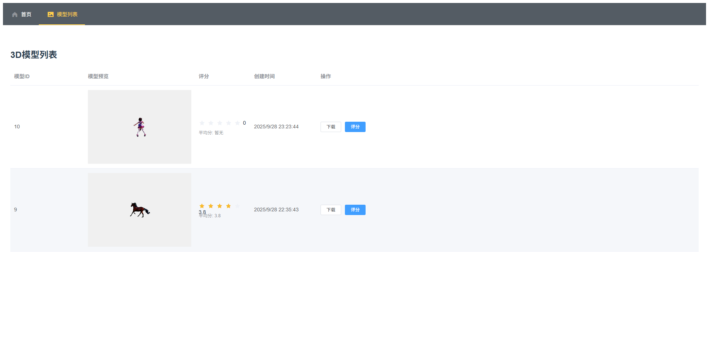

# 3D模型生成网页设计方案

## 1. 目标用户分析

### 用户类型

1. **独立游戏开发者**：小型团队或个人开发者需要快速生成3D资产
2. **教育工作者**：需要为教学材料创建3D可视化内容
3. **电商产品展示**：需要为产品创建3D展示模型
4. **3D打印爱好者**：需要将创意快速转化为可打印模型
5. **数字艺术创作者**：需要快速原型设计工具

### 用户痛点

- 传统3D建模软件学习曲线陡峭
- 外包3D建模成本高、周期长
- 现有AI生成工具过于复杂或效果不佳
- 缺乏简单易用的单一对象生成工具

### 用户故事

"作为一名独立游戏开发者，我希望能够通过简单的文本描述或参考图片快速生成基础3D模型，这样我可以专注于游戏设计而不是建模技术，同时节省外包成本。"

## 2. 功能规划与优先级

### 核心功能

1. **图片生成3D模型** (P0)
2. **基础模型参数调整** (P1)
    - 纹理分辨率
    - 前景比例
    - 网格类型
    - 顶点数量
3. **静态模型简单交互** (P1)
4. **模型评分系统** (P1)
5. **模型存储与检索** (P2)

### 本次开发功能

- 图片生成3D模型
- 基础参数调整
- 模型简单交互
- 模型评分系统
- 数据库存储功能

## 3. API选择分析

### 对比的API提供商

1. **Stability AI**：
    
    - 优势：生成质量较高，支持多种格式输出
    - 劣势：成本相对较高
2. **Kaedim**：
    
    - 优势：专注于3D生成，简单易用
    - 劣势：定制选项较少
3. **Masterpiece Studio**：
    
    - 优势：专业级输出
    - 劣势：响应速度较慢

### 选择Stability AI的原因

- 生成质量满足需求
- API文档完善
- 支持多种输出格式
- 虽然成本较高，但通过缓存和检索优化可以降低实际调用次数

## 4. 效果评估系统设计

### 关键评估指标

1. **视觉保真度**：生成模型与输入描述的匹配程度
2. **几何合理性**：模型结构是否合理，有无明显缺陷
3. **拓扑质量**：网格分布是否均匀合理
4. **用户评分**：用户对生成结果的满意度

### 评估系统设计

1. **自动评分模块**：
    
    - 使用预训练的CNN网络评估视觉保真度
    - 几何分析算法检测模型缺陷
    - 拓扑分析算法评估网格质量
2. **用户反馈系统**：
    
    - 简单的五星评分（本次落地实现）
    - 可选的文字反馈
3. **持续改进机制**：
    
    - 收集高质量生成案例作为训练数据
    - 定期重新训练评估模型
    - A/B测试不同生成参数的效果

## 5. 减少API调用次数的方案

### 可能方案

1. **本地缓存系统**：
    
    - 存储生成的模型
    - 基于相似性检索复用已有模型
2. **感知哈希近似搜索**：
    
    - 计算输入图片的感知哈希
    - 在数据库中查找相似哈希的已有模型
3. **参数化模型变形**：
    
    - 对已有模型进行参数化调整
    - 避免完全重新生成
4. **用户收藏系统**：
    
    - 鼓励用户复用高质量模型
    - 建立热门模型库

### 选择落地方案

**感知哈希近似搜索+本地缓存系统**：

- 已实现MySQL中的感知哈希搜索
- 结合模型二进制数据存储
- 对相似请求返回已有模型
- 可减少30-50%的API调用

## 6. 系统架构设计

### 前端

- Three.js模型展示
- 参数调整UI
- 模型交互控制
- 评分反馈界面

### 后端

- API调用代理
- 模型处理与存储
- 感知哈希计算
- 评分系统

### 数据库

- MySQL存储模型元数据和感知哈希
- 文件系统存储模型二进制数据

## 7. 实施路线图

1. **第一阶段**：基础生成功能
    
    - 图片输入
    - 基本参数调整
    - 模型展示
2. **第二阶段**：优化系统
    
    - 评分系统
    - 缓存与检索
    - 用户反馈


这个设计方案平衡了功能完整性与开发可行性，通过核心功能的快速实现和持续迭代优化，能够有效解决目标用户的痛点问题。

# 效果展示



#### 议题一

开发一个根据文本或图片生成 3D 模型的网页，要构建的 3D 模型只需要实现单个素材元素的生成，不需要到场景级别（例如能生成一匹马，而不需要一匹马在草原奔跑）。

#### 请回答：

1. 你计划将这个网页面向什么类型的用户？这些类型的用户他们面临什么样的痛点，你设想的用户故事是什么样呢？
2. 你认为这个网页需要哪些功能？这些功能各自的优先级是什么？你计划本次开发哪些功能？
3. 你计划采纳哪家公司提供的 3D 模型生成 API？你对比了哪些公司的 API，你为什么选择用这家公司的 API？
4. AI 应用和传统应用不同，它需要持续进行效果迭代。你会设置什么样的关键指标来作为验证 3D 模型生成效果的评估？你会设计一个什么样的系统来进行评估和改善，请描述评估系统的设计。
5. 有什么方式可以让我们减少对第三方 3D 模型生成 API的调用次数？请描述你认为各种可能的思路，并选择一种进行落地。

**请开发以上网页，包括效果评估系统以及模型调用频次优化功能。针对以上 1-5 点，请把你的思考整理成文档，作为作品的说明一并提交。**
  


vue.config.js

```
// const { defineConfig } = require('@vue/cli-service')  
// module.exports = defineConfig({  
//   transpileDependencies: true  
// })
```


pack

```
  
//{  
//  "name": "vue_qiniu_1_spar3d_2",  
//  "version": "0.1.0",  
//  "private": true,  
//  "scripts": {  
//    "serve": "vue-cli-service serve",  
//    "build": "vue-cli-service build",  
//    "lint": "vue-cli-service lint"  
//  },  
//  "dependencies": {  
//    "core-js": "^3.8.3",  
//    "vue": "^3.2.13"  
//  },  
//  "devDependencies": {  
//    "@babel/core": "^7.12.16",  
//    "@babel/eslint-parser": "^7.12.16",  
//    "@vue/cli-plugin-babel": "~5.0.0",  
//    "@vue/cli-plugin-eslint": "~5.0.0",  
//    "@vue/cli-service": "~5.0.0",  
//    "eslint": "^7.32.0",  
//    "eslint-plugin-vue": "^8.0.3"  
//  },  
//  "eslintConfig": {  
//    "root": true,  
//    "env": {  
//      "node": true  
//    },  
//    "extends": [  
//      "plugin:vue/vue3-essential",  
//      "eslint:recommended"  
//    ],  
//    "parserOptions": {  
//      "parser": "@babel/eslint-parser"  
//    },  
//    "rules": {}  
//  },  
//  "browserslist": [  
//    "> 1%",  
//    "last 2 versions",  
//    "not dead",  
//    "not ie 11"  
//  ]  
//}
```


议题说明

#### 议题一

开发一个根据文本或图片生成 3D 模型的网页，要构建的 3D 模型只需要实现单个素材元素的生成，不需要到场景级别（例如能生成一匹马，而不需要一匹马在草原奔跑）。

#### 请回答：

1. 你计划将这个网页面向什么类型的用户？这些类型的用户他们面临什么样的痛点，你设想的用户故事是什么样呢？
2. 你认为这个网页需要哪些功能？这些功能各自的优先级是什么？你计划本次开发哪些功能？
3. 你计划采纳哪家公司提供的 3D 模型生成 API？你对比了哪些公司的 API，你为什么选择用这家公司的 API？
4. AI 应用和传统应用不同，它需要持续进行效果迭代。你会设置什么样的关键指标来作为验证 3D 模型生成效果的评估？你会设计一个什么样的系统来进行评估和改善，请描述评估系统的设计。
5. 有什么方式可以让我们减少对第三方 3D 模型生成 API的调用次数？请描述你认为各种可能的思路，并选择一种进行落地。

**请开发以上网页，包括效果评估系统以及模型调用频次优化功能。针对以上 1-5 点，请把你的思考整理成文档，作为作品的说明一并提交。**


议题说明

#### 议题二

开发一个利用 AI 来做角色扮演的网页，用户可以搜索自己感兴趣的角色例如哈利波特、苏格拉底等并可与其进行语音聊天。

#### 请回答：

1. 你计划将这个网页面向什么类型的用户？这些类型的用户他们面临什么样的痛点，你设想的用户故事是什么样呢？
2. 你认为这个网页需要哪些功能？这些功能各自的优先级是什么？你计划本次开发哪些功能？
3. 你计划采纳哪家公司的哪个 LLM 模型能力？你对比了哪些，你为什么选择用该 LLM 模型？
4. 你期望 AI 角色除了语音聊天外还应该有哪些技能？

**请开发以上网页，包括实现 3 个以上 AI 角色应该具备的技能。要求不能调用第三方的 Agent 能力，只需允许调用 LLM 模型、语音识别以及 TTS 能力。针对以上 1-4 点，请把你的思考整理成文档，作为作品的说明一并提交。**


```
<?xml version="1.0" encoding="UTF-8" ?>  
<!DOCTYPE configuration  
PUBLIC "-//mybatis.org//DTD Config 3.0//EN"  
"http://mybatis.org/dtd/mybatis-3-config.dtd">  
<configuration>  
  
    <properties>       <!-- 华勤技术股份有限公司，广东省西勤精密模具有限公司，南昌春勤精密技术有限公司，东莞华誉精密技术有限公司 -->  
       <property name="getCompanyHid"  
               value="'6042d4ad0d654ddf819926f023b4d968',  
               '463ce84eef1745e2b2e32913dc59d9d9',               'ed42b1250ffd44cfb8098ede734daccd',               '4e2292566fc548608a8d0706a8e1f26f'"/>  
    </properties>  
    <settings>       <setting name="cacheEnabled"             value="true" />  <!-- 全局映射器启用缓存 -->  
       <setting name="useGeneratedKeys"         value="true" />  <!-- 允许 JDBC 支持自动生成主键 -->  
       <setting name="defaultExecutorType"      value="REUSE" /> <!-- 配置默认的执行器 -->  
       <setting name="logImpl"                  value="SLF4J" /> <!-- 指定 MyBatis 所用日志的具体实现 -->  
       <!-- <setting name="mapUnderscoreToCamelCase" value="true"/>  驼峰式命名 -->  
    </settings>  
    </configuration>
```

```
<?xml version="1.0" encoding="UTF-8" ?>  
<!DOCTYPE mapper  
PUBLIC "-//mybatis.org//DTD Mapper 3.0//EN"  
"http://mybatis.org/dtd/mybatis-3-mapper.dtd">  
<mapper namespace="com.o.project.manager.mapper.TbOrgUnitMapper">  
  
    <resultMap type="com.o.project.manager.domain.TbOrgUnit" id="tbOrgUnit">  
       <id     property="id"   column="C_HID"   />  
       <result property="code"   column="C_CODE"   />  
       <result property="name"  column="C_NAME"  />  
       <result property="level"  column="C_LEVEL"  />  
       <result property="properties"  column="C_PROPERTIES"  />  
    </resultMap>    <resultMap id="tbOrgSuperiorInfo" type="com.o.project.manager.domain.TbOrgSuperiorInfo">  
       <id     property="id"   column="C_HID"   />  
       <result property="code"   column="C_CODE"   />  
       <result property="name"  column="C_NAME"  />  
       <result property="level"  column="C_LEVEL"  />  
       <result property="properties"  column="C_PROPERTIES"  />  
       <result property="centerName"  column="C_CENTER"  />  
       <result property="systemName"  column="C_SYSTEM"  />  
       <result property="subSystemName"  column="C_SUBSYSTEM"  />  
       <result property="deptName"  column="C_DEPT"  />  
       <result property="subDeptName"  column="C_SUBDEPT"  />  
       <result property="sectName"  column="C_SECT"  />  
    </resultMap>  
    <!--诺依曼及下级所有组织-->  
    <sql id="nuoYiManOrgIds">  
       SELECT R1.C_ORG_HID  
       FROM (SELECT U.C_CODE,U.C_NAME, R.C_ORG_HID, R.C_SUPERIOR_HID,R.C_DISPLAYNO,U.C_LEVEL       FROM TB_ORG_UNITRELATION R, TB_ORG_ORGUNIT U       WHERE R.C_DIM_HID = '65ca64ab44274d789f8e958abbddc406' AND U.C_HID = R.C_ORG_HID        <![CDATA[         AND U.C_BEGIN_DATE <= TRUNC(CURRENT_DATE) AND U.C_END_DATE >= TRUNC(CURRENT_DATE)         AND R.C_BEGIN_DATE <= TRUNC(CURRENT_DATE) AND R.C_END_DATE >= TRUNC(CURRENT_DATE)       ]]>       AND R.C_STATUS = '1'       ) R1       START WITH R1.C_ORG_HID = '4e7ce6dcda23464da3dff565abe9561f'       CONNECT BY  R1.C_SUPERIOR_HID = PRIOR R1.C_ORG_HID    </sql>  
  
    <select id="selectLeaderPosDeptByUserCode" parameterType="String" resultMap="tbOrgUnit">  
       SELECT DEPT.C_HID, DEPT.C_CODE, DEPT.C_NAME, DEPT.c_LEVEL, NVL(UPR.C_PROPERTIES,'1') as C_PROPERTIES  
       FROM       TB_ORG_POSITION POS,       TB_STA_EMP_ORG EMPORG,       TB_ORG_ORGUNIT DEPT       LEFT JOIN (SELECT U.C_HID, '0' AS C_PROPERTIES FROM TB_ORG_ORGUNIT U WHERE U.C_HID IN       (SELECT R1.C_ORG_HID  FROM (SELECT R.C_ORG_HID, R.C_SUPERIOR_HID  FROM TB_ORG_UNITRELATION R       WHERE R.C_DIM_HID = '65ca64ab44274d789f8e958abbddc406'       AND R.C_BEGIN_DATE &lt;= TRUNC(CURRENT_DATE)  AND R.C_END_DATE >= TRUNC(CURRENT_DATE)  AND R.C_STATUS = '1') R1  
       START WITH R1.C_ORG_HID IN  (SELECT U.C_HID FROM TB_ORG_ORGUNIT U  WHERE U.C_PROPERTIES = '0'  AND U.C_BEGIN_DATE &lt;= TRUNC(SYSDATE)  AND U.C_END_DATE >= TRUNC(SYSDATE) )  
       CONNECT BY R1.C_SUPERIOR_HID = PRIOR R1.C_ORG_HID)       AND U.C_STATUS = '1'  AND U.C_BEGIN_DATE &lt;= TRUNC(SYSDATE)  AND U.C_END_DATE >= TRUNC(SYSDATE)  ) UPR  
       ON DEPT.C_HID = UPR.C_HID       WHERE POS.C_OU_HID = DEPT.C_HID       AND EMPORG.C_POSITION_HID = POS.C_HID       AND DEPT.C_BEGIN_DATE &lt;= TRUNC(CURRENT_DATE)  
       AND DEPT.C_END_DATE >= TRUNC(CURRENT_DATE)       AND POS.C_BEGIN_DATE &lt;= TRUNC(CURRENT_DATE)  
       AND POS.C_END_DATE >= TRUNC(CURRENT_DATE)       AND EMPORG.C_BEGIN_DATE &lt;= TRUNC(CURRENT_DATE)  
       AND EMPORG.C_END_DATE > TRUNC(CURRENT_DATE)       AND DEPT.C_STATUS = '1'       AND POS.C_STATUS = '1'       AND POS.C_LEADER_POS = '1'       AND EMPORG.C_DEPT_TYPE in ('1','2')       AND EMPORG.C_EMPLOYEE_ID IN (SELECT C_OID FROM TB_STA_EMP WHERE C_CODE =#{empCode})       ORDER BY EMPORG.C_DEPT_TYPE,DEPT.C_LEVEL    </select>  
  
    <select id="selectTbOrgUnitInfoByOrgId" parameterType="String" resultMap="tbOrgUnit">  
       select U.C_HID, U.C_CODE, U.C_NAME, U.C_LEVEL,  NVL(UPR.C_PROPERTIES,'1') as C_PROPERTIES from  
       TB_ORG_ORGUNIT  u       LEFT JOIN (SELECT U.C_HID, '0' AS C_PROPERTIES FROM TB_ORG_ORGUNIT U WHERE U.C_HID IN       (SELECT R1.C_ORG_HID  FROM (SELECT R.C_ORG_HID, R.C_SUPERIOR_HID  FROM TB_ORG_UNITRELATION R       WHERE R.C_DIM_HID = '65ca64ab44274d789f8e958abbddc406'       AND R.C_BEGIN_DATE &lt;= TRUNC(CURRENT_DATE)  AND R.C_END_DATE >= TRUNC(CURRENT_DATE)  AND R.C_STATUS = '1') R1  
       START WITH R1.C_ORG_HID IN  (SELECT U.C_HID FROM TB_ORG_ORGUNIT U  WHERE U.C_PROPERTIES = '0'  AND U.C_BEGIN_DATE &lt;= TRUNC(SYSDATE)  AND U.C_END_DATE >= TRUNC(SYSDATE) )  
       CONNECT BY R1.C_SUPERIOR_HID = PRIOR R1.C_ORG_HID)       AND U.C_STATUS = '1'  AND U.C_BEGIN_DATE &lt;= TRUNC(SYSDATE)  AND U.C_END_DATE >= TRUNC(SYSDATE)  ) UPR  
       ON U.C_HID = UPR.C_HID       where U.C_HID = #{orgId}       AND TRUNC(CURRENT_DATE) >=U.C_BEGIN_DATE       AND U.C_END_DATE >= TRUNC(CURRENT_DATE)    </select>  
  
    <select id="selectOrgJobHidByEmpCode" parameterType="String" resultType="String">  
       select C_HID  
       FROM TB_ORG_JOB JOB       where TRUNC(CURRENT_DATE) >= JOB.C_EFFECTIVE_DATE_BEGIN       AND JOB.C_EFFECTIVE_DATE_END >= TRUNC(CURRENT_DATE)       AND JOB.C_NAME = 'CEO'       and JOB.C_HID in (          select EMPORG.C_JOB_HID          from TB_STA_EMP_ORG EMPORG          where TRUNC(CURRENT_DATE) >= EMPORG.C_BEGIN_DATE          AND EMPORG.C_END_DATE > TRUNC(CURRENT_DATE)          AND EMPORG.C_EMPLOYEE_ID in (select emp.c_oid from TB_STA_EMP emp where emp.C_CODE = #{empCode})       )    </select>  
  
    <select id="selectParentTbOrgUnitByOrgHid" parameterType="String" resultMap="tbOrgUnit">  
       SELECT R1.C_ORG_HID C_HID, R1.C_CODE, R1.C_NAME, R1.c_LEVEL, R1.C_PROPERTIES  
       FROM (           SELECT R.C_ORG_HID,U.C_CODE, U.C_NAME, R.C_SUPERIOR_HID, U.C_LEVEL, U.C_PROPERTIES          FROM TB_ORG_UNITRELATION R, TB_ORG_ORGUNIT U          WHERE R.C_DIM_HID = '65ca64ab44274d789f8e958abbddc406'          AND U.C_HID = R.C_ORG_HID          <![CDATA[          AND U.C_BEGIN_DATE <= TRUNC(CURRENT_DATE) AND U.C_END_DATE >= TRUNC(CURRENT_DATE)          AND R.C_BEGIN_DATE <= TRUNC(CURRENT_DATE) AND R.C_END_DATE >= TRUNC(CURRENT_DATE)          ]]>          AND R.C_STATUS = '1'           AND U.C_HID NOT IN (          <include refid="nuoYiManOrgIds"/>  
          )  
       ) R1       START WITH R1.C_ORG_HID = #{orgId}       CONNECT BY PRIOR R1.C_SUPERIOR_HID = R1.C_ORG_HID       order by C_LEVEL desc    </select>  
  
    <sql id="orgBaseSql">  
       SELECT U.C_HID, U.C_CODE , U.C_NAME, U.C_LEVEL, U.C_PROPERTIES, R.C_SUPERIOR_HID, R.C_ORG_HID  
        FROM TB_ORG_ORGUNIT U, TB_ORG_UNITRELATION R        WHERE U.C_HID = R.C_ORG_HID        AND R.C_BEGIN_DATE &lt;= TRUNC(SYSDATE)  
        AND R.C_END_DATE >= TRUNC(SYSDATE)        AND U.C_STATUS = '1'        AND U.C_BEGIN_DATE &lt;= TRUNC(SYSDATE)  
        AND U.C_END_DATE >= TRUNC(SYSDATE)        AND r.C_DIM_HID = '65ca64ab44274d789f8e958abbddc406'        AND r.C_STATUS = '1'    </sql>  
  
    <!-- 当前组织及其所有下级组织id -->  
    <select id="queryAllChildrenOrgByCurrentOrgHid" resultMap="tbOrgUnit">  
       SELECT R.C_HID, R.C_CODE , R.C_NAME, R.C_LEVEL, R.C_PROPERTIES, R.C_SUPERIOR_HID, R.C_ORG_HID  
       FROM (       <include refid="orgBaseSql"/>  
       ) R  
       START WITH R.C_ORG_HID = #{orgHid}       CONNECT BY PRIOR R.C_ORG_HID = R.C_SUPERIOR_HID    </select>  
  
    <!-- 查询当前组的直接下级的组织id -->  
    <select id="getDirectChildrenOrgListByOrgId" resultMap="tbOrgUnit">  
       <include refid="orgBaseSql"/>  
       AND (R.C_SUPERIOR_HID = #{orgHid} OR R.C_ORG_HID = #{orgHid})  
    </select>  
    <!--查询当前组织直接下级的组织信息-->  
    <select id="getDirectChildrenOrgInfo" resultMap="tbOrgSuperiorInfo">  
       SELECT U.C_HID, U.C_CODE , U.C_NAME, U.C_LEVEL, U.C_PROPERTIES, R.C_SUPERIOR_HID, R.C_ORG_HID,  
             OA.C_CENTER_NAME C_CENTER,OA.C_SYSTNAME C_SYSTEM,OA.C_F_SYSTEM_NAME C_SUBSYSTEM,             OA.C_DEPTNAME C_DEPT,OA.C_SUBDEPTNAME C_SUBDEPT,             CASE WHEN U.C_LEVEL = '5' THEN OA.C_GRUPNAME                WHEN U.C_LEVEL = '8' THEN OA.C_WORKLEVEL_NAME                WHEN U.C_LEVEL = '9' THEN OA.C_CLASSGROUP_NAME                END C_SECT       FROM TB_ORG_ORGUNIT U left join TB_ORG_ORGUNITALL OA on U.C_HID = OA.C_HID, TB_ORG_UNITRELATION R       WHERE U.C_HID = R.C_ORG_HID         AND R.C_BEGIN_DATE &lt;= TRUNC(SYSDATE)  
         AND R.C_END_DATE >= TRUNC(SYSDATE)         AND U.C_STATUS = '1'         AND U.C_BEGIN_DATE &lt;= TRUNC(SYSDATE)  
         AND U.C_END_DATE >= TRUNC(SYSDATE)         AND r.C_DIM_HID = '65ca64ab44274d789f8e958abbddc406'         AND r.C_STATUS = '1'         AND (R.C_SUPERIOR_HID = #{orgHid} OR R.C_ORG_HID = #{orgHid})    </select>  
    <!--获取当前组织的岗位列表-->  
    <select id="getOrgPost" resultType="com.o.project.manager.domain.vo.PostVo">  
       SELECT DISTINCT PS.C_CODE postCode, PS.C_NAME postName, PS.C_HID hid   
       FROM TB_STA_EMP_ORG EO LEFT JOIN TB_ORG_POSITION PS  
          ON PS.C_BEGIN_DATE &lt;= TRUNC( CURRENT_DATE )  
          AND PS.C_END_DATE >= TRUNC( CURRENT_DATE )          AND PS.C_HID = EO.C_POSITION_HID -- 部门岗位  
       WHERE EO.C_DEPT_HID = #{orgHid}  
          AND EO.C_DEPT_TYPE = '1'          AND EO.C_BEGIN_DATE &lt;= TRUNC(SYSDATE)  
          AND EO.C_END_DATE > TRUNC(SYSDATE)    </select>  
  
    <!-- 根据组织hid获取组织信息 -->  
    <select id="getOrgUnitInfo" resultMap="tbOrgUnit">  
       <include refid="orgBaseSql"/>  
       AND U.C_HID = #{orgHid}  
    </select>  
    <!--根据组织hid获取全组织信息-->  
    <select id="getOrgUnitAllInfoByHid" resultType="com.o.project.manager.domain.OrgUnitAllPo">  
        SELECT ORGALL.C_OID             AS id,  
               ORGALL.C_OPERATE_TIME    AS operateTime,               ORGALL.C_OPERATOR        AS operator,               ORGALL.C_HID             AS hid,               ORGALL.C_COMPANY_HID     AS companyHid,               ORGALL.C_COMPANY_CODE    AS companyCode,               ORGALL.C_COMPANY_NAME    AS companyName,               ORGALL.C_CENTER_HID      AS centerHid,               ORGALL.C_CENTER_CODE     AS centerCode,               ORGALL.C_CENTER_NAME     AS centerName,               ORGALL.C_SYSTEM_HID      AS systemHid,               ORGALL.C_SYSTEM_CODE     AS systemCode,               ORGALL.C_SYSTNAME        AS systname,               ORGALL.C_F_SYSTEM_HID    AS fSystemHid,               ORGALL.C_F_SYSTEM_CODE   AS fSystemCode,               ORGALL.C_F_SYSTEM_NAME   AS fSystemName,               ORGALL.C_DEPT_HID        AS deptHid,               ORGALL.C_DEPT_CODE       AS deptCode,               ORGALL.C_DEPTNAME        AS deptname,               ORGALL.C_SUBDEPT_HID     AS subdeptHid,               ORGALL.C_SUBDEPT_CODE    AS subdeptCode,               ORGALL.C_SUBDEPTNAME     AS subdeptname,               ORGALL.C_GRUP_HID        AS grupHid,               ORGALL.C_GRUP_CODE       AS grupCode,               ORGALL.C_GRUPNAME        AS grupname,               ORGALL.C_WORKLEVEL_HID   AS worklevelHid,               ORGALL.C_WORKLEVEL_CODE  AS worklevelCode,               ORGALL.C_WORKLEVEL_NAME  AS worklevelName,               ORGALL.C_CLASSGROUP_HID  AS classgroupHid,               ORGALL.C_CLASSGROUP_CODE AS classgroupCode,               ORGALL.C_CLASSGROUP_NAME AS classgroupName,               ORGALL.C_ALLORG_NAME     AS allorgName        FROM TB_ORG_ORGUNITALL ORGALL       WHERE ORGALL.C_HID = #{orgHid}    </select>  
  
    <select id="getOrgInfo" resultMap="tbOrgUnit">  
       SELECT U.C_HID, U.C_CODE , U.C_NAME, U.C_LEVEL, U.C_PROPERTIES  
       FROM TB_ORG_ORGUNIT U       WHERE U.C_HID = #{orgHid} and          U.C_STATUS = '1' and          U.C_BEGIN_DATE &lt;= TRUNC(SYSDATE) and  
          U.C_END_DATE >= TRUNC(SYSDATE)    </select>  
  
    <select id="getCompanyInfo" resultType="com.o.project.manager.domain.CompanyInfo">  
       select U1.C_HID as companyHid, U1.C_NAME as companyName  
  
       FROM TB_ORG_ORGUNIT U1,       TB_ORG_UNITRELATION R1       WHERE U1.C_LEVEL = '1'       and U1.C_HID = R1.C_ORG_HID       AND U1.C_STATUS = '1'       AND U1.C_BEGIN_DATE &lt;= TRUNC(SYSDATE)  
       AND U1.C_END_DATE >= TRUNC(SYSDATE)       AND R1.C_BEGIN_DATE &lt;= TRUNC(SYSDATE)  
       AND R1.C_END_DATE >= TRUNC(SYSDATE)       AND R1.C_STATUS = '1'       AND R1.C_DIM_HID = '65ca64ab44274d789f8e958abbddc406'       AND U1.C_HID IN (${getCompanyHid})    </select>  
  
    <select id="queryCompanyInfoByOrgHid" resultType="com.o.project.manager.domain.CompanyInfo">  
       select UA.C_COMPANY_HID  as companyHid,  
       UA.C_COMPANY_NAME as companyName  
       FROM TB_ORG_ORGUNIT U1,       TB_ORG_ORGUNITALL UA       WHERE U1.C_HID = #{id}       and U1.C_HID = UA.C_HID       AND U1.C_STATUS = '1'       AND U1.C_BEGIN_DATE &lt;= TRUNC(SYSDATE)  
       AND U1.C_END_DATE >= TRUNC(SYSDATE)    </select>  
</mapper>
```


```
<?xml version="1.0" encoding="UTF-8" ?>  
<!DOCTYPE mapper  
        PUBLIC "-//mybatis.org//DTD Mapper 3.0//EN"  
        "http://mybatis.org/dtd/mybatis-3-mapper.dtd">  
<mapper namespace="com.o.project.manager.mapper.StaffMapper">  
  
    <!--更新isDelete为1的新数据为0-->  
    <update id="updateOnJObNum">  
       update sys_manage_organization set is_delete = 0 where config_type = #{updateConfigType} and is_delete = 1 and type = #{type}  
    </update>  
    <!--更改导师-->  
    <update id="updateAdvisor">  
        UPDATE TB_STA_EMP SET C_DAOSHI = #{advisorId} WHERE C_OID = #{employeeId}  
    </update>  
  
    <!--删除isDelete为0旧数据-->  
    <delete id="deleteOnJObNum">  
        delete from sys_manage_organization where config_type = #{configType} and is_delete = 0 and type = #{type}  
    </delete>  
  
    <!--动态获取-管理者自助首页-人员动态看板数据-->  
    <select id="selectDocDataList" resultType="com.o.project.manager.vo.StaffVo">  
        select  
            so.one_classify oneClassify ,            so.two_classify twoClassify,            so.condition_sql conditionSql,            so.type `type`,            (case when smo.amount is null then 0 else smo.amount end) amount,            case when smo.over_time is null then 0 else smo.over_time end decimalNum,            smo.organization_id organizationId,            so.organization_property organizationProperty,            ifnull(lc.language_value,so.show_name) showName        from            sys_configuration so        left join (            select                amount,                organization_id,                over_time,                config_id            from                sys_manage_organization            where                is_delete = false                and type = #{type}                and organization_id = #{organizationId}                )smo on            so.id = smo.config_id        left join sys_language_config lc on lc.relation_id = so.id and lc.relation_table ='sys_configuration' and lc.language_category = #{languageCategory}        where        so.type = #{type}        order by so.sort ASC    </select>  
  
    <!--当前组织含下级所对应类型在职人数的数据-->  
    <select id="queryOnJobNumMap" resultType="com.o.framework.task.ConfigurationTask$OrganizationAmount">  
        SELECT  
        EO.C_COMPANY_HID organizationId,        COUNT(1) amount        FROM        TB_STA_EMP E,        TB_STA_EMP_CLASS TC,        TB_STA_EMP_ORGAPPEND OA,        TB_STA_EMP_ORG EO        WHERE E.C_OID=EO.C_EMPLOYEE_ID AND OA.C_OID=EO.C_OID        AND EO.C_BEGIN_DATE &lt;= TRUNC(SYSDATE) AND EO.C_END_DATE > TRUNC(SYSDATE) AND EO.C_DEPT_TYPE='1'  
        AND EO.C_EMPLOYEE_STATUS in('2','11')       -- AND EO.C_COMPANY_HID = '6042d4ad0d654ddf819926f023b4d968'        AND TC.C_EMPLOYEE_ID = EO.C_EMPLOYEE_ID        AND TC.C_BEGIN_DATE &lt;= TRUNC(SYSDATE) AND TC.C_END_DATE >= TRUNC(SYSDATE)  
        <if test="conditionSql != null and conditionSql != ''">  
            AND ${conditionSql}  
        </if>  
  
        AND (EO.C_DEPT_HID IN ( SELECT R1.C_HID  
        FROM (        SELECT U1.C_HID,R1.C_ORG_HID, R1.C_SUPERIOR_HID        FROM TB_ORG_ORGUNIT U1, TB_ORG_UNITRELATION R1        WHERE U1.C_HID = R1.C_ORG_HID        AND R1.C_BEGIN_DATE &lt;= TRUNC(SYSDATE)  
        AND R1.C_END_DATE >= TRUNC(SYSDATE)        AND U1.C_STATUS = '1'        AND U1.C_BEGIN_DATE &lt;= TRUNC(SYSDATE)  
        AND U1.C_END_DATE >= TRUNC(SYSDATE)        AND r1.C_DIM_HID = '65ca64ab44274d789f8e958abbddc406'        AND r1.C_STATUS = '1'        ) R1        START WITH R1.C_ORG_HID in (${getCompanyHid})        CONNECT BY PRIOR R1.C_ORG_HID = R1.C_SUPERIOR_HID))  
        GROUP BY C_COMPANY_HID  
        UNION ALL  
        SELECT        OA.C_CENTHID organizationId,        COUNT(1) amount        FROM        TB_STA_EMP E,        TB_STA_EMP_ORG EO,        TB_STA_EMP_CLASS TC,        TB_STA_EMP_ORGAPPEND OA        WHERE E.C_OID=EO.C_EMPLOYEE_ID AND OA.C_OID=EO.C_OID        AND EO.C_DEPT_TYPE = '1'        AND EO.C_BEGIN_DATE &lt;= TRUNC(SYSDATE)  
        AND EO.C_END_DATE &gt; TRUNC(SYSDATE)  
        AND EO.C_EMPLOYEE_STATUS in('2','11')        AND TC.C_EMPLOYEE_ID = EO.C_EMPLOYEE_ID        AND TC.C_BEGIN_DATE &lt;= TRUNC(SYSDATE) AND TC.C_END_DATE >= TRUNC(SYSDATE)  
        <if test="conditionSql != null and conditionSql != ''">  
            AND ${conditionSql}  
        </if>  
        GROUP BY OA.C_CENTHID  
  
        UNION ALL  
        SELECT        OA.C_F_SYSTEM_ID organizationId,        COUNT(1) amount        FROM        TB_STA_EMP E,        TB_STA_EMP_ORG EO,        TB_STA_EMP_CLASS TC,        TB_STA_EMP_ORGAPPEND OA        WHERE E.C_OID=EO.C_EMPLOYEE_ID AND OA.C_OID=EO.C_OID        AND EO.C_DEPT_TYPE = '1'        AND EO.C_BEGIN_DATE &lt;= TRUNC(SYSDATE)  
        AND EO.C_END_DATE &gt; TRUNC(SYSDATE)  
        AND EO.C_EMPLOYEE_STATUS in('2','11')        AND TC.C_EMPLOYEE_ID = EO.C_EMPLOYEE_ID        AND TC.C_BEGIN_DATE &lt;= TRUNC(SYSDATE) AND TC.C_END_DATE >= TRUNC(SYSDATE)  
        <if test="conditionSql != null and conditionSql != ''">  
            AND ${conditionSql}  
        </if>  
        GROUP BY OA.C_F_SYSTEM_ID  
  
        UNION ALL  
        SELECT        OA.C_SYSTHID organizationId,        COUNT(1) amount        FROM        TB_STA_EMP E,        TB_STA_EMP_ORG EO,        TB_STA_EMP_CLASS TC,        TB_STA_EMP_ORGAPPEND OA        WHERE E.C_OID=EO.C_EMPLOYEE_ID AND OA.C_OID=EO.C_OID        AND EO.C_DEPT_TYPE = '1'        AND EO.C_BEGIN_DATE &lt;= TRUNC(SYSDATE)  
        AND EO.C_END_DATE &gt; TRUNC(SYSDATE)  
        AND EO.C_EMPLOYEE_STATUS in('2','11')        AND TC.C_EMPLOYEE_ID = EO.C_EMPLOYEE_ID        AND TC.C_BEGIN_DATE &lt;= TRUNC(SYSDATE) AND TC.C_END_DATE >= TRUNC(SYSDATE)  
        <if test="conditionSql != null and conditionSql != ''">  
            AND ${conditionSql}  
        </if>  
        GROUP BY OA.C_SYSTHID  
        UNION ALL        SELECT        OA.C_DEPTHID organizationId,        COUNT(1) amount        FROM        TB_STA_EMP E,        TB_STA_EMP_ORG EO,        TB_STA_EMP_CLASS TC,        TB_STA_EMP_ORGAPPEND OA        WHERE E.C_OID=EO.C_EMPLOYEE_ID AND OA.C_OID=EO.C_OID        AND EO.C_DEPT_TYPE = '1'        AND EO.C_BEGIN_DATE &lt;= TRUNC(SYSDATE)  
        AND EO.C_END_DATE &gt; TRUNC(SYSDATE)  
        AND EO.C_EMPLOYEE_STATUS in('2','11')        AND TC.C_EMPLOYEE_ID = EO.C_EMPLOYEE_ID        AND TC.C_BEGIN_DATE &lt;= TRUNC(SYSDATE) AND TC.C_END_DATE >= TRUNC(SYSDATE)  
        <if test="conditionSql != null and conditionSql != ''">  
            AND ${conditionSql}  
        </if>  
        GROUP BY OA.C_DEPTHID  
        UNION ALL        SELECT        OA.C_SUBDEPTHID organizationId,        COUNT(1) amount        FROM        TB_STA_EMP E,        TB_STA_EMP_ORG EO,        TB_STA_EMP_CLASS TC,        TB_STA_EMP_ORGAPPEND OA        WHERE E.C_OID=EO.C_EMPLOYEE_ID AND OA.C_OID=EO.C_OID        AND EO.C_DEPT_TYPE = '1'        AND EO.C_BEGIN_DATE &lt;= TRUNC(SYSDATE)  
        AND EO.C_END_DATE &gt; TRUNC(SYSDATE)  
        AND EO.C_EMPLOYEE_STATUS in('2','11')        AND TC.C_EMPLOYEE_ID = EO.C_EMPLOYEE_ID        AND TC.C_BEGIN_DATE &lt;= TRUNC(SYSDATE) AND TC.C_END_DATE >= TRUNC(SYSDATE)  
        <if test="conditionSql != null and conditionSql != ''">  
            AND ${conditionSql}  
        </if>  
        GROUP BY OA.C_SUBDEPTHID  
        UNION ALL        SELECT        OA.C_GRUPHID organizationId,        COUNT(1) amount        FROM        TB_STA_EMP E,        TB_STA_EMP_ORG EO,        TB_STA_EMP_CLASS TC,        TB_STA_EMP_ORGAPPEND OA        WHERE E.C_OID=EO.C_EMPLOYEE_ID AND OA.C_OID=EO.C_OID        AND EO.C_DEPT_TYPE = '1'        AND EO.C_BEGIN_DATE &lt;= TRUNC(SYSDATE)  
        AND EO.C_END_DATE &gt; TRUNC(SYSDATE)  
        AND EO.C_EMPLOYEE_STATUS in('2','11')        AND TC.C_EMPLOYEE_ID = EO.C_EMPLOYEE_ID        AND TC.C_BEGIN_DATE &lt;= TRUNC(SYSDATE) AND TC.C_END_DATE >= TRUNC(SYSDATE)  
        <if test="conditionSql != null and conditionSql != ''">  
            AND ${conditionSql}  
        </if>  
        GROUP BY OA.C_GRUPHID  
        UNION ALL        SELECT        OA.C_WORKLEVEL_ID organizationId,        COUNT(1) amount        FROM        TB_STA_EMP E,        TB_STA_EMP_ORG EO,        TB_STA_EMP_CLASS TC,        TB_STA_EMP_ORGAPPEND OA        WHERE E.C_OID=EO.C_EMPLOYEE_ID AND OA.C_OID=EO.C_OID        AND EO.C_DEPT_TYPE = '1'        AND EO.C_BEGIN_DATE &lt;= TRUNC(SYSDATE)  
        AND EO.C_END_DATE &gt; TRUNC(SYSDATE)  
        AND EO.C_EMPLOYEE_STATUS in('2','11')        AND TC.C_EMPLOYEE_ID = EO.C_EMPLOYEE_ID        AND TC.C_BEGIN_DATE &lt;= TRUNC(SYSDATE) AND TC.C_END_DATE >= TRUNC(SYSDATE)  
        <if test="conditionSql != null and conditionSql != ''">  
            AND ${conditionSql}  
        </if>  
        GROUP BY OA.C_WORKLEVEL_ID  
        UNION ALL        SELECT        OA.C_CLASSGROUP_ID organizationId,        COUNT(1) amount        FROM        TB_STA_EMP E,        TB_STA_EMP_ORG EO,        TB_STA_EMP_CLASS TC,        TB_STA_EMP_ORGAPPEND OA        WHERE E.C_OID=EO.C_EMPLOYEE_ID AND OA.C_OID=EO.C_OID        AND EO.C_DEPT_TYPE = '1'        AND EO.C_BEGIN_DATE &lt;= TRUNC(SYSDATE)  
        AND EO.C_END_DATE &gt; TRUNC(SYSDATE)  
        AND EO.C_EMPLOYEE_STATUS in('2','11')        AND TC.C_EMPLOYEE_ID = EO.C_EMPLOYEE_ID        AND TC.C_BEGIN_DATE &lt;= TRUNC(SYSDATE) AND TC.C_END_DATE >= TRUNC(SYSDATE)  
        <if test="conditionSql != null and conditionSql != ''">  
            AND ${conditionSql}  
        </if>  
        GROUP BY OA.C_CLASSGROUP_ID  
    </select>  
    <!--当前组织含下级所对应类型待入职人数的数据 240822增加未来生效-->  
    <select id="queryWaitJobNumMap" resultType="com.o.framework.task.ConfigurationTask$OrganizationAmount">  
        SELECT  
        organizationId,        SUM(amount) amount        FROM        (        SELECT        OAL.C_COMPANY_HID organizationId,        COUNT(1) amount        FROM        TB_ORG_ORGUNIT U,        TB_ORG_ORGUNITALL OAL,        TB_STA_PREPARE_HIRE H        LEFT JOIN TB_ORG_JOB JJ        ON JJ.C_HID = H.C_JOB_ID        AND TRUNC(SYSDATE) BETWEEN JJ.C_EFFECTIVE_DATE_BEGIN AND        JJ.C_EFFECTIVE_DATE_END        WHERE        1 = 1        AND OAL.C_HID = H.C_DEPT_HID        AND H.C_STATUS = 'preparing'        AND OAL.C_COMPANY_HID IN (${getCompanyHid})        AND OAL.C_HID = U.C_HID        AND U.C_STATUS = '1'        AND U.C_BEGIN_DATE &lt;=  TRUNC(SYSDATE)  
        AND U.C_END_DATE >=  TRUNC(SYSDATE)        <if test="conditionSql != null and conditionSql != ''">  
            AND ${conditionSql}  
        </if>  
        GROUP BY OAL.C_COMPANY_HID  
        UNION ALL        SELECT        H.C_COMPANY_HID organizationId, ---公司预入职 未来生效  
        count(1) amount  
        FROM(        SELECT        EG.C_COMPANY_HID, ---公司预入职 未来生效  
        EG.C_EMPLOYEE_TYPE ,  
        TC.C_LABOR_TYPE C_YONGGONGXINGSHI,        EG.C_EMPTYPE,        EG.C_POSITION_HID        FROM        TB_STA_EMP E,        TB_STA_EMP_CLASS TC,        TB_STA_EMP_ORG EG,        TB_STA_EMP_ORGAPPEND EOA        WHERE E.C_OID=EG.C_EMPLOYEE_ID        AND EG.c_end_date > TRUNC(SYSDATE)        AND EG.C_BEGIN_DATE > TRUNC(SYSDATE)        AND EG.C_EMPLOYEE_STATUS IN ('2', '11')        AND EG.C_DEPT_TYPE ='1'        AND EG.C_COMPANY_HID IN (${getCompanyHid})        AND TC.C_EMPLOYEE_ID = EG.C_EMPLOYEE_ID        AND TC.C_BEGIN_DATE > TRUNC(SYSDATE) AND TC.C_END_DATE > TRUNC(SYSDATE)        AND EOA.C_OID = EG.C_OID        ) H        LEFT JOIN TB_ORG_POSITION PS ON PS.C_BEGIN_DATE &lt;= TRUNC( CURRENT_DATE )  
        AND PS.C_END_DATE >= TRUNC( CURRENT_DATE )        AND PS.C_HID = H.C_POSITION_HID -- 部门岗位  
        LEFT JOIN TB_ORG_JOB JJ ON JJ.C_EFFECTIVE_DATE_BEGIN &lt;= TRUNC( CURRENT_DATE )  
        AND JJ.C_EFFECTIVE_DATE_END >= TRUNC( CURRENT_DATE )        AND JJ.C_HID = PS.C_JOB_HID -- 标准岗位  
        <if test="conditionSql != null and conditionSql != ''">  
            AND ${conditionSql}  
        </if>  
        GROUP BY H.C_COMPANY_HID  
        )        GROUP BY organizationId  
        UNION ALL  
        SELECT        organizationId,        SUM(amount) amount        FROM        (        SELECT        OAL.C_CENTER_HID organizationId,        COUNT(1) amount        FROM        TB_ORG_ORGUNIT U,        TB_ORG_ORGUNITALL OAL,        TB_STA_PREPARE_HIRE H        LEFT JOIN TB_ORG_JOB JJ        ON JJ.C_HID = H.C_JOB_ID        AND TRUNC(SYSDATE) BETWEEN JJ.C_EFFECTIVE_DATE_BEGIN AND        JJ.C_EFFECTIVE_DATE_END        WHERE        1 = 1        AND OAL.C_HID = H.C_DEPT_HID        AND H.C_STATUS = 'preparing'        AND OAL.C_HID = U.C_HID        AND U.C_STATUS = '1'        AND U.C_BEGIN_DATE &lt;= TRUNC(SYSDATE)  
        AND U.C_END_DATE >= TRUNC(SYSDATE)        <if test="conditionSql != null and conditionSql != ''">  
            AND ${conditionSql}  
        </if>  
        GROUP BY  
        OAL.C_CENTER_HID        UNION ALL        SELECT        H.C_CENTHID organizationId, ---中心预入职 未来生效  
        count(1) amount  
        FROM(        SELECT        EOA.C_CENTHID, ---中心预入职 未来生效  
        EG.C_EMPLOYEE_TYPE ,  
        TC.C_LABOR_TYPE C_YONGGONGXINGSHI,        EG.C_EMPTYPE,        EG.C_POSITION_HID        FROM        TB_STA_EMP E,        TB_STA_EMP_CLASS TC,        TB_STA_EMP_ORG EG,        TB_STA_EMP_ORGAPPEND EOA        WHERE E.C_OID=EG.C_EMPLOYEE_ID        AND EG.c_end_date > TRUNC(SYSDATE)        AND EG.C_BEGIN_DATE > TRUNC(SYSDATE)        AND EG.C_EMPLOYEE_STATUS IN ('2', '11')        AND EG.C_DEPT_TYPE ='1'        AND EG.C_COMPANY_HID IN (${getCompanyHid})        AND TC.C_EMPLOYEE_ID = EG.C_EMPLOYEE_ID        AND TC.C_BEGIN_DATE > TRUNC(SYSDATE) AND TC.C_END_DATE > TRUNC(SYSDATE)        AND EOA.C_OID = EG.C_OID        AND EOA.C_CENTHID IS NOT NULL        ) H        LEFT JOIN TB_ORG_POSITION PS ON PS.C_BEGIN_DATE &lt;= TRUNC( CURRENT_DATE )  
        AND PS.C_END_DATE >= TRUNC( CURRENT_DATE )        AND PS.C_HID = H.C_POSITION_HID -- 部门岗位  
        LEFT JOIN TB_ORG_JOB JJ ON JJ.C_EFFECTIVE_DATE_BEGIN &lt;= TRUNC( CURRENT_DATE )  
        AND JJ.C_EFFECTIVE_DATE_END >= TRUNC( CURRENT_DATE )        AND JJ.C_HID = PS.C_JOB_HID -- 标准岗位  
        <if test="conditionSql != null and conditionSql != ''">  
            AND ${conditionSql}  
        </if>  
        GROUP BY H.C_CENTHID  
        )        GROUP BY organizationId  
        UNION ALL  
        SELECT        organizationId,        SUM(amount) amount        FROM        (        SELECT        OAL.C_SYSTEM_HID organizationId,        COUNT(1) amount        FROM        TB_ORG_ORGUNIT U,        TB_ORG_ORGUNITALL OAL,        TB_STA_PREPARE_HIRE H        LEFT JOIN TB_ORG_JOB JJ        ON JJ.C_HID = H.C_JOB_ID        AND TRUNC(SYSDATE) BETWEEN JJ.C_EFFECTIVE_DATE_BEGIN AND        JJ.C_EFFECTIVE_DATE_END        WHERE        1 = 1        AND OAL.C_HID = H.C_DEPT_HID        AND H.C_STATUS = 'preparing'        AND OAL.C_HID = U.C_HID        AND U.C_STATUS = '1'        AND U.C_BEGIN_DATE &lt;= TRUNC(SYSDATE)  
        AND U.C_END_DATE >= TRUNC(SYSDATE)        <if test="conditionSql != null and conditionSql != ''">  
            AND ${conditionSql}  
        </if>  
        GROUP BY  
        OAL.C_SYSTEM_HID        UNION ALL        SELECT        H.C_SYSTHID organizationId, ---体系预入职 未来生效  
        count(1) amount  
        FROM(        SELECT        EOA.C_SYSTHID, ---体系预入职 未来生效  
        EG.C_EMPLOYEE_TYPE ,  
        TC.C_LABOR_TYPE C_YONGGONGXINGSHI,        EG.C_EMPTYPE,        EG.C_POSITION_HID        FROM        TB_STA_EMP E,        TB_STA_EMP_CLASS TC,        TB_STA_EMP_ORG EG,        TB_STA_EMP_ORGAPPEND EOA        WHERE E.C_OID=EG.C_EMPLOYEE_ID        AND EG.c_end_date > TRUNC(SYSDATE)        AND EG.C_BEGIN_DATE > TRUNC(SYSDATE)        AND EG.C_EMPLOYEE_STATUS IN ('2', '11')        AND EG.C_DEPT_TYPE ='1'        AND EG.C_COMPANY_HID IN (${getCompanyHid})        AND TC.C_EMPLOYEE_ID = EG.C_EMPLOYEE_ID        AND TC.C_BEGIN_DATE > TRUNC(SYSDATE) AND TC.C_END_DATE > TRUNC(SYSDATE)        AND EOA.C_OID = EG.C_OID        AND EOA.C_SYSTHID IS NOT NULL        ) H        LEFT JOIN TB_ORG_POSITION PS ON PS.C_BEGIN_DATE &lt;= TRUNC( CURRENT_DATE )  
        AND PS.C_END_DATE >= TRUNC( CURRENT_DATE )        AND PS.C_HID = H.C_POSITION_HID -- 部门岗位  
        LEFT JOIN TB_ORG_JOB JJ ON JJ.C_EFFECTIVE_DATE_BEGIN &lt;= TRUNC( CURRENT_DATE )  
        AND JJ.C_EFFECTIVE_DATE_END >= TRUNC( CURRENT_DATE )        AND JJ.C_HID = PS.C_JOB_HID -- 标准岗位  
        <if test="conditionSql != null and conditionSql != ''">  
            AND ${conditionSql}  
        </if>  
        GROUP BY H.C_SYSTHID  
        )        GROUP BY organizationId  
        UNION ALL  
        SELECT        organizationId,        SUM(amount) amount        FROM        (        SELECT        OAL.C_F_SYSTEM_HID organizationId,        COUNT(1) amount        FROM        TB_ORG_ORGUNIT U,        TB_ORG_ORGUNITALL OAL,        TB_STA_PREPARE_HIRE H        LEFT JOIN TB_ORG_JOB JJ        ON JJ.C_HID = H.C_JOB_ID        AND TRUNC(SYSDATE) BETWEEN JJ.C_EFFECTIVE_DATE_BEGIN AND        JJ.C_EFFECTIVE_DATE_END        WHERE        1 = 1        AND OAL.C_HID = H.C_DEPT_HID        AND H.C_STATUS = 'preparing'        AND OAL.C_HID = U.C_HID        AND U.C_STATUS = '1'        AND U.C_BEGIN_DATE &lt;= TRUNC(SYSDATE)  
        AND U.C_END_DATE >= TRUNC(SYSDATE)        <if test="conditionSql != null and conditionSql != ''">  
            AND ${conditionSql}  
        </if>  
        GROUP BY  
        OAL.C_F_SYSTEM_HID        UNION ALL        SELECT        H.C_F_SYSTEM_ID organizationId, ---分体系预入职 未来生效  
        count(1) amount  
        FROM(        SELECT        EOA.C_F_SYSTEM_ID, ---分体系预入职 未来生效  
        EG.C_EMPLOYEE_TYPE ,  
        TC.C_LABOR_TYPE C_YONGGONGXINGSHI,        EG.C_EMPTYPE,        EG.C_POSITION_HID        FROM        TB_STA_EMP E,        TB_STA_EMP_CLASS TC,        TB_STA_EMP_ORG EG,        TB_STA_EMP_ORGAPPEND EOA        WHERE E.C_OID=EG.C_EMPLOYEE_ID        AND EG.c_end_date > TRUNC(SYSDATE)        AND EG.C_BEGIN_DATE > TRUNC(SYSDATE)        AND EG.C_EMPLOYEE_STATUS IN ('2', '11')        AND EG.C_DEPT_TYPE ='1'        AND EG.C_COMPANY_HID IN (${getCompanyHid})        AND TC.C_EMPLOYEE_ID = EG.C_EMPLOYEE_ID        AND TC.C_BEGIN_DATE > TRUNC(SYSDATE) AND TC.C_END_DATE > TRUNC(SYSDATE)        AND EOA.C_OID = EG.C_OID        AND EOA.C_F_SYSTEM_ID IS NOT NULL        ) H        LEFT JOIN TB_ORG_POSITION PS ON PS.C_BEGIN_DATE &lt;= TRUNC( CURRENT_DATE )  
        AND PS.C_END_DATE >= TRUNC( CURRENT_DATE )        AND PS.C_HID = H.C_POSITION_HID -- 部门岗位  
        LEFT JOIN TB_ORG_JOB JJ ON JJ.C_EFFECTIVE_DATE_BEGIN &lt;= TRUNC( CURRENT_DATE )  
        AND JJ.C_EFFECTIVE_DATE_END >= TRUNC( CURRENT_DATE )        AND JJ.C_HID = PS.C_JOB_HID -- 标准岗位  
        <if test="conditionSql != null and conditionSql != ''">  
            AND ${conditionSql}  
        </if>  
        GROUP BY H.C_F_SYSTEM_ID  
        )        GROUP BY organizationId  
        UNION ALL  
        SELECT        organizationId,        SUM(amount) amount        FROM        (        SELECT        OAL.C_DEPT_HID organizationId,        COUNT(1) amount        FROM        TB_ORG_ORGUNIT U,        TB_ORG_ORGUNITALL OAL,        TB_STA_PREPARE_HIRE H        LEFT JOIN TB_ORG_JOB JJ        ON JJ.C_HID = H.C_JOB_ID        AND TRUNC(SYSDATE) BETWEEN JJ.C_EFFECTIVE_DATE_BEGIN AND        JJ.C_EFFECTIVE_DATE_END        WHERE        1 = 1        AND OAL.C_HID = H.C_DEPT_HID        AND H.C_STATUS = 'preparing'        AND OAL.C_HID = U.C_HID        AND U.C_STATUS = '1'        AND U.C_BEGIN_DATE &lt;= TRUNC(SYSDATE)  
        AND U.C_END_DATE >= TRUNC(SYSDATE)        <if test="conditionSql != null and conditionSql != ''">  
            AND ${conditionSql}  
        </if>  
        GROUP BY  
        OAL.C_DEPT_HID        UNION ALL        SELECT        H.C_DEPTHID organizationId, ---部门预入职 未来生效  
        count(1) amount  
        FROM(        SELECT        EOA.C_DEPTHID, ---部门预入职 未来生效  
        EG.C_EMPLOYEE_TYPE ,  
        TC.C_LABOR_TYPE C_YONGGONGXINGSHI,        EG.C_EMPTYPE,        EG.C_POSITION_HID        FROM        TB_STA_EMP E,        TB_STA_EMP_CLASS TC,        TB_STA_EMP_ORG EG,        TB_STA_EMP_ORGAPPEND EOA        WHERE E.C_OID=EG.C_EMPLOYEE_ID        AND EG.c_end_date > TRUNC(SYSDATE)        AND EG.C_BEGIN_DATE > TRUNC(SYSDATE)        AND EG.C_EMPLOYEE_STATUS IN ('2', '11')        AND EG.C_DEPT_TYPE ='1'        AND EG.C_COMPANY_HID IN (${getCompanyHid})        AND TC.C_EMPLOYEE_ID = EG.C_EMPLOYEE_ID        AND TC.C_BEGIN_DATE > TRUNC(SYSDATE) AND TC.C_END_DATE > TRUNC(SYSDATE)        AND EOA.C_OID = EG.C_OID        AND EOA.C_DEPTHID IS NOT NULL        ) H        LEFT JOIN TB_ORG_POSITION PS ON PS.C_BEGIN_DATE &lt;= TRUNC( CURRENT_DATE )  
        AND PS.C_END_DATE >= TRUNC( CURRENT_DATE )        AND PS.C_HID = H.C_POSITION_HID -- 部门岗位  
        LEFT JOIN TB_ORG_JOB JJ ON JJ.C_EFFECTIVE_DATE_BEGIN &lt;= TRUNC( CURRENT_DATE )  
        AND JJ.C_EFFECTIVE_DATE_END >= TRUNC( CURRENT_DATE )        AND JJ.C_HID = PS.C_JOB_HID -- 标准岗位  
        <if test="conditionSql != null and conditionSql != ''">  
            AND ${conditionSql}  
        </if>  
        GROUP BY H.C_DEPTHID  
        )        GROUP BY organizationId  
        UNION ALL  
        SELECT        organizationId,        SUM(amount) amount        FROM        (        SELECT        OAL.C_SUBDEPT_HID organizationId,        COUNT(1) amount        FROM        TB_ORG_ORGUNIT U,        TB_ORG_ORGUNITALL OAL,        TB_STA_PREPARE_HIRE H        LEFT JOIN TB_ORG_JOB JJ        ON JJ.C_HID = H.C_JOB_ID        AND TRUNC(SYSDATE) BETWEEN JJ.C_EFFECTIVE_DATE_BEGIN AND        JJ.C_EFFECTIVE_DATE_END        WHERE        1 = 1        AND OAL.C_HID = H.C_DEPT_HID        AND H.C_STATUS = 'preparing'        AND OAL.C_HID = U.C_HID        AND U.C_STATUS = '1'        AND U.C_BEGIN_DATE &lt;= TRUNC(SYSDATE)  
        AND U.C_END_DATE >= TRUNC(SYSDATE)        <if test="conditionSql != null and conditionSql != ''">  
            AND ${conditionSql}  
        </if>  
        GROUP BY  
        OAL.C_SUBDEPT_HID        UNION ALL        SELECT        H.C_SUBDEPTHID organizationId, ---副部门预入职 未来生效  
        count(1) amount  
        FROM(        SELECT        EOA.C_SUBDEPTHID, ---副部门预入职 未来生效  
        EG.C_EMPLOYEE_TYPE ,  
        TC.C_LABOR_TYPE C_YONGGONGXINGSHI,        EG.C_EMPTYPE,        EG.C_POSITION_HID        FROM        TB_STA_EMP E,        TB_STA_EMP_CLASS TC,        TB_STA_EMP_ORG EG,        TB_STA_EMP_ORGAPPEND EOA        WHERE E.C_OID=EG.C_EMPLOYEE_ID        AND EG.c_end_date > TRUNC(SYSDATE)        AND EG.C_BEGIN_DATE > TRUNC(SYSDATE)        AND EG.C_EMPLOYEE_STATUS IN ('2', '11')        AND EG.C_DEPT_TYPE ='1'        AND EG.C_COMPANY_HID IN (${getCompanyHid})        AND TC.C_EMPLOYEE_ID = EG.C_EMPLOYEE_ID        AND TC.C_BEGIN_DATE > TRUNC(SYSDATE) AND TC.C_END_DATE > TRUNC(SYSDATE)        AND EOA.C_OID = EG.C_OID        AND EOA.C_SUBDEPTHID IS NOT NULL        ) H        LEFT JOIN TB_ORG_POSITION PS ON PS.C_BEGIN_DATE &lt;= TRUNC( CURRENT_DATE )  
        AND PS.C_END_DATE >= TRUNC( CURRENT_DATE )        AND PS.C_HID = H.C_POSITION_HID -- 部门岗位  
        LEFT JOIN TB_ORG_JOB JJ ON JJ.C_EFFECTIVE_DATE_BEGIN &lt;= TRUNC( CURRENT_DATE )  
        AND JJ.C_EFFECTIVE_DATE_END >= TRUNC( CURRENT_DATE )        AND JJ.C_HID = PS.C_JOB_HID -- 标准岗位  
        <if test="conditionSql != null and conditionSql != ''">  
            AND ${conditionSql}  
        </if>  
        GROUP BY H.C_SUBDEPTHID  
        )        GROUP BY organizationId  
        UNION ALL  
        SELECT        organizationId,        SUM(amount) amount        FROM        (        SELECT        OAL.C_GRUP_HID organizationId,        COUNT(1) amount        FROM        TB_ORG_ORGUNIT U,        TB_ORG_ORGUNITALL OAL,        TB_STA_PREPARE_HIRE H        LEFT JOIN TB_ORG_JOB JJ        ON JJ.C_HID = H.C_JOB_ID        AND TRUNC(SYSDATE) BETWEEN JJ.C_EFFECTIVE_DATE_BEGIN AND        JJ.C_EFFECTIVE_DATE_END        WHERE        1 = 1        AND OAL.C_HID = H.C_DEPT_HID        AND H.C_STATUS = 'preparing'        AND OAL.C_HID = U.C_HID        AND U.C_STATUS = '1'        AND U.C_BEGIN_DATE &lt;= TRUNC(SYSDATE)  
        AND U.C_END_DATE >= TRUNC(SYSDATE)        <if test="conditionSql != null and conditionSql != ''">  
            AND ${conditionSql}  
        </if>  
        GROUP BY  
        OAL.C_GRUP_HID        UNION ALL        SELECT        H.C_GRUPHID organizationId, ---组科室预入职 未来生效  
        count(1) amount  
        FROM(        SELECT        EOA.C_GRUPHID, ---组科室预入职 未来生效  
        EG.C_EMPLOYEE_TYPE ,  
        TC.C_LABOR_TYPE C_YONGGONGXINGSHI,        EG.C_EMPTYPE,        EG.C_POSITION_HID        FROM        TB_STA_EMP E,        TB_STA_EMP_CLASS TC,        TB_STA_EMP_ORG EG,        TB_STA_EMP_ORGAPPEND EOA        WHERE E.C_OID=EG.C_EMPLOYEE_ID        AND EG.c_end_date > TRUNC(SYSDATE)        AND EG.C_BEGIN_DATE > TRUNC(SYSDATE)        AND EG.C_EMPLOYEE_STATUS IN ('2', '11')        AND EG.C_DEPT_TYPE ='1'        AND EG.C_COMPANY_HID IN (${getCompanyHid})        AND TC.C_EMPLOYEE_ID = EG.C_EMPLOYEE_ID        AND TC.C_BEGIN_DATE > TRUNC(SYSDATE) AND TC.C_END_DATE > TRUNC(SYSDATE)        AND EOA.C_OID = EG.C_OID        AND EOA.C_GRUPHID IS NOT NULL        ) H        LEFT JOIN TB_ORG_POSITION PS ON PS.C_BEGIN_DATE &lt;= TRUNC( CURRENT_DATE )  
        AND PS.C_END_DATE >= TRUNC( CURRENT_DATE )        AND PS.C_HID = H.C_POSITION_HID -- 部门岗位  
        LEFT JOIN TB_ORG_JOB JJ ON JJ.C_EFFECTIVE_DATE_BEGIN &lt;= TRUNC( CURRENT_DATE )  
        AND JJ.C_EFFECTIVE_DATE_END >= TRUNC( CURRENT_DATE )        AND JJ.C_HID = PS.C_JOB_HID -- 标准岗位  
        <if test="conditionSql != null and conditionSql != ''">  
            AND ${conditionSql}  
        </if>  
        GROUP BY H.C_GRUPHID  
        )        GROUP BY organizationId  
        UNION ALL  
        SELECT        organizationId,        SUM(amount) amount        FROM        (        SELECT        OAL.C_WORKLEVEL_HID organizationId,        COUNT(1) amount        FROM        TB_ORG_ORGUNIT U,        TB_ORG_ORGUNITALL OAL,        TB_STA_PREPARE_HIRE H        LEFT JOIN TB_ORG_JOB JJ        ON JJ.C_HID = H.C_JOB_ID        AND TRUNC(SYSDATE) BETWEEN JJ.C_EFFECTIVE_DATE_BEGIN AND        JJ.C_EFFECTIVE_DATE_END        WHERE        1 = 1        AND OAL.C_HID = H.C_DEPT_HID        AND H.C_STATUS = 'preparing'        AND OAL.C_HID = U.C_HID        AND U.C_STATUS = '1'        AND U.C_BEGIN_DATE &lt;= TRUNC(SYSDATE)  
        AND U.C_END_DATE >= TRUNC(SYSDATE)        <if test="conditionSql != null and conditionSql != ''">  
            AND ${conditionSql}  
        </if>  
        GROUP BY  
        OAL.C_WORKLEVEL_HID        UNION ALL        SELECT        H.C_WORKLEVEL_ID organizationId, ---组预入职 未来生效  
        count(1) amount  
        FROM(        SELECT        EOA.C_WORKLEVEL_ID, ---组预入职 未来生效  
        EG.C_EMPLOYEE_TYPE ,  
        TC.C_LABOR_TYPE C_YONGGONGXINGSHI,        EG.C_EMPTYPE,        EG.C_POSITION_HID        FROM        TB_STA_EMP E,        TB_STA_EMP_CLASS TC,        TB_STA_EMP_ORG EG,        TB_STA_EMP_ORGAPPEND EOA        WHERE E.C_OID=EG.C_EMPLOYEE_ID        AND EG.c_end_date > TRUNC(SYSDATE)        AND EG.C_BEGIN_DATE > TRUNC(SYSDATE)        AND EG.C_EMPLOYEE_STATUS IN ('2', '11')        AND EG.C_DEPT_TYPE ='1'        AND EG.C_COMPANY_HID IN (${getCompanyHid})        AND TC.C_EMPLOYEE_ID = EG.C_EMPLOYEE_ID        AND TC.C_BEGIN_DATE > TRUNC(SYSDATE) AND TC.C_END_DATE > TRUNC(SYSDATE)        AND EOA.C_OID = EG.C_OID        AND EOA.C_WORKLEVEL_ID IS NOT NULL        ) H        LEFT JOIN TB_ORG_POSITION PS ON PS.C_BEGIN_DATE &lt;= TRUNC( CURRENT_DATE )  
        AND PS.C_END_DATE >= TRUNC( CURRENT_DATE )        AND PS.C_HID = H.C_POSITION_HID -- 部门岗位  
        LEFT JOIN TB_ORG_JOB JJ ON JJ.C_EFFECTIVE_DATE_BEGIN &lt;= TRUNC( CURRENT_DATE )  
        AND JJ.C_EFFECTIVE_DATE_END >= TRUNC( CURRENT_DATE )        AND JJ.C_HID = PS.C_JOB_HID -- 标准岗位  
        <if test="conditionSql != null and conditionSql != ''">  
            AND ${conditionSql}  
        </if>  
        GROUP BY H.C_WORKLEVEL_ID  
        )        GROUP BY organizationId  
        UNION ALL  
        SELECT        organizationId,        SUM(amount) amount        FROM        ( SELECT        OAL.C_CLASSGROUP_HID organizationId,        COUNT(1) amount        FROM        TB_ORG_ORGUNIT U,        TB_ORG_ORGUNITALL OAL,        TB_STA_PREPARE_HIRE H        LEFT JOIN TB_ORG_JOB JJ        ON JJ.C_HID = H.C_JOB_ID        AND TRUNC(SYSDATE) BETWEEN JJ.C_EFFECTIVE_DATE_BEGIN AND        JJ.C_EFFECTIVE_DATE_END        WHERE        1 = 1        AND OAL.C_HID = H.C_DEPT_HID        AND H.C_STATUS = 'preparing'        AND OAL.C_HID = U.C_HID        AND U.C_STATUS = '1'        AND U.C_BEGIN_DATE &lt;= TRUNC(SYSDATE)  
        AND U.C_END_DATE >= TRUNC(SYSDATE)        <if test="conditionSql != null and conditionSql != ''">  
            AND ${conditionSql}  
        </if>  
        GROUP BY  
        OAL.C_CLASSGROUP_HID        UNION ALL        SELECT        H.C_CLASSGROUP_ID organizationId, ---班预入职 未来生效  
        count(1) amount  
        FROM(        SELECT        EOA.C_CLASSGROUP_ID, ---班预入职 未来生效  
        EG.C_EMPLOYEE_TYPE ,  
        TC.C_LABOR_TYPE C_YONGGONGXINGSHI,        EG.C_EMPTYPE,        EG.C_POSITION_HID        FROM        TB_STA_EMP E,        TB_STA_EMP_CLASS TC,        TB_STA_EMP_ORG EG,        TB_STA_EMP_ORGAPPEND EOA        WHERE E.C_OID=EG.C_EMPLOYEE_ID        AND EG.c_end_date > TRUNC(SYSDATE)        AND EG.C_BEGIN_DATE > TRUNC(SYSDATE)        AND EG.C_EMPLOYEE_STATUS IN ('2', '11')        AND EG.C_DEPT_TYPE ='1'        AND EG.C_COMPANY_HID IN (${getCompanyHid})        AND TC.C_EMPLOYEE_ID = EG.C_EMPLOYEE_ID        AND TC.C_BEGIN_DATE > TRUNC(SYSDATE) AND TC.C_END_DATE > TRUNC(SYSDATE)        AND EOA.C_OID = EG.C_OID        AND EOA.C_CLASSGROUP_ID IS NOT NULL        ) H        LEFT JOIN TB_ORG_POSITION PS ON PS.C_BEGIN_DATE &lt;= TRUNC( CURRENT_DATE )  
        AND PS.C_END_DATE >= TRUNC( CURRENT_DATE )        AND PS.C_HID = H.C_POSITION_HID -- 部门岗位  
        LEFT JOIN TB_ORG_JOB JJ ON JJ.C_EFFECTIVE_DATE_BEGIN &lt;= TRUNC( CURRENT_DATE )  
        AND JJ.C_EFFECTIVE_DATE_END >= TRUNC( CURRENT_DATE )        AND JJ.C_HID = PS.C_JOB_HID -- 标准岗位  
        <if test="conditionSql != null and conditionSql != ''">  
            AND ${conditionSql}  
        </if>  
        GROUP BY H.C_CLASSGROUP_ID  
        )        GROUP BY organizationId    </select>  
    <!--当前组织含下级所对应类型待离职人数的数据-->  
    <select id="queryWaitDimIssIonNumMap" resultType="com.o.framework.task.ConfigurationTask$OrganizationAmount">  
        SELECT  
        organizationId,        SUM(amount) amount        FROM        (            SELECT            --中心HID  
            EO.C_COMPANY_HID organizationId,            COUNT(DISTINCT EO.C_EMPLOYEE_ID) amount            FROM            TB_STA_EMP_ORG EO            LEFT JOIN TB_STA_EMP_CLASS TC ON TC.C_EMPLOYEE_ID = EO.C_EMPLOYEE_ID AND TC.C_BEGIN_DATE &lt;= TRUNC(SYSDATE) AND TC.C_END_DATE >= TRUNC(SYSDATE)  
            WHERE EO.C_EMPLOYEE_STATUS in('2','11')            AND EO.C_BEGIN_DATE &lt;= TRUNC(SYSDATE) AND EO.C_END_DATE>TRUNC(SYSDATE) AND EO.C_DEPT_TYPE='1'  
            AND EO.C_EMPLOYEE_ID IN(            SELECT C_CREATOR FROM TB_INF_OA_FLOWINFO            WHERE C_FLOW_ID IN ${flowId}            AND C_STATUS = '1'            )            AND EO.C_COMPANY_HID IN (${getCompanyHid})            <if test="conditionSql != null and conditionSql != ''">  
                AND ${conditionSql}  
            </if>  
            GROUP BY  
            EO.C_COMPANY_HID  
            UNION ALL  
            --未来生效  
            SELECT  
            --中心HID  
            EO.C_COMPANY_HID organizationId,            COUNT(DISTINCT EO.C_EMPLOYEE_ID) amount            FROM            TB_STA_EMP_ORG EO            LEFT JOIN TB_STA_EMP_CLASS TC ON TC.C_EMPLOYEE_ID = EO.C_EMPLOYEE_ID AND TC.C_BEGIN_DATE &lt;= TRUNC(SYSDATE) AND TC.C_END_DATE >= TRUNC(SYSDATE)  
            WHERE EO.C_DEPT_TYPE='1'            AND EO.C_BEGIN_DATE > TRUNC(SYSDATE)            AND EO.C_EMPLOYEE_STATUS = '3'            AND EO.C_COMPANY_HID IN (${getCompanyHid})            <if test="conditionSql != null and conditionSql != ''">  
                AND ${conditionSql}  
            </if>  
            GROUP BY  
            EO.C_COMPANY_HID        )        GROUP BY organizationId  
        UNION ALL  
        SELECT        organizationId,        SUM(amount) amount        FROM        (        SELECT        --中心HID  
        OA.C_CENTHID organizationId,        COUNT(1) amount        FROM        TB_STA_EMP_ORGAPPEND OA,        TB_STA_EMP_CLASS TC,        TB_STA_EMP_ORG EO        WHERE        EO.C_OID = OA.C_OID        AND EO.C_DEPT_TYPE = '1'        AND EO.C_BEGIN_DATE &lt;= TRUNC(SYSDATE)  
        AND EO.C_END_DATE &gt; TRUNC(SYSDATE)  
        AND EO.C_EMPLOYEE_ID IN (        SELECT C_CREATOR FROM TB_INF_OA_FLOWINFO        WHERE C_FLOW_ID IN ${flowId}        AND C_STATUS = '1'        )        AND EO.C_EMPLOYEE_STATUS in('2','11')        AND TC.C_EMPLOYEE_ID = EO.C_EMPLOYEE_ID        AND TC.C_BEGIN_DATE &lt;= TRUNC(SYSDATE) AND TC.C_END_DATE >= TRUNC(SYSDATE)  
        <if test="conditionSql != null and conditionSql != ''">  
            AND ${conditionSql}  
        </if>  
        GROUP BY  
        OA.C_CENTHID  
        UNION ALL  
        SELECT        OA.C_CENTHID organizationId,        COUNT(1) amount        FROM        TB_STA_EMP_ORGAPPEND OA,        TB_STA_EMP_CLASS TC,        TB_STA_EMP_ORG EO        WHERE        EO.C_OID = OA.C_OID        AND EO.C_DEPT_TYPE='1'        AND EO.C_BEGIN_DATE > TRUNC(SYSDATE)        AND EO.C_EMPLOYEE_STATUS = '3'        AND TC.C_EMPLOYEE_ID = EO.C_EMPLOYEE_ID        AND TC.C_BEGIN_DATE &lt;= TRUNC(SYSDATE) AND TC.C_END_DATE >= TRUNC(SYSDATE)  
        <if test="conditionSql != null and conditionSql != ''">  
            AND ${conditionSql}  
        </if>  
        GROUP BY  
        OA.C_CENTHID        )        GROUP BY organizationId  
        UNION ALL  
        SELECT        organizationId,        SUM(amount) amount        FROM        (        SELECT        --中心HID  
        OA.C_F_SYSTEM_ID organizationId,        COUNT(1) amount        FROM        TB_STA_EMP_ORGAPPEND OA,        TB_STA_EMP_CLASS TC,        TB_STA_EMP_ORG EO        WHERE        EO.C_OID = OA.C_OID        AND EO.C_DEPT_TYPE = '1'        AND EO.C_BEGIN_DATE &lt;= TRUNC(SYSDATE)  
        AND EO.C_END_DATE &gt; TRUNC(SYSDATE)  
        AND EO.C_EMPLOYEE_ID IN (        SELECT C_CREATOR FROM TB_INF_OA_FLOWINFO        WHERE C_FLOW_ID IN ${flowId}        AND C_STATUS = '1'        )        AND EO.C_EMPLOYEE_STATUS in('2','11')        AND TC.C_EMPLOYEE_ID = EO.C_EMPLOYEE_ID        AND TC.C_BEGIN_DATE &lt;= TRUNC(SYSDATE) AND TC.C_END_DATE >= TRUNC(SYSDATE)  
        <if test="conditionSql != null and conditionSql != ''">  
            AND ${conditionSql}  
        </if>  
        GROUP BY  
        OA.C_F_SYSTEM_ID  
        UNION ALL  
        SELECT        OA.C_F_SYSTEM_ID organizationId,        COUNT(1) amount        FROM        TB_STA_EMP_ORGAPPEND OA,        TB_STA_EMP_CLASS TC,        TB_STA_EMP_ORG EO        WHERE        EO.C_OID = OA.C_OID        AND EO.C_DEPT_TYPE='1'        AND EO.C_BEGIN_DATE > TRUNC(SYSDATE)        AND EO.C_EMPLOYEE_STATUS = '3'        AND TC.C_EMPLOYEE_ID = EO.C_EMPLOYEE_ID        AND TC.C_BEGIN_DATE &lt;= TRUNC(SYSDATE) AND TC.C_END_DATE >= TRUNC(SYSDATE)  
        <if test="conditionSql != null and conditionSql != ''">  
            AND ${conditionSql}  
        </if>  
        GROUP BY  
        OA.C_F_SYSTEM_ID        )        GROUP BY organizationId  
        UNION ALL  
        SELECT        organizationId,        SUM(amount) amount        FROM        (        SELECT        --中心HID  
        OA.C_SYSTHID organizationId,        COUNT(1) amount        FROM        TB_STA_EMP_ORGAPPEND OA,        TB_STA_EMP_CLASS TC,        TB_STA_EMP_ORG EO        WHERE        EO.C_OID = OA.C_OID        AND EO.C_DEPT_TYPE = '1'        AND EO.C_BEGIN_DATE &lt;= TRUNC(SYSDATE)  
        AND EO.C_END_DATE &gt; TRUNC(SYSDATE)  
        AND EO.C_EMPLOYEE_ID IN (        SELECT C_CREATOR FROM TB_INF_OA_FLOWINFO        WHERE C_FLOW_ID IN ${flowId}        AND C_STATUS = '1'        )        AND EO.C_EMPLOYEE_STATUS in('2','11')        AND TC.C_EMPLOYEE_ID = EO.C_EMPLOYEE_ID        AND TC.C_BEGIN_DATE &lt;= TRUNC(SYSDATE) AND TC.C_END_DATE >= TRUNC(SYSDATE)  
        <if test="conditionSql != null and conditionSql != ''">  
            AND ${conditionSql}  
        </if>  
        GROUP BY  
        OA.C_SYSTHID  
        UNION ALL  
        SELECT        OA.C_SYSTHID organizationId,        COUNT(1) amount        FROM        TB_STA_EMP_ORGAPPEND OA,        TB_STA_EMP_CLASS TC,        TB_STA_EMP_ORG EO        WHERE        EO.C_OID = OA.C_OID        AND EO.C_DEPT_TYPE='1'        AND EO.C_BEGIN_DATE > TRUNC(SYSDATE)        AND EO.C_EMPLOYEE_STATUS = '3'        AND TC.C_EMPLOYEE_ID = EO.C_EMPLOYEE_ID        AND TC.C_BEGIN_DATE &lt;= TRUNC(SYSDATE) AND TC.C_END_DATE >= TRUNC(SYSDATE)  
        <if test="conditionSql != null and conditionSql != ''">  
            AND ${conditionSql}  
        </if>  
        GROUP BY  
        OA.C_SYSTHID        )        GROUP BY organizationId  
        UNION ALL  
        SELECT        organizationId,        SUM(amount) amount        FROM        (        SELECT        --中心HID  
        OA.C_DEPTHID organizationId,        COUNT(1) amount        FROM        TB_STA_EMP_ORGAPPEND OA,        TB_STA_EMP_CLASS TC,        TB_STA_EMP_ORG EO        WHERE        EO.C_OID = OA.C_OID        AND EO.C_DEPT_TYPE = '1'        AND EO.C_BEGIN_DATE &lt;= TRUNC(SYSDATE)  
        AND EO.C_END_DATE &gt; TRUNC(SYSDATE)  
        AND EO.C_EMPLOYEE_ID IN (        SELECT C_CREATOR FROM TB_INF_OA_FLOWINFO        WHERE C_FLOW_ID IN ${flowId}        AND C_STATUS = '1'        )        AND EO.C_EMPLOYEE_STATUS in('2','11')        AND TC.C_EMPLOYEE_ID = EO.C_EMPLOYEE_ID        AND TC.C_BEGIN_DATE &lt;= TRUNC(SYSDATE) AND TC.C_END_DATE >= TRUNC(SYSDATE)  
        <if test="conditionSql != null and conditionSql != ''">  
            AND ${conditionSql}  
        </if>  
        GROUP BY  
        OA.C_DEPTHID  
        UNION ALL  
        SELECT        OA.C_DEPTHID organizationId,        COUNT(1) amount        FROM        TB_STA_EMP_ORGAPPEND OA,        TB_STA_EMP_CLASS TC,        TB_STA_EMP_ORG EO        WHERE        EO.C_OID = OA.C_OID        AND EO.C_DEPT_TYPE='1'        AND EO.C_BEGIN_DATE > TRUNC(SYSDATE)        AND EO.C_EMPLOYEE_STATUS = '3'        AND TC.C_EMPLOYEE_ID = EO.C_EMPLOYEE_ID        AND TC.C_BEGIN_DATE &lt;= TRUNC(SYSDATE) AND TC.C_END_DATE >= TRUNC(SYSDATE)  
        <if test="conditionSql != null and conditionSql != ''">  
            AND ${conditionSql}  
        </if>  
        GROUP BY  
        OA.C_DEPTHID        )        GROUP BY organizationId  
        UNION ALL  
        SELECT        organizationId,        SUM(amount) amount        FROM        (        SELECT        --中心HID  
        OA.C_SUBDEPTHID organizationId,        COUNT(1) amount        FROM        TB_STA_EMP_ORGAPPEND OA,        TB_STA_EMP_CLASS TC,        TB_STA_EMP_ORG EO        WHERE        EO.C_OID = OA.C_OID        AND EO.C_DEPT_TYPE = '1'        AND EO.C_BEGIN_DATE &lt;= TRUNC(SYSDATE)  
        AND EO.C_END_DATE &gt; TRUNC(SYSDATE)  
        AND EO.C_EMPLOYEE_ID IN (        SELECT C_CREATOR FROM TB_INF_OA_FLOWINFO        WHERE C_FLOW_ID IN ${flowId}        AND C_STATUS = '1'        )        AND EO.C_EMPLOYEE_STATUS in('2','11')        AND TC.C_EMPLOYEE_ID = EO.C_EMPLOYEE_ID        AND TC.C_BEGIN_DATE &lt;= TRUNC(SYSDATE) AND TC.C_END_DATE >= TRUNC(SYSDATE)  
        <if test="conditionSql != null and conditionSql != ''">  
            AND ${conditionSql}  
        </if>  
        GROUP BY  
        OA.C_SUBDEPTHID  
        UNION ALL  
        SELECT        OA.C_SUBDEPTHID organizationId,        COUNT(1) amount        FROM        TB_STA_EMP_ORGAPPEND OA,        TB_STA_EMP_CLASS TC,        TB_STA_EMP_ORG EO        WHERE        EO.C_OID = OA.C_OID        AND EO.C_DEPT_TYPE='1'        AND EO.C_BEGIN_DATE > TRUNC(SYSDATE)        AND EO.C_EMPLOYEE_STATUS = '3'        AND TC.C_EMPLOYEE_ID = EO.C_EMPLOYEE_ID        AND TC.C_BEGIN_DATE &lt;= TRUNC(SYSDATE) AND TC.C_END_DATE >= TRUNC(SYSDATE)  
        <if test="conditionSql != null and conditionSql != ''">  
            AND ${conditionSql}  
        </if>  
        GROUP BY  
        OA.C_SUBDEPTHID        )        GROUP BY organizationId  
        UNION ALL  
        SELECT        organizationId,        SUM(amount) amount        FROM        (        SELECT        --中心HID  
        OA.C_GRUPHID organizationId,        COUNT(1) amount        FROM        TB_STA_EMP_ORGAPPEND OA,        TB_STA_EMP_CLASS TC,        TB_STA_EMP_ORG EO        WHERE        EO.C_OID = OA.C_OID        AND EO.C_DEPT_TYPE = '1'        AND EO.C_BEGIN_DATE &lt;= TRUNC(SYSDATE)  
        AND EO.C_END_DATE &gt; TRUNC(SYSDATE)  
        AND EO.C_EMPLOYEE_ID IN (        SELECT C_CREATOR FROM TB_INF_OA_FLOWINFO        WHERE C_FLOW_ID IN ${flowId}        AND C_STATUS = '1'        )        AND EO.C_EMPLOYEE_STATUS in('2','11')        AND TC.C_EMPLOYEE_ID = EO.C_EMPLOYEE_ID        AND TC.C_BEGIN_DATE &lt;= TRUNC(SYSDATE) AND TC.C_END_DATE >= TRUNC(SYSDATE)  
        <if test="conditionSql != null and conditionSql != ''">  
            AND ${conditionSql}  
        </if>  
        GROUP BY  
        OA.C_GRUPHID  
        UNION ALL  
        SELECT        OA.C_GRUPHID organizationId,        COUNT(1) amount        FROM        TB_STA_EMP_ORGAPPEND OA,        TB_STA_EMP_CLASS TC,        TB_STA_EMP_ORG EO        WHERE        EO.C_OID = OA.C_OID        AND EO.C_DEPT_TYPE='1'        AND EO.C_BEGIN_DATE > TRUNC(SYSDATE)        AND EO.C_EMPLOYEE_STATUS = '3'        AND TC.C_EMPLOYEE_ID = EO.C_EMPLOYEE_ID        AND TC.C_BEGIN_DATE &lt;= TRUNC(SYSDATE) AND TC.C_END_DATE >= TRUNC(SYSDATE)  
        <if test="conditionSql != null and conditionSql != ''">  
            AND ${conditionSql}  
        </if>  
        GROUP BY  
        OA.C_GRUPHID        )        GROUP BY organizationId  
        UNION ALL  
        SELECT        organizationId,        SUM(amount) amount        FROM        (        SELECT        --中心HID  
        OA.C_WORKLEVEL_ID organizationId,        COUNT(1) amount        FROM        TB_STA_EMP_ORGAPPEND OA,        TB_STA_EMP_CLASS TC,        TB_STA_EMP_ORG EO        WHERE        EO.C_OID = OA.C_OID        AND EO.C_DEPT_TYPE = '1'        AND EO.C_BEGIN_DATE &lt;= TRUNC(SYSDATE)  
        AND EO.C_END_DATE &gt; TRUNC(SYSDATE)  
        AND EO.C_EMPLOYEE_ID IN (        SELECT C_CREATOR FROM TB_INF_OA_FLOWINFO        WHERE C_FLOW_ID IN ${flowId}        AND C_STATUS = '1'        )        AND EO.C_EMPLOYEE_STATUS in('2','11')        AND TC.C_EMPLOYEE_ID = EO.C_EMPLOYEE_ID        AND TC.C_BEGIN_DATE &lt;= TRUNC(SYSDATE) AND TC.C_END_DATE >= TRUNC(SYSDATE)  
        <if test="conditionSql != null and conditionSql != ''">  
            AND ${conditionSql}  
        </if>  
        GROUP BY  
        OA.C_WORKLEVEL_ID  
        UNION ALL  
        SELECT        OA.C_WORKLEVEL_ID organizationId,        COUNT(1) amount        FROM        TB_STA_EMP_ORGAPPEND OA,        TB_STA_EMP_CLASS TC,        TB_STA_EMP_ORG EO        WHERE        EO.C_OID = OA.C_OID        AND EO.C_DEPT_TYPE='1'        AND EO.C_BEGIN_DATE > TRUNC(SYSDATE)        AND EO.C_EMPLOYEE_STATUS = '3'        AND TC.C_EMPLOYEE_ID = EO.C_EMPLOYEE_ID        AND TC.C_BEGIN_DATE &lt;= TRUNC(SYSDATE) AND TC.C_END_DATE >= TRUNC(SYSDATE)  
        <if test="conditionSql != null and conditionSql != ''">  
            AND ${conditionSql}  
        </if>  
        GROUP BY  
        OA.C_WORKLEVEL_ID        )        GROUP BY organizationId  
        UNION ALL  
        SELECT        organizationId,        SUM(amount) amount        FROM        (        SELECT        --中心HID  
        OA.C_CLASSGROUP_ID organizationId,        COUNT(1) amount        FROM        TB_STA_EMP_ORGAPPEND OA,        TB_STA_EMP_CLASS TC,        TB_STA_EMP_ORG EO        WHERE        EO.C_OID = OA.C_OID        AND EO.C_DEPT_TYPE = '1'        AND EO.C_BEGIN_DATE &lt;= TRUNC(SYSDATE)  
        AND EO.C_END_DATE &gt; TRUNC(SYSDATE)  
        AND EO.C_EMPLOYEE_ID IN (        SELECT C_CREATOR FROM TB_INF_OA_FLOWINFO        WHERE C_FLOW_ID IN ${flowId}        AND C_STATUS = '1'        )        AND EO.C_EMPLOYEE_STATUS in('2','11')        AND TC.C_EMPLOYEE_ID = EO.C_EMPLOYEE_ID        AND TC.C_BEGIN_DATE &lt;= TRUNC(SYSDATE) AND TC.C_END_DATE >= TRUNC(SYSDATE)  
        <if test="conditionSql != null and conditionSql != ''">  
            AND ${conditionSql}  
        </if>  
        GROUP BY  
        OA.C_CLASSGROUP_ID  
        UNION ALL  
        SELECT        OA.C_CLASSGROUP_ID organizationId,        COUNT(1) amount        FROM        TB_STA_EMP_ORGAPPEND OA,        TB_STA_EMP_CLASS TC,        TB_STA_EMP_ORG EO        WHERE        EO.C_OID = OA.C_OID        AND EO.C_DEPT_TYPE='1'        AND EO.C_BEGIN_DATE > TRUNC(SYSDATE)        AND EO.C_EMPLOYEE_STATUS = '3'        AND TC.C_EMPLOYEE_ID = EO.C_EMPLOYEE_ID        AND TC.C_BEGIN_DATE &lt;= TRUNC(SYSDATE) AND TC.C_END_DATE >= TRUNC(SYSDATE)  
        <if test="conditionSql != null and conditionSql != ''">  
            AND ${conditionSql}  
        </if>  
        GROUP BY  
        OA.C_CLASSGROUP_ID        )        GROUP BY organizationId    </select>  
    <!--当前组织含下级所对应类型异动-入人数的数据-->  
    <select id="queryToMoveInMap" resultType="com.o.framework.task.ConfigurationTask$OrganizationAmount">  
        SELECT  
        organizationId,        COUNT(DISTINCT empId) amount        FROM        (        SELECT        OAAFT.C_CENTER_HID organizationId        , YD.C_EMPLOYEE_ID empId        FROM TB_STA_INTRANSFERINFO YD,        TB_ORG_ORGUNITALL OABEF,        TB_ORG_ORGUNITALL OAAFT,        TB_STA_EMP_ORG EO,        TB_STA_EMP_CLASS TC        WHERE YD.C_PRE_UNITHID = OABEF.C_HID        AND YD.C_NEW_UNITHID = OAAFT.C_HID        AND YD.C_EMPLOYEE_ID = EO.C_EMPLOYEE_ID        AND YD.C_EMPLOYEE_ID = TC.C_EMPLOYEE_ID        AND EO.C_BEGIN_DATE &lt;= TRUNC(SYSDATE)  
        AND EO.C_END_DATE > TRUNC(SYSDATE)        AND EO.C_DEPT_TYPE = '1'        AND TC.C_BEGIN_DATE &lt;= TRUNC(SYSDATE) AND TC.C_END_DATE >= TRUNC(SYSDATE)  
        <if test="conditionSql != null and conditionSql != ''">  
            AND ${conditionSql}  
        </if>  
        AND (OAAFT.C_CENTER_HID IS NOT NULL AND (OABEF.C_CENTER_HID IS NULL OR OAAFT.C_CENTER_HID &lt;&gt;  
        OABEF.C_CENTER_HID))  
        UNION ALL        SELECT        OAAFT.C_CENTER_HID organizationId        ,EO.C_EMPLOYEE_ID empId        FROM        TB_STA_EMP_TURNOVER TU,        TB_ORG_ORGUNITALL OABEF,        TB_ORG_ORGUNITALL OAAFT,        TB_STA_EMP_ORG EO,        TB_STA_EMP_CLASS TC        WHERE        EO.C_TURNOVER_ID = TU.C_OID        AND EO.C_EMPLOYEE_ID = TC.C_EMPLOYEE_ID        AND EO.C_DEPT_TYPE = '1'        AND TU.C_BEGIN_DATE > TRUNC(SYSDATE)        AND TU.C_PREV_DEPT_HID = OABEF.C_HID        AND TU.C_NEW_DEPT_HID = OAAFT.C_HID        AND TC.C_BEGIN_DATE &lt;= TRUNC(SYSDATE) AND TC.C_END_DATE >= TRUNC(SYSDATE)  
        <if test="conditionSql != null and conditionSql != ''">  
            AND ${conditionSql}  
        </if>  
        AND (OAAFT.C_CENTER_HID IS NOT NULL AND (OABEF.C_CENTER_HID IS NULL OR OAAFT.C_CENTER_HID &lt;&gt;  
        OABEF.C_CENTER_HID))  
        )        GROUP BY organizationId  
        UNION ALL  
        SELECT        organizationId,        COUNT(DISTINCT empId) amount        FROM        (        SELECT        OAAFT.C_SYSTEM_HID organizationId        , YD.C_EMPLOYEE_ID empId        FROM TB_STA_INTRANSFERINFO YD,        TB_ORG_ORGUNITALL OABEF,        TB_ORG_ORGUNITALL OAAFT,        TB_STA_EMP_ORG EO,        TB_STA_EMP_CLASS TC        WHERE YD.C_PRE_UNITHID = OABEF.C_HID        AND YD.C_NEW_UNITHID = OAAFT.C_HID        AND YD.C_EMPLOYEE_ID = EO.C_EMPLOYEE_ID        AND YD.C_EMPLOYEE_ID = TC.C_EMPLOYEE_ID        AND EO.C_BEGIN_DATE &lt;= TRUNC(SYSDATE)  
        AND EO.C_END_DATE > TRUNC(SYSDATE)        AND EO.C_DEPT_TYPE = '1'        AND TC.C_BEGIN_DATE &lt;= TRUNC(SYSDATE) AND TC.C_END_DATE >= TRUNC(SYSDATE)  
        <if test="conditionSql != null and conditionSql != ''">  
            AND ${conditionSql}  
        </if>  
        AND (OAAFT.C_SYSTEM_HID IS NOT NULL AND (OABEF.C_SYSTEM_HID IS NULL OR OAAFT.C_SYSTEM_HID &lt;&gt;  
        OABEF.C_SYSTEM_HID))  
        UNION ALL        SELECT        OAAFT.C_SYSTEM_HID organizationId        , EO.C_EMPLOYEE_ID empId        FROM        TB_STA_EMP_TURNOVER TU,        TB_ORG_ORGUNITALL OABEF,        TB_ORG_ORGUNITALL OAAFT,        TB_STA_EMP_ORG EO,        TB_STA_EMP_CLASS TC        WHERE        EO.C_TURNOVER_ID = TU.C_OID        AND EO.C_EMPLOYEE_ID = TC.C_EMPLOYEE_ID        AND EO.C_DEPT_TYPE = '1'        AND TU.C_BEGIN_DATE > TRUNC(SYSDATE)        AND TU.C_PREV_DEPT_HID = OABEF.C_HID        AND TU.C_NEW_DEPT_HID = OAAFT.C_HID        AND TC.C_BEGIN_DATE &lt;= TRUNC(SYSDATE) AND TC.C_END_DATE >= TRUNC(SYSDATE)  
        <if test="conditionSql != null and conditionSql != ''">  
            AND ${conditionSql}  
        </if>  
        AND (OAAFT.C_SYSTEM_HID IS NOT NULL AND (OABEF.C_SYSTEM_HID IS NULL OR OAAFT.C_SYSTEM_HID &lt;&gt;  
        OABEF.C_SYSTEM_HID))  
        )        GROUP BY organizationId  
        UNION ALL  
        SELECT        organizationId,        COUNT(DISTINCT empId) amount        FROM        (        SELECT        OAAFT.C_F_SYSTEM_HID organizationId        , YD.C_EMPLOYEE_ID empId        FROM TB_STA_INTRANSFERINFO YD,        TB_ORG_ORGUNITALL OABEF,        TB_ORG_ORGUNITALL OAAFT,        TB_STA_EMP_ORG EO,        TB_STA_EMP_CLASS TC        WHERE YD.C_PRE_UNITHID = OABEF.C_HID        AND YD.C_NEW_UNITHID = OAAFT.C_HID        AND YD.C_EMPLOYEE_ID = EO.C_EMPLOYEE_ID        AND YD.C_EMPLOYEE_ID = TC.C_EMPLOYEE_ID        AND EO.C_BEGIN_DATE &lt;= TRUNC(SYSDATE)  
        AND EO.C_END_DATE > TRUNC(SYSDATE)        AND EO.C_DEPT_TYPE = '1'        AND TC.C_BEGIN_DATE &lt;= TRUNC(SYSDATE) AND TC.C_END_DATE >= TRUNC(SYSDATE)  
        <if test="conditionSql != null and conditionSql != ''">  
            AND ${conditionSql}  
        </if>  
        AND (OAAFT.C_F_SYSTEM_HID IS NOT NULL AND (OABEF.C_F_SYSTEM_HID IS NULL OR OAAFT.C_F_SYSTEM_HID &lt;&gt;  
        OABEF.C_F_SYSTEM_HID))  
        UNION ALL        SELECT        OAAFT.C_F_SYSTEM_HID organizationId        , EO.C_EMPLOYEE_ID empId        FROM        TB_STA_EMP_TURNOVER TU,        TB_ORG_ORGUNITALL OABEF,        TB_ORG_ORGUNITALL OAAFT,        TB_STA_EMP_ORG EO,        TB_STA_EMP_CLASS TC        WHERE        EO.C_TURNOVER_ID = TU.C_OID        AND EO.C_EMPLOYEE_ID = TC.C_EMPLOYEE_ID        AND EO.C_DEPT_TYPE = '1'        AND TU.C_BEGIN_DATE > TRUNC(SYSDATE)        AND TU.C_PREV_DEPT_HID = OABEF.C_HID        AND TU.C_NEW_DEPT_HID = OAAFT.C_HID        AND TC.C_BEGIN_DATE &lt;= TRUNC(SYSDATE) AND TC.C_END_DATE >= TRUNC(SYSDATE)  
        <if test="conditionSql != null and conditionSql != ''">  
            AND ${conditionSql}  
        </if>  
        AND (OAAFT.C_F_SYSTEM_HID IS NOT NULL AND (OABEF.C_F_SYSTEM_HID IS NULL OR OAAFT.C_F_SYSTEM_HID &lt;&gt;  
        OABEF.C_F_SYSTEM_HID))  
        )        GROUP BY organizationId  
        UNION ALL  
        SELECT        organizationId,        COUNT(DISTINCT empId) amount        FROM        (        SELECT        OAAFT.C_DEPT_HID organizationId        , YD.C_EMPLOYEE_ID empId        FROM TB_STA_INTRANSFERINFO YD,        TB_ORG_ORGUNITALL OABEF,        TB_ORG_ORGUNITALL OAAFT,        TB_STA_EMP_ORG EO,        TB_STA_EMP_CLASS TC        WHERE YD.C_PRE_UNITHID = OABEF.C_HID        AND YD.C_NEW_UNITHID = OAAFT.C_HID        AND YD.C_EMPLOYEE_ID = EO.C_EMPLOYEE_ID        AND YD.C_EMPLOYEE_ID = TC.C_EMPLOYEE_ID        AND EO.C_BEGIN_DATE &lt;= TRUNC(SYSDATE)  
        AND EO.C_END_DATE > TRUNC(SYSDATE)        AND EO.C_DEPT_TYPE = '1'        AND TC.C_BEGIN_DATE &lt;= TRUNC(SYSDATE) AND TC.C_END_DATE >= TRUNC(SYSDATE)  
        <if test="conditionSql != null and conditionSql != ''">  
            AND ${conditionSql}  
        </if>  
        AND (OAAFT.C_DEPT_HID IS NOT NULL AND (OABEF.C_DEPT_HID IS NULL OR OAAFT.C_DEPT_HID &lt;&gt;  
        OABEF.C_DEPT_HID))  
        UNION ALL        SELECT        OAAFT.C_DEPT_HID organizationId        ,EO.C_EMPLOYEE_ID empId        FROM        TB_STA_EMP_TURNOVER TU,        TB_ORG_ORGUNITALL OABEF,        TB_ORG_ORGUNITALL OAAFT,        TB_STA_EMP_ORG EO,        TB_STA_EMP_CLASS TC        WHERE        EO.C_TURNOVER_ID = TU.C_OID        AND EO.C_EMPLOYEE_ID = TC.C_EMPLOYEE_ID        AND EO.C_DEPT_TYPE = '1'        AND TU.C_BEGIN_DATE > TRUNC(SYSDATE)        AND TU.C_PREV_DEPT_HID = OABEF.C_HID        AND TU.C_NEW_DEPT_HID = OAAFT.C_HID        AND TC.C_BEGIN_DATE &lt;= TRUNC(SYSDATE) AND TC.C_END_DATE >= TRUNC(SYSDATE)  
        <if test="conditionSql != null and conditionSql != ''">  
            AND ${conditionSql}  
        </if>  
        AND (OAAFT.C_DEPT_HID IS NOT NULL AND (OABEF.C_DEPT_HID IS NULL OR OAAFT.C_DEPT_HID &lt;&gt;  
        OABEF.C_DEPT_HID))  
        )        GROUP BY organizationId  
        UNION ALL  
        SELECT        organizationId,        COUNT(DISTINCT empId) amount        FROM        (        SELECT        OAAFT.C_SUBDEPT_HID organizationId        ,YD.C_EMPLOYEE_ID empId        FROM TB_STA_INTRANSFERINFO YD,        TB_ORG_ORGUNITALL OABEF,        TB_ORG_ORGUNITALL OAAFT,        TB_STA_EMP_ORG EO,        TB_STA_EMP_CLASS TC        WHERE YD.C_PRE_UNITHID = OABEF.C_HID        AND YD.C_NEW_UNITHID = OAAFT.C_HID        AND YD.C_EMPLOYEE_ID = EO.C_EMPLOYEE_ID        AND YD.C_EMPLOYEE_ID = TC.C_EMPLOYEE_ID        AND EO.C_BEGIN_DATE &lt;= TRUNC(SYSDATE)  
        AND EO.C_END_DATE > TRUNC(SYSDATE)        AND EO.C_DEPT_TYPE = '1'        AND TC.C_BEGIN_DATE &lt;= TRUNC(SYSDATE) AND TC.C_END_DATE >= TRUNC(SYSDATE)  
        <if test="conditionSql != null and conditionSql != ''">  
            AND ${conditionSql}  
        </if>  
        AND (OAAFT.C_SUBDEPT_HID IS NOT NULL AND (OABEF.C_SUBDEPT_HID IS NULL OR OAAFT.C_SUBDEPT_HID &lt;&gt;  
        OABEF.C_SUBDEPT_HID))  
        UNION ALL        SELECT        OAAFT.C_SUBDEPT_HID organizationId        , EO.C_EMPLOYEE_ID empId        FROM        TB_STA_EMP_TURNOVER TU,        TB_ORG_ORGUNITALL OABEF,        TB_ORG_ORGUNITALL OAAFT,        TB_STA_EMP_ORG EO,        TB_STA_EMP_CLASS TC        WHERE        EO.C_TURNOVER_ID = TU.C_OID        AND EO.C_EMPLOYEE_ID = TC.C_EMPLOYEE_ID        AND EO.C_DEPT_TYPE = '1'        AND TU.C_BEGIN_DATE > TRUNC(SYSDATE)        AND TU.C_PREV_DEPT_HID = OABEF.C_HID        AND TU.C_NEW_DEPT_HID = OAAFT.C_HID        AND TC.C_BEGIN_DATE &lt;= TRUNC(SYSDATE) AND TC.C_END_DATE >= TRUNC(SYSDATE)  
        <if test="conditionSql != null and conditionSql != ''">  
            AND ${conditionSql}  
        </if>  
        AND (OAAFT.C_SUBDEPT_HID IS NOT NULL AND (OABEF.C_SUBDEPT_HID IS NULL OR OAAFT.C_SUBDEPT_HID &lt;&gt;  
        OABEF.C_SUBDEPT_HID))  
        )        GROUP BY organizationId  
        UNION ALL  
        SELECT        organizationId,        COUNT(DISTINCT empId) amount        FROM        (        SELECT        OAAFT.C_GRUP_HID organizationId        , YD.C_EMPLOYEE_ID empId        FROM TB_STA_INTRANSFERINFO YD,        TB_ORG_ORGUNITALL OABEF,        TB_ORG_ORGUNITALL OAAFT,        TB_STA_EMP_ORG EO,        TB_STA_EMP_CLASS TC        WHERE YD.C_PRE_UNITHID = OABEF.C_HID        AND YD.C_NEW_UNITHID = OAAFT.C_HID        AND YD.C_EMPLOYEE_ID = EO.C_EMPLOYEE_ID        AND YD.C_EMPLOYEE_ID = TC.C_EMPLOYEE_ID        AND EO.C_BEGIN_DATE &lt;= TRUNC(SYSDATE)  
        AND EO.C_END_DATE > TRUNC(SYSDATE)        AND EO.C_DEPT_TYPE = '1'        AND TC.C_BEGIN_DATE &lt;= TRUNC(SYSDATE) AND TC.C_END_DATE >= TRUNC(SYSDATE)  
        <if test="conditionSql != null and conditionSql != ''">  
            AND ${conditionSql}  
        </if>  
        AND (OAAFT.C_GRUP_HID IS NOT NULL AND (OABEF.C_GRUP_HID IS NULL OR OAAFT.C_GRUP_HID &lt;&gt;  
        OABEF.C_GRUP_HID))  
        UNION ALL        SELECT        OAAFT.C_GRUP_HID organizationId        , EO.C_EMPLOYEE_ID empId        FROM        TB_STA_EMP_TURNOVER TU,        TB_ORG_ORGUNITALL OABEF,        TB_ORG_ORGUNITALL OAAFT,        TB_STA_EMP_ORG EO,        TB_STA_EMP_CLASS TC        WHERE        EO.C_TURNOVER_ID = TU.C_OID        AND EO.C_EMPLOYEE_ID = TC.C_EMPLOYEE_ID        AND EO.C_DEPT_TYPE = '1'        AND TU.C_BEGIN_DATE > TRUNC(SYSDATE)        AND TU.C_PREV_DEPT_HID = OABEF.C_HID        AND TU.C_NEW_DEPT_HID = OAAFT.C_HID        AND TC.C_BEGIN_DATE &lt;= TRUNC(SYSDATE) AND TC.C_END_DATE >= TRUNC(SYSDATE)  
        <if test="conditionSql != null and conditionSql != ''">  
            AND ${conditionSql}  
        </if>  
        AND (OAAFT.C_GRUP_HID IS NOT NULL AND (OABEF.C_GRUP_HID IS NULL OR OAAFT.C_GRUP_HID &lt;&gt;  
        OABEF.C_GRUP_HID))  
        )        GROUP BY organizationId  
        UNION ALL  
        SELECT        organizationId,        COUNT(DISTINCT empId) amount        FROM        (        SELECT        OAAFT.C_WORKLEVEL_HID organizationId        , YD.C_EMPLOYEE_ID empId        FROM TB_STA_INTRANSFERINFO YD,        TB_ORG_ORGUNITALL OABEF,        TB_ORG_ORGUNITALL OAAFT,        TB_STA_EMP_ORG EO,        TB_STA_EMP_CLASS TC        WHERE YD.C_PRE_UNITHID = OABEF.C_HID        AND YD.C_NEW_UNITHID = OAAFT.C_HID        AND YD.C_EMPLOYEE_ID = EO.C_EMPLOYEE_ID        AND YD.C_EMPLOYEE_ID = TC.C_EMPLOYEE_ID        AND EO.C_BEGIN_DATE &lt;= TRUNC(SYSDATE)  
        AND EO.C_END_DATE > TRUNC(SYSDATE)        AND EO.C_DEPT_TYPE = '1'        AND TC.C_BEGIN_DATE &lt;= TRUNC(SYSDATE) AND TC.C_END_DATE >= TRUNC(SYSDATE)  
        <if test="conditionSql != null and conditionSql != ''">  
            AND ${conditionSql}  
        </if>  
        AND (OAAFT.C_WORKLEVEL_HID IS NOT NULL AND (OABEF.C_WORKLEVEL_HID IS NULL OR OAAFT.C_WORKLEVEL_HID &lt;&gt;  
        OABEF.C_WORKLEVEL_HID))  
        UNION ALL        SELECT        OAAFT.C_WORKLEVEL_HID organizationId        , EO.C_EMPLOYEE_ID empId        FROM        TB_STA_EMP_TURNOVER TU,        TB_ORG_ORGUNITALL OABEF,        TB_ORG_ORGUNITALL OAAFT,        TB_STA_EMP_ORG EO,        TB_STA_EMP_CLASS TC        WHERE        EO.C_TURNOVER_ID = TU.C_OID        AND EO.C_EMPLOYEE_ID = TC.C_EMPLOYEE_ID        AND EO.C_DEPT_TYPE = '1'        AND TU.C_BEGIN_DATE > TRUNC(SYSDATE)        AND TU.C_PREV_DEPT_HID = OABEF.C_HID        AND TU.C_NEW_DEPT_HID = OAAFT.C_HID        AND TC.C_BEGIN_DATE &lt;= TRUNC(SYSDATE) AND TC.C_END_DATE >= TRUNC(SYSDATE)  
        <if test="conditionSql != null and conditionSql != ''">  
            AND ${conditionSql}  
        </if>  
        AND (OAAFT.C_WORKLEVEL_HID IS NOT NULL AND (OABEF.C_WORKLEVEL_HID IS NULL OR OAAFT.C_WORKLEVEL_HID &lt;&gt;  
        OABEF.C_WORKLEVEL_HID))  
        )        GROUP BY organizationId  
        UNION ALL  
        SELECT        organizationId,        COUNT(DISTINCT empId) amount        FROM        (        SELECT        OAAFT.C_CLASSGROUP_HID organizationId        , YD.C_EMPLOYEE_ID empId        FROM TB_STA_INTRANSFERINFO YD,        TB_ORG_ORGUNITALL OABEF,        TB_ORG_ORGUNITALL OAAFT,        TB_STA_EMP_ORG EO,        TB_STA_EMP_CLASS TC        WHERE YD.C_PRE_UNITHID = OABEF.C_HID        AND YD.C_NEW_UNITHID = OAAFT.C_HID        AND YD.C_EMPLOYEE_ID = EO.C_EMPLOYEE_ID        AND YD.C_EMPLOYEE_ID = TC.C_EMPLOYEE_ID        AND EO.C_BEGIN_DATE &lt;= TRUNC(SYSDATE)  
        AND EO.C_END_DATE > TRUNC(SYSDATE)        AND EO.C_DEPT_TYPE = '1'        AND TC.C_BEGIN_DATE &lt;= TRUNC(SYSDATE) AND TC.C_END_DATE >= TRUNC(SYSDATE)  
        <if test="conditionSql != null and conditionSql != ''">  
            AND ${conditionSql}  
        </if>  
        AND (OAAFT.C_CLASSGROUP_HID IS NOT NULL AND (OABEF.C_CLASSGROUP_HID IS NULL OR OAAFT.C_CLASSGROUP_HID &lt;&gt;  
        OABEF.C_CLASSGROUP_HID))  
        UNION ALL        SELECT        OAAFT.C_CLASSGROUP_HID organizationId        , EO.C_EMPLOYEE_ID empId        FROM        TB_STA_EMP_TURNOVER TU,        TB_ORG_ORGUNITALL OABEF,        TB_ORG_ORGUNITALL OAAFT,        TB_STA_EMP_ORG EO,        TB_STA_EMP_CLASS TC        WHERE        EO.C_TURNOVER_ID = TU.C_OID        AND EO.C_EMPLOYEE_ID = TC.C_EMPLOYEE_ID        AND EO.C_DEPT_TYPE = '1'        AND TU.C_BEGIN_DATE > TRUNC(SYSDATE)        AND TU.C_PREV_DEPT_HID = OABEF.C_HID        AND TU.C_NEW_DEPT_HID = OAAFT.C_HID        AND TC.C_BEGIN_DATE &lt;= TRUNC(SYSDATE) AND TC.C_END_DATE >= TRUNC(SYSDATE)  
        <if test="conditionSql != null and conditionSql != ''">  
            AND ${conditionSql}  
        </if>  
        AND (OAAFT.C_CLASSGROUP_HID IS NOT NULL AND (OABEF.C_CLASSGROUP_HID IS NULL OR OAAFT.C_CLASSGROUP_HID &lt;&gt;  
        OABEF.C_CLASSGROUP_HID))  
        )        GROUP BY organizationId    </select>  
    <!--当前组织含下级所对应类型异动-出人数的数据-->  
    <select id="queryToMoveOutMap" resultType="com.o.framework.task.ConfigurationTask$OrganizationAmount">  
        SELECT  
        organizationId,        COUNT(DISTINCT empId) amount        FROM        (        SELECT        OABEF.C_CENTER_HID organizationId        , YD.C_EMPLOYEE_ID empId        FROM TB_STA_INTRANSFERINFO YD,        TB_ORG_ORGUNITALL OABEF,        TB_ORG_ORGUNITALL OAAFT,        TB_STA_EMP_ORG EO,        TB_STA_EMP_CLASS TC        WHERE YD.C_PRE_UNITHID = OABEF.C_HID        AND YD.C_NEW_UNITHID = OAAFT.C_HID        AND YD.C_EMPLOYEE_ID = EO.C_EMPLOYEE_ID        AND YD.C_EMPLOYEE_ID = TC.C_EMPLOYEE_ID        AND EO.C_BEGIN_DATE &lt;= TRUNC(SYSDATE)  
        AND EO.C_END_DATE > TRUNC(SYSDATE)        AND EO.C_DEPT_TYPE = '1'        AND TC.C_BEGIN_DATE &lt;= TRUNC(SYSDATE) AND TC.C_END_DATE >= TRUNC(SYSDATE)  
        <if test="conditionSql != null and conditionSql != ''">  
            AND ${conditionSql}  
        </if>  
        AND (OABEF.C_CENTER_HID IS NOT NULL AND (OAAFT.C_CENTER_HID IS NULL OR OAAFT.C_CENTER_HID &lt;&gt;  
        OABEF.C_CENTER_HID))  
        UNION ALL        SELECT        OABEF.C_CENTER_HID organizationId        ,EO.C_EMPLOYEE_ID empId        FROM        TB_STA_EMP_TURNOVER TU,        TB_ORG_ORGUNITALL OABEF,        TB_ORG_ORGUNITALL OAAFT,        TB_STA_EMP_ORG EO,        TB_STA_EMP_CLASS TC        WHERE        EO.C_TURNOVER_ID = TU.C_OID        AND EO.C_EMPLOYEE_ID = TC.C_EMPLOYEE_ID        AND EO.C_DEPT_TYPE = '1'        AND TU.C_BEGIN_DATE > TRUNC(SYSDATE)        AND TU.C_PREV_DEPT_HID = OABEF.C_HID        AND TU.C_NEW_DEPT_HID = OAAFT.C_HID        AND TC.C_BEGIN_DATE &lt;= TRUNC(SYSDATE) AND TC.C_END_DATE >= TRUNC(SYSDATE)  
        <if test="conditionSql != null and conditionSql != ''">  
            AND ${conditionSql}  
        </if>  
        AND (OABEF.C_CENTER_HID IS NOT NULL AND (OAAFT.C_CENTER_HID IS NULL OR OAAFT.C_CENTER_HID &lt;&gt;  
        OABEF.C_CENTER_HID))  
        )        GROUP BY organizationId  
        UNION ALL  
        SELECT        organizationId,        COUNT(DISTINCT empId) amount        FROM        (        SELECT        OABEF.C_SYSTEM_HID organizationId        , YD.C_EMPLOYEE_ID empId        FROM TB_STA_INTRANSFERINFO YD,        TB_ORG_ORGUNITALL OABEF,        TB_ORG_ORGUNITALL OAAFT,        TB_STA_EMP_ORG EO,        TB_STA_EMP_CLASS TC        WHERE YD.C_PRE_UNITHID = OABEF.C_HID        AND YD.C_NEW_UNITHID = OAAFT.C_HID        AND YD.C_EMPLOYEE_ID = EO.C_EMPLOYEE_ID        AND YD.C_EMPLOYEE_ID = TC.C_EMPLOYEE_ID        AND EO.C_BEGIN_DATE &lt;= TRUNC(SYSDATE)  
        AND EO.C_END_DATE > TRUNC(SYSDATE)        AND EO.C_DEPT_TYPE = '1'        AND TC.C_BEGIN_DATE &lt;= TRUNC(SYSDATE) AND TC.C_END_DATE >= TRUNC(SYSDATE)  
        <if test="conditionSql != null and conditionSql != ''">  
            AND ${conditionSql}  
        </if>  
        AND (OABEF.C_SYSTEM_HID IS NOT NULL AND (OAAFT.C_SYSTEM_HID IS NULL OR OAAFT.C_SYSTEM_HID &lt;&gt;  
        OABEF.C_SYSTEM_HID))  
        UNION ALL        SELECT        OABEF.C_SYSTEM_HID organizationId        , EO.C_EMPLOYEE_ID empId        FROM        TB_STA_EMP_TURNOVER TU,        TB_ORG_ORGUNITALL OABEF,        TB_ORG_ORGUNITALL OAAFT,        TB_STA_EMP_ORG EO,        TB_STA_EMP_CLASS TC        WHERE        EO.C_TURNOVER_ID = TU.C_OID        AND EO.C_EMPLOYEE_ID = TC.C_EMPLOYEE_ID        AND EO.C_DEPT_TYPE = '1'        AND TU.C_BEGIN_DATE > TRUNC(SYSDATE)        AND TU.C_PREV_DEPT_HID = OABEF.C_HID        AND TU.C_NEW_DEPT_HID = OAAFT.C_HID        AND TC.C_BEGIN_DATE &lt;= TRUNC(SYSDATE) AND TC.C_END_DATE >= TRUNC(SYSDATE)  
        <if test="conditionSql != null and conditionSql != ''">  
            AND ${conditionSql}  
        </if>  
        AND (OABEF.C_SYSTEM_HID IS NOT NULL AND (OAAFT.C_SYSTEM_HID IS NULL OR OAAFT.C_SYSTEM_HID &lt;&gt;  
        OABEF.C_SYSTEM_HID))  
        )        GROUP BY organizationId  
        UNION ALL  
        SELECT        organizationId,        COUNT(DISTINCT empId) amount        FROM        (        SELECT        OABEF.C_F_SYSTEM_HID organizationId        ,YD.C_EMPLOYEE_ID empId        FROM TB_STA_INTRANSFERINFO YD,        TB_ORG_ORGUNITALL OABEF,        TB_ORG_ORGUNITALL OAAFT,        TB_STA_EMP_ORG EO,        TB_STA_EMP_CLASS TC        WHERE YD.C_PRE_UNITHID = OABEF.C_HID        AND YD.C_NEW_UNITHID = OAAFT.C_HID        AND YD.C_EMPLOYEE_ID = EO.C_EMPLOYEE_ID        AND YD.C_EMPLOYEE_ID = TC.C_EMPLOYEE_ID        AND EO.C_BEGIN_DATE &lt;= TRUNC(SYSDATE)  
        AND EO.C_END_DATE > TRUNC(SYSDATE)        AND EO.C_DEPT_TYPE = '1'        AND TC.C_BEGIN_DATE &lt;= TRUNC(SYSDATE) AND TC.C_END_DATE >= TRUNC(SYSDATE)  
        <if test="conditionSql != null and conditionSql != ''">  
            AND ${conditionSql}  
        </if>  
        AND (OABEF.C_F_SYSTEM_HID IS NOT NULL AND (OAAFT.C_F_SYSTEM_HID IS NULL OR OAAFT.C_F_SYSTEM_HID &lt;&gt;  
        OABEF.C_F_SYSTEM_HID))  
        UNION ALL        SELECT        OABEF.C_F_SYSTEM_HID organizationId        , EO.C_EMPLOYEE_ID empId        FROM        TB_STA_EMP_TURNOVER TU,        TB_ORG_ORGUNITALL OABEF,        TB_ORG_ORGUNITALL OAAFT,        TB_STA_EMP_ORG EO,        TB_STA_EMP_CLASS TC        WHERE        EO.C_TURNOVER_ID = TU.C_OID        AND EO.C_EMPLOYEE_ID = TC.C_EMPLOYEE_ID        AND EO.C_DEPT_TYPE = '1'        AND TU.C_BEGIN_DATE > TRUNC(SYSDATE)        AND TU.C_PREV_DEPT_HID = OABEF.C_HID        AND TU.C_NEW_DEPT_HID = OAAFT.C_HID        AND TC.C_BEGIN_DATE &lt;= TRUNC(SYSDATE) AND TC.C_END_DATE >= TRUNC(SYSDATE)  
        <if test="conditionSql != null and conditionSql != ''">  
            AND ${conditionSql}  
        </if>  
        AND (OABEF.C_F_SYSTEM_HID IS NOT NULL AND (OAAFT.C_F_SYSTEM_HID IS NULL OR OAAFT.C_F_SYSTEM_HID &lt;&gt;  
        OABEF.C_F_SYSTEM_HID))  
        )        GROUP BY organizationId  
        UNION ALL  
        SELECT        organizationId,        COUNT(DISTINCT empId) amount        FROM        (        SELECT        OABEF.C_DEPT_HID organizationId        ,YD.C_EMPLOYEE_ID empId        FROM TB_STA_INTRANSFERINFO YD,        TB_ORG_ORGUNITALL OABEF,        TB_ORG_ORGUNITALL OAAFT,        TB_STA_EMP_ORG EO,        TB_STA_EMP_CLASS TC        WHERE YD.C_PRE_UNITHID = OABEF.C_HID        AND YD.C_NEW_UNITHID = OAAFT.C_HID        AND YD.C_EMPLOYEE_ID = EO.C_EMPLOYEE_ID        AND YD.C_EMPLOYEE_ID = TC.C_EMPLOYEE_ID        AND EO.C_BEGIN_DATE &lt;= TRUNC(SYSDATE)  
        AND EO.C_END_DATE > TRUNC(SYSDATE)        AND EO.C_DEPT_TYPE = '1'        AND TC.C_BEGIN_DATE &lt;= TRUNC(SYSDATE) AND TC.C_END_DATE >= TRUNC(SYSDATE)  
        <if test="conditionSql != null and conditionSql != ''">  
            AND ${conditionSql}  
        </if>  
        AND (OABEF.C_DEPT_HID IS NOT NULL AND (OAAFT.C_DEPT_HID IS NULL OR OAAFT.C_DEPT_HID &lt;&gt;  
        OABEF.C_DEPT_HID))  
        UNION ALL        SELECT        OABEF.C_DEPT_HID organizationId        , EO.C_EMPLOYEE_ID empId        FROM        TB_STA_EMP_TURNOVER TU,        TB_ORG_ORGUNITALL OABEF,        TB_ORG_ORGUNITALL OAAFT,        TB_STA_EMP_ORG EO,        TB_STA_EMP_CLASS TC        WHERE        EO.C_TURNOVER_ID = TU.C_OID        AND EO.C_EMPLOYEE_ID = TC.C_EMPLOYEE_ID        AND EO.C_DEPT_TYPE = '1'        AND TU.C_BEGIN_DATE > TRUNC(SYSDATE)        AND TU.C_PREV_DEPT_HID = OABEF.C_HID        AND TU.C_NEW_DEPT_HID = OAAFT.C_HID        AND TC.C_BEGIN_DATE &lt;= TRUNC(SYSDATE) AND TC.C_END_DATE >= TRUNC(SYSDATE)  
        <if test="conditionSql != null and conditionSql != ''">  
            AND ${conditionSql}  
        </if>  
        AND (OABEF.C_DEPT_HID IS NOT NULL AND (OAAFT.C_DEPT_HID IS NULL OR OAAFT.C_DEPT_HID &lt;&gt;  
        OABEF.C_DEPT_HID))  
        )        GROUP BY organizationId  
        UNION ALL  
        SELECT        organizationId,        COUNT(DISTINCT empId) amount        FROM        (        SELECT        OABEF.C_SUBDEPT_HID organizationId        ,YD.C_EMPLOYEE_ID empId        FROM TB_STA_INTRANSFERINFO YD,        TB_ORG_ORGUNITALL OABEF,        TB_ORG_ORGUNITALL OAAFT,        TB_STA_EMP_ORG EO,        TB_STA_EMP_CLASS TC        WHERE YD.C_PRE_UNITHID = OABEF.C_HID        AND YD.C_NEW_UNITHID = OAAFT.C_HID        AND YD.C_EMPLOYEE_ID = EO.C_EMPLOYEE_ID        AND YD.C_EMPLOYEE_ID = TC.C_EMPLOYEE_ID        AND EO.C_BEGIN_DATE &lt;= TRUNC(SYSDATE)  
        AND EO.C_END_DATE > TRUNC(SYSDATE)        AND EO.C_DEPT_TYPE = '1'        AND TC.C_BEGIN_DATE &lt;= TRUNC(SYSDATE) AND TC.C_END_DATE >= TRUNC(SYSDATE)  
        <if test="conditionSql != null and conditionSql != ''">  
            AND ${conditionSql}  
        </if>  
        AND (OABEF.C_SUBDEPT_HID IS NOT NULL AND (OAAFT.C_SUBDEPT_HID IS NULL OR OAAFT.C_SUBDEPT_HID &lt;&gt;  
        OABEF.C_SUBDEPT_HID))  
        UNION ALL        SELECT        OABEF.C_SUBDEPT_HID organizationId        , EO.C_EMPLOYEE_ID empId        FROM        TB_STA_EMP_TURNOVER TU,        TB_ORG_ORGUNITALL OABEF,        TB_ORG_ORGUNITALL OAAFT,        TB_STA_EMP_ORG EO,        TB_STA_EMP_CLASS TC        WHERE        EO.C_TURNOVER_ID = TU.C_OID        AND EO.C_EMPLOYEE_ID = TC.C_EMPLOYEE_ID        AND EO.C_DEPT_TYPE = '1'        AND TU.C_BEGIN_DATE > TRUNC(SYSDATE)        AND TU.C_PREV_DEPT_HID = OABEF.C_HID        AND TU.C_NEW_DEPT_HID = OAAFT.C_HID        AND TC.C_BEGIN_DATE &lt;= TRUNC(SYSDATE) AND TC.C_END_DATE >= TRUNC(SYSDATE)  
        <if test="conditionSql != null and conditionSql != ''">  
            AND ${conditionSql}  
        </if>  
        AND (OABEF.C_SUBDEPT_HID IS NOT NULL AND (OAAFT.C_SUBDEPT_HID IS NULL OR OAAFT.C_SUBDEPT_HID &lt;&gt;  
        OABEF.C_SUBDEPT_HID))  
        )        GROUP BY organizationId  
        UNION ALL  
        SELECT        organizationId,        COUNT(DISTINCT empId) amount        FROM        (        SELECT        OABEF.C_GRUP_HID organizationId        , YD.C_EMPLOYEE_ID empId        FROM TB_STA_INTRANSFERINFO YD,        TB_ORG_ORGUNITALL OABEF,        TB_ORG_ORGUNITALL OAAFT,        TB_STA_EMP_ORG EO,        TB_STA_EMP_CLASS TC        WHERE YD.C_PRE_UNITHID = OABEF.C_HID        AND YD.C_NEW_UNITHID = OAAFT.C_HID        AND YD.C_EMPLOYEE_ID = EO.C_EMPLOYEE_ID        AND YD.C_EMPLOYEE_ID = TC.C_EMPLOYEE_ID        AND EO.C_BEGIN_DATE &lt;= TRUNC(SYSDATE)  
        AND EO.C_END_DATE > TRUNC(SYSDATE)        AND EO.C_DEPT_TYPE = '1'        AND TC.C_BEGIN_DATE &lt;= TRUNC(SYSDATE) AND TC.C_END_DATE >= TRUNC(SYSDATE)  
        <if test="conditionSql != null and conditionSql != ''">  
            AND ${conditionSql}  
        </if>  
        AND (OABEF.C_GRUP_HID IS NOT NULL AND (OAAFT.C_GRUP_HID IS NULL OR OAAFT.C_GRUP_HID &lt;&gt;  
        OABEF.C_GRUP_HID))  
        UNION ALL        SELECT        OABEF.C_GRUP_HID organizationId        ,EO.C_EMPLOYEE_ID empId        FROM        TB_STA_EMP_TURNOVER TU,        TB_ORG_ORGUNITALL OABEF,        TB_ORG_ORGUNITALL OAAFT,        TB_STA_EMP_ORG EO,        TB_STA_EMP_CLASS TC        WHERE        EO.C_TURNOVER_ID = TU.C_OID        AND EO.C_EMPLOYEE_ID = TC.C_EMPLOYEE_ID        AND EO.C_DEPT_TYPE = '1'        AND TU.C_BEGIN_DATE > TRUNC(SYSDATE)        AND TU.C_PREV_DEPT_HID = OABEF.C_HID        AND TU.C_NEW_DEPT_HID = OAAFT.C_HID        AND TC.C_BEGIN_DATE &lt;= TRUNC(SYSDATE) AND TC.C_END_DATE >= TRUNC(SYSDATE)  
        <if test="conditionSql != null and conditionSql != ''">  
            AND ${conditionSql}  
        </if>  
        AND (OABEF.C_GRUP_HID IS NOT NULL AND (OAAFT.C_GRUP_HID IS NULL OR OAAFT.C_GRUP_HID &lt;&gt;  
        OABEF.C_GRUP_HID))  
        )        GROUP BY organizationId  
        UNION ALL  
        SELECT        organizationId,        COUNT(DISTINCT empId) amount        FROM        (        SELECT        OABEF.C_WORKLEVEL_HID organizationId        , YD.C_EMPLOYEE_ID empId        FROM TB_STA_INTRANSFERINFO YD,        TB_ORG_ORGUNITALL OABEF,        TB_ORG_ORGUNITALL OAAFT,        TB_STA_EMP_ORG EO,        TB_STA_EMP_CLASS TC        WHERE YD.C_PRE_UNITHID = OABEF.C_HID        AND YD.C_NEW_UNITHID = OAAFT.C_HID        AND YD.C_EMPLOYEE_ID = EO.C_EMPLOYEE_ID        AND YD.C_EMPLOYEE_ID = TC.C_EMPLOYEE_ID        AND EO.C_BEGIN_DATE &lt;= TRUNC(SYSDATE)  
        AND EO.C_END_DATE > TRUNC(SYSDATE)        AND EO.C_DEPT_TYPE = '1'        AND TC.C_BEGIN_DATE &lt;= TRUNC(SYSDATE) AND TC.C_END_DATE >= TRUNC(SYSDATE)  
        <if test="conditionSql != null and conditionSql != ''">  
            AND ${conditionSql}  
        </if>  
        AND (OABEF.C_WORKLEVEL_HID IS NOT NULL AND (OAAFT.C_WORKLEVEL_HID IS NULL OR OAAFT.C_WORKLEVEL_HID &lt;&gt;  
        OABEF.C_WORKLEVEL_HID))  
        UNION ALL        SELECT        OABEF.C_WORKLEVEL_HID organizationId        , EO.C_EMPLOYEE_ID empId        FROM        TB_STA_EMP_TURNOVER TU,        TB_ORG_ORGUNITALL OABEF,        TB_ORG_ORGUNITALL OAAFT,        TB_STA_EMP_ORG EO,        TB_STA_EMP_CLASS TC        WHERE        EO.C_TURNOVER_ID = TU.C_OID        AND EO.C_EMPLOYEE_ID = TC.C_EMPLOYEE_ID        AND EO.C_DEPT_TYPE = '1'        AND TU.C_BEGIN_DATE > TRUNC(SYSDATE)        AND TU.C_PREV_DEPT_HID = OABEF.C_HID        AND TU.C_NEW_DEPT_HID = OAAFT.C_HID        AND TC.C_BEGIN_DATE &lt;= TRUNC(SYSDATE) AND TC.C_END_DATE >= TRUNC(SYSDATE)  
        <if test="conditionSql != null and conditionSql != ''">  
            AND ${conditionSql}  
        </if>  
        AND (OABEF.C_WORKLEVEL_HID IS NOT NULL AND (OAAFT.C_WORKLEVEL_HID IS NULL OR OAAFT.C_WORKLEVEL_HID &lt;&gt;  
        OABEF.C_WORKLEVEL_HID))  
        )        GROUP BY organizationId  
        UNION ALL  
        SELECT        organizationId,        COUNT(DISTINCT empId) amount        FROM        (        SELECT        OABEF.C_CLASSGROUP_HID organizationId        , YD.C_EMPLOYEE_ID empId        FROM TB_STA_INTRANSFERINFO YD,        TB_ORG_ORGUNITALL OABEF,        TB_ORG_ORGUNITALL OAAFT,        TB_STA_EMP_ORG EO,        TB_STA_EMP_CLASS TC        WHERE YD.C_PRE_UNITHID = OABEF.C_HID        AND YD.C_NEW_UNITHID = OAAFT.C_HID        AND YD.C_EMPLOYEE_ID = EO.C_EMPLOYEE_ID        AND YD.C_EMPLOYEE_ID = TC.C_EMPLOYEE_ID        AND EO.C_BEGIN_DATE &lt;= TRUNC(SYSDATE)  
        AND EO.C_END_DATE > TRUNC(SYSDATE)        AND EO.C_DEPT_TYPE = '1'        AND TC.C_BEGIN_DATE &lt;= TRUNC(SYSDATE) AND TC.C_END_DATE >= TRUNC(SYSDATE)  
        <if test="conditionSql != null and conditionSql != ''">  
            AND ${conditionSql}  
        </if>  
        AND (OABEF.C_CLASSGROUP_HID IS NOT NULL AND (OAAFT.C_CLASSGROUP_HID IS NULL OR OAAFT.C_CLASSGROUP_HID &lt;&gt;  
        OABEF.C_CLASSGROUP_HID))  
        UNION ALL        SELECT        OABEF.C_CLASSGROUP_HID organizationId        , EO.C_EMPLOYEE_ID empId        FROM        TB_STA_EMP_TURNOVER TU,        TB_ORG_ORGUNITALL OABEF,        TB_ORG_ORGUNITALL OAAFT,        TB_STA_EMP_ORG EO,        TB_STA_EMP_CLASS TC        WHERE        EO.C_TURNOVER_ID = TU.C_OID        AND EO.C_EMPLOYEE_ID = TC.C_EMPLOYEE_ID        AND EO.C_DEPT_TYPE = '1'        AND TU.C_BEGIN_DATE > TRUNC(SYSDATE)        AND TU.C_PREV_DEPT_HID = OABEF.C_HID        AND TU.C_NEW_DEPT_HID = OAAFT.C_HID        AND TC.C_BEGIN_DATE &lt;= TRUNC(SYSDATE) AND TC.C_END_DATE >= TRUNC(SYSDATE)  
        <if test="conditionSql != null and conditionSql != ''">  
            AND ${conditionSql}  
        </if>  
        AND (OABEF.C_CLASSGROUP_HID IS NOT NULL AND (OAAFT.C_CLASSGROUP_HID IS NULL OR OAAFT.C_CLASSGROUP_HID &lt;&gt;  
        OABEF.C_CLASSGROUP_HID))  
        )        GROUP BY organizationId    </select>  
    <!--当前组织含下级所对应类型编辑余额人数的数据-->  
    <select id="queryPrepareBalanceMap" resultType="com.o.framework.task.ConfigurationTask$OrganizationAmount">  
        SELECT  
        OAL.C_HID organizationId ,        TR.C_WORKFORCEBALANCENUM amount        FROM--         TB_ORG_WORKFORCEBALANCE_NEW TR,  
        TB_ORG_MANAGE_PLAIT_REPORT TR,        TB_ORG_ORGUNITALL OAL        WHERE OAL.C_HID = TR.C_UNIT_HID        <if test="conditionSql != null and conditionSql != ''">  
            AND ${conditionSql}  
        </if>  
    </select>  
    <!--待入职明细 - 不带条件sql 在途-->  
    <sql id="selectWaitJobDetailsVo">  
        SELECT  
        H.C_CODE employeeCode,--工号  
        H.C_NAME employeeName,--姓名  
        CA.C_EMPLOYEE_TYPE employeeType,--员工类型编码  
        GETCODENAME(CA.C_EMPLOYEE_TYPE,'CODE_EMPLOYEE_TYPE') employeetypeName ,--员工类型中文  
        TO_CHAR(H.C_ENTER_DATE,'yyyy-MM-dd') enterDate,--预入职日期  
        OAL.C_CENTER_NAME orGunIt1Name,--中心  
        OAL.C_SYSTNAME orGunIt2Name,--体系/事业部  
        OAL.C_F_SYSTEM_NAME orGunIt3Name,--分体系  
        OAL.C_DEPTNAME orGunIt4Name,--部门  
        OAL.C_SUBDEPTNAME orGunIt5Name,--副部  
        OAL.C_GRUPNAME orGunIt6Name,--组/科室  
        OAL.C_CLASSGROUP_NAME orGunIt8Name,--班  
        GETCODENAME(JJ.C_WORKERS_TPYE,'WORKERS_TYPE') workersTypeName ,--职工类型名称  
        POSITION.C_NAME positionName,--岗位名称  
        H.C_YONGGONGXINGSHI employmentMode,--用工方式编码  
        GETCODENAME(H.C_YONGGONGXINGSHI,'CODE_EmployeementType') employmentModeName ,---用工方式名称  
        jc.C_VOCATIONAL_LEVEL empLevel,--员工层级  
        GETCODENAME(jc.C_VOCATIONAL_LEVEL,'CODE_jobGradeLevel') empLevelName ,---员工层级名称  
        jc.C_NAME empRank,--职级名称  
        H.C_ZHAOPINLEIXING ecruItMenTType, --招聘类型编码  
        GETCODENAME(H.C_ZHAOPINLEIXING,'ZPZD') ecruItMenTTypeName,--招聘类型  
        --        H.C_ZHAOPINQUDAO ecruItMeNtCl,--招聘渠道  
        GETCODENAME(H.C_ZHAOPINQUDAO,'ZPZD') ecruItMenTClName,--招聘渠道名称  
        H.C_LAOWUGONGSI laborCompany,--劳务公司  
        --        H.C_XUESHENGGONGBEI studentsWorkRemark,--学生工备注  
        GETCODENAME(H.C_XUESHENGGONGBEI,'Studentworker') studentsWorkRemarkName,--学生工备注中文  
        H.C_ZUIGAOXUEXIAO schoolName,--学校名称  
        GETCODENAME(H.C_YEWUQUYU,'YEWUQUYU') businessAreaName,--业务区域名称  
        COMPANY.C_NAME companyName,--合同主体  
        H.C_WORK_SPACE orkCity,--工作城市  
        zone.C_WORK_ZONE workZoneName,--工作园区名称  
        F_STA_GETAGE(H.C_BIRTHDAY) AS age,--年龄  
        GETCODENAME(H.C_GENDER,'CODE_GenderType') sex,--性别中文  
        --        nvl(ELE.C_SIGN_STATUS,'nvl') as fddConStatus,--签署状态  
        GETCODENAME(nvl(ELE.C_SIGN_STATUS,'nvl'),'FDD_CON_STATUS') fddConStatusName,--签署状态中文  
        H.C_AGREEMENT_NAMES fddConAgreement--签署协议  
        FROM TB_STA_PREPARE_HIRE H  
        LEFT JOIN TB_ORG_POSITION POSITION        ON H.C_POSITION_ID = POSITION.C_HID        AND POSITION.C_END_DATE >= TRUNC(SYSDATE)        AND TRUNC(SYSDATE) >= POSITION.C_BEGIN_DATE        LEFT JOIN  TB_ORG_JOB_CLASS jc ON H.C_POS_LEVEL = jc.c_oid and jc. C_STATUS = '1'        LEFT JOIN TB_ORG_JOB JJ        ON JJ.C_HID = H.C_JOB_ID        AND TRUNC(SYSDATE) BETWEEN JJ.C_EFFECTIVE_DATE_BEGIN AND        JJ.C_EFFECTIVE_DATE_END        LEFT JOIN TB_ORG_JOB_CATEGORY CA        ON CA.C_HID = JJ.C_OFFICE_FAMLILY_HID        AND TRUNC(SYSDATE) BETWEEN CA.C_EFFECTIVE_DATE_BEGIN AND        CA.C_EFFECTIVE_DATE_END        LEFT JOIN TB_ORG_ORGUNITALL OAL ON OAL.C_HID = H.C_DEPT_HID        LEFT JOIN TB_CON_ELE_VISA_BATCH_INFO ELE on H.C_OID = ELE.C_DATA_ID and ELE.C_STATUS='1'        LEFT JOIN TB_INF_CITY_WORK_ZONE zone ON zone.C_OID  = H.C_WORK_ZONE        LEFT JOIN TB_ORG_ORGUNIT COMPANY ON H.C_CON_PARTY = COMPANY.C_HID AND COMPANY.C_END_DATE >= TRUNC(SYSDATE) AND TRUNC(SYSDATE) >= COMPANY.C_BEGIN_DATE    </sql>  
    <!--待入职明细 - 带条件sql 在途-->  
    <select id="selectWaitJobDetails" resultType="com.o.project.manager.domain.vo.WaitJobDetailsRequestEx">  
        <include refid="selectWaitJobDetailsVo"/>  
        where H.C_STATUS = 'preparing'  
            <if test="sqlWhere != null and sqlWhere != ''">  
                AND ${sqlWhere}  
            </if>  
            <if test="waitJobDetailsRequest.params.dataScope != null and waitJobDetailsRequest.params.dataScope != ''">  
                ${waitJobDetailsRequest.params.dataScope}  
            </if>  
            <if test="waitJobDetailsRequest.employeeCode != null and waitJobDetailsRequest.employeeCode != ''">  
                AND H.C_CODE LIKE  concat(concat('%',#{waitJobDetailsRequest.employeeCode}), '%')  
            </if>  
            <if test="waitJobDetailsRequest.employeeName != null and waitJobDetailsRequest.employeeName != ''">  
                AND H.C_NAME LIKE concat(concat('%',#{waitJobDetailsRequest.employeeName}), '%')  
            </if>  
            <if test="waitJobDetailsRequest.enterDateStart != null and waitJobDetailsRequest.enterDateStart != ''">  
                AND to_char(H.C_ENTER_DATE,'yyyy-MM-dd') >= #{waitJobDetailsRequest.enterDateStart}  
            </if>  
            <if test="waitJobDetailsRequest.enterDateEnd != null and waitJobDetailsRequest.enterDateEnd != ''">  
                AND to_char(H.C_ENTER_DATE,'yyyy-MM-dd') &lt;= #{waitJobDetailsRequest.enterDateEnd}  
            </if>  
            <if test="waitJobDetailsRequest.positionName != null and waitJobDetailsRequest.positionName != ''">  
                AND POSITION.C_NAME LIKE concat(concat('%',#{waitJobDetailsRequest.positionName}), '%')  
            </if>  
            <if test="waitJobDetailsRequest.empLevel != null and waitJobDetailsRequest.empLevel != ''">  
                AND jc.C_VOCATIONAL_LEVEL = #{waitJobDetailsRequest.empLevel}  
            </if>  
            <if test="waitJobDetailsRequest.empRank != null and waitJobDetailsRequest.empRank != ''">  
                AND jc.C_NAME LIKE concat(concat('%',#{waitJobDetailsRequest.empRank}), '%')  
            </if>  
            <if test="waitJobDetailsRequest.employmentMode != null and waitJobDetailsRequest.employmentMode != ''">  
                AND H.C_YONGGONGXINGSHI = #{waitJobDetailsRequest.employmentMode}  
            </if>  
            <if test="waitJobDetailsRequest.laborCompany != null and waitJobDetailsRequest.laborCompany != ''">  
                AND H.C_LAOWUGONGSI LIKE concat(concat('%',#{waitJobDetailsRequest.laborCompany}), '%')  
            </if>  
            <if test="waitJobDetailsRequest.businessArea != null and waitJobDetailsRequest.businessArea != ''">  
                AND H.C_YEWUQUYU = #{waitJobDetailsRequest.businessArea}  
            </if>  
            <if test="waitJobDetailsRequest.age != null and waitJobDetailsRequest.age != ''">  
                <choose>  
                    <when test="waitJobDetailsRequest.ageOperate == '0'.toString()"> --小于等于  
                        AND F_STA_GETAGE(H.C_BIRTHDAY) &lt;= #{waitJobDetailsRequest.age}  
                    </when>  
                    <when test="waitJobDetailsRequest.ageOperate == '2'.toString()"> --大于等于  
                        AND F_STA_GETAGE(H.C_BIRTHDAY) >= #{waitJobDetailsRequest.age}  
                    </when>  
                    <otherwise>  
                        AND F_STA_GETAGE(H.C_BIRTHDAY) = #{waitJobDetailsRequest.age}  
                    </otherwise>  
                </choose>  
            </if>  
            <if test="waitJobDetailsRequest.genDer != null and waitJobDetailsRequest.genDer != ''">  
                AND H.C_GENDER = #{waitJobDetailsRequest.genDer}  
            </if>  
            <!--是否红杉  员工类型=职员，用工方式=正式工，招聘类型=春招或秋招-->  
            <if test="waitJobDetailsRequest.ifRedwood != null and waitJobDetailsRequest.ifRedwood != '' and waitJobDetailsRequest.ifRedwood == 'Y'.toString()">  
                AND CA.C_EMPLOYEE_TYPE='0' and H.C_YONGGONGXINGSHI='1' and H.C_ZHAOPINLEIXING in('3','4')  
            </if>  
            <if test="waitJobDetailsRequest.ifRedwood != null and waitJobDetailsRequest.ifRedwood != '' and waitJobDetailsRequest.ifRedwood == 'N'.toString()">  
                AND (CA.C_EMPLOYEE_TYPE!='0' or H.C_YONGGONGXINGSHI!='1' or H.C_ZHAOPINLEIXING NOT in('3','4'))  
            </if>  
    </select>  
    <!--待入职明细 - 带条件sql 未来生效-->  
    <select id="selectWaitJobDetailsFuture" resultType="com.o.project.manager.domain.vo.WaitJobDetailsRequestEx">  
        SELECT  
        E.C_CODE employeeCode,--工号  
        E.C_NAME employeeName,--姓名  
        H.C_EMPLOYEE_TYPE employeeType,--员工类型编码  
        GETCODENAME(H.C_EMPLOYEE_TYPE,'CODE_EMPLOYEE_TYPE') employeetypeName ,--员工类型中文  
        TO_CHAR(H.C_BEGIN_DATE,'yyyy-MM-dd') enterDate,--预入职日期  
        EOA.C_CENTNAME orGunIt1Name,--中心  
        EOA.C_SYSTNAME orGunIt2Name,--体系/事业部  
        EOA.C_F_SYSTEM_NAME orGunIt3Name,--分体系  
        EOA.C_DEPTNAME orGunIt4Name,--部门  
        EOA.C_SUBDEPTNAME orGunIt5Name,--副部  
        EOA.C_GRUPNAME orGunIt6Name,--组/科室  
        EOA.C_CLASSGROUP_NAME orGunIt8Name,--班  
        GETCODENAME(H.C_WORKERS_TYPE,'WORKERS_TYPE') workersTypeName ,--职工类型名称  
        EOA.C_POSNAME positionName,--岗位名称  
        TC.C_LABOR_TYPE employmentMode,--用工方式编码  
        GETCODENAME(TC.C_LABOR_TYPE,'CODE_EmployeementType') employmentModeName ,---用工方式名称  
        jc.C_VOCATIONAL_LEVEL empLevel,--员工层级  
        GETCODENAME(jc.C_VOCATIONAL_LEVEL,'CODE_jobGradeLevel') empLevelName ,---员工层级名称  
        jc.C_NAME empRank,--职级名称  
        E.C_ZHAOPINLEIXING ecruItMenTType, --招聘类型编码  
        GETCODENAME(E.C_ZHAOPINLEIXING,'ZPZD') ecruItMenTTypeName,--招聘类型  
        E.C_LAOWUGONGSI laborCompany,--劳务公司  
        E.C_ZUIGAOXUEXIAO schoolName,--学校名称  
        GETCODENAME(E.C_YEWUQUYU,'YEWUQUYU') businessAreaName,--业务区域名称  
        F_STA_GETPARTYANAME(E.C_OID) companyName,--合同主体  
        E.C_GONGZUOCHENGSHI orkCity,--工作城市  
        H.C_WORK_ZONE workZoneName,--工作园区名称  
        E.C_AGE AS age,--年龄  
        GETCODENAME(E.C_GENDER,'CODE_GenderType') sex,--性别中文  
        GETCODENAME(E.C_ZHAOPINQUDAO,'ZPZD') ecruItMenTClName,--招聘渠道名称  
        GETCODENAME(E.C_XUESHENGGONGBEI,'Studentworker') studentsWorkRemarkName,--学生工备注中文  
        nvl(ELE.C_SIGN_STATUS,'nvl') as fddConStatus,--签署状态  
        GETCODENAME(nvl(ELE.C_SIGN_STATUS,'nvl'),'FDD_CON_STATUS') fddConStatusName,--签署状态中文  
        PR.C_AGREEMENT_NAMES fddConAgreement--签署协议  
        FROM  
        TB_STA_EMP E        LEFT JOIN  tb_sta_pos_level pl ON e.c_oid = pl.c_employee_id and pl.c_begin_date > TRUNC(SYSDATE) and pl.c_end_date > TRUNC(SYSDATE)        LEFT JOIN  TB_ORG_JOB_CLASS jc ON pl.C_POS_LEVEL = jc.c_oid and jc. C_STATUS = '1'        LEFT JOIN TB_STA_PREPARE_HIRE PR ON PR.C_CODE =E.C_CODE  AND PR.C_STATUS ='completed'        LEFT JOIN TB_CON_ELE_VISA_BATCH_INFO ELE on PR.C_OID = ELE.C_DATA_ID and ELE.C_STATUS='1'        ,        TB_STA_EMP_CLASS TC,        TB_STA_EMP_ORG H,        TB_STA_EMP_ORGAPPEND EOA,        TB_STA_EMP_TURNOVER TU        WHERE E.C_OID=H.C_EMPLOYEE_ID        AND H.C_TURNOVER_ID = TU.C_OID        AND TU.C_TURNOVER_TYPE IN ('rz2','rz5')        AND H.c_end_date > TRUNC(SYSDATE)        AND H.C_BEGIN_DATE > TRUNC(SYSDATE)        AND TU.c_end_date > TRUNC(SYSDATE)        AND TU.C_BEGIN_DATE > TRUNC(SYSDATE)        AND H.C_EMPLOYEE_STATUS IN ('2', '11')        AND H.C_DEPT_TYPE ='1'        AND H.C_COMPANY_HID IN (${getCompanyHid})        AND TC.C_EMPLOYEE_ID = H.C_EMPLOYEE_ID        AND TC.C_BEGIN_DATE > TRUNC(SYSDATE) AND TC.C_END_DATE > TRUNC(SYSDATE)        AND EOA.C_OID = H.C_OID        <if test="sqlWhere != null and sqlWhere != ''">  
            AND ${sqlWhere}  
        </if>  
        <if test="waitJobDetailsRequest.params.dataScope != null and waitJobDetailsRequest.params.dataScope != ''">  
            ${waitJobDetailsRequest.params.dataScope}  
        </if>  
        <if test="waitJobDetailsRequest.employeeCode != null and waitJobDetailsRequest.employeeCode != ''">  
            AND E.C_CODE LIKE  concat(concat('%',#{waitJobDetailsRequest.employeeCode}), '%')  
        </if>  
        <if test="waitJobDetailsRequest.employeeName != null and waitJobDetailsRequest.employeeName != ''">  
            AND E.C_NAME LIKE concat(concat('%',#{waitJobDetailsRequest.employeeName}), '%')  
        </if>  
        <if test="waitJobDetailsRequest.enterDateStart != null and waitJobDetailsRequest.enterDateStart != ''">  
            AND to_char(H.C_BEGIN_DATE,'yyyy-MM-dd') >= #{waitJobDetailsRequest.enterDateStart}  
        </if>  
        <if test="waitJobDetailsRequest.enterDateEnd != null and waitJobDetailsRequest.enterDateEnd != ''">  
            AND to_char(H.C_BEGIN_DATE,'yyyy-MM-dd') &lt;= #{waitJobDetailsRequest.enterDateEnd}  
        </if>  
        <if test="waitJobDetailsRequest.positionName != null and waitJobDetailsRequest.positionName != ''">  
            AND EOA.C_POSNAME LIKE concat(concat('%',#{waitJobDetailsRequest.positionName}), '%')  
        </if>  
        <if test="waitJobDetailsRequest.empLevel != null and waitJobDetailsRequest.empLevel != ''">  
            AND jc.C_VOCATIONAL_LEVEL = #{waitJobDetailsRequest.empLevel}  
        </if>  
        <if test="waitJobDetailsRequest.empRank != null and waitJobDetailsRequest.empRank != ''">  
            AND jc.C_NAME LIKE concat(concat('%',#{waitJobDetailsRequest.empRank}), '%')  
        </if>  
        <if test="waitJobDetailsRequest.employmentMode != null and waitJobDetailsRequest.employmentMode != ''">  
            AND TC.C_LABOR_TYPE = #{waitJobDetailsRequest.employmentMode}  
        </if>  
        <if test="waitJobDetailsRequest.laborCompany != null and waitJobDetailsRequest.laborCompany != ''">  
            AND E.C_LAOWUGONGSI LIKE concat(concat('%',#{waitJobDetailsRequest.laborCompany}), '%')  
        </if>  
        <if test="waitJobDetailsRequest.businessArea != null and waitJobDetailsRequest.businessArea != ''">  
            AND E.C_YEWUQUYU = #{waitJobDetailsRequest.businessArea}  
        </if>  
        <if test="waitJobDetailsRequest.age != null and waitJobDetailsRequest.age != ''">  
            <choose>  
                <when test="waitJobDetailsRequest.ageOperate == '0'.toString()"> --小于等于  
                    AND E.C_AGE &lt;= #{waitJobDetailsRequest.age}  
                </when>  
                <when test="waitJobDetailsRequest.ageOperate == '2'.toString()"> --大于等于  
                    AND E.C_AGE >= #{waitJobDetailsRequest.age}  
                </when>  
                <otherwise>  
                    AND E.C_AGE = #{waitJobDetailsRequest.age}  
                </otherwise>  
            </choose>  
        </if>  
        <if test="waitJobDetailsRequest.genDer != null and waitJobDetailsRequest.genDer != ''">  
            AND E.C_GENDER = #{waitJobDetailsRequest.genDer}  
        </if>  
        <!--是否红杉  员工类型=职员，用工方式=正式工，招聘类型=春招或秋招-->  
        <if test="waitJobDetailsRequest.ifRedwood != null and waitJobDetailsRequest.ifRedwood != '' and waitJobDetailsRequest.ifRedwood == 'Y'.toString()">  
            AND H.C_EMPLOYEE_TYPE='0' and TC.C_LABOR_TYPE='1' and E.C_ZHAOPINLEIXING in('3','4')  
        </if>  
        <if test="waitJobDetailsRequest.ifRedwood != null and waitJobDetailsRequest.ifRedwood != '' and waitJobDetailsRequest.ifRedwood == 'N'.toString()">  
            AND (H.C_EMPLOYEE_TYPE!='0' or TC.C_LABOR_TYPE!='1' or E.C_ZHAOPINLEIXING NOT in('3','4'))  
        </if>  
    </select>  
  
    <sql id="selectOnJobVo">  
        SELECT  
        E.C_OID employeeId --员工id  
        ,E.C_CODE employeeCode --工号  
        ,E.C_NAME employeeName -- 姓名  
        ,E.C_AGE age --年龄  
        ,TPC.C_MOBILE_TEL phone --联系电话  
        ,GETCODENAME(E.C_ZHAOPINLEIXING,'CODE_RecruitmentType') recruitmentTypeName --招聘类型  
        ,GETCODENAME(E.C_NATIVEPLACE,'CODE_AdministrationArea') nativePlace --籍贯  
        ,OAL.C_SYSTNAME orGunIt2Name -- 体系/事业部  
        ,OAL.C_DEPTNAME orGunIt4Name -- 部门  
        ,SE.C_NAME directSuperiorName --直接上级  
        ,OAL.C_SUBDEPTNAME orGunIt5Name  -- 副部  
        ,OAL.C_GRUPNAME orgunit6Name -- 组/科室  
        ,jca.c_code jobCatName--岗位族  
        ,TP.C_NAME positionName -- 岗位  
        ,JG.C_NAME jobMaxRank -- 岗位最高职级  
        ,GETCODENAME(E.C_GENDER,'CODE_GenderType') sex -- 性别  
        ,TO_CHAR(TC.C_LABOR_DATE, 'yyyy-MM-dd') laborDate -- 入职日期  
        ,GETCODENAME(EO.C_GONGZUOCHENGSHI,'Workcity') workCity -- 工作城市  
        ,EJC.C_NAME positionalLevel -- 职级  
        ,GETCODENAME(EJC.C_VOCATIONAL_LEVEL,'CODE_jobGradeLevel') positionalName -- 员工层级  
        ,TC.C_LENGTH_OF_SERVICE_YEAR companyAge-- 司龄（年）  
        ,E.C_CERTORG domicilePlace -- 户籍所在地  
        ,E.C_ZUIGAOXUEXIAO schoolName --学校名称  
        ,E.C_ZUIGAOXUELI majorName --所学专业  
        ,E.C_ZUIGAOZUANYE educationName--学历  
        ,TO_CHAR(TPN.C_EXTENSION_DATE, 'yyyy-MM-dd') extensionDate --转正日期  
        ,TO_CHAR(E.C_ZUIGAOBIYERIQI, 'yyyy-MM-dd') graduationDate--毕业日期  
        ,EO.C_O15 o15 --是否15薪  
        ,EO.C_EMPLOYEE_TYPE empType --员工类型  
        ,EO.C_EMPTYPE newEmpType --新员工类型  
        ,E.C_DAOSHI advisor --导师Id  
        ,TUTOR.TUTORNAME advisorName --导师名称  
        FROM  
        TB_STA_EMP E        LEFT JOIN (SELECT E.C_OID,E.C_NAME||''||E.C_CODE AS TUTORNAME FROM TB_STA_EMP E ) TUTOR ON TUTOR.C_OID = E.C_DAOSHI        LEFT JOIN TB_STA_COMMUNICATION TPC ON TPC.C_EMPLOYEE_ID = E.C_OID        LEFT JOIN TB_STA_PROB_NOVICE TPN ON TPN.C_EMPLOYEE_ID = E.C_OID        LEFT JOIN TB_STA_POS_LEVEL EPL ON EPL.C_BEGIN_DATE &lt;= TRUNC(SYSDATE) AND EPL.C_END_DATE >= TRUNC(SYSDATE) AND EPL.C_EMPLOYEE_ID=E.C_OID  
        LEFT JOIN TB_ORG_JOB_CLASS EJC ON EJC.C_OID=EPL.C_POS_LEVEL,        TB_STA_EMP_CLASS TC,        TB_ORG_ORGUNITALL OAL,        TB_STA_EMP_ORG EO        LEFT JOIN TB_STA_EMP SE ON SE.C_OID = EO.C_DIRECTSUPERIOR        LEFT JOIN TB_ORG_POSITION TP ON TP.C_HID=EO.C_POSITION_HID AND TP.C_BEGIN_DATE &lt;= TRUNC(SYSDATE) AND TP.C_END_DATE >= TRUNC(SYSDATE)  
        LEFT JOIN TB_ORG_JOB JB ON JB.C_EFFECTIVE_DATE_BEGIN &lt;= TRUNC( CURRENT_DATE ) AND JB.C_EFFECTIVE_DATE_END >= TRUNC( CURRENT_DATE )AND JB.C_HID = TP.C_JOB_HID -- 标准岗位  
        LEFT JOIN TB_ORG_JOB_CLASS JG ON JG.C_OID = JB.C_END_RANK  
        LEFT JOIN tb_org_job_category jca on TP.c_office_famlily_hid = jca.c_hid and jca.c_effective_date_begin &lt;=TRUNC(SYSDATE) and jca.c_effective_date_end>=TRUNC(SYSDATE) and jca.c_effective_status='1'  
        WHERE E.C_OID=EO.C_EMPLOYEE_ID        AND OAL.C_HID=EO.C_DEPT_HID        AND EO.C_BEGIN_DATE &lt;= TRUNC(SYSDATE)  
        AND EO.C_END_DATE > TRUNC(SYSDATE)        AND EO.C_DEPT_TYPE='1'        and TC.C_BEGIN_DATE &lt;= TRUNC(SYSDATE) AND TC.C_END_DATE >= TRUNC(SYSDATE) AND TC.C_EMPLOYEE_ID=E.C_OID  
    </sql>  
    <sql id="selectDimIssIonDetailsVo">  
        SELECT  
        E.C_OID employeeId --员工id  
        ,E.C_CODE employeeCode --工号  
        ,E.C_NAME employeeName -- 姓名  
        ,E.C_AGE age --年龄  
        ,TPC.C_MOBILE_TEL phone --联系电话  
        ,GETCODENAME(E.C_ZHAOPINLEIXING,'CODE_RecruitmentType') recruitmentTypeName --招聘类型  
        ,OAL.C_SYSTNAME orGunIt2Name -- 体系/事业部  
        ,OAL.C_DEPTNAME orGunIt4Name -- 部门  
        ,SE.C_NAME directSuperiorName --直接上级  
        ,OAL.C_SUBDEPTNAME orGunIt5Name  -- 副部  
        ,OAL.C_GRUPNAME orgunit6Name -- 组/科室  
        ,TP.C_NAME positionName -- 岗位  
        ,GETCODENAME(E.C_GENDER,'CODE_GenderType') sex -- 性别  
        ,TO_CHAR(TC.C_LABOR_DATE, 'yyyy-MM-dd') laborDate -- 入职日期  
        ,GETCODENAME(EO.C_GONGZUOCHENGSHI,'Workcity') workCity -- 工作城市  
        ,EJC.C_NAME positionalLevel -- 职级  
        ,GETCODENAME(EJC.C_VOCATIONAL_LEVEL,'CODE_jobGradeLevel') positionalName -- 员工层级  
        ,TC.C_LENGTH_OF_SERVICE_YEAR companyAge-- 司龄（年）  
        ,E.C_CERTORG domicilePlace -- 户籍所在地  
        ,E.C_ZUIGAOXUEXIAO schoolName --学校名称  
        ,E.C_ZUIGAOXUELI majorName --所学专业  
        ,E.C_ZUIGAOZUANYE educationName--学历  
        ,TO_CHAR(TPN.C_EXTENSION_DATE, 'yyyy-MM-dd') extensionDate --转正日期  
        ,TO_CHAR(E.C_ZUIGAOBIYERIQI, 'yyyy-MM-dd') graduationDate--毕业日期  
        ,TO_CHAR(TEX.C_EXIT_DATE, 'yyyy-MM-dd') exitDate -- 离职日期  
        ,GETCODENAME(TEX.C_REASON,'CODE_DimissionReason') reasonName --离职原因 常数代码  
        ,TO_CHAR(TVSECN.C_TERMN_DATE, 'yyyy-MM-dd') termDate --合同终止日期  
        ,EO.C_O15 o15 --是否15薪  
        ,EO.C_EMPLOYEE_TYPE empType --员工类型  
        ,EO.C_EMPTYPE newEmpType --新员工类型  
        FROM  
        TB_STA_EMP E        LEFT JOIN TB_STA_COMMUNICATION TPC ON TPC.C_EMPLOYEE_ID = E.C_OID        LEFT JOIN TB_STA_PROB_NOVICE TPN ON TPN.C_EMPLOYEE_ID = E.C_OID        LEFT JOIN TB_STA_EMP_CLASS TC ON TC.C_BEGIN_DATE &lt;= TRUNC(SYSDATE) AND TC.C_END_DATE >= TRUNC(SYSDATE) AND TC.C_EMPLOYEE_ID=E.C_OID  
        LEFT JOIN TB_STA_POS_LEVEL EPL ON EPL.C_BEGIN_DATE &lt;= TRUNC(SYSDATE) AND EPL.C_END_DATE >= TRUNC(SYSDATE) AND EPL.C_EMPLOYEE_ID=E.C_OID  
        LEFT JOIN TB_ORG_JOB_CLASS EJC ON EJC.C_OID=EPL.C_POS_LEVEL        LEFT JOIN TB_STA_EXIT TEX ON TEX.C_EMPLOYEE_ID = E.C_OID        LEFT JOIN        (          SELECT            C_EMPLOYEE_ID,            MAX(C_TERMN_DATE) KEEP (DENSE_RANK LAST ORDER BY C_CONTRACT_CODE) AS C_TERMN_DATE          FROM TB_STA_CONTRACT          WHERE C_STATUS IN ('3', '4') -- 合同状态过滤  
          GROUP BY C_EMPLOYEE_ID  
        ) TVSECN ON TVSECN.C_EMPLOYEE_ID = E.C_OID        ,        TB_STA_EMP_ORG EO        LEFT JOIN TB_ORG_ORGUNITALL OAL ON OAL.C_HID=EO.C_DEPT_HID        LEFT JOIN TB_STA_EMP SE ON SE.C_OID = EO.C_DIRECTSUPERIOR        LEFT JOIN TB_ORG_POSITION TP ON TP.C_HID=EO.C_POSITION_HID AND TP.C_BEGIN_DATE &lt;= TRUNC(SYSDATE) AND TP.C_END_DATE >= TRUNC(SYSDATE)  
        WHERE E.C_OID=EO.C_EMPLOYEE_ID        AND EO.C_BEGIN_DATE &lt;= TRUNC(SYSDATE)  
        AND EO.C_END_DATE > TRUNC(SYSDATE)        AND EO.C_DEPT_TYPE='1'    </sql>  
    <!--在职/离职明细-->  
    <select id="selectOnJobOrDimIssIonDetails" resultType="com.o.project.manager.domain.vo.OnJobOrDimIssIonVo">  
  
        <if test="onJobOrDimIssIon == 'onJob'.toString()">  
            <include refid="selectOnJobVo"/>  
        </if>  
        <if test="onJobOrDimIssIon == 'dimIssIon'.toString()">  
            <include refid="selectDimIssIonDetailsVo"/>  
        </if>  
        AND ${onJobOrDimIsIonSql}  
        <if test="conditionSql != null and conditionSql != ''">  
            AND ${conditionSql}  
        </if>  
        <if test="onJobOrDimIssIonRequest.employeeCode != null and onJobOrDimIssIonRequest.employeeCode != ''">  
            AND E.C_CODE LIKE concat(concat('%',#{onJobOrDimIssIonRequest.employeeCode}), '%')  
        </if>  
        <if test="onJobOrDimIssIonRequest.employeeName != null and onJobOrDimIssIonRequest.employeeName != ''">  
            AND E.C_NAME LIKE concat(concat('%',#{onJobOrDimIssIonRequest.employeeName}), '%')  
        </if>  
        <if test="onJobOrDimIssIonRequest.params.dataScope != null and onJobOrDimIssIonRequest.params.dataScope != ''">  
            ${onJobOrDimIssIonRequest.params.dataScope}  
        </if>  
        <if test="onJobOrDimIssIonRequest.positionName != null and onJobOrDimIssIonRequest.positionName != ''">  
            AND TP.C_NAME LIKE concat(concat('%',#{onJobOrDimIssIonRequest.positionName}), '%')  
        </if>  
        <if test="onJobOrDimIssIonRequest.positionLevel != null and onJobOrDimIssIonRequest.positionLevel != ''">  
            AND EJC.C_NAME LIKE concat(concat('%',#{onJobOrDimIssIonRequest.positionLevel}), '%')  
        </if>  
        <if test="onJobOrDimIssIonRequest.workCity != null and onJobOrDimIssIonRequest.workCity != ''">  
            AND EO.C_GONGZUOCHENGSHI= #{onJobOrDimIssIonRequest.workCity}  
        </if>  
        <if test="onJobOrDimIssIonRequest.employmentMode != null and onJobOrDimIssIonRequest.employmentMode != ''">  
            AND TC.C_LABOR_TYPE = #{onJobOrDimIssIonRequest.employmentMode}  
        </if>  
        <if test="onJobOrDimIssIonRequest.businessArea != null and onJobOrDimIssIonRequest.businessArea != ''">  
            AND EO.C_YEWUQUYU = #{onJobOrDimIssIonRequest.businessArea}  
        </if>  
        <if test="onJobOrDimIssIonRequest.vocationalLevel != null and onJobOrDimIssIonRequest.vocationalLevel != ''">  
            AND EJC.C_VOCATIONAL_LEVEL = #{onJobOrDimIssIonRequest.vocationalLevel}  
        </if>  
        <if test="onJobOrDimIssIonRequest.entryStartTime != null and onJobOrDimIssIonRequest.entryStartTime != ''">  
            AND TO_CHAR(TC.C_LABOR_DATE,'yyyy-MM-dd') >= #{onJobOrDimIssIonRequest.entryStartTime}  
        </if>  
        <if test="onJobOrDimIssIonRequest.entryEndTime != null and onJobOrDimIssIonRequest.entryEndTime != ''">  
            AND TO_CHAR(TC.C_LABOR_DATE,'yyyy-MM-dd') &lt;= #{onJobOrDimIssIonRequest.entryEndTime}  
        </if>  
        <if test="onJobOrDimIssIonRequest.genDer != null and onJobOrDimIssIonRequest.genDer != ''">  
            AND E.C_GENDER = #{onJobOrDimIssIonRequest.genDer}  
        </if>  
        <if test="onJobOrDimIssIonRequest.exitDateStart != null and onJobOrDimIssIonRequest.exitDateStart != ''">  
            AND TO_CHAR(TEX.C_EXIT_DATE, 'yyyy-MM-dd') >= #{onJobOrDimIssIonRequest.exitDateStart}  
        </if>  
        <if test="onJobOrDimIssIonRequest.exitDateEnd != null and onJobOrDimIssIonRequest.exitDateEnd != ''">  
            AND TO_CHAR(TEX.C_EXIT_DATE, 'yyyy-MM-dd') &lt;= #{onJobOrDimIssIonRequest.exitDateEnd}  
        </if>  
        <!--是否近3届红杉  ①员工类型=职员，用工方式=正式工，招聘类型=春招、秋招，  
                        当年度Q1、Q2，加入集团日期为当年度往前3年、2年、1年的所有员工  
                       例如：2024-06-30，则取数范围为 2021.1.1-2023.12.31                        ②员工类型=职员，用工方式=正式工，招聘类型=春招、秋招，  
                        当年度Q3、Q4，加入集团日期为当年度、往前2年、1年的所有员工  
                       例如：2024-07-01，取数范围为 2022.1.1-当前-->  
        <if test="onJobOrDimIssIonRequest.ifThreeStaff != null and onJobOrDimIssIonRequest.ifThreeStaff != '' and onJobOrDimIssIonRequest.ifThreeStaff == 'Y'.toString()">  
            AND EO.C_EMPLOYEE_TYPE='0' and TC.C_LABOR_TYPE='1' and E.C_ZHAOPINLEIXING in('3','4')  
            and TO_CHAR(E.C_RUJITUANRIQI,'yyyy-MM-dd')>=#{onJobOrDimIssIonRequest.ruJiTuanStartDate}            and TO_CHAR(E.C_RUJITUANRIQI,'yyyy-MM-dd') &lt;=#{onJobOrDimIssIonRequest.ruJiTuanEndDate}  
        </if>  
        <if test="onJobOrDimIssIonRequest.ifThreeStaff != null and onJobOrDimIssIonRequest.ifThreeStaff != '' and onJobOrDimIssIonRequest.ifThreeStaff == 'N'.toString()">  
            AND (EO.C_EMPLOYEE_TYPE!='0' or TC.C_LABOR_TYPE!='1' or E.C_ZHAOPINLEIXING NOT in('3','4')  
            or TO_CHAR(E.C_RUJITUANRIQI,'yyyy-MM-dd') &lt; #{onJobOrDimIssIonRequest.ruJiTuanStartDate}  
            or TO_CHAR(E.C_RUJITUANRIQI,'yyyy-MM-dd') > #{onJobOrDimIssIonRequest.ruJiTuanEndDate})        </if>  
        <!--是否社招新人 用工方式=正式工，招聘类型≠春招、秋招，实习，校招（小白杨）司龄＜1（年）的所有员工-->  
        <if test="onJobOrDimIssIonRequest.ifSocialNewStaff != null and onJobOrDimIssIonRequest.ifSocialNewStaff != '' and onJobOrDimIssIonRequest.ifSocialNewStaff == 'Y'.toString()">  
            AND E.C_SINIAN &lt; 1 and TC.C_LABOR_TYPE='1' and E.C_ZHAOPINLEIXING not in('3','4','100008','100006')  
        </if>  
        <if test="onJobOrDimIssIonRequest.ifSocialNewStaff != null and onJobOrDimIssIonRequest.ifSocialNewStaff != '' and onJobOrDimIssIonRequest.ifSocialNewStaff == 'N'.toString()">  
            AND (E.C_SINIAN >= 1 or TC.C_LABOR_TYPE!='1' or E.C_ZHAOPINLEIXING in('3','4','100008','100006'))  
        </if>  
        <if test="onJobOrDimIssIonRequest.age != null and onJobOrDimIssIonRequest.age != ''">  
            <choose>  
                <when test="onJobOrDimIssIonRequest.ageOperate == '0'.toString()"> --小于等于  
                    AND E.C_AGE &lt;= #{onJobOrDimIssIonRequest.age}  
                </when>  
                <when test="onJobOrDimIssIonRequest.ageOperate == '2'.toString()"> --大于等于  
                    AND E.C_AGE >= #{onJobOrDimIssIonRequest.age}  
                </when>  
                <otherwise>  
                    AND E.C_AGE = #{onJobOrDimIssIonRequest.age}  
                </otherwise>  
            </choose>  
        </if>  
        <!--是否直接下级-->  
        <if test="onJobOrDimIssIonRequest.ifDirectSub != null and onJobOrDimIssIonRequest.ifDirectSub != '' and onJobOrDimIssIonRequest.ifDirectSub == 'Y'.toString() and onJobOrDimIssIonRequest.directSuperiorCode!=null and onJobOrDimIssIonRequest.directSuperiorCode!=''">  
            AND EO.C_DIRECTSUPERIOR = #{onJobOrDimIssIonRequest.directSuperiorCode}  
        </if>  
        <if test="onJobOrDimIssIonRequest.ifDirectSub != null and onJobOrDimIssIonRequest.ifDirectSub != '' and onJobOrDimIssIonRequest.ifDirectSub == 'N'.toString() and onJobOrDimIssIonRequest.directSuperiorCode!=null and onJobOrDimIssIonRequest.directSuperiorCode!=''">  
            AND EO.C_DIRECTSUPERIOR != #{onJobOrDimIssIonRequest.directSuperiorCode}  
        </if>  
        <if test="onJobOrDimIssIonRequest.majorName != null and onJobOrDimIssIonRequest.majorName != ''">  
            AND E.C_ZUIGAOXUELI LIKE concat(concat('%',#{onJobOrDimIssIonRequest.majorName}), '%')  
        </if>  
  
        <if test="onJobOrDimIssIon == 'dimIssIon'.toString()">  
            ORDER BY TEX.C_EXIT_DATE DESC  
        </if>  
<!--        <if test="onJobOrDimIssIon == 'onJob'.toString()">-->  
<!--            ORDER BY EJC.C_VOCATIONAL_LEVEL,E.C_CODE-->  
<!--        </if>-->  
    </select>  
    <!--待离职明细-->  
    <select id="selectWaitDimIssIonDetails" resultType="com.o.project.manager.domain.vo.WaitDimIssIonDetailsVo">  
        SELECT  
        E.C_OID employeeId -- 员工id  
        ,EO.C_YEWUQUYU businessArea --业务区域  
        ,GETCODENAME(EO.C_YEWUQUYU,'YEWUQUYU') businessAreaName-- 业务区域(常数显示)  
        ,E.C_CODE employeeCode -- 工号  
        ,E.C_NAME employeeName -- 姓名  
        ,EOA.C_CENTNAME orgunit1Name -- 中心  
        ,EOA.C_SYSTNAME orgunit2Name -- 体系/事业部  
        ,EOA.C_F_SYSTEM_NAME orgunit3Name -- 分体系  
        ,EOA.C_DEPTNAME organizationName -- 部门  
        ,EOA.C_SUBDEPTNAME orgunit5Name -- 副部  
        ,EOA.C_GRUPNAME orgunit6Name -- 组/科室  
        ,EOA.C_WORKLEVEL_NAME orgunit7Name -- 组  
        ,EOA.C_CLASSGROUP_NAME orgunit8Name -- 班  
        ,EO.C_DEPT_HID DEPTHID -- 部门  
        ,TP.C_NAME positionName -- 岗位  
        ,TO_CHAR(TC.C_LABOR_DATE,'yyyy-MM-dd') laborDate -- 入职日期  
        ,GETCODENAME(EO.C_GONGZUOCHENGSHI,'Workcity') workCity -- 工作城市  
        ,EJC.C_NAME positionalLevel -- 职级  
        ,EJC.C_VOCATIONAL_LEVEL positional -- 员工层级  
        ,GETCODENAME(EJC.C_VOCATIONAL_LEVEL,'CODE_jobGradeLevel') positionalName--员工层级（常数代码显示）  
        ,(case when EO.C_EMPTYPE = 5 and EO.C_O15= 0 then TCS.C_PER_FOUR_MONTH ELSE  TCS.C_PERFORMANCE end) perForManCe  -- 近四次季度/月度绩效  
        ,(case when EO.C_EMPTYPE = 5 and EO.C_O15= 0 then TCS.C_SCORE_FOUR_MONTH ELSE  TCS.C_PERFSCORE end) perForScore  -- 近四次季度/月度绩效和  
        ,E.C_ZHAOPINLEIXING ecruItMenTType --招聘类型编码  
        ,GETCODENAME(E.C_ZHAOPINLEIXING,'ZPZD') ecruItMenTTypeName--招聘类型  
        <choose>  
            <when test="flowId != null and flowId != ''">  
                ,TO_CHAR(OAF.C_CREATE_DATE,'yyyy-MM-dd') flowCreateDate --流程创建时间  
                ,OAF.C_NODE_NAME nodeName --节点名称  
                ,OAF.CURRENT_OPERATORS operaTors --审批人工号  
                ,OAF.C_URL url --查看流程url  
                ,TO_CHAR(SEA.C_EXPECT_EXIT_DATE,'yyyy-MM-dd') waitDimIssIonDate --期望离职日期  
                ,TO_CHAR(SEA.C_HANDLING_DATE,'yyyy-MM-dd') finalDate --批复离职日期（直接上级离职办理日期）  
            </when>  
            <otherwise>  
                ,TO_CHAR(EO.C_BEGIN_DATE,'yyyy-MM-dd') finalDate --批复离职日期（直接上级离职办理日期）  
            </otherwise>  
        </choose>  
        FROM  
        TB_STA_EMP E --员工基本信息  
  
        <choose>  
            <when test="flowId != null and flowId != ''">  
                LEFT JOIN  
                (                SELECT                C_EMPLOYEE_ID,                C_EXPECT_EXIT_DATE,                C_HANDLING_DATE,                row_number() over(partition by C_EMPLOYEE_ID ORDER BY C_OPERATE_TIME DESC) ID                FROM TB_STA_EXIT_APPROVAL                )SEA ON SEA.C_EMPLOYEE_ID = E.C_OID AND SEA.ID = 1-- 离职审批信息  
  
                LEFT JOIN  
                (                SELECT                OAF.* ,                row_number() over(partition by C_CREATOR ORDER BY C_CREATE_DATE DESC,C_CREATE_TIME DESC) ID                FROM TB_INF_OA_FLOWINFO OAF                WHERE 1=1                AND OAF.C_FLOW_ID IN ${flowId}                AND OAF.C_STATUS='1'                ) OAF ON OAF.C_CREATOR = E.C_OID AND OAF.ID = 1            </when>  
        </choose>  
        LEFT JOIN TB_CNB_SALARYFLOWEMPINFO TCS ON TCS.C_EMPID = E.C_OID --调薪申请员工信息  
        LEFT JOIN TB_STA_EMP_CLASS TC ON TC.C_BEGIN_DATE &lt;= TRUNC(SYSDATE) AND TC.C_END_DATE>=TRUNC(SYSDATE) AND  
        TC.C_EMPLOYEE_ID=E.C_OID --员工分类信息  
        LEFT JOIN TB_STA_POS_LEVEL EPL ON EPL.C_BEGIN_DATE &lt;= TRUNC(SYSDATE) AND EPL.C_END_DATE>=TRUNC(SYSDATE) AND  
        EPL.C_EMPLOYEE_ID=E.C_OID -- 员工职级信息  
        LEFT JOIN TB_ORG_JOB_CLASS EJC ON EJC.C_OID=EPL.C_POS_LEVEL, -- 职级  
        TB_STA_EMP_ORGAPPEND EOA, -- 员工组织附加信息  
        TB_STA_EMP_ORG EO --员工组织信息  
        LEFT JOIN TB_ORG_POSITION TP ON TP.C_HID=EO.C_POSITION_HID AND TP.C_BEGIN_DATE &lt;= TRUNC(SYSDATE) AND  
        TP.C_END_DATE>=TRUNC(SYSDATE) -- 岗位基本信息  
        WHERE E.C_OID=EO.C_EMPLOYEE_ID  
        AND EOA.C_OID=EO.C_OID        AND EO.C_DEPT_TYPE = '1'        <choose>  
            <when test="flowId != null and flowId != ''">  
                AND EO.C_EMPLOYEE_STATUS in('2','11')  
                AND EO.C_BEGIN_DATE &lt;= TRUNC(SYSDATE)  
                AND EO.C_END_DATE > TRUNC(SYSDATE)                AND EO.C_EMPLOYEE_ID IN (                SELECT C_CREATOR FROM TB_INF_OA_FLOWINFO                WHERE C_FLOW_ID IN ${flowId}                AND C_STATUS = '1'                )            </when>  
            <otherwise>  
                AND EO.C_BEGIN_DATE > TRUNC(SYSDATE)  
                AND EO.C_EMPLOYEE_STATUS = '3'            </otherwise>  
        </choose>  
        <if test="waitDimIssIonDetailsRequest.params.dataScope != null and waitDimIssIonDetailsRequest.params.dataScope != ''">  
            ${waitDimIssIonDetailsRequest.params.dataScope}  
        </if>  
        <if test="sqlWhere != null and sqlWhere != ''">  
            AND ${sqlWhere}  
        </if>  
        <if test="waitDimIssIonDetailsRequest.employeeType != null and waitDimIssIonDetailsRequest.employeeType != ''">  
            AND EOA.C_EMPTYPECODE = #{waitDimIssIonDetailsRequest.employeeType}  
        </if>  
        <if test="waitDimIssIonDetailsRequest.employmentMode != null and waitDimIssIonDetailsRequest.employmentMode != ''">  
            AND TC.C_LABOR_TYPE = #{waitDimIssIonDetailsRequest.employmentMode}  
        </if>  
        <if test="waitDimIssIonDetailsRequest.businessArea != null and waitDimIssIonDetailsRequest.businessArea != ''">  
            AND EO.C_YEWUQUYU = #{waitDimIssIonDetailsRequest.businessArea}  
        </if>  
        <if test="waitDimIssIonDetailsRequest.employeeCode != null and waitDimIssIonDetailsRequest.employeeCode != ''">  
            AND E.C_CODE like concat(concat('%',#{waitDimIssIonDetailsRequest.employeeCode}), '%')  
        </if>  
        <if test="waitDimIssIonDetailsRequest.employeeName != null and waitDimIssIonDetailsRequest.employeeName != ''">  
            AND E.C_NAME like concat(concat('%',#{waitDimIssIonDetailsRequest.employeeName}), '%')  
        </if>  
        <if test="waitDimIssIonDetailsRequest.positionName != null and waitDimIssIonDetailsRequest.positionName != ''">  
            AND TP.C_NAME like concat(concat('%',#{waitDimIssIonDetailsRequest.positionName}), '%')  
        </if>  
        <if test="waitDimIssIonDetailsRequest.positional != null and waitDimIssIonDetailsRequest.positional != ''">  
            AND EJC.C_VOCATIONAL_LEVEL = #{waitDimIssIonDetailsRequest.positional}  
        </if>  
        <if test="waitDimIssIonDetailsRequest.positionalLevel != null and waitDimIssIonDetailsRequest.positionalLevel != ''">  
            AND EJC.C_NAME like  concat(concat('%',#{waitDimIssIonDetailsRequest.positionalLevel}), '%')  
        </if>  
        <if test="waitDimIssIonDetailsRequest.laborDateStart != null and waitDimIssIonDetailsRequest.laborDateStart != ''">  
            AND TO_CHAR(TC.C_LABOR_DATE,'yyyy-MM-dd') >= #{waitDimIssIonDetailsRequest.laborDateStart}  
        </if>  
        <if test="waitDimIssIonDetailsRequest.laborDateEnd != null and waitDimIssIonDetailsRequest.laborDateEnd != ''">  
            AND TO_CHAR(TC.C_LABOR_DATE,'yyyy-MM-dd') &lt;= #{waitDimIssIonDetailsRequest.laborDateEnd}  
        </if>  
        <if test="waitDimIssIonDetailsRequest.gender != null and waitDimIssIonDetailsRequest.gender != ''">  
            AND E.C_GENDER = #{waitDimIssIonDetailsRequest.gender}  
        </if>  
        <!--近四次绩效和-->  
        <if test="waitDimIssIonDetailsRequest.perfScore != null and waitDimIssIonDetailsRequest.perfScore != ''">  
            <choose>  
                <when test="waitDimIssIonDetailsRequest.perfScoreOperate == '0'.toString()"> --小于等于  
                    AND (case when EO.C_EMPTYPE = 5 and EO.C_O15= 0 then TCS.C_SCORE_FOUR_MONTH ELSE  TCS.C_PERFSCORE end) &lt;= #{waitDimIssIonDetailsRequest.perfScore}  
                </when>  
                <when test="waitDimIssIonDetailsRequest.perfScoreOperate == '2'.toString()"> --大于等于  
                    AND (case when EO.C_EMPTYPE = 5 and EO.C_O15= 0 then TCS.C_SCORE_FOUR_MONTH ELSE  TCS.C_PERFSCORE end) >= #{waitDimIssIonDetailsRequest.perfScore}  
                </when>  
                <otherwise>  
                    AND (case when EO.C_EMPTYPE = 5 and EO.C_O15= 0 then TCS.C_SCORE_FOUR_MONTH ELSE  TCS.C_PERFSCORE end) = #{waitDimIssIonDetailsRequest.perfScore}  
                </otherwise>  
            </choose>  
        </if>  
        <!--是否近3届红杉  ①员工类型=职员，用工方式=正式工，招聘类型=春招、秋招，  
                         当年度Q1、Q2，加入集团日期为当年度往前3年、2年、1年的所有员工  
                        例如：2024-06-30，则取数范围为 2021.1.1-2023.12.31                         ②员工类型=职员，用工方式=正式工，招聘类型=春招、秋招，  
                         当年度Q3、Q4，加入集团日期为当年度、往前2年、1年的所有员工  
                        例如：2024-07-01，取数范围为 2022.1.1-当前-->  
        <if test="waitDimIssIonDetailsRequest.ifThreeStaff != null and waitDimIssIonDetailsRequest.ifThreeStaff != '' and waitDimIssIonDetailsRequest.ifThreeStaff == 'Y'.toString()">  
            AND EO.C_EMPLOYEE_TYPE='0' and TC.C_LABOR_TYPE='1' and E.C_ZHAOPINLEIXING in('3','4')  
            and TO_CHAR(E.C_RUJITUANRIQI,'yyyy-MM-dd')>=#{waitDimIssIonDetailsRequest.ruJiTuanStartDate}            and TO_CHAR(E.C_RUJITUANRIQI,'yyyy-MM-dd') &lt;=#{waitDimIssIonDetailsRequest.ruJiTuanEndDate}  
        </if>  
        <if test="waitDimIssIonDetailsRequest.ifThreeStaff != null and waitDimIssIonDetailsRequest.ifThreeStaff != '' and waitDimIssIonDetailsRequest.ifThreeStaff == 'N'.toString()">  
            AND (EO.C_EMPLOYEE_TYPE!='0' or TC.C_LABOR_TYPE!='1' or E.C_ZHAOPINLEIXING NOT in('3','4')  
            or TO_CHAR(E.C_RUJITUANRIQI,'yyyy-MM-dd') &lt; #{waitDimIssIonDetailsRequest.ruJiTuanStartDate}  
            or TO_CHAR(E.C_RUJITUANRIQI,'yyyy-MM-dd') > #{waitDimIssIonDetailsRequest.ruJiTuanEndDate})        </if>  
        <!--是否社招新人 用工方式=正式工，招聘类型≠春招、秋招，实习，校招（小白杨）司龄＜1（年）的所有员工-->  
        <if test="waitDimIssIonDetailsRequest.ifSocialNewStaff != null and waitDimIssIonDetailsRequest.ifSocialNewStaff != '' and waitDimIssIonDetailsRequest.ifSocialNewStaff == 'Y'.toString()">  
            AND E.C_SINIAN &lt; 1 and TC.C_LABOR_TYPE='1' and E.C_ZHAOPINLEIXING not in('3','4','100008','100006')  
        </if>  
        <if test="waitDimIssIonDetailsRequest.ifSocialNewStaff != null and waitDimIssIonDetailsRequest.ifSocialNewStaff != '' and waitDimIssIonDetailsRequest.ifSocialNewStaff == 'N'.toString()">  
            AND (E.C_SINIAN >= 1 or TC.C_LABOR_TYPE!='1' or E.C_ZHAOPINLEIXING in('3','4','100008','100006'))  
        </if>  
  
        <choose>  
            <when test="flowId != null and flowId != ''">  
                <!--批复离职日期搜索-->  
                <if test="waitDimIssIonDetailsRequest.finalDateStart!=null and waitDimIssIonDetailsRequest.finalDateStart!='' ">  
                    AND TO_CHAR(SEA.C_HANDLING_DATE,'yyyy-MM-dd') >= #{waitDimIssIonDetailsRequest.finalDateStart}  
                </if>  
                <if test="waitDimIssIonDetailsRequest.finalDateEnd!=null and waitDimIssIonDetailsRequest.finalDateEnd!='' ">  
                    AND TO_CHAR(SEA.C_HANDLING_DATE,'yyyy-MM-dd') &lt;= #{waitDimIssIonDetailsRequest.finalDateEnd}  
                </if>  
                ORDER BY SEA.C_HANDLING_DATE DESC,E.C_CODE DESC  
            </when>  
            <otherwise>  
                <if test="waitDimIssIonDetailsRequest.finalDateStart!=null and waitDimIssIonDetailsRequest.finalDateStart!='' ">  
                    AND TO_CHAR(EO.C_BEGIN_DATE,'yyyy-MM-dd') >= #{waitDimIssIonDetailsRequest.finalDateStart}  
                </if>  
                <if test="waitDimIssIonDetailsRequest.finalDateEnd!=null and waitDimIssIonDetailsRequest.finalDateEnd!='' ">  
                    AND TO_CHAR(EO.C_BEGIN_DATE,'yyyy-MM-dd') &lt;= #{waitDimIssIonDetailsRequest.finalDateEnd}  
                </if>  
                ORDER BY EO.C_BEGIN_DATE DESC,E.C_CODE DESC  
            </otherwise>  
        </choose>  
    </select>  
    <!--人员类型下拉框-->  
    <select id="staffHtmlSelect" resultType="com.o.project.manager.vo.StaffHtmlSelect">  
        select  
        so.one_classify oneClassify,        so.two_classify twoClassify,        so.organization_property organizationProperty,        (case when so.two_classify = 'total' then '全部'  
        else so.show_name end) showName        from sys_configuration so        where so.one_classify = #{oneClassify}        and so.two_classify &lt;&gt; 'redLabel'  
    </select>  
    <!--所对应类型的数据 批量添加 0人员动态 1日常管理-->  
    <insert id="insertOrganizations">  
        INSERT INTO sys_manage_organization (id,config_id, amount, create_time, update_time, is_delete,  
        organization_id,config_type,`type`,over_time)        values        <foreach collection="list" item="item" index="index" separator=",">  
            (  
            replace(uuid(),'-',''),            #{item.configId},            #{item.amount},            now(),            now(),            true,            #{item.organizationId},            #{item.configType},            #{item.type},            #{item.overTime,javaType = java.math.BigDecimal}            )        </foreach>  
    </insert>  
    <!--获取近4次季度绩效-->  
    <select id="getPerformanceNearByEmpId" resultType="HashMap">  
        select  
        a.c_employee_id employeeId,        listagg (a.pLevel, ',') WITHIN GROUP (ORDER BY a.rn DESC) pLevels        from            (            select            c_employee_id,            pLevel,            (Row_number() over(partition by c_employee_id order by startTime DESC)) rn            from                (                select hq.c_employee_id,                to_char(hq.c_begin_date, 'yyyyMMdd') as startTime,                hq.c_performance_level pLevel                from                hcm.TB_HUAQ_STAFF_QUARTER hq                union all                select                hq.c_employee_id,                to_char(hq.c_begin_date, 'yyyyMMdd') as startTime,                hq.c_performance_level pLevel                from                hcm.TB_HAOQ_STAFF_QUARTER hq  
                )                where c_employee_id in                <foreach collection="employeeIds" index="index" item="item" open="(" separator="," close=")">  
                    #{item}  
                </foreach>  
            ) a  
        where  rn &lt;= 4  
        group by a.c_employee_id    </select>  
    <!--获取近4次月度绩效-->  
    <select id="getPerformanceMonthByEmpId" resultType="HashMap">  
        select TT.c_employee_id employeeId, LISTAGG(TT.C_PERFORMANCE_LEVEL, ',') WITHIN GROUP (ORDER BY TT.rl desc) as pLevels from (  
        select  T.*  FROM (        select a.*,Row_number() over(partition by a.c_employee_id order by to_number(a.c_year) desc,to_number(a.c_month,'9999') desc ) rl        from  TB_WORKERS_MONTH_ACHIEVEMENT a        where c_employee_id in        <foreach collection="employeeIds" index="index" item="item" open="(" separator="," close=")">  
            #{item}  
        </foreach>  
        ) T where T.rl &lt;=4  order by T.rl desc  
        ) TT group by TT.c_employee_id    </select>  
    <!--查询TB_INF_JXDJYXS获取对应绩效得分-->  
    <select id="queryForMapList" resultType="HashMap">  
        SELECT S.C_JXDJ jxdj,S.C_JXDJXS jxdjxs FROM TB_INF_JXDJYXS S  
    </select>  
    <!--根据code查询name-->  
    <select id="selectCode" resultType="HashMap">  
        select emp.C_CODE empCode,emp.C_NAME empName  
        from TB_STA_EMP emp        where emp.C_CODE in        <foreach collection="getCodeByName" index="index" item="item" open="(" separator="," close=")">  
            #{item}  
        </foreach>  
    </select>  
    <!--选择导师(弹框)-->  
    <select id="selectAdvisor" resultType="com.o.project.manager.domain.vo.SelectAdvisorVo">  
        SELECT  
        E.C_OID employeeId,        E.C_CODE employeeCode,        E.C_NAME employeeName,        EOA.C_ALLORG_NAME organizationName,        JB.C_NAME postName,-- 标准岗位  
        TP.C_NAME positionName,--岗位  
        E.C_SINIAN companyAge,--司龄  
        EJC.C_NAME positionalLevel, -- 职级  
        GETCODENAME(EJC.C_VOCATIONAL_LEVEL,'CODE_jobGradeLevel') positional, -- 员工层级  
        E.C_GONGZUOCHENGSHI orkCity,--工作城市  
        (case when EO.C_EMPTYPE = 5 and EO.C_O15= 0 then TCS.C_SCORE_FOUR_MONTH ELSE  TCS.C_PERFSCORE end) perForScore,  -- 近四次季度/月度绩效和  
        GETCODENAME(EO.C_EMPLOYEE_STATUS,'CODE_StaffStatusType') empStatusName, -- 员工状态  
        GETCODENAME(EO.C_ACTIVE_STATUS,'CODE_EmployeeActiveStatus') activeStatusName -- 在职状态  
        FROM  
        TB_STA_EMP E        LEFT JOIN TB_CNB_SALARYFLOWEMPINFO TCS ON TCS.C_EMPID = E.C_OID--调薪申请员工信息  
        LEFT JOIN TB_STA_POS_LEVEL EPL ON EPL.C_BEGIN_DATE &lt;= TRUNC(SYSDATE) AND EPL.C_END_DATE >= TRUNC(SYSDATE) AND EPL.C_EMPLOYEE_ID=E.C_OID  
        LEFT JOIN TB_ORG_JOB_CLASS EJC ON EJC.C_OID=EPL.C_POS_LEVEL,        TB_STA_EMP_ORGAPPEND EOA,        TB_STA_EMP_ORG EO        LEFT JOIN TB_ORG_POSITION TP ON TP.C_HID=EO.C_POSITION_HID AND TP.C_BEGIN_DATE &lt;= TRUNC(SYSDATE) AND TP.C_END_DATE >= TRUNC(SYSDATE) -- 岗位  
        LEFT JOIN TB_ORG_JOB JB ON JB.C_EFFECTIVE_DATE_BEGIN &lt;= TRUNC(SYSDATE)  
        AND JB.C_EFFECTIVE_DATE_END >= TRUNC(SYSDATE)        AND JB.C_HID = TP.C_JOB_HID -- 标准岗位  
        WHERE E.C_OID=EO.C_EMPLOYEE_ID  
        AND EOA.C_OID=EO.C_OID        AND EO.C_BEGIN_DATE &lt;= TRUNC(SYSDATE)  
        AND EO.C_END_DATE > TRUNC(SYSDATE)        AND EO.C_DEPT_TYPE='1'        AND EO.C_EMPLOYEE_STATUS IN ('2', '11')        <if test="selectAdvisorRequest.employeeCode != null and selectAdvisorRequest.employeeCode != ''">  
            AND E.C_CODE LIKE concat(concat('%',#{selectAdvisorRequest.employeeCode}), '%')  
        </if>  
        <if test="selectAdvisorRequest.employeeName != null and selectAdvisorRequest.employeeName != ''">  
            AND E.C_NAME LIKE concat(concat('%',#{selectAdvisorRequest.employeeName}), '%')  
        </if>  
        <if test="selectAdvisorRequest.employeeName != null and selectAdvisorRequest.employeeName != ''">  
            AND E.C_NAME LIKE concat(concat('%',#{selectAdvisorRequest.employeeName}), '%')  
        </if>  
        <if test="selectAdvisorRequest.employeeType != null and selectAdvisorRequest.employeeType != ''">  
            AND EO.C_EMPLOYEE_TYPE = #{selectAdvisorRequest.employeeType}  
        </if>  
        <if test="selectAdvisorRequest.positionName != null and selectAdvisorRequest.positionName != ''">  
            AND TP.C_NAME like concat(concat('%',#{selectAdvisorRequest.positionName}), '%')  
        </if>  
        <if test="selectAdvisorRequest.positional != null and selectAdvisorRequest.positional != ''">  
            AND EJC.C_VOCATIONAL_LEVEL = #{selectAdvisorRequest.positional}  
        </if>  
        <if test="selectAdvisorRequest.positionalLevel != null and selectAdvisorRequest.positionalLevel != ''">  
            AND EJC.C_NAME like  concat(concat('%',#{selectAdvisorRequest.positionalLevel}), '%')  
        </if>  
        <if test="selectAdvisorRequest.businessArea != null and selectAdvisorRequest.businessArea != ''">  
            AND E.C_YEWUQUYU = #{selectAdvisorRequest.businessArea}  
        </if>  
        <if test="selectAdvisorRequest.params.dataScope != null and selectAdvisorRequest.params.dataScope != ''">  
            ${selectAdvisorRequest.params.dataScope}  
        </if>  
    </select>  
</mapper>
```

```
<?xml version="1.0" encoding="UTF-8"?>  
<!DOCTYPE mapper PUBLIC "-//mybatis.org//DTD Mapper 3.0//EN" "http://mybatis.org/dtd/mybatis-3-mapper.dtd">  
<mapper namespace="com.o.project.manager.mapper.PaidLeaveStockManageMapper">  
  
    <!--有薪假库存管理列表查询-->  
    <select id="list" resultType="com.o.project.manager.domain.vo.PaidLeaveStockManageVo">  
        SELECT  
            A.C_OID ID,            EMP.C_GENDER GENDER,            EMP.C_PHOTO PHOTO,            EMPORG.C_DEPT_HID C_DEPT_HID,            OO.C_NAME redeptName,            O.C_COMPANY_NAME COMPANYNAME,            EMP.C_OID EMPLOYEEID,            EMP.C_CODE empCode, --工号  
            EMP.C_NAME empName, --姓名  
            A.C_YEAR year,  --年份  
            A.C_MONTH month,    --月份  
            O.C_CENTER_NAME centerName, --中心  
            O.C_SYSTNAME systemName,    --体系  
            O.C_F_SYSTEM_NAME subSystemName,    --分体系  
            O.C_DEPTNAME deptName,  --部门  
            O.C_SUBDEPTNAME subDeptName,    --副部  
            O.C_GRUPNAME sectName,  --组/科室  
            GETCODENAME(EMPORG.c_employee_type, 'CODE_EMPLOYEE_TYPE') empType,  --员工类型  
            GETCODENAME(C.C_VOCATIONAL_LEVEL, 'CODE_jobGradeLevel') vocationnaLevel,    --层级  
            C.C_NAME empLevelName,  --职级  
            OC.C_NAME catName,  --岗位族  
            OJC.C_NAME catpName,    --岗位类  
            JOB.C_NAME postName,    --岗位  
            GETCODENAME(EMPORG.C_YEWUQUYU, 'YEWUQUYU') businessArea,    --业务区域  
            GETCODENAME(EMPORG.C_GONGZUOCHENGSHI, 'Workcity') workCity, --工作城市  
            A.C_ENTITLEMENTS_COUNTS entitlementsCounts, --有薪假应享合计  
            A.C_ENJOYED_COUNTS enjoyedCounts,   --有薪假已享合计  
            A.C_BALANCE_COUNTS balanceCounts,   --有薪假余额合计  
            A.C_ANNYAL_LEAVE_BALANCE annyalLeaveBalance,    --年假余额  
            A.C_EXCLUSIVE_BALANCE exclusiveBalance, --专享带薪假余额  
            A.C_REWARD_BALANCE rewardBalance,   --奖励带薪假余额  
            A.C_CHILDCARE_BALANCE childcareBalance, --育儿假余额  
            TO_CHAR(A.C_EXPIRATION_DATE, 'yyyy-mm-dd') expirationDate   --有效期  
        FROM  
        TB_TMG_LEAVE_INVENTORY A            INNER JOIN TB_STA_EMP EMP ON EMP.C_OID = A.C_EMPLOYEE_ID        LEFT JOIN TB_STA_EMP_ORG EMPORG ON EMPORG.C_EMPLOYEE_ID = EMP.C_OID        LEFT JOIN TB_ORG_ORGUNIT OO ON OO.C_HID = EMPORG.C_DEPT_HID AND TRUNC(CURRENT_DATE) >= OO.C_BEGIN_DATE AND TRUNC(CURRENT_DATE) &lt; OO.C_END_DATE  
        LEFT JOIN TB_ORG_ORGUNITALL O ON O.C_HID = EMPORG.C_DEPT_HID        LEFT JOIN TB_STA_POS_LEVEL L ON EMP.C_OID = L.C_EMPLOYEE_ID AND TRUNC(CURRENT_DATE) >= L.C_BEGIN_DATE AND TRUNC(CURRENT_DATE) &lt; L.C_END_DATE  
        LEFT JOIN TB_ORG_JOB_CLASS C ON L.C_POS_LEVEL = C.C_OID        LEFT JOIN TB_ORG_JOB JOB ON JOB.C_HID = EMPORG.C_JOB_HID            AND JOB.C_EFFECTIVE_DATE_BEGIN &lt;= TRUNC(CURRENT_DATE) AND JOB.C_EFFECTIVE_DATE_END >= TRUNC(CURRENT_DATE)  
        LEFT JOIN TB_ORG_JOB_CATEGORY OC ON JOB.C_OFFICE_FAMLILY_HID = OC.C_HID            AND OC.C_EFFECTIVE_DATE_BEGIN &lt;= TRUNC(CURRENT_DATE) AND OC.C_EFFECTIVE_DATE_END >= TRUNC(CURRENT_DATE)  
        LEFT JOIN TB_ORG_JOB_CATEGORY OJC ON JOB.C_JOB_FAMILY_HID = OJC.C_HID            AND OJC.C_EFFECTIVE_DATE_BEGIN &lt;= TRUNC(CURRENT_DATE) AND OJC.C_EFFECTIVE_DATE_END >= TRUNC(CURRENT_DATE)  
        <where>  
            EMPORG.C_DEPT_TYPE = '1'  
            AND EMPORG.C_BEGIN_DATE &lt;= SYSDATE AND EMPORG.C_END_DATE > SYSDATE  
            AND EMPORG.C_EMPLOYEE_STATUS IN ('2', '11')            <if test="requestInfo.year != null and requestInfo.year !=''">  
                AND A.C_YEAR = #{requestInfo.year}  
            </if>  
            <if test="requestInfo.month != null and requestInfo.month !=''">  
                AND A.C_MONTH = #{requestInfo.month}  
            </if>  
            <if test="requestInfo.businessArea != null and requestInfo.businessArea !=''">  
                AND EMPORG.C_YEWUQUYU = #{requestInfo.businessArea}  
            </if>  
            <if test="requestInfo.empCode != null and requestInfo.empCode !=''">  
                AND EMP.C_CODE LIKE concat(concat('%',#{requestInfo.empCode}), '%')  
            </if>  
            <if test="requestInfo.empName != null and requestInfo.empName !=''">  
                AND EMP.C_NAME LIKE concat(concat('%',#{requestInfo.empName}), '%')  
            </if>  
            <if test="requestInfo.empType != null and requestInfo.empType !=''">  
                AND EMPORG.c_employee_type = #{requestInfo.empType}  
            </if>  
            ${requestInfo.params.dataScope}  
        </where>  
        ORDER BY A.C_ENTITLEMENTS_COUNTS DESC  
  
    </select>  
  
    <!--获取华勤的总监 副总监 经理-->  
    <select id="getMailReceiverList" resultType="com.o.project.system.domain.vo.ManagerEmpOrgInfoVo">  
        SELECT DISTINCT  
            op.C_HID as postHid,            op.c_name as postName,            e.c_oid as empId,            e.c_code as empCode,            e.c_name as empName,            eg.C_DEPT_HID as deptHid,            u.c_code as deptCode,            u.c_name as deptName,            u.C_LEVEL as orgLevel,            NVL(UPR.C_PROPERTIES,'1') as orgProperties        FROM TB_ORG_POSITION     op,            TB_STA_EMP          e,            TB_STA_EMP_ORG      eg,            TB_ORG_ORGUNIT      u        LEFT JOIN        (SELECT U.C_HID, '0' AS C_PROPERTIES FROM TB_ORG_ORGUNIT U WHERE U.C_HID IN            (SELECT R1.C_ORG_HID  FROM (SELECT R.C_ORG_HID, R.C_SUPERIOR_HID  FROM TB_ORG_UNITRELATION R                WHERE R.C_DIM_HID = '65ca64ab44274d789f8e958abbddc406'                AND R.C_BEGIN_DATE &lt;= TRUNC(CURRENT_DATE)  AND R.C_END_DATE >= TRUNC(CURRENT_DATE)  AND R.C_STATUS = '1') R1  
                START WITH R1.C_ORG_HID IN  (SELECT U.C_HID FROM TB_ORG_ORGUNIT U  WHERE U.C_PROPERTIES = '0'  AND U.C_BEGIN_DATE &lt;=  TRUNC(SYSDATE)  AND U.C_END_DATE >=  TRUNC(SYSDATE) )  
                CONNECT BY R1.C_SUPERIOR_HID = PRIOR R1.C_ORG_HID)            AND U.C_STATUS = '1'  AND U.C_BEGIN_DATE &lt;=  TRUNC(SYSDATE)  AND U.C_END_DATE >=  TRUNC(SYSDATE)  ) UPR  
        ON U.C_HID = UPR.C_HID,        TB_ORG_UNITRELATION r        WHERE e.c_oid = eg.c_employee_id            AND eg.C_POSITION_HID = op.c_hid            AND eg.c_dept_hid = u.c_hid            AND u.c_hid = r.c_org_hid            AND op.c_begin_date &lt;= TRUNC(SYSDATE)  
            AND op.c_end_date >= TRUNC(SYSDATE)            AND op.c_status = '1'            AND op.C_LEADER_POS = '1'            AND eg.c_end_date > TRUNC(SYSDATE)            AND EG.C_BEGIN_DATE &lt;= TRUNC(SYSDATE)  
            AND EG.C_EMPLOYEE_STATUS IN ('2', '11')            AND u.C_STATUS = '1'            AND u.C_BEGIN_DATE &lt;= TRUNC(SYSDATE)  
            AND u.C_END_DATE >= TRUNC(SYSDATE)            AND r.C_BEGIN_DATE &lt;= TRUNC(SYSDATE)  
            AND r.C_END_DATE >= TRUNC(SYSDATE)            AND r.C_DIM_HID = '65ca64ab44274d789f8e958abbddc406'            AND r.C_STATUS = '1'            AND u.C_LEVEL IN (4,5,6)            AND eg.C_COMPANY_HID IN (${getCompanyHid})    </select>  
</mapper>
```

```
<?xml version="1.0" encoding="UTF-8"?>  
<!DOCTYPE mapper PUBLIC "-//mybatis.org//DTD Mapper 3.0//EN" "http://mybatis.org/dtd/mybatis-3-mapper.dtd">  
<mapper namespace="com.o.project.manager.mapper.HcmOverTimeWorkMapper">  
    <sql id="overTimeWorkBaseSql">  
        D.C_OID employeeId, -- 人员id  
        D.C_EMPCODE empCode, -- 工号  
        D.C_NAME empName, -- 姓名  
        D.C_CENTER centerName, -- 中心  
        D.C_SYSTEMNAME systemName, -- 体系  
        D.C_DEPTNAME deptName, -- 部门  
        D.C_GROUPNAME groupName, -- 组  
        D.C_EMPTYPE empType, -- 员工类型  
        D.C_EMPLEVELNAME vocationalLevel, -- 员工层级  
        D.C_JOBCLASSNAME posLevelName, -- 员工职级  
        D.C_CATNAME catpName, -- 岗位类  
        D.C_CATFNAME catName, -- 岗位族  
        D.C_JOBNAME jobName, -- 岗位名称  
        D.C_RDEPTNAME redeptName, -- 所属组织  
        D.C_BUSINESSAREA businessArea, -- 业务区域  
        D.C_MONTH month, -- 月份  
        D.C_YEAR year, -- 年份  
        D.C_WORKCITY workCity, -- 工作城市  
        D.C_SUBSYSTEMNAME subSystemName,   --分体系  
        D.C_SUBDEPTNAME subDeptName,       --副部  
        getcodename(D.C_OVERTIME_FLAG, 'CODE_WhetherType') overTimeFlag,    --是否计延时出勤  
        getcodename(D.C_EMPLOYEE_STATUS, 'CODE_StaffStatusType') empStatus, --员工状态  
    </sql>  
  
    <sql id="timeCondition">  
        <if test="requestParam.month != null and requestParam.month!='' ">  
            AND D.C_MONTH = #{requestParam.month}  
        </if>  
        <if test="requestParam.year != null and requestParam.year!='' ">  
            AND D.C_YEAR = #{requestParam.year}  
        </if>  
    </sql>  
  
    <sql id="empCondition">  
        <if test="requestParam.empCode != null and requestParam.empCode!='' ">  
            AND D.C_EMPCODE LIKE CONCAT('%',CONCAT(#{requestParam.empCode},'%'))  
        </if>  
        <if test="requestParam.empName != null and requestParam.empName!='' ">  
            AND D.C_NAME LIKE CONCAT('%',CONCAT(#{requestParam.empName},'%'))  
        </if>  
        <if test="requestParam.businessArea != null and requestParam.businessArea!='' ">  
            AND D.C_BUSINESSAREA LIKE CONCAT('%',CONCAT(#{requestParam.businessArea},'%'))  
        </if>  
        <if test="requestParam.empType != null and requestParam.empType != ''">  
            AND D.C_EMPTYPECODE = #{requestParam.empType}  
        </if>  
        <if test="requestParam.ifOverTime != null and requestParam.ifOverTime != ''">  
            AND D.C_OVERTIME_FLAG = #{requestParam.ifOverTime}     -- 是否计延时出勤 CODE_WhetherType  
        </if>  
        <if test="requestParam.empStatus != null and requestParam.empStatus != ''">  
            AND D.C_EMPLOYEE_STATUS = #{requestParam.empStatus}     -- 员工状态  CODE_StaffStatusType  
        </if>  
        <if test="requestParam.vocationnaLevel != null and requestParam.vocationnaLevel != ''">  
            AND D.C_EMPLEVELNAME = getcodename(#{requestParam.vocationnaLevel}, 'CODE_jobGradeLevel')     -- 员工层级 前端传的code 考勤表存的中文要转换下  
        </if>  
        <if test="requestParam.sectionCode == '0'.toString() "> -- 加班余额区间  
            AND D.C_BALANCETIME &lt;= 20  
        </if>  
        <if test="requestParam.sectionCode == '1'.toString() ">  
            AND D.C_BALANCETIME > 20 AND D.C_BALANCETIME &lt;= 40  
        </if>  
        <if test="requestParam.sectionCode == '2'.toString() ">  
            AND D.C_BALANCETIME > 40 AND D.C_BALANCETIME &lt;= 60  
        </if>  
        <if test="requestParam.sectionCode == '3'.toString() ">  
            AND D.C_BALANCETIME > 60 AND D.C_BALANCETIME &lt;= 80  
        </if>  
        <if test="requestParam.sectionCode == '4'.toString() ">  
            AND D.C_BALANCETIME > 80 AND D.C_BALANCETIME &lt;= 100  
        </if>  
        <if test="requestParam.sectionCode == '5'.toString() ">  
            AND D.C_BALANCETIME > 100 AND D.C_BALANCETIME &lt;= 120  
        </if>  
        <if test="requestParam.sectionCode == '6'.toString() ">  
            AND D.C_BALANCETIME > 120  
        </if>  
    </sql>  
  
    <!--延时出勤明细-->  
    <select id="queryAvgOverTimeWorkDetails" resultType="overTimeWorkDetailsVo">  
        SELECT  
        <include refid="overTimeWorkBaseSql"/>  
        D.C_WORKOVERTIME workOverTime, -- 工作日延时出勤  
        D.C_WEEKOVERTIME weekOverTime, -- 休息日延时出勤  
        D.C_LEAVETIME leaveTime, -- 调休  
        D.C_WEEKTRAVELTIME weekTravelTime, -- 周末出差延时出勤  
        D.C_LEGALOVERTIME legalOverTime, -- 法定延时出勤  
        D.C_BALANCETIME balanceTime -- 延时出勤余额  
        FROM  
        TB_TMG_EMPOVERTIMEDETAIL D        LEFT JOIN TB_STA_EMP_ORG EO            ON D.C_EMPLOYEE_ID = EO.C_EMPLOYEE_ID AND EO.C_BEGIN_DATE &lt;= TRUNC(SYSDATE) AND EO.C_END_DATE > TRUNC(SYSDATE) AND EO.C_DEPT_TYPE = '1'  
        LEFT JOIN TB_STA_EMP_CLASS TC            ON EO.C_EMPLOYEE_ID = TC.C_EMPLOYEE_ID AND TC.C_BEGIN_DATE &lt;= TRUNC( CURRENT_DATE ) AND TC.C_END_DATE >= TRUNC( CURRENT_DATE ) --员工分类信息  
        WHERE  
        D.C_EMPCODE IS NOT NULL        and D.C_EMPCODE != #{requestParam.currUserCode}        AND D.C_EMPTYPECODE IN ('0', '3', '4')        AND TC.C_LABOR_TYPE !='8' --剔除外包  
        <if test="conditionSql != null and conditionSql !='' ">  
            AND ${conditionSql} -- C_EMPTYPE IN (0) 条件sql  
        </if>  
        <include refid="timeCondition"/>  
        <include refid="empCondition"/>  
        ${requestParam.params.dataScope}  
        ORDER BY        D.C_YEAR DESC, D.C_MONTH DESC, D.C_BALANCETIME DESC,        D.C_SYSTEMNAME, D.C_DEPTNAME, D.C_EMPCODE    </select>  
  
    <!--延时出勤明细导出-->  
    <select id="queryAvgOverTimeWorkDetailsExport" resultType="OverTimeWorkBaseVo">  
        SELECT  
        <include refid="overTimeWorkBaseSql"/>  
        D.C_WORKOVERTIME workOverTime, -- 工作日延时出勤  
        D.C_WEEKOVERTIME weekOverTime, -- 休息日延时出勤  
        D.C_LEAVETIME leaveTime, -- 调休  
        D.C_WEEKTRAVELTIME weekTravelTime, -- 周末出差延时出勤  
        D.C_LEGALOVERTIME legalOverTime, -- 法定延时出勤  
        D.C_BALANCETIME balanceTime -- 延时出勤余额  
        FROM  
        TB_TMG_EMPOVERTIMEDETAIL D        LEFT JOIN TB_STA_EMP_ORG EO            ON D.C_EMPLOYEE_ID = EO.C_EMPLOYEE_ID AND EO.C_BEGIN_DATE &lt;= TRUNC(SYSDATE) AND EO.C_END_DATE > TRUNC(SYSDATE) AND EO.C_DEPT_TYPE = '1'  
        LEFT JOIN TB_STA_EMP_CLASS TC            ON EO.C_EMPLOYEE_ID = TC.C_EMPLOYEE_ID AND TC.C_BEGIN_DATE &lt;= TRUNC( CURRENT_DATE ) AND TC.C_END_DATE >= TRUNC( CURRENT_DATE ) --员工分类信息  
        WHERE  
        D.C_EMPCODE IS NOT NULL        and D.C_EMPCODE != #{requestParam.currUserCode}        AND D.C_EMPTYPECODE IN ('0', '3', '4')        AND TC.C_LABOR_TYPE !='8' --剔除外包  
        <if test="conditionSql != null and conditionSql !='' ">  
            AND ${conditionSql} -- C_EMPTYPE IN (0) 条件sql  
        </if>  
        <include refid="timeCondition"/>  
        <include refid="empCondition"/>  
        ${requestParam.params.dataScope}  
        ORDER BY        D.C_YEAR DESC, D.C_MONTH DESC, D.C_BALANCETIME DESC,        D.C_SYSTEMNAME, D.C_DEPTNAME, D.C_EMPCODE    </select>  
  
  
    <!--外包延时出勤明细-->  
    <select id="queryOutsourceAvgOverTimeWorkDetails" resultType="overTimeWorkDetailsVo">  
        SELECT  
        <include refid="overTimeWorkBaseSql"/>  
        D.C_WORKOVERTIME workOverTime, -- 工作日延时出勤  
        D.C_WEEKOVERTIME weekOverTime, -- 休息日延时出勤  
        D.C_LEAVETIME leaveTime, -- 调休  
        D.C_WEEKTRAVELTIME weekTravelTime, -- 周末出差延时出勤  
        D.C_LEGALOVERTIME legalOverTime, -- 法定延时出勤  
        D.C_BALANCETIME balanceTime -- 延时出勤余额  
        FROM  
        TB_TMG_EMPOVERTIMEDETAIL D        LEFT JOIN TB_STA_EMP_ORG EO        ON D.C_EMPLOYEE_ID = EO.C_EMPLOYEE_ID AND EO.C_BEGIN_DATE &lt;= TRUNC(SYSDATE) AND EO.C_END_DATE > TRUNC(SYSDATE) AND EO.C_DEPT_TYPE = '1'  
        LEFT JOIN TB_STA_EMP_CLASS TC        ON EO.C_EMPLOYEE_ID = TC.C_EMPLOYEE_ID AND TC.C_BEGIN_DATE &lt;= TRUNC( CURRENT_DATE ) AND TC.C_END_DATE >= TRUNC( CURRENT_DATE ) --员工分类信息  
        WHERE  
        D.C_EMPCODE IS NOT NULL        AND D.C_EMPTYPECODE IN ('0', '3', '4')        AND TC.C_LABOR_TYPE ='8' -- 只有外包  
        <include refid="timeCondition"/>  
        <include refid="empCondition"/>  
        ${requestParam.params.dataScope}  
        ORDER BY D.C_YEAR DESC, D.C_MONTH DESC, D.C_BALANCETIME DESC, D.C_SYSTEMNAME, D.C_DEPTNAME, D.C_EMPCODE    </select>  
  
  
    <!--外包延时出勤明细均值-->  
    <select id="queryOutsourceAvgOverTimeWorkDetailsAvg" resultType="String">  
        SELECT  
        TRUNC(SUM(D.C_BALANCETIME)/COUNT(0),1) averageOverTime        FROM        TB_TMG_EMPOVERTIMEDETAIL D        LEFT JOIN TB_STA_EMP_ORG EO        ON D.C_EMPLOYEE_ID = EO.C_EMPLOYEE_ID AND EO.C_BEGIN_DATE &lt;= TRUNC(SYSDATE) AND EO.C_END_DATE > TRUNC(SYSDATE) AND EO.C_DEPT_TYPE = '1'  
        LEFT JOIN TB_STA_EMP_CLASS TC        ON EO.C_EMPLOYEE_ID = TC.C_EMPLOYEE_ID AND TC.C_BEGIN_DATE &lt;= TRUNC( CURRENT_DATE ) AND TC.C_END_DATE >= TRUNC( CURRENT_DATE ) --员工分类信息  
        WHERE  
        D.C_EMPCODE IS NOT NULL        AND D.C_EMPTYPECODE IN ('0', '3', '4')        AND TC.C_LABOR_TYPE ='8' -- 只有外包  
        <include refid="timeCondition"/>  
        <include refid="empCondition"/>  
        ${requestParam.params.dataScope}  
    </select>  
  
  
    <!--延时出勤明细导出-->  
    <select id="queryOutsourceAvgOverTimeWorkDetailsExport" resultType="OverTimeWorkBaseVo">  
        SELECT  
        <include refid="overTimeWorkBaseSql"/>  
        D.C_WORKOVERTIME workOverTime, -- 工作日延时出勤  
        D.C_WEEKOVERTIME weekOverTime, -- 休息日延时出勤  
        D.C_LEAVETIME leaveTime, -- 调休  
        D.C_WEEKTRAVELTIME weekTravelTime, -- 周末出差延时出勤  
        D.C_LEGALOVERTIME legalOverTime, -- 法定延时出勤  
        D.C_BALANCETIME balanceTime -- 延时出勤余额  
        FROM  
        TB_TMG_EMPOVERTIMEDETAIL D        LEFT JOIN TB_STA_EMP_ORG EO        ON D.C_EMPLOYEE_ID = EO.C_EMPLOYEE_ID AND EO.C_BEGIN_DATE &lt;= TRUNC(SYSDATE) AND EO.C_END_DATE > TRUNC(SYSDATE) AND EO.C_DEPT_TYPE = '1'  
        LEFT JOIN TB_STA_EMP_CLASS TC        ON EO.C_EMPLOYEE_ID = TC.C_EMPLOYEE_ID AND TC.C_BEGIN_DATE &lt;= TRUNC( CURRENT_DATE ) AND TC.C_END_DATE >= TRUNC( CURRENT_DATE ) --员工分类信息  
        WHERE  
        D.C_EMPCODE IS NOT NULL        AND D.C_EMPTYPECODE IN ('0', '3', '4')        AND TC.C_LABOR_TYPE ='8' -- 只有外包  
        <include refid="timeCondition"/>  
        <include refid="empCondition"/>  
        ${requestParam.params.dataScope}  
        ORDER BY        D.C_YEAR DESC, D.C_MONTH DESC, D.C_BALANCETIME DESC,        D.C_SYSTEMNAME, D.C_DEPTNAME, D.C_EMPCODE    </select>  
  
  
    <!--周度延时出勤-->  
    <select id="queryAvgOverTimeWorkEarlyWarning" resultType="OverTimeWorkEarlyWarningVo">  
        SELECT  
        <include refid="overTimeWorkBaseSql"/>  
        D.C_LEAVETIME leaveTime, -- 调休时间  
        D.C_LASTBALANCETIME lastBalanceTime, -- 上月延时出勤余额  
        D.C_LEGALOVERTIME legalOverTime, -- 法定假日延时出勤  
        D.C_WORKOVERTIME + D.C_WEEKOVERTIME - D.C_LEAVETIME cumulativeDelay -- 累计延时数  
        FROM TB_TMG_WEEKOVERTIMEDETAIL D  
        WHERE D.C_EMPCODE IS NOT NULL        and D.C_EMPCODE != #{requestParam.currUserCode}        AND D.C_EMPTYPECODE IN ('0','3','4')        <include refid="timeCondition"/>  
        <include refid="empCondition"/>  
        ${requestParam.params.dataScope}  
        ORDER BY D.C_YEAR DESC, D.C_MONTH DESC, D.C_SYSTEMNAME, D.C_DEPTNAME, D.C_BALANCETIME, D.C_EMPCODE    </select>  
  
    <!--月度出差超20天-->  
    <select id="queryTravelOfMonthDetails" resultType="TravelOfMonthDetailsVo">  
        SELECT  
        R.C_EMPCODE empCode,        R.C_EMPNAME empName,        R.C_RDEPTNAME redeptName,        R.C_CENTNAME centerName,        R.C_SYSTNAME systemName,        R.C_DEPTNAME deptName,        R.C_BUSIAREANAME businessArea,        R.C_WORKCITYNAME workCity,        R.C_GRUPNAME groupName,        R.C_EMPTYPENAME empType,        R.C_EMPLEVELNAME vocationalLevel,        R.C_JOBCLASSNAME posLevelName,        R.C_CATNAME catName,        R.C_CATFNAME catpName,        R.C_JOBNAME jobName,        D.C_MONTH month, -- 月份  
        D.C_YEAR year, -- 年份  
        D.C_EMPLOYEE_ID employeeId,  
        D.C_THISMONTHTIME thisMonthTime,        D.C_THISMONTHDAY thisMonthDay,        D.C_LASTMONTHTIME lastMonthTime,        D.C_LASTMONTHDAY lastMonthDay        FROM TB_TMG_OUTCITYTRAVEL D,TB_V_STA_EMP_CUR_INF_REAL R        WHERE D.C_EMPLOYEE_ID = R.C_EMPID        AND R.C_EMPTYPE IN (0,3,4)        and R.C_LABORTYPECODE &lt;>'8'  
        ${requestParam.params.dataScope}        AND D.C_THISMONTHDAY > 20 -- 当月出差超20天  
        <include refid="timeCondition"/>  
        <if test="requestParam.empCode != null and requestParam.empCode!='' ">  
            AND R.C_EMPCODE LIKE CONCAT('%',CONCAT(#{requestParam.empCode},'%'))  
        </if>  
        <if test="requestParam.empName != null and requestParam.empName!='' ">  
            AND R.C_EMPNAME LIKE CONCAT('%',CONCAT(#{requestParam.empName},'%'))  
        </if>  
        <if test="requestParam.businessArea != null and requestParam.businessArea!='' ">  
            AND R.C_BUSIAREANAME LIKE CONCAT('%',CONCAT(#{requestParam.businessArea},'%'))  
        </if>  
        <if test="requestParam.empType != null and requestParam.empType != ''">  
            AND R.C_EMPTYPENAME like CONCAT('%',CONCAT(#{requestParam.empType},'%'))  
        </if>  
        <if test="requestParam.vocationnaLevel != null and requestParam.vocationnaLevel != ''">  
            AND R.C_EMPLEVELCODE=#{requestParam.vocationnaLevel}  
        </if>  
        <if test="requestParam.travelDays != null and requestParam.travelDays != ''">  
            <if test="requestParam.travelDays == 0">  
                AND D.C_THISMONTHDAY >= 20  
            </if>  
            <if test="requestParam.travelDays == 1">  
                AND D.C_THISMONTHDAY >= 10 AND D.C_THISMONTHDAY &lt; 20  
            </if>  
            <if test="requestParam.travelDays == 2">  
                AND D.C_THISMONTHDAY >= 5 AND D.C_THISMONTHDAY &lt; 10  
            </if>  
            <if test="requestParam.travelDays == 3">  
                AND D.C_THISMONTHDAY &lt;=5  
            </if>  
        </if>  
        ORDER BY D.C_YEAR DESC, D.C_MONTH DESC, D.C_THISMONTHDAY,R.C_EMPCODE  
    </select>  
  
    <!--部门/体系平均延时出勤数-->  
    <select id="queryAvgOverTimeWorkOrgType" resultType="com.o.project.manager.domain.vo.AvgOverTimeWorkVo">  
        SELECT D.C_YEAR year,  
        D.C_MONTH month,        D.C_CENTER center,        D.C_SYSTEMNAME systemName,        <choose>  
            <when test="orgType == 'dept'.toString()">  
                D.C_DEPTNAME deptName,  
                D.C_GROUPNAME groupName,            </when>  
        </choose>  
        TRUNC(SUM(C_BALANCETIME)/COUNT(0),1) averageOverTime  
        FROM TB_TMG_EMPOVERTIMEDETAIL D        WHERE D.C_EMPCODE IS NOT NULL        AND D.C_OVERTIME_FLAG = '1'        AND D.C_LABORTYPE NOT IN('7','8')        AND D.C_EMPTYPECODE IN ('0', '3', '4')        <choose>  
            <when test="orgType == 'dept'.toString()">  
                AND D.C_DEPTNAME IS NOT NULL -- 只查询职员、非制造O类员工  
                ${requestParam.params.dataScope}  
            </when>  
            <otherwise>  
                AND D.C_SYSTEMNAME IS NOT NULL  
            </otherwise>  
        </choose>  
        <if test="requestParam.month != null and requestParam.month != ''">  
            AND D.C_MONTH = #{requestParam.month}  
        </if>  
        <if test="requestParam.year != null and requestParam.year != ''">  
            AND D.C_YEAR = #{requestParam.year}  
        </if>  
        <if test="requestParam.systemName != null and requestParam.systemName != ''">  
            AND D.C_SYSTEMNAME like CONCAT('%',CONCAT(#{requestParam.systemName},'%'))  
        </if>  
        GROUP BY C_YEAR,C_MONTH,C_CENTER,C_SYSTEMNAME  
        <choose>  
            <when test="orgType == 'dept'.toString()">  
                ,D.C_DEPTNAME,D.C_GROUPNAME  
            </when>  
        </choose>  
        ORDER BY D.C_YEAR DESC, D.C_MONTH DESC, SUM(C_BALANCETIME)/ COUNT(0) DESC  
    </select>  
  
    <!--体系平均延时出勤-->  
    <select id="querySystemAvfOverTime" resultType="com.o.project.manager.domain.vo.AvgOverTimeWorkVo">  
        SELECT * FROM  
        (            SELECT                D.C_YEAR year,                D.C_MONTH month,                D.C_CENTER center,                D.C_SYSTEMNAME systemName,                TRUNC(SUM(C_BALANCETIME)/ COUNT(0), 1) averageOverTime            FROM            TB_TMG_EMPOVERTIMEDETAIL D            WHERE            D.C_EMPCODE IS NOT NULL            AND D.C_SYSTEMNAME IS NOT NULL            <if test="requestParam.month != null and requestParam.month != ''">  
                AND D.C_MONTH = #{requestParam.month}  
            </if>  
            <if test="requestParam.year != null and requestParam.year != ''">  
                AND D.C_YEAR = #{requestParam.year}  
            </if>  
            <if test="requestParam.companyHid != null and requestParam.companyHid != ''">  
                AND D.C_COMPANY_HID = #{requestParam.companyHid}  
            </if>  
            AND D.C_OVERTIME_FLAG = '1' AND D.C_EMPLOYEE_STATUS != '11' AND D.C_EMPTYPECODE IN ('0', '3')  
            AND D.C_LABORTYPE &lt;> '8'  
            GROUP BY D.C_YEAR, D.C_MONTH, D.C_CENTER, D.C_SYSTEMNAME  
            UNION ALL  
            SELECT                D.C_YEAR year,               D.C_MONTH month,                D.C_CENTER center,                D.C_DEPTNAME systemName,            TRUNC(SUM(C_BALANCETIME)/ COUNT(0), 1) averageOverTime            FROM            TB_TMG_EMPOVERTIMEDETAIL D            WHERE            D.C_EMPCODE IS NOT NULL            AND D.C_SYSTEMNAME IS NULL            <if test="requestParam.month != null and requestParam.month != ''">  
                AND D.C_MONTH = #{requestParam.month}  
            </if>  
            <if test="requestParam.year != null and requestParam.year != ''">  
                AND D.C_YEAR = #{requestParam.year}  
            </if>  
            <if test="requestParam.companyHid != null and requestParam.companyHid != ''">  
                AND D.C_COMPANY_HID = #{requestParam.companyHid}  
            </if>  
            AND D.C_OVERTIME_FLAG = '1' AND D.C_EMPLOYEE_STATUS != '11' AND D.C_EMPTYPECODE IN ('0', '3')  
            AND D.C_LABORTYPE &lt;> '8'  
            AND C_DEPTHID IN (                SELECT                AL.C_DEPT_HID                FROM                TB_STA_EMP_ORG ORG                INNER JOIN TB_ORG_ORGUNITALL AL ON                ORG.C_DEPT_HID = AL.C_HID                WHERE                C_SYSTEM_HID IS NULL                AND ORG.C_EMPTYPE IN ('0', '3')                AND ORG.C_BEGIN_DATE &lt;= SYSDATE AND ORG.C_END_DATE > SYSDATE  
                AND ORG.C_EMPLOYEE_STATUS IN('11' ,'2')                GROUP BY AL.C_DEPT_HID                HAVING COUNT(ORG.C_EMPLOYEE_ID) >= 80)            AND D.C_CENTERID != '179740ba1391406c9bd13e6a4fda485f'            GROUP BY D.C_YEAR, D.C_MONTH, D.C_CENTER, D.C_DEPTNAME        )        ORDER BY year DESC, month DESC, averageOverTime DESC    </select>  
  
    <!--获取虚拟中心配置-->  
    <select id="getVirtual" resultType="java.util.Map">  
        SELECT  
            GETCODENAME(C_ORGANIZATION ,'VIRTUAL_SYSTEM') "key",            GETCODENAME(C_CENTER,'VIRTUAL_CENTER') "value"        FROM TB_VIRTUALCENTER_CONFIG        WHERE SYSDATE BETWEEN C_BEGIN_DATE AND C_END_DATE    </select>  
  
</mapper>
```

```
organization.company.not.exist=所属组织的对应公司信息不存在
organization.company.not.exist=The corresponding company information for the affiliated organization does not exist.
organization.company.not.exist=Thông tin công ty tương ứng của tổ chức trực thuộc không tồn tại.
organization.company.not.exist=所屬組織的對應公司信息不存在
```

```
package com.o.project.manager.service;  
  
import com.o.project.manager.domain.CompanyInfo;  
import com.o.project.manager.domain.vo.PostVo;  
import com.o.project.manager.domain.TbOrgUnit;  
import com.o.project.manager.domain.TbOrgUnitTree;  
  
import java.util.List;  
  
/**  
 * @author wangchuanyun  
 * @DATE 2022/4/17  
 **/public interface ITbOrgUnitService {  
  
    /**  
     * 根据员工号获取员工所属岗位是主管岗位对应的部门  
     * @param empCode 员工号  
     * @param postName 岗位名称  
     * @return 主管岗位的部门信息  
     */  
    List<TbOrgUnit> selectLeaderPosDeptByUserCode(String empCode,String postName);  
  
  
    /**  
     * 根据组织ID或员工号查询组织信息  
     * @param orgId HCM组织ID  
     * @param userCode 员工号  
     * @return 组织相关信息  
     */  
    TbOrgUnit selectTbOrgUnitByOrgAndUser(String orgId, String userCode);  
  
    /**  
     * 查询当前组织及其下级的组织id  
     *     * @param orgHid 当前组织id  
     * @return 组织id集合  
     */  
    List<String> queryAllChildrenOrgHidList(String orgHid);  
  
    /**  
     * 查询当前组的直接下级的组织id  
     *     * @param orgHid 当前组织id  
     * @param deptName 部门名称  
     * @return 组织相关信息  
     */  
    TbOrgUnitTree getDirectChildrenOrgListByOrgId(String orgHid, String deptName);  
  
    /**  
     * 查询当前组织直接下级组织的信息  
     */  
    TbOrgUnitTree getDirectChildrenOrgInfo(String orgHid, String deptName);  
  
    /**  
     * 根据组织id查询岗位  
     *  
     * @param orgHid 组织id  
     * @return 岗位  
     */  
    List<PostVo> getOrgPost(String orgHid);  
  
    /**  
     * 根据组织id查询组织信息  
     *  
     * @param orgHid 组织id  
     * @return 组织信息  
     */  
    TbOrgUnit selectById(String orgHid);  
  
    /**  
     * 获得公司hid name  
     * @return  
     */  
    List<CompanyInfo> getCompanyInfo();  
  
    /**  
     * 根据组织hid获得公司信息*/  
    CompanyInfo getCompanyInfoByOrgHid(String orgHid);  
}
```

```
package com.o.project.manager.service.impl;  
  
import cn.hutool.core.collection.CollectionUtil;  
import cn.hutool.core.util.ObjectUtil;  
import com.o.common.exception.CustomException;  
import com.o.common.utils.MessageUtils;  
import com.o.common.utils.StringUtils;  
import com.o.framework.aspectj.lang.annotation.DataSource;  
import com.o.framework.aspectj.lang.enums.DataSourceType;  
import com.o.project.manager.domain.CompanyInfo;  
import com.o.project.manager.domain.vo.PostVo;  
import com.o.project.manager.domain.TbOrgSuperiorInfo;  
import com.o.project.manager.domain.TbOrgUnit;  
import com.o.project.manager.domain.TbOrgUnitTree;  
import com.o.project.manager.mapper.TbOrgUnitMapper;  
import com.o.project.manager.service.ITbOrgUnitService;  
import lombok.extern.slf4j.Slf4j;  
import org.springframework.beans.BeanUtils;  
import org.springframework.beans.factory.annotation.Autowired;  
import org.springframework.stereotype.Service;  
  
import java.util.ArrayList;  
import java.util.List;  
import java.util.stream.Collectors;  
  
/**  
 * 组织信息获取  
 *  
 * @author wangchuanyun  
 * @DATE 2022/4/17  
 **/@Service  
@DataSource(value = DataSourceType.SLAVE)  
@Slf4j  
public class TbOrgUnitServiceImpl implements ITbOrgUnitService {  
  
    @Autowired  
    private TbOrgUnitMapper tbOrgUnitMapper;  
  
    private final static String CEO = "CEO";  
  
  
    /**  
     * 根据员工号获取员工所属岗位是主管岗位对应的部门  
     *  
     * @param empCode  员工号  
     * @param postName 岗位名称  
     * @return 主管岗位的部门信息  
     */  
    @Override  
    public List<TbOrgUnit> selectLeaderPosDeptByUserCode(String empCode, String postName) {  
        //如果岗位为“CEO”，则默认对应组织为“华勤技术股份有限公司”，而非“总裁室”  
        if (CEO.equals(postName)) {  
            TbOrgUnit tbOrgUnit = tbOrgUnitMapper.selectTbOrgUnitInfoByOrgId("6042d4ad0d654ddf819926f023b4d968");  
            List<TbOrgUnit> tbOrgUnitList = new ArrayList<>();  
            tbOrgUnitList.add(tbOrgUnit);  
            return tbOrgUnitList;  
        }  
        //获取当前人的主管岗位的组织列表，组织属性已通过sql追溯获取  
        List<TbOrgUnit> tbOrgUnitList = tbOrgUnitMapper.selectLeaderPosDeptByUserCode(empCode);  
        log.info("根据员工工号"+empCode+"获取主管岗位的组织列表的List返回长度："+tbOrgUnitList.size());  
        tbOrgUnitList.forEach(e -> {  
            if (StringUtils.isEmpty(e.getProperties())) {  
                e.setProperties("1");  
            }  
        });  
        return tbOrgUnitList;  
    }  
  
    /**  
     * 根据组织ID或员工号查询对应的管理者自助角色  
     *  
     * @param orgId    HCM组织ID  
     * @param userCode 员工号  
     * @return 角色ID  
     */    @Override  
    public TbOrgUnit selectTbOrgUnitByOrgAndUser(String orgId, String userCode) {  
        // 根据组织hid获取组织相关信息 sql已追溯  
        log.info("根据组织hid获取组织关键信息orgId:"+orgId+"工号："+userCode);  
        TbOrgUnit tbOrgUnit = null;  
        if(StringUtils.isEmpty(userCode)){  
            throw new CustomException(MessageUtils.message("system.deserted.exception"));  
        }  
        //todo 保障95%的报错  增加的if  
        if((StringUtils.isEmpty(orgId) || "null".equalsIgnoreCase(orgId))){  
            //组织hid传过来是空，人员信息非空，先默认获取主职的组织信息，以减少95%非兼岗人员的报错问题，此方法会对兼岗的有所影响，兼岗场景不知道所选组织id，可能会导致数据混乱  
            //根据人员获取人员的主管组织  
            List<TbOrgUnit> tbOrgUnits = new ArrayList<>();  
            if("101000001".equals(userCode)){  
                tbOrgUnits = this.selectLeaderPosDeptByUserCode(userCode, CEO);  
            }else {  
                tbOrgUnits = this.selectLeaderPosDeptByUserCode(userCode, "");  
            }  
            tbOrgUnit = !CollectionUtil.isEmpty(tbOrgUnits) ? tbOrgUnits.get(0) : null;  
            log.info("根据工号获取当前人主职的组织信息，工号："+userCode+ "组织Object:"+(ObjectUtil.isEmpty(tbOrgUnit) ? tbOrgUnit : "层级"+tbOrgUnit.getLevel()+"属性"+tbOrgUnit.getProperties()));  
        }else {  
            tbOrgUnit = tbOrgUnitMapper.selectTbOrgUnitInfoByOrgId(orgId);  
            log.info("根据组织id获取当前人的主管组织信息，组织hid："+orgId+ "返回的组织Object:"+(ObjectUtil.isEmpty(tbOrgUnit) ? tbOrgUnit : "层级"+tbOrgUnit.getLevel()+"属性"+tbOrgUnit.getProperties()));  
        }  
        if (tbOrgUnit == null || StringUtils.isEmpty(tbOrgUnit.getLevel())) {  
            log.info("根据组织hid获取组织关键信息orgId:"+orgId+"工号："+userCode+"响应：该组织或组织层级不存在"+ (ObjectUtil.isEmpty(tbOrgUnit) ? tbOrgUnit : "层级"+tbOrgUnit.getLevel()+"属性"+tbOrgUnit.getProperties()));  
            throw new CustomException(MessageUtils.message("system.deserted.exception"));  
        }  
        //追溯后组织属性扔为空，则默认非制造  
        if(StringUtils.isEmpty(tbOrgUnit.getProperties())){  
            tbOrgUnit.setProperties("1");  
        }  
        // 设置组织的所属公司  
        CompanyInfo companyInfo = tbOrgUnitMapper.queryCompanyInfoByOrgHid(tbOrgUnit.getId());  
        tbOrgUnit.setCompanyHid(companyInfo.getCompanyHid());  
        return tbOrgUnit;  
    }  
  
    @Override  
    public List<String> queryAllChildrenOrgHidList(String orgHid) {  
        List<TbOrgUnit> tbOrgUnits = tbOrgUnitMapper.queryAllChildrenOrgByCurrentOrgHid(orgHid);  
        return tbOrgUnits.stream().map(TbOrgUnit::getId).collect(Collectors.toList());  
    }  
  
    @Override  
    public TbOrgUnitTree getDirectChildrenOrgListByOrgId(String orgHid, String deptName) {  
        List<TbOrgUnit> tbOrgUnits = queryAllChildrenOrgByOrgId(orgHid, deptName);  
        TbOrgUnitTree tbOrgUnitTree = new TbOrgUnitTree();  
        // 遍历数据集 ,构建只有一层的组织树  
        tbOrgUnits.forEach(org -> {  
            if (org.getId().equals(orgHid)) {  
                BeanUtils.copyProperties(org, tbOrgUnitTree);  
                return;  
            }  
            tbOrgUnitTree.getDirectChildren().add(new TbOrgUnitTree(org, orgHid));  
        });  
        return tbOrgUnitTree;  
    }  
  
    private List<TbOrgUnit> queryAllChildrenOrgByOrgId(String orgHid, String deptName) {  
        if (StringUtils.isNotEmpty(deptName)) {  
            List<TbOrgUnit> tbOrgUnits = tbOrgUnitMapper.queryAllChildrenOrgByCurrentOrgHid(orgHid);  
            return tbOrgUnits.stream().filter(org -> org.getName().contains(deptName) || org.getId().equals(orgHid)).collect(Collectors.toList());  
        }  
        return tbOrgUnitMapper.getDirectChildrenOrgListByOrgId(orgHid);  
    }  
  
    @Override  
    public TbOrgUnitTree getDirectChildrenOrgInfo(String orgHid, String deptName) {  
        List<TbOrgSuperiorInfo> tbOrgUnits = tbOrgUnitMapper.getDirectChildrenOrgInfo(orgHid);  
        if (StringUtils.isNotEmpty(deptName)) {  
            tbOrgUnits = tbOrgUnits.stream().filter(org -> org.getName().contains(deptName) || org.getId().equals(orgHid)).collect(Collectors.toList());  
        }  
        TbOrgUnitTree tbOrgUnitTree = new TbOrgUnitTree();  
        // 遍历数据集 ,构建只有一层的组织树  
        tbOrgUnits.forEach(org -> {  
            if (org.getId().equals(orgHid)) {  
                BeanUtils.copyProperties(org, tbOrgUnitTree);  
                return;  
            }  
            tbOrgUnitTree.getDirectChildren().add(new TbOrgUnitTree(org, orgHid));  
        });  
        return tbOrgUnitTree;  
    }  
  
    @Override  
    public List<PostVo> getOrgPost(String orgHid) {  
        return tbOrgUnitMapper.getOrgPost(orgHid);  
    }  
  
    @Override  
    public TbOrgUnit selectById(String orgHid) {  
        return tbOrgUnitMapper.getOrgInfo(orgHid);  
    }  
  
    @Override  
    public List<CompanyInfo> getCompanyInfo() {  
        return tbOrgUnitMapper.getCompanyInfo();  
    }  
  
    @Override  
    public CompanyInfo getCompanyInfoByOrgHid(String orgHid) {  
        return tbOrgUnitMapper.queryCompanyInfoByOrgHid(orgHid);  
    }  
}
```

```
package com.o.project.manager.service.impl;  
  
import cn.hutool.core.collection.CollectionUtil;  
import cn.hutool.core.util.StrUtil;  
import com.baomidou.mybatisplus.core.metadata.IPage;  
import com.github.pagehelper.Page;  
import com.github.pagehelper.PageHelper;  
import com.o.common.PageUtil;  
import com.o.common.exception.CustomException;  
import com.o.common.utils.MessageUtils;  
import com.o.common.utils.StringUtils;  
import com.o.framework.aspectj.lang.annotation.DataScope;  
import com.o.framework.aspectj.lang.annotation.DataSource;  
import com.o.framework.aspectj.lang.enums.DataSourceType;  
import com.o.framework.datasource.DynamicDataSourceContextHolder;  
import com.o.framework.task.ConfigurationTask;  
import com.o.project.manager.domain.CompanyInfo;  
import com.o.project.manager.domain.OverTimeWorkRequestInfo;  
import com.o.project.manager.domain.vo.*;  
import com.o.project.manager.enums.StaffEnum;  
import com.o.project.manager.mapper.HcmOverTimeWorkMapper;  
import com.o.project.manager.mapper.TbOrgUnitMapper;  
import com.o.project.manager.service.ISysConfigurationService;  
import com.o.project.manager.service.OverTimeWorkService;  
import lombok.RequiredArgsConstructor;  
import org.springframework.stereotype.Service;  
  
import java.time.LocalDate;  
import java.util.List;  
import java.util.Map;  
  
@Service  
@DataSource(DataSourceType.SLAVE)  
@RequiredArgsConstructor  
public class OverTimeWorkServiceImpl implements OverTimeWorkService {  
    private final HcmOverTimeWorkMapper hcmOverTimeWorkMapper;  
  
    private final ISysConfigurationService configurationService;  
  
    private final ManagerCommonServiceImpl managerCommonService;  
  
    private final TbOrgUnitMapper tbOrgUnitMapper;  
  
    /**  
     * 延时出勤明细  
     */  
    @Override  
    @DataScope(deptAlias = "D.C_RDEPTHID")  
    public IPage<?> overTimeWorkDetails(OverTimeWorkRequestInfo requestInfo) {  
//        managerCommonService.getSpecialPermission(requestInfo, requestInfo.getOrgHidString());  
        String conditionSql = "total".equals(requestInfo.getTwoClassify()) ?  
                "" : configurationService.gainTwoClassIfySql(StaffEnum.OVERTIMEWORK.getState(), requestInfo.getTwoClassify());  
        DynamicDataSourceContextHolder.setDataSourceType("SLAVE");  
        Page<OverTimeWorkDetailsVo> startPage = PageHelper.startPage(requestInfo.getPageNum(), requestInfo.getPageSize());  
        List<OverTimeWorkDetailsVo> list = hcmOverTimeWorkMapper.queryAvgOverTimeWorkDetails(conditionSql, requestInfo);  
        return PageUtil.getPageInfo(requestInfo.getPageNum(), requestInfo.getPageSize(), list, startPage.getTotal());  
    }  
    /**  
     * 延时出勤明细导出  
     */  
    @Override  
    @DataScope(deptAlias = "D.C_RDEPTHID")  
    public List<OverTimeWorkBaseVo> overTimeWorkDetailsExport(OverTimeWorkRequestInfo requestInfo) {  
//        managerCommonService.getSpecialPermission(requestInfo, requestInfo.getOrgHidString());  
        String conditionSql = "total".equals(requestInfo.getTwoClassify()) ?  
                "" : configurationService.gainTwoClassIfySql(StaffEnum.OVERTIMEWORK.getState(), requestInfo.getTwoClassify());  
        DynamicDataSourceContextHolder.setDataSourceType("SLAVE");  
        return hcmOverTimeWorkMapper.queryAvgOverTimeWorkDetailsExport(conditionSql, requestInfo);  
    }  
  
    /*  
     * 外包延时出勤明细  
     * */    @Override  
    @DataScope(deptAlias = "D.C_RDEPTHID")  
    public IPage<?> overTimeOutsourceWorkDetails(OverTimeWorkRequestInfo requestInfo) {  
        Page<OverTimeWorkDetailsVo> startPage = PageHelper.startPage(requestInfo.getPageNum(), requestInfo.getPageSize());  
        List<OverTimeWorkDetailsVo> list = hcmOverTimeWorkMapper.queryOutsourceAvgOverTimeWorkDetails(requestInfo);  
        return PageUtil.getPageInfo(requestInfo.getPageNum(), requestInfo.getPageSize(), list, startPage.getTotal());  
    }  
  
    /*  
     * 外包延时出勤明细--均值  
     * */    @Override  
    @DataScope(deptAlias = "D.C_RDEPTHID")  
    public Object overTimeOutsourceWorkDetailsAvg(OverTimeWorkRequestInfo requestInfo) {  
        return hcmOverTimeWorkMapper.queryOutsourceAvgOverTimeWorkDetailsAvg(requestInfo);  
    }  
    /**  
     * 外包延时出勤明细导出  
     */  
    @Override  
    @DataScope(deptAlias = "D.C_RDEPTHID")  
    public List<OverTimeWorkBaseVo> overTimeOutsourceWorkDetailsExport(OverTimeWorkRequestInfo requestInfo) {  
        DynamicDataSourceContextHolder.setDataSourceType("SLAVE");  
        return hcmOverTimeWorkMapper.queryOutsourceAvgOverTimeWorkDetailsExport(requestInfo);  
    }  
  
    /**  
     * 周度延时预警  
     */  
    @Override  
    @DataScope(deptAlias = "D.C_RDEPTHID")  
    public IPage<?> overTimeWorkEarlyWarning(OverTimeWorkRequestInfo requestInfo) {  
        DynamicDataSourceContextHolder.setDataSourceType("SLAVE");  
        Page<OverTimeWorkEarlyWarningVo> startPage = PageHelper.startPage(requestInfo.getPageNum(), requestInfo.getPageSize());  
        List<OverTimeWorkEarlyWarningVo> list = hcmOverTimeWorkMapper.queryAvgOverTimeWorkEarlyWarning(requestInfo);  
        return PageUtil.getPageInfo(requestInfo.getPageNum(), requestInfo.getPageSize(), list, startPage.getTotal());  
    }  
  
    /**  
     * 月度出差超20天  
     */  
    @Override  
    @DataScope(deptAlias = "R.C_RDEPTHID")  
    public IPage<?> queryTravelOfMonthDetails(OverTimeWorkRequestInfo requestInfo) {  
        DynamicDataSourceContextHolder.setDataSourceType("SLAVE");  
        Page<TravelOfMonthDetailsVo> startPage = PageHelper.startPage(requestInfo.getPageNum(), requestInfo.getPageSize());  
        List<TravelOfMonthDetailsVo> list = hcmOverTimeWorkMapper.queryTravelOfMonthDetails(requestInfo);  
        return PageUtil.getPageInfo(requestInfo.getPageNum(), requestInfo.getPageSize(), list, startPage.getTotal());  
    }  
  
    /**  
     * 月度延时出勤超100H  
     */    @Override  
    @DataScope(deptAlias = "D.C_RDEPTHID")  
    public IPage<?> queryOverTimeWorkOfMonth(OverTimeWorkRequestInfo requestInfo) {  
//        managerCommonService.getSpecialPermission(requestInfo, requestInfo.getOrgHidString());  
//        String conditionSql = configurationService.gainTwoClassIfySql(StaffEnum.OVERTIMEWORK.getState(), requestInfo.getTwoClassify());  
        String conditionSql = "";  
        DynamicDataSourceContextHolder.setDataSourceType("SLAVE");  
        conditionSql = StrUtil.isEmpty(conditionSql) ? " D.C_BALANCETIME >= 100 " : conditionSql + " AND D.C_BALANCETIME >= 100 ";  
        Page<OverTimeWorkDetailsVo> startPage = PageHelper.startPage(requestInfo.getPageNum(), requestInfo.getPageSize());  
        List<OverTimeWorkDetailsVo> list = hcmOverTimeWorkMapper.queryAvgOverTimeWorkDetails(conditionSql, requestInfo);  
        return PageUtil.getPageInfo(requestInfo.getPageNum(), requestInfo.getPageSize(), list, startPage.getTotal());  
    }  
  
    /**  
     * 部门/体系平均延时出勤数  
     */  
    @Override  
    @DataScope(deptAlias = "D.C_RDEPTHID")  
    public IPage<?> queryAvgOverTimeWorkOfDept(OverTimeWorkRequestInfo requestInfo, String orgType) {  
        // 设置所属公司，使出勤数查询限制在某公司下  
        CompanyInfo companyInfo = tbOrgUnitMapper.queryCompanyInfoByOrgHid(requestInfo.getOrgHidString());  
        if(StringUtils.isEmpty(companyInfo.getCompanyHid()))  
            throw new CustomException(MessageUtils.message("organization.company.not.exist"));  
        requestInfo.setCompanyHid(companyInfo.getCompanyHid());  
        Page<AvgOverTimeWorkVo> startPage = PageHelper.startPage(requestInfo.getPageNum(), requestInfo.getPageSize());  
        List<AvgOverTimeWorkVo> list;  
        if ("system".equals(orgType)) {  
            list = hcmOverTimeWorkMapper.querySystemAvfOverTime(requestInfo);  
        } else {  
            list = hcmOverTimeWorkMapper.queryAvgOverTimeWorkOrgType(orgType, requestInfo);  
        }  
        //体系平均延时出勤需要处理虚拟中心  
        handleVirtualCenter(orgType, list);  
        return PageUtil.getPageInfo(requestInfo.getPageNum(), requestInfo.getPageSize(), list, startPage.getTotal());  
    }  
  
    /**  
     * 处理虚拟中心  
     *  
     * @param orgType 类别  
     * @param list 结果  
     */  
    private void handleVirtualCenter(String orgType, List<AvgOverTimeWorkVo> list) {  
        if ("system".equals(orgType) && CollectionUtil.isNotEmpty(list)) {  
            //获取虚拟中心配置  
            Map<String, Map<String, String>> map = hcmOverTimeWorkMapper.getVirtual();  
            for (AvgOverTimeWorkVo each : list) {  
                if (StringUtils.isBlank(each.getCenter())) {  
                    if (map.get(each.getSystemName()) != null) {  
                        String virtualCenter = map.get(each.getSystemName()).get("value");  
                        each.setCenter(virtualCenter);  
                    }  
                }  
            }  
        }  
    }  
}
```

```
package com.o.project.manager.domain;  
  
import lombok.Data;  
import lombok.EqualsAndHashCode;  
  
@Data  
@EqualsAndHashCode(callSuper = true)  
public class OverTimeWorkRequestInfo extends BaseRequestInfo {  
    /* 年份 */    private String year;  
  
    /* 月份 */    private String month;  
  
    /* 体系 */    private String systemName;  
  
    /* 业务区域 */    private String businessArea;  
  
    /* 二级类 */    private String twoClassify;  
  
    /* 员工类型 */    private String empType;  
  
    /* 加班余额区间 */    private String sectionCode;  
  
    /* 排序方式 */    private int order;  
  
    /* 是否计延时出勤 */    private String ifOverTime;  
  
    /* 员工状态 */    private String empStatus;  
  
    /* 出差天数 */    private String travelDays;  
  
    /* 员工层级 编码*/  
    private String vocationnaLevel;  
    /*当前登录人工号*/  
    private String currUserCode;  
  
    /* 组织所属公司hid*/  
    private String companyHid;  
}
```


```
package com.o.project.manager.controller;  
  
import cn.hutool.core.collection.CollectionUtil;  
import cn.hutool.core.util.ObjectUtil;  
import com.o.common.exception.CustomException;  
import com.o.common.utils.MessageUtils;  
import com.o.common.utils.ServletUtils;  
import com.o.framework.aspectj.lang.annotation.Log;  
import com.o.framework.aspectj.lang.enums.BusinessType;  
import com.o.framework.security.LoginUser;  
import com.o.framework.security.service.TokenService;  
import com.o.framework.web.domain.AjaxResult;  
import com.o.project.manager.domain.TbOrgUnit;  
import com.o.project.manager.domain.TbOrgUnitTree;  
import com.o.project.manager.service.ITbOrgUnitService;  
import com.o.project.system.domain.SysUser;  
import lombok.extern.slf4j.Slf4j;  
import org.springframework.beans.factory.annotation.Autowired;  
import org.springframework.web.bind.annotation.GetMapping;  
import org.springframework.web.bind.annotation.PathVariable;  
import org.springframework.web.bind.annotation.RequestMapping;  
import org.springframework.web.bind.annotation.RestController;  
  
import java.util.List;  
  
/**  
 * 组织信息获取  
 * @author wangchuanyun  
 * @DATE 2022/4/17  
 **/@RestController  
@RequestMapping("/manager/dept")  
@Slf4j  
public class TbOrgUnitController {  
  
    @Autowired  
    private TokenService tokenService;  
    @Autowired  
    private ITbOrgUnitService tbOrgUnitService;  
  
    /**  
     * 根据登录人获取主管部门  
     */  
    @Log(title = "管理者自助-根据登录人获取主管部门", businessType = BusinessType.OTHER)  
    @GetMapping("/getLeaderDept")  
    public AjaxResult getIsLeaderDept(){  
        LoginUser loginUser = tokenService.getLoginUser(ServletUtils.getRequest());  
        SysUser user = loginUser.getUser();  
  
        List<TbOrgUnit> tbOrgUnits = tbOrgUnitService.selectLeaderPosDeptByUserCode(user.getUserName(),user.getPostName());  
        log.info("登录人userCode"+user.getUserName()+"获取主管组织数据库查询结果："+(CollectionUtil.isEmpty(tbOrgUnits) ? null : "主职层级"+tbOrgUnits.get(0).getLevel()+"对应属性"+tbOrgUnits.get(0).getProperties()));  
        if(CollectionUtil.isEmpty(tbOrgUnits)){  
           throw new CustomException(MessageUtils.message("system.deserted.exception"));  
        }  
        return AjaxResult.success(tbOrgUnits);  
    }  
  
    /**  
     * 获取当前的组织的直接下级  
     *  
     * @param orgHid 当前组织id  
     * @param deptName 组织名称  
     * @return 直接下级  
     */  
    @Log(title = "管理者自助-获取当前的组织的直接下级", businessType = BusinessType.OTHER)  
    @GetMapping("/directChildrenOrgList/{orgHid}")  
    public AjaxResult getDirectChildrenOrgList(@PathVariable String orgHid, String deptName) {  
        TbOrgUnitTree tbOrgUnits = tbOrgUnitService.getDirectChildrenOrgListByOrgId(orgHid, deptName);  
        return AjaxResult.success(tbOrgUnits);  
    }  
  
    @Log(title = "管理者自助-查询当前组织直接下级组织的信息", businessType = BusinessType.OTHER)  
    @GetMapping("/directChildrenOrgInfo/{orgHid}")  
    public AjaxResult getDirectChildrenOrgInfo(@PathVariable String orgHid, String deptName) {  
        return AjaxResult.success(tbOrgUnitService.getDirectChildrenOrgInfo(orgHid, deptName));  
    }  
  
    @Log(title = "管理者自助-获取当前组织的岗位列表", businessType = BusinessType.OTHER)  
    @GetMapping("/getOrgPost/{orgHid}")  
    public AjaxResult getOrgPost(@PathVariable String orgHid) {  
        return AjaxResult.success(tbOrgUnitService.getOrgPost(orgHid));  
    }  
  
    /**  
     * 获取公司Hid name*/  
    @Log(title = "后台管理-获取公司信息", businessType = BusinessType.OTHER)  
    @GetMapping("/getCompanyInfo")  
    public AjaxResult getCompanyInfo(){  
        return AjaxResult.success(tbOrgUnitService.getCompanyInfo());  
    }  
  
    /**  
     * 获取组织所在公司*/  
    @GetMapping("/getCompanyInfoByOrgHid/{orgHid}")  
    public AjaxResult getCompanyInfo(@PathVariable("orgHid") String orgHid){  
        return AjaxResult.success(tbOrgUnitService.getCompanyInfoByOrgHid(orgHid));  
    }  
}
```


